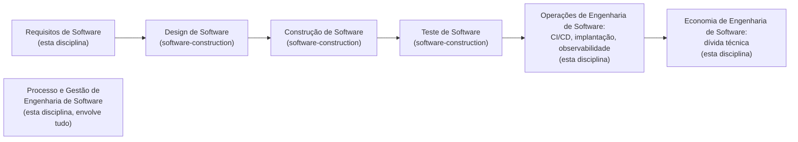

## Objetivos de Aprendizagem

- Enunciar a divisão real e citável de áreas de conhecimento que o SWEBOK v4.0 usa para organizar a engenharia de software, e nomear quais áreas esta disciplina cobre.
- Explicar precisamente o que `algorithms-software/software-construction` já cobre (Design, Construção e Teste de Software, na própria nomenclatura do SWEBOK) e por que esta disciplina não rederiva nada disso.
- Nomear as quatro áreas de conhecimento do SWEBOK das quais esta disciplina de fato constrói o seu escopo: Requisitos de Software, Processo de Engenharia de Software, Gestão de Engenharia de Software e Operações de Engenharia de Software, mais Economia de Engenharia de Software para o seu conceito de encerramento.
- Reconhecer as Operações de Engenharia de Software especificamente como a mais nova destas áreas, adicionada no SWEBOK v4.0 (2024), e entender por que o CI/CD e a observabilidade de produção, material genuinamente novo nesta plataforma, vivem ali em vez de serem uma reflexão tardia informal.

## Contexto e Motivação

Toda disciplina no módulo `software-distributed` deste currículo precisa de uma resposta real a uma pergunta antes de um único conceito ser escrito: o que, exatamente, resta ensinar uma vez que uma disciplina irmã já ensinou algo adjacente. `algorithms-software/software-construction`, vinte conceitos publicados mais cedo neste currículo, já responde "como construo software que funciona e permanece manutenível": especificações e contratos, ocultamento de informação, acoplamento e coesão, padrões de design, os dois estilos de arquitetura ensinados num nível introdutório, SOLID, o espectro completo de teste do unitário ao de sistema, desenvolvimento orientado a testes, depuração sistemática, controle de versão, code review, refatoração, e a dimensão individual-versus-equipe do processo. Esse é um tratamento real, completo e honesto do nível unitário da engenharia de software. O trabalho desta disciplina é tudo que o SWEBOK trata como conhecimento fora desse nível unitário.

O Guide to the Software Engineering Body of Knowledge (SWEBOK) da IEEE Computer Society, agora na sua quarta edição, é a autoridade de fato, atual e citável para esta divisão, não uma conveniência inventada. O SWEBOK v4.0 organiza o campo em dezoito áreas de conhecimento. Três delas, nomeadas exatamente como o SWEBOK as nomeia, mapeiam diretamente sobre o que `software-construction` já cobre: Design de Software, Construção de Software e Teste de Software. Esta disciplina é construída a partir de quatro áreas de conhecimento diferentes que aquela disciplina não toca de forma alguma: Requisitos de Software, Processo de Engenharia de Software, Gestão de Engenharia de Software e Operações de Engenharia de Software, a última destas uma adição genuinamente nova na edição de 2024, adicionada especificamente para capturar práticas (pipelines de integração e implantação contínua, monitoramento de produção, resposta a incidentes) que tinham crescido grandes e importantes o bastante na prática real da indústria para merecer a sua própria área em vez de viver como uma nota de rodapé dentro da Manutenção de Software. Esta disciplina encerra com um conceito de uma nona área, Economia de Engenharia de Software, porque a dívida técnica é mais bem entendida como um conceito econômico genuíno, não uma metáfora deixada solta.

A diretriz de currículo ACM/IEEE CS2013, a mesma família de citação já usada por todas as outras disciplinas ancoradas no CS2013 deste currículo, corrobora esta divisão independentemente: a sua própria área de conhecimento de Engenharia de Software lista Engenharia de Requisitos, Processos de Software e Gestão de Projetos de Software como unidades de conhecimento distintas ao lado de Design, Construção e Verificação e Validação de Software, a mesma linha de construção-versus-todo-o-resto que o SWEBOK traça. Duas autoridades de currículo independentes e reais concordando com o mesmo limite é forte evidência de que esta é uma distinção real e bem estabelecida no campo, não uma divisão conveniente inventada para esta plataforma.

## Teoria Central

### As nove áreas de conhecimento do SWEBOK relevantes à divisão deste currículo

O SWEBOK v4.0 lista dezoito áreas de conhecimento no total. As nove que importam para traçar o limite desta disciplina contra a sua irmã são:

```text
Já cobertas por algorithms-software/software-construction:
  - Design de Software
  - Construção de Software
  - Teste de Software

Cobertas por ESTA disciplina (software-distributed/software-engineering):
  - Requisitos de Software
  - Processo de Engenharia de Software
  - Gestão de Engenharia de Software
  - Operações de Engenharia de Software   (nova na v4.0)
  - Economia de Engenharia de Software     (um conceito de encerramento)

Fora de escopo para ambas, cobertas em outro lugar neste currículo ou ainda não alcançadas:
  - Arquitetura de Software              (deliberadamente rasa em software-construction;
                                          tratamento mais profundo vive em system-design-concepts
                                          e systems/distributed-systems-i, veja
                                          from-requirements-to-architecture-decisions)
  - Manutenção de Software, Gestão de Configuração de Software,
    Qualidade de Software, Segurança de Software, Prática Profissional de
    Engenharia de Software, Fundações de Computação/Matemática/Engenharia
```

O último bloco vale ser honesto sobre: esta disciplina não alega cobrir toda área restante do SWEBOK tampouco. A Gestão de Configuração de Software, por exemplo, já é substancialmente coberta pelos conceitos version-control-with-git e branching-and-merging-strategies de `software-construction`, mesmo que o SWEBOK a trate como a sua própria área. O trabalho desta disciplina é especificamente preencher as quatro-e-meia áreas listadas como cobertas acima, não se tornar uma segunda passagem redundante por todo o guia.

### O que a Construção de Software, precisamente, já possui

Importa ser preciso sobre onde a linha de fato cai, porque "construção de software" como frase cotidiana soa como se pudesse significar quase qualquer coisa sobre construir software. A própria definição do SWEBOK é mais estreita e mais útil: a Construção de Software é a criação detalhada de software funcional por meio de codificação, verificação (teste unitário, depuração) e integração, no nível de um programador individual ou uma equipe pequena escrevendo e imediatamente checando uma unidade de código. Tudo a montante disso (por que este recurso existe de todo, que processo organiza a equipe escrevendo-o) e tudo a jusante disso (como ele é implantado, como ele se comporta uma vez que usuários reais estão acessando-o) está explicitamente fora de escopo para a Construção de Software como o SWEBOK a define, e é exatamente o território desta disciplina.



### Por que as Operações de Engenharia de Software são a parte genuinamente nova

Integração contínua, entrega contínua, pipelines de implantação e observabilidade de produção não são material acadêmico clássico da forma que a Engenharia de Requisitos ou os modelos de processo são; elas cresceram diretamente da prática real da indústria ao longo de aproximadamente as últimas duas décadas e foram formalizadas o bastante, recentemente o bastante, que o SWEBOK só lhes deu uma área de conhecimento dedicada na sua edição de 2024. Esta disciplina trata essa história honestamente em vez de fingir que estas ideias são mais antigas ou mais academicamente assentadas do que são: os conceitos nas seções de CI/CD e observabilidade desta disciplina são originados de escrita de profissional (os próprios artigos de Martin Fowler sobre integração e entrega contínua, a própria escrita de Cindy Sridharan sobre observabilidade) da mesma forma que o conceito SOLID de `software-construction` honestamente originou Robert C. Martin como uma origem industrial, não acadêmica.

## Exemplos Resolvidos

### Exemplo 1: roteando uma pergunta real para a disciplina certa

Uma equipe está decidindo se um novo recurso de pagamento precisa de uma arquitetura baseada em fila ou uma chamada síncrona direta. Isso é uma pergunta de `software-construction` ou uma pergunta de `software-engineering`? Nenhuma disciplina sozinha a responde: a *própria decisão*, rastreando de um requisito não funcional (um alvo de throughput, uma tolerância para consistência eventual) a uma escolha de arquitetura, é o `from-requirements-to-architecture-decisions` desta disciplina. A implementação de fila de fato, acoplamento e coesão entre o código produtor e consumidor, e os testes unitários em torno dela, são o território de `software-construction`. Nenhuma disciplina reivindica a pergunta inteira; cada uma possui uma metade distinta dela.

### Exemplo 2: um bug encontrado em produção

Uma null pointer exception surge em produção três semanas depois do lançamento. Diagnosticar e consertar o próprio defeito de código, `systematic-debugging`, é `software-construction`. Mas *como a equipe descobriu* (um alerta disparado de uma métrica, um trace mostrando onde a requisição falhou) é o material de observabilidade desta disciplina, e *se esse conserto deveria ser enviado imediatamente ou esperar pelo próximo trem de lançamento* é uma pergunta de Processo de Engenharia de Software, também desta disciplina. O mesmo incidente toca ambas as disciplinas em pontos genuinamente diferentes no seu ciclo de vida, que é exatamente o que o capstone desta disciplina rastreia de ponta a ponta.

### Exemplo 3: uma área de conhecimento que fica explicitamente fora de escopo

Uma equipe quer orientação profunda sobre escolher entre um monólito e uma arquitetura de microsserviços para um novo sistema. O próprio conceito `software-architecture-styles` de `software-construction` explicitamente sinaliza que a arquitetura distribuída mais profunda é "deixada para uma disciplina posterior e mais avançada em outro lugar neste currículo". Esta disciplina investigou essa lacuna diretamente (veja `from-requirements-to-architecture-decisions`) e descobriu que ela já é preenchida, em duas profundidades diferentes, por duas disciplinas já publicadas: `system-design-concepts` (Estudos Complementares) para padrões de arquitetura aplicados, de nível de estudo de caso, e `systems/distributed-systems-i` para os primitivos teóricos de consenso e replicação sobre os quais tais arquiteturas são construídas. O próprio conceito de arquitetura desta disciplina é deliberadamente uma ponte que cruza para fora para ambos em vez de um terceiro tratamento concorrente.

## Equívocos Comuns e Armadilhas

- **"Engenharia de software só significa escrever bom código."** As dezoito áreas de conhecimento do SWEBOK deixam claro que isto é só três delas (Design, Construção, Teste); um enorme corpo de conhecimento bem estabelecido existe para as atividades circundantes (decidir o que construir, organizar como uma equipe o constrói, levá-lo com segurança à produção, rastrear a dívida de atalhos tomados ao longo do caminho) que nada tem a ver com qualidade de código diretamente.
- **"CI/CD e observabilidade são só ferramental, não conhecimento de engenharia real."** A própria decisão de 2024 do SWEBOK de adicionar as Operações de Engenharia de Software como uma área de conhecimento dedicada é evidência direta e atual contra isto: o próprio corpo de conhecimento autoritativo do campo julgou essas práticas maduras e importantes o bastante para merecer status formal, não uma nota de rodapé.
- **"Esta disciplina duplica `software-construction`."** Uma comparação conceito por conceito (veja o diagrama de blocos da Teoria Central) mostra zero sobreposição de slug e um limite limpo de área do SWEBOK; todo vínculo cruzado nesta disciplina aponta para fora para um conceito de nível de construção para profundidade que esta disciplina deliberadamente não rederiva, em vez de repeti-lo.

## Resumo

A decisão de escopo real e citável desta disciplina repousa sobre as próprias dezoito áreas de conhecimento do SWEBOK v4.0, corroborada independentemente pela própria área de conhecimento de Engenharia de Software do ACM/IEEE CS2013: `algorithms-software/software-construction` já cobre por completo Design, Construção e Teste de Software, o nível unitário de construir software, e esta disciplina cobre o que o SWEBOK trata como conhecimento separado inteiramente, Requisitos, Processo, Gestão e a recém-adicionada Operações de Engenharia de Software (integração e implantação contínua, observabilidade de produção), encerrando com um conceito de Economia de Engenharia de Software para a dívida técnica. A Arquitetura de Software além do vocabulário introdutório que `software-construction` já ensina é deliberadamente deixada de fora de ambas as disciplinas, porque já é coberta, em duas profundidades diferentes, por duas outras disciplinas já publicadas com as quais esta cruza em vez de duplicar.

## Documentation Links

- [IEEE Computer Society: SWEBOK v4.0 Guide](https://www.computer.org/education/bodies-of-knowledge/software-engineering): a divisão de área de conhecimento oficial e atual sobre a qual a decisão de escopo desta disciplina inteira é construída, incluindo as três novas áreas adicionadas na edição de 2024.
- [ACM/IEEE: CS2013 Software Engineering Knowledge Area](https://csed.acm.org/knowledge-areas-software-engineering-se-cs2013-version/): uma autoridade de currículo independente corroborando a mesma divisão de construção-versus-todo-o-resto, nomeando Engenharia de Requisitos, Processos de Software e Gestão de Projetos de Software como unidades distintas de Design, Construção e Verificação e Validação de Software.
