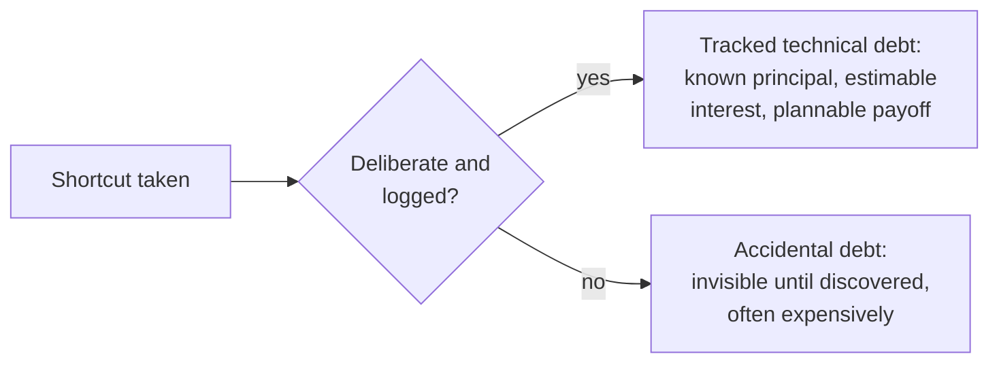

## Learning Objectives

- State Ward Cunningham's original 1992 formulation of the technical debt metaphor precisely, including the real system (WyCash) it was coined to explain.
- Explain the metaphor's actual economic structure: a principal (the shortcut taken), an interest rate (the ongoing cost of working around it), and a real, decidable payoff decision.
- Distinguish deliberate, tracked technical debt from accidental, undiscovered debt, and explain why only the first kind is actually manageable the way Cunningham's own metaphor intends.
- Connect technical debt directly to `refactoring` as its real, concrete repayment mechanism, not a vague, unrelated concept.

## Context & Motivation

This discipline closes its main body of concepts with one drawn from a ninth SWEBOK knowledge area, Software Engineering Economics, because technical debt is genuinely an economic concept, with a real principal, a real interest rate, and a real, decidable payoff decision, not a vague complaint about code quality dressed up in financial language. Ward Cunningham coined the metaphor himself, in a real, citable 1992 OOPSLA experience report about a real system he was actually building, WyCash, a portfolio management system for Wyatt Software, and this concept treats his own original words as the primary source, rather than the diluted, secondhand version of the metaphor that has spread through the field since.

## Core Theory

### Cunningham's original words, exactly

Cunningham's 1992 experience report states the metaphor directly: "Shipping first time code is like going into debt. A little debt speeds development so long as it is paid back promptly with a rewrite. The danger occurs when the debt is not repaid. Every minute spent on not-quite-right code counts as interest on that debt."

Three real, distinct economic ideas are packed into that short passage, and losing any one of them is exactly how the metaphor gets diluted in secondhand retellings:

```text
PRINCIPAL:  The shortcut itself, the not-quite-right code
            shipped to move faster right now.

INTEREST:   The ongoing, recurring cost of living with that
            shortcut, every future minute anyone spends
            working around or working through the not-quite-
            right code, for as long as it remains unfixed.

REPAYMENT:  A deliberate rewrite, paid back "promptly," that
            eliminates the principal and, with it, the ongoing
            interest payments.
```

### Deliberate versus accidental debt

Cunningham's own framing assumes the debt is a conscious, informed choice: a team knowingly ships a not-quite-right shortcut to gain real, immediate speed, with a genuine intention to repay it. This is a fundamentally different situation from debt a team accumulates by accident, through code written carelessly with no awareness at the time that a shortcut was even being taken. The distinction matters directly for how manageable the debt actually is: deliberate debt can be logged, tracked, and prioritized against its known interest cost, the same way a real financial loan appears on a balance sheet; accidental debt is, by definition, invisible until someone discovers it, usually the hard way, and cannot be deliberately managed until it is found.



### Interest, made concrete: why it compounds

The interest in Cunningham's metaphor is not a one-time cost, it recurs every time the not-quite-right code is touched again: every future feature built near it takes longer because the shortcut has to be worked around again, every future bug near it is harder to diagnose because the code's structure no longer matches its actual intent, and every new engineer reading it pays an extra comprehension cost the shortcut itself created. This is exactly why unpaid technical debt genuinely compounds, the same structural reason a real financial debt's interest compounds if left unpaid: each new touch of the affected code adds a new, small, recurring cost that persists for as long as the original shortcut remains unfixed.

### Refactoring: the real, named repayment mechanism

Cunningham's own metaphor names the repayment mechanism directly: "a rewrite." `refactoring` (`software-construction`) is exactly that mechanism, formalized: a deliberate, behavior-preserving restructuring of existing code that eliminates the original shortcut's principal without changing what the code actually does from the outside. Technical debt without a real refactoring plan is a debt with no realistic payoff strategy at all, exactly analogous to a real financial debt with interest accruing and no plan to ever repay the principal.

## Worked Examples

### Example 1: a real, deliberate debt decision, made honestly

A team facing a genuine, fixed launch deadline decides to hardcode a single payment provider's specific API format directly into the checkout code, rather than building the proper abstraction layer that would support multiple providers cleanly, because the abstraction would take three extra days the deadline does not allow. This is logged explicitly as technical debt: principal, the hardcoded, provider-specific checkout code; interest, an estimated extra half-day of work every time a change touches checkout, for as long as the hardcoding remains; payoff plan, a scheduled refactoring sprint two weeks after launch, once the immediate deadline pressure is gone. This is Cunningham's metaphor exactly as he described it, a little debt speeding development now, with a genuine, tracked plan for prompt repayment.

### Example 2: unpaid debt actually compounding, made concrete

The team from Example 1 misses its own two-week payoff plan under continued, ongoing deadline pressure, and the hardcoded checkout code remains unrefactored for eight months. In that time, three unrelated features are built that each have to work around the same hardcoded assumption, each taking the estimated extra half-day the original entry projected, for a real, compounded total of one and a half extra days paid so far, on top of the three extra days the original shortcut was taken to save. The debt's own interest has now cost more than the principal it was originally taken out to avoid, exactly the danger Cunningham's own passage names directly: "the danger occurs when the debt is not repaid."

### Example 3: accidental debt, discovered the hard way

A different team has no record anywhere of a shortcut having been taken in a particular module, because the engineer who wrote it years ago did not recognize it as a shortcut at the time. A new engineer, assigned to add a feature to that module, discovers only after several confusing days of investigation that the module's actual structure does not match its apparent purpose at all, a real, undiscovered debt with a real, ongoing interest cost that had been quietly accruing, unlogged and unmanaged, the entire time. Unlike Example 1's deliberate debt, this debt had no principal ever recorded, no interest ever estimated, and no payoff plan ever considered, because nobody knew it existed until the cost of not knowing was already being paid.

## Common Misconceptions & Pitfalls

- **"Technical debt just means bad code."** Cunningham's own original passage frames it as a deliberate, informed tradeoff (speed now, in exchange for a real, ongoing cost later), not a synonym for carelessness; Example 1 shows genuinely careful, deliberate engineering can still incur real technical debt, made responsibly, with a real plan attached.
- **"All technical debt is equally manageable, as long as you eventually get around to fixing it."** Example 3 shows accidental, undiscovered debt is categorically less manageable than deliberate, logged debt, precisely because it cannot be prioritized, estimated, or planned against until it is found, often at real, unplanned cost.
- **"Technical debt is a permanent, unavoidable feature of any codebase, not worth actively managing."** Example 2 shows unpaid debt has a real, measurable, compounding cost (the interest exceeding the original principal it was taken to avoid), which is exactly the concrete, decidable economic argument for treating debt payoff as a genuine, scheduled priority rather than an indefinitely deferred someday.

## Summary

Ward Cunningham's own 1992 experience report, about a real system he was building (WyCash), coined the technical debt metaphor with a real, precise economic structure: a principal (the shortcut taken), an interest rate (the ongoing, recurring cost of living with it, which genuinely compounds the longer it remains unpaid), and a repayment mechanism, a deliberate rewrite, which `refactoring` (`software-construction`) is the concrete, formalized version of. Deliberate, logged debt, taken knowingly with a real payoff plan, is manageable the way Cunningham's own metaphor intends; accidental, undiscovered debt is categorically different and less manageable, since it cannot be prioritized or planned against until someone finds it, often at real, unplanned cost. This is the discipline's honest closing point for its Software Engineering Economics material: technical debt is a real, decidable economic tradeoff, not a vague complaint, and treating it as one is what actually makes it manageable.

## Documentation Links

- [Cunningham (1992): The WyCash Portfolio Management System, OOPSLA Experience Report](http://c2.com/doc/oopsla92.html): the original, primary source this concept's entire framing is built on, Cunningham's own words about a real system he was building at the time.
- [IEEE Computer Society: SWEBOK v4.0 Guide](https://www.computer.org/education/bodies-of-knowledge/software-engineering): the Software Engineering Economics knowledge area this concept's economic framing (principal, interest, decidable payoff) belongs to.
