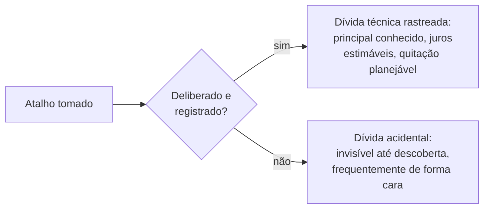

## Objetivos de Aprendizagem

- Enunciar a formulação original de 1992 de Ward Cunningham da metáfora da dívida técnica precisamente, incluindo o sistema real (WyCash) para o qual ela foi cunhada para explicar.
- Explicar a estrutura econômica de fato da metáfora: um principal (o atalho tomado), uma taxa de juros (o custo contínuo de trabalhar em torno dele) e uma decisão de quitação real e decidível.
- Distinguir dívida técnica deliberada e rastreada de dívida acidental e não descoberta, e explicar por que só o primeiro tipo é de fato gerenciável da forma que a própria metáfora de Cunningham pretende.
- Conectar a dívida técnica diretamente à `refactoring` como o seu mecanismo de quitação real e concreto, não um conceito vago e não relacionado.

## Contexto e Motivação

Esta disciplina encerra o seu corpo principal de conceitos com um tirado de uma nona área de conhecimento do SWEBOK, Economia de Engenharia de Software, porque a dívida técnica é genuinamente um conceito econômico, com um principal real, uma taxa de juros real e uma decisão de quitação real e decidível, não uma reclamação vaga sobre qualidade de código vestida em linguagem financeira. Ward Cunningham cunhou a metáfora ele mesmo, num relatório de experiência real e citável de 1992 na OOPSLA sobre um sistema real que ele estava de fato construindo, WyCash, um sistema de gestão de portfólio para a Wyatt Software, e este conceito trata as suas próprias palavras originais como a fonte primária, em vez da versão diluída e de segunda mão da metáfora que se espalhou pelo campo desde então.

## Teoria Central

### As palavras originais de Cunningham, exatamente

O relatório de experiência de 1992 de Cunningham enuncia a metáfora diretamente: "Enviar código de primeira vez é como entrar em dívida. Um pouco de dívida acelera o desenvolvimento desde que seja paga de volta prontamente com uma reescrita. O perigo ocorre quando a dívida não é paga. Todo minuto gasto em código não-bem-certo conta como juros sobre essa dívida."

Três ideias econômicas reais e distintas estão embaladas nessa curta passagem, e perder qualquer uma delas é exatamente como a metáfora é diluída em recontagens de segunda mão:

```text
PRINCIPAL:  O próprio atalho, o código não-bem-certo
            enviado para ir mais rápido agora mesmo.

JUROS:      O custo contínuo e recorrente de conviver com esse
            atalho, todo minuto futuro que alguém gasta
            trabalhando em torno ou através do código não-bem-
            certo, por tanto tempo quanto ele permaneça não consertado.

QUITAÇÃO:   Uma reescrita deliberada, paga de volta "prontamente",
            que elimina o principal e, com ele, os pagamentos
            de juros contínuos.
```

### Dívida deliberada versus acidental

O próprio enquadramento de Cunningham assume que a dívida é uma escolha consciente e informada: uma equipe conscientemente envia um atalho não-bem-certo para ganhar velocidade real e imediata, com uma intenção genuína de pagá-lo. Esta é uma situação fundamentalmente diferente de dívida que uma equipe acumula por acidente, por meio de código escrito descuidadamente sem nenhuma consciência no momento de que um atalho estava sequer sendo tomado. A distinção importa diretamente para quão gerenciável a dívida de fato é: a dívida deliberada pode ser registrada, rastreada e priorizada contra o seu custo de juros conhecido, da mesma forma que um empréstimo financeiro real aparece num balanço; a dívida acidental é, por definição, invisível até alguém descobri-la, geralmente da forma difícil, e não pode ser deliberadamente gerenciada até ser encontrada.



### Juros, tornados concretos: por que se compõem

Os juros na metáfora de Cunningham não são um custo único, eles recorrem toda vez que o código não-bem-certo é tocado de novo: todo recurso futuro construído perto dele leva mais tempo porque o atalho tem de ser trabalhado em torno de novo, todo bug futuro perto dele é mais difícil de diagnosticar porque a estrutura do código não corresponde mais à sua intenção de fato, e todo novo engenheiro lendo-o paga um custo de compreensão extra que o próprio atalho criou. É exatamente por isso que a dívida técnica não paga genuinamente se compõe, a mesma razão estrutural pela qual os juros de uma dívida financeira real se compõem se deixados não pagos: cada novo toque do código afetado adiciona um novo e pequeno custo recorrente que persiste por tanto tempo quanto o atalho original permaneça não consertado.

### Refatoração: o mecanismo de quitação real e nomeado

A própria metáfora de Cunningham nomeia o mecanismo de quitação diretamente: "uma reescrita". `refactoring` (`software-construction`) é exatamente esse mecanismo, formalizado: uma reestruturação deliberada e preservadora de comportamento de código existente que elimina o principal do atalho original sem mudar o que o código de fato faz de fora. Dívida técnica sem um plano de refatoração real é uma dívida sem nenhuma estratégia de quitação realista de todo, exatamente análoga a uma dívida financeira real com juros acumulando e nenhum plano de jamais pagar o principal.

## Exemplos Resolvidos

### Exemplo 1: uma decisão de dívida real e deliberada, feita honestamente

Uma equipe enfrentando um prazo de lançamento genuíno e fixo decide fixar diretamente no código de checkout o formato de API específico de um único provedor de pagamento, em vez de construir a camada de abstração apropriada que suportaria múltiplos provedores de forma limpa, porque a abstração levaria três dias extras que o prazo não permite. Isto é registrado explicitamente como dívida técnica: principal, o código de checkout fixo e específico do provedor; juros, uma estimativa de meio dia extra de trabalho toda vez que uma mudança toca o checkout, por tanto tempo quanto a fixação permaneça; plano de quitação, um sprint de refatoração agendado duas semanas após o lançamento, uma vez que a pressão imediata de prazo tenha ido embora. Esta é a metáfora de Cunningham exatamente como ele a descreveu, um pouco de dívida acelerando o desenvolvimento agora, com um plano genuíno e rastreado para quitação pronta.

### Exemplo 2: dívida não paga de fato se compondo, tornada concreta

A equipe do Exemplo 1 perde o seu próprio plano de quitação de duas semanas sob pressão de prazo contínua e em andamento, e o código de checkout fixo permanece não refatorado por oito meses. Nesse tempo, três recursos não relacionados são construídos que cada um tem de trabalhar em torno da mesma suposição fixa, cada um levando o meio dia extra estimado que a entrada original projetou, para um total real e composto de um dia e meio extra pago até agora, em cima dos três dias extras que o atalho original foi tomado para economizar. Os próprios juros da dívida agora custaram mais do que o principal que ela foi originalmente tomada para evitar, exatamente o perigo que a própria passagem de Cunningham nomeia diretamente: "o perigo ocorre quando a dívida não é paga".

### Exemplo 3: dívida acidental, descoberta da forma difícil

Uma equipe diferente não tem registro em lugar nenhum de um atalho ter sido tomado num módulo particular, porque o engenheiro que o escreveu anos atrás não o reconheceu como um atalho no momento. Um novo engenheiro, designado a adicionar um recurso a esse módulo, descobre só depois de vários dias confusos de investigação que a estrutura de fato do módulo não corresponde ao seu propósito aparente de forma alguma, uma dívida real e não descoberta com um custo de juros real e contínuo que vinha quietamente acumulando, não registrada e não gerenciada, o tempo todo. Ao contrário da dívida deliberada do Exemplo 1, esta dívida não teve nenhum principal jamais registrado, nenhum juros jamais estimado, e nenhum plano de quitação jamais considerado, porque ninguém sabia que ela existia até o custo de não saber já estar sendo pago.

## Equívocos Comuns e Armadilhas

- **"Dívida técnica só significa código ruim."** A própria passagem original de Cunningham a enquadra como um trade-off deliberado e informado (velocidade agora, em troca de um custo real e contínuo depois), não um sinônimo de descuido; o Exemplo 1 mostra que engenharia genuinamente cuidadosa e deliberada ainda pode incorrer em dívida técnica real, feita responsavelmente, com um plano real anexado.
- **"Toda dívida técnica é igualmente gerenciável, desde que você eventualmente chegue a consertá-la."** O Exemplo 3 mostra que a dívida acidental e não descoberta é categoricamente menos gerenciável do que a dívida deliberada e registrada, precisamente porque ela não pode ser priorizada, estimada ou planejada até ser encontrada, frequentemente a um custo real e não planejado.
- **"Dívida técnica é um recurso permanente e inevitável de qualquer código, não vale gerenciar ativamente."** O Exemplo 2 mostra que a dívida não paga tem um custo real, mensurável e composto (os juros excedendo o principal original que ela foi tomada para evitar), que é exatamente o argumento econômico concreto e decidível para tratar a quitação de dívida como uma prioridade genuína e agendada em vez de um algum-dia indefinidamente adiado.

## Resumo

O próprio relatório de experiência de 1992 de Ward Cunningham, sobre um sistema real que ele estava construindo (WyCash), cunhou a metáfora da dívida técnica com uma estrutura econômica real e precisa: um principal (o atalho tomado), uma taxa de juros (o custo contínuo e recorrente de conviver com ele, que genuinamente se compõe quanto mais tempo permanece não pago) e um mecanismo de quitação, uma reescrita deliberada, que `refactoring` (`software-construction`) é a versão concreta e formalizada de. A dívida deliberada e registrada, tomada conscientemente com um plano de quitação real, é gerenciável da forma que a própria metáfora de Cunningham pretende; a dívida acidental e não descoberta é categoricamente diferente e menos gerenciável, já que ela não pode ser priorizada ou planejada até alguém encontrá-la, frequentemente a um custo real e não planejado. Este é o ponto de encerramento honesto da disciplina para o seu material de Economia de Engenharia de Software: a dívida técnica é um trade-off econômico real e decidível, não uma reclamação vaga, e tratá-la como um é o que de fato a torna gerenciável.

## Documentation Links

- [Cunningham (1992): The WyCash Portfolio Management System, OOPSLA Experience Report](http://c2.com/doc/oopsla92.html): a fonte primária e original sobre a qual o enquadramento inteiro deste conceito é construído, as próprias palavras de Cunningham sobre um sistema real que ele estava construindo no momento.
- [IEEE Computer Society: SWEBOK v4.0 Guide](https://www.computer.org/education/bodies-of-knowledge/software-engineering): a área de conhecimento de Economia de Engenharia de Software à qual o enquadramento econômico deste conceito (principal, juros, quitação decidível) pertence.
