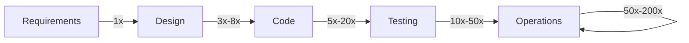

## Learning Objectives

- State Barry Boehm's real finding precisely: the cost of fixing a defect rises roughly an order of magnitude at each later phase it is caught in, not a fixed universal ratio.
- Name the real data sources behind the finding (TRW, IBM, GTE, the Bell Labs Safeguard program) and the real, honest range of measured multipliers, rather than the popularized single number.
- Explain why the popularized 1:10:100 rule is a heuristic simplification, and what is lost by quoting it as a fixed law.
- Connect this finding to why `requirements-elicitation-specification-and-validation`'s validation step and `test-driven-development` both exist specifically as early-detection mechanisms.

## Context & Motivation

Every earlier concept in this discipline's Software Requirements area implicitly assumes catching a problem early is worth real effort: validating a specification before implementation, tracing a change's impact before accepting it. This concept states, with real, historical data behind it, exactly why that assumption is justified, and states it honestly rather than repeating the version of the finding that has drifted into an urban legend through decades of secondhand citation. Barry Boehm's actual work, gathered from real, large software projects across several real organizations and published in Software Engineering Economics (1981), remains one of the most cited findings in the field; it is also, per careful historical review of the original data, one of the most commonly oversimplified.

## Core Theory

### The real data: where it came from, and what it actually showed

Boehm assembled cost-to-fix data at TRW, corroborated by data from IBM, GTE, and the Bell Labs Safeguard program, across dozens of real, large government and aerospace software projects run under a waterfall-style process in the 1970s. The consistent pattern across this data: the later a defect surfaces in the development lifecycle relative to when it was introduced, the more expensive it is to fix, because fixing it later means undoing and redoing more work built on top of the mistake, not just the mistake itself.

### The honest range, not the popularized single ratio

The finding is very often quoted today as a single, fixed 1:10:100 rule (a defect costs 1x to fix at requirements time, 10x at design or coding time, 100x after release). Boehm's actual data, read carefully, showed a real range rather than one fixed number, varying by project type and by exactly which two phases are being compared:

```text
Requirements  -> Design:              roughly  3x  to   8x
Requirements  -> Code:                roughly  5x  to  20x
Requirements  -> Development Testing: roughly 10x  to  50x
Requirements  -> Acceptance Testing:  roughly 30x  to 100x
Requirements  -> Operations:          roughly 50x  to 200x
```

Boehm's original presentation of this data included confidence intervals and explicit project-type breakdowns; the loss of that nuance across decades of secondhand citation, collapsing a real range into a single tidy number, is a genuine, documented pattern in how this finding gets misused, not a minor rounding.

### Why the trend, not the exact multiplier, is the load-bearing part

The specific numbers above should never be quoted as a fixed law applicable to any given project; different organizations, different domains, and especially projects run under a different process than the waterfall-style projects Boehm actually measured, would show different multipliers. What is robust, and independently plausible on first-principles grounds regardless of the exact numbers, is the trend itself: a defect caught at requirements time costs the effort of rewriting a sentence; the same conceptual mistake caught after release costs identifying the failure in production, tracing it back through however many layers of code and design were built on top of the original mistake, fixing all of it, retesting all of it, and redeploying, none of which the requirements-time fix ever had to pay for.



## Worked Examples

### Example 1: the same mistake, caught at two different phases

A requirement is ambiguous about whether a discount code can be applied more than once per order. Caught during a validation review (`requirements-elicitation-specification-and-validation`), the fix is a five-minute conversation with the stakeholder and one clarified sentence in the specification, genuinely a 1x cost by Boehm's own baseline. The same ambiguity, missed at validation and caught only after release when a customer applies the same discount code six times on one order, requires identifying the bug in production, tracing it through the checkout code, the discount-calculation code, and the order-total code, writing and reviewing a fix, retesting the entire checkout flow (since discount logic touches order totals broadly), and issuing refunds to affected customers. Nothing about the underlying mistake changed between the two scenarios; only when it was caught changed, and the honest range in Core Theory says this specific kind of catch (requirements to operations) plausibly cost fifty to two hundred times more the second way.

### Example 2: quoting the finding honestly versus quoting it as an urban legend

A team lead justifies skipping a validation review by saying "the 1:10:100 rule isn't a real thing anyway, it's just a marketing slide." This overcorrects: the specific number 1:10:100 is indeed an oversimplification of Boehm's real data, but dismissing the underlying trend entirely because the popularized number is imprecise throws out a real, historically grounded finding along with a bad citation of it. The honest response acknowledges both halves at once: the exact ratio should never be quoted as a law, and the underlying trend (costs escalate meaningfully, by a real order of magnitude or more, the later a defect is caught) is genuinely well-supported by real data from real, large projects.

### Example 3: why this motivates validation and TDD specifically, not just "be careful"

A team debates whether time spent on requirements validation and test-driven development is worth it versus "moving fast" and fixing problems as they surface. Boehm's data reframes this debate concretely: both practices exist specifically to move the *detection point* of a defect as early as possible in the lifecycle, which by the trend in Core Theory is the single highest-leverage lever available for reducing the total cost of a defect, independent of how skilled the team is at fixing defects once found. `test-driven-development` (`software-construction`) catches a class of defect at the moment the code satisfying a requirement is written, arguably the earliest point at the construction level; requirements validation catches a different class even earlier, before any code exists at all.

## Common Misconceptions & Pitfalls

- **"The exact 1:10:100 ratio is a proven law that applies to any project."** Core Theory's honest range (3x to 200x depending on which phases and which project type) shows the specific numbers are a heuristic simplification of Boehm's real, more nuanced data, not a fixed constant; quoting an exact ratio as universal law is the single most common misuse of this finding.
- **"Because the popularized ratio is oversimplified, the whole finding is discredited."** Example 2 shows this overcorrects; the underlying trend (costs rise meaningfully the later a defect is caught) is well supported by real data from TRW, IBM, GTE, and Bell Labs projects, independent of whether the specific 1:10:100 number is accurate.
- **"This finding only applies to waterfall-style projects, so it's irrelevant to agile teams."** The projects Boehm measured were run under a waterfall-style process, which is worth stating honestly, but the underlying mechanism (fixing a mistake costs more once other work has been built on top of it) is a property of how software is layered and built, not of which process a team follows; it is exactly why agile practices like TDD and short feedback loops (`agile-processes-scrum-in-practice`, `kanban-and-flow-based-process`) are frequently justified using this same reasoning, even though Boehm's original data predates them.

## Summary

Barry Boehm's real, historically grounded finding, drawn from real cost data at TRW, IBM, GTE, and the Bell Labs Safeguard program across dozens of large 1970s software projects, is that the cost of fixing a defect rises meaningfully, roughly by an order of magnitude, at each later phase it is caught in; the popularized 1:10:100 rule oversimplifies a real, honest range (roughly 3x to 8x from requirements to design, up to 50x to 200x from requirements to operations) into a single number Boehm's own data never claimed as a fixed law. The trend, not the exact multiplier, is the part worth taking seriously: it is the concrete economic justification for why this discipline's own validation activity (`requirements-elicitation-specification-and-validation`) and `software-construction`'s own `test-driven-development` both exist specifically to move the point where a defect is caught as early in the lifecycle as possible.

## Documentation Links

- [ReworkCost.com: Boehm Cost of Change Curve, What the 1981 Data Actually Shows](https://reworkcost.com/boehm-cost-of-change-curve): a careful, honest historical review of Boehm's original data, including the real measured ranges and an explicit caution against the popularized 1:10:100 oversimplification this concept deliberately avoids repeating.
- [Sommerville: Software Engineering (10th Edition, Pearson)](https://www.pearson.com/en-us/subject-catalog/p/software-engineering/P200000003258/9780137503148): the standard textbook treatment connecting this cost-escalation finding to the practical case for early requirements validation.
