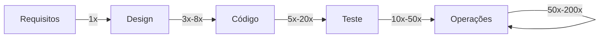

## Objetivos de Aprendizagem

- Enunciar o achado real de Barry Boehm precisamente: o custo de consertar um defeito sobe aproximadamente uma ordem de magnitude a cada fase posterior em que é pego, não uma razão universal fixa.
- Nomear as fontes de dados reais por trás do achado (TRW, IBM, GTE, o programa Safeguard da Bell Labs) e a faixa real e honesta de multiplicadores medidos, em vez do número único popularizado.
- Explicar por que a popularizada regra 1:10:100 é uma simplificação heurística, e o que se perde ao citá-la como uma lei fixa.
- Conectar este achado a por que o passo de validação de `requirements-elicitation-specification-and-validation` e o `test-driven-development` ambos existem especificamente como mecanismos de detecção precoce.

## Contexto e Motivação

Todo conceito anterior na área de Requisitos de Software desta disciplina implicitamente assume que pegar um problema cedo vale esforço real: validar uma especificação antes da implementação, rastrear o impacto de uma mudança antes de aceitá-la. Este conceito enuncia, com dados reais e históricos por trás, exatamente por que essa suposição é justificada, e a enuncia honestamente em vez de repetir a versão do achado que virou lenda urbana por meio de décadas de citação de segunda mão. O trabalho de fato de Barry Boehm, reunido de projetos de software reais e grandes por entre várias organizações reais e publicado em Software Engineering Economics (1981), permanece um dos achados mais citados do campo; é também, por revisão histórica cuidadosa dos dados originais, um dos mais comumente simplificados em excesso.

## Teoria Central

### Os dados reais: de onde vieram, e o que de fato mostraram

Boehm reuniu dados de custo-para-consertar na TRW, corroborados por dados da IBM, GTE e do programa Safeguard da Bell Labs, por entre dezenas de projetos de software reais, grandes, governamentais e aeroespaciais rodados sob um processo de estilo waterfall nos anos 1970. O padrão consistente por entre estes dados: quanto mais tarde um defeito surge no ciclo de vida de desenvolvimento em relação a quando foi introduzido, mais caro é consertá-lo, porque consertá-lo mais tarde significa desfazer e refazer mais trabalho construído em cima do erro, não só o próprio erro.

### A faixa honesta, não a razão única popularizada

O achado é muito frequentemente citado hoje como uma regra 1:10:100 única e fixa (um defeito custa 1x para consertar no tempo de requisitos, 10x no tempo de design ou codificação, 100x depois do lançamento). Os dados de fato de Boehm, lidos cuidadosamente, mostraram uma faixa real em vez de um número fixo, variando por tipo de projeto e por exatamente quais duas fases estão sendo comparadas:

```text
Requisitos  -> Design:                aproximadamente  3x  a   8x
Requisitos  -> Código:                aproximadamente  5x  a  20x
Requisitos  -> Teste de Desenvolvimento: aproximadamente 10x  a  50x
Requisitos  -> Teste de Aceitação:    aproximadamente 30x  a 100x
Requisitos  -> Operações:             aproximadamente 50x  a 200x
```

A apresentação original de Boehm destes dados incluía intervalos de confiança e divisões explícitas por tipo de projeto; a perda dessa nuance por entre décadas de citação de segunda mão, colapsando uma faixa real num único número arrumado, é um padrão genuíno e documentado em como este achado é mal usado, não um arredondamento menor.

### Por que a tendência, não o multiplicador exato, é a parte estrutural

Os números específicos acima nunca deveriam ser citados como uma lei fixa aplicável a qualquer dado projeto; organizações diferentes, domínios diferentes, e especialmente projetos rodados sob um processo diferente dos projetos de estilo waterfall que Boehm de fato mediu, mostrariam multiplicadores diferentes. O que é robusto, e independentemente plausível por fundamentos de primeiros princípios independentemente dos números exatos, é a própria tendência: um defeito pego no tempo de requisitos custa o esforço de reescrever uma frase; o mesmo erro conceitual pego depois do lançamento custa identificar a falha em produção, rastreá-la de volta por quantas camadas de código e design foram construídas em cima do erro original, consertar tudo isso, retestar tudo isso, e reimplantar, nada do qual o conserto de tempo de requisitos jamais teve de pagar.



## Exemplos Resolvidos

### Exemplo 1: o mesmo erro, pego em duas fases diferentes

Um requisito é ambíguo sobre se um código de desconto pode ser aplicado mais de uma vez por pedido. Pego durante uma revisão de validação (`requirements-elicitation-specification-and-validation`), o conserto é uma conversa de cinco minutos com o stakeholder e uma frase esclarecida na especificação, genuinamente um custo de 1x pela própria baseline de Boehm. A mesma ambiguidade, perdida na validação e pega só depois do lançamento quando um cliente aplica o mesmo código de desconto seis vezes num pedido, exige identificar o bug em produção, rastreá-lo pelo código de checkout, pelo código de cálculo de desconto e pelo código de total de pedido, escrever e revisar um conserto, retestar o fluxo de checkout inteiro (já que a lógica de desconto toca os totais de pedido amplamente), e emitir reembolsos aos clientes afetados. Nada sobre o erro subjacente mudou entre os dois cenários; só quando ele foi pego mudou, e a faixa honesta na Teoria Central diz que este tipo específico de captura (requisitos a operações) plausivelmente custou cinquenta a duzentas vezes mais da segunda forma.

### Exemplo 2: citando o achado honestamente versus citá-lo como lenda urbana

Um líder de equipe justifica pular uma revisão de validação dizendo "a regra 1:10:100 não é uma coisa real de qualquer forma, é só um slide de marketing". Isto supercorrige: o número específico 1:10:100 é de fato uma simplificação excessiva dos dados reais de Boehm, mas descartar a tendência subjacente inteiramente porque o número popularizado é impreciso joga fora um achado real e historicamente fundamentado junto com uma citação ruim dele. A resposta honesta reconhece ambas as metades de uma vez: a razão exata nunca deveria ser citada como uma lei, e a tendência subjacente (os custos escalam significativamente, por uma ordem de magnitude real ou mais, quanto mais tarde um defeito é pego) é genuinamente bem suportada por dados reais de projetos reais e grandes.

### Exemplo 3: por que isto motiva a validação e o TDD especificamente, não só "tenha cuidado"

Uma equipe debate se o tempo gasto em validação de requisitos e desenvolvimento orientado a testes vale a pena versus "ir rápido" e consertar problemas à medida que surgem. Os dados de Boehm reenquadram este debate concretamente: ambas as práticas existem especificamente para mover o *ponto de detecção* de um defeito tão cedo quanto possível no ciclo de vida, que pela tendência na Teoria Central é a alavanca individual de maior alavancagem disponível para reduzir o custo total de um defeito, independentemente de quão habilidosa a equipe é em consertar defeitos uma vez encontrados. `test-driven-development` (`software-construction`) pega uma classe de defeito no momento em que o código satisfazendo um requisito é escrito, discutivelmente o ponto mais cedo no nível de construção; a validação de requisitos pega uma classe diferente ainda mais cedo, antes de qualquer código existir de todo.

## Equívocos Comuns e Armadilhas

- **"A razão exata 1:10:100 é uma lei comprovada que se aplica a qualquer projeto."** A faixa honesta da Teoria Central (3x a 200x dependendo de quais fases e qual tipo de projeto) mostra que os números específicos são uma simplificação heurística dos dados reais e mais nuançados de Boehm, não uma constante fixa; citar uma razão exata como lei universal é o mau uso individual mais comum deste achado.
- **"Porque a razão popularizada é simplificada em excesso, o achado inteiro é desacreditado."** O Exemplo 2 mostra que isto supercorrige; a tendência subjacente (os custos sobem significativamente quanto mais tarde um defeito é pego) é bem suportada por dados reais de projetos da TRW, IBM, GTE e Bell Labs, independentemente de o número específico 1:10:100 ser preciso.
- **"Este achado só se aplica a projetos de estilo waterfall, então é irrelevante para equipes ágeis."** Os projetos que Boehm mediu foram rodados sob um processo de estilo waterfall, o que vale enunciar honestamente, mas o mecanismo subjacente (consertar um erro custa mais uma vez que outro trabalho foi construído em cima dele) é uma propriedade de como o software é camadado e construído, não de qual processo uma equipe segue; é exatamente por que práticas ágeis como TDD e laços de feedback curtos (`agile-processes-scrum-in-practice`, `kanban-and-flow-based-process`) são frequentemente justificadas usando este mesmo raciocínio, mesmo que os dados originais de Boehm os antecedam.

## Resumo

O achado real e historicamente fundamentado de Barry Boehm, tirado de dados de custo reais na TRW, IBM, GTE e no programa Safeguard da Bell Labs por entre dezenas de grandes projetos de software dos anos 1970, é que o custo de consertar um defeito sobe significativamente, aproximadamente por uma ordem de magnitude, a cada fase posterior em que é pego; a popularizada regra 1:10:100 simplifica demais uma faixa real e honesta (aproximadamente 3x a 8x de requisitos a design, até 50x a 200x de requisitos a operações) num único número que os próprios dados de Boehm nunca reivindicaram como uma lei fixa. A tendência, não o multiplicador exato, é a parte que vale levar a sério: ela é a justificativa econômica concreta para por que a própria atividade de validação desta disciplina (`requirements-elicitation-specification-and-validation`) e o próprio `test-driven-development` de `software-construction` ambos existem especificamente para mover o ponto onde um defeito é pego tão cedo no ciclo de vida quanto possível.

## Documentation Links

- [ReworkCost.com: Boehm Cost of Change Curve, What the 1981 Data Actually Shows](https://reworkcost.com/boehm-cost-of-change-curve): uma revisão histórica cuidadosa e honesta dos dados originais de Boehm, incluindo as faixas medidas reais e uma cautela explícita contra a simplificação excessiva popularizada 1:10:100 que este conceito deliberadamente evita repetir.
- [Sommerville: Software Engineering (10th Edition, Pearson)](https://www.pearson.com/en-us/subject-catalog/p/software-engineering/P200000003258/9780137503148): o tratamento de livro-texto padrão conectando este achado de escalada de custo ao caso prático para a validação precoce de requisitos.
