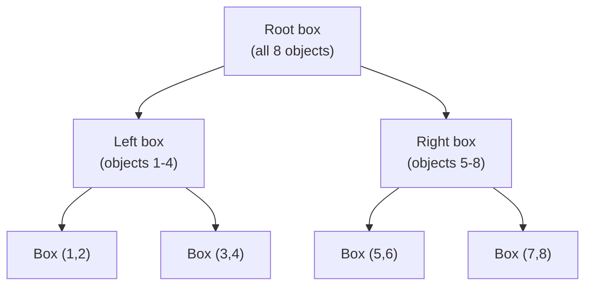

## Learning Objectives

- Explain why testing every ray against every object in a scene does not scale, in concrete terms.
- Build a small bounding volume hierarchy by hand, splitting a short list of objects recursively along the longest axis, following Ray Tracing: The Next Week's own construction.
- Trace a single ray query through that hierarchy, showing which subtrees get skipped entirely via a single box test.
- Connect this construction directly to `the-divide-and-conquer-paradigm` (`algorithms`): what problem property makes this genuinely the same paradigm applied to spatial data.

## Context & Motivation

`ray-casting-generating-and-intersecting-rays` built the mechanics of intersecting one ray against one object; a real scene has anywhere from dozens to millions of objects, and testing every ray against every one of them makes rendering time grow linearly with scene complexity, for every single ray, an approach that stops being practical almost immediately. This concept covers the real, standard fix, a bounding volume hierarchy (BVH), following Shirley, Black, and Hollasch's Ray Tracing: The Next Week, and connects it explicitly to `the-divide-and-conquer-paradigm` (`algorithms`): a BVH is exactly that paradigm, break a problem into smaller subproblems recursively, applied to spatial subdivision instead of, say, subdividing a sorted array.

## Core Theory

### The problem: linear cost per ray

Without any acceleration structure, finding what a single ray hits first requires testing it against every object in the scene and keeping the closest hit, cost proportional to the number of objects, n. For a scene with a million triangles and a million rays (roughly one per pixel at a modest resolution), the naive total cost is on the order of a trillion intersection tests, hopeless for any interactive or even reasonably fast offline render.

### Building a bounding volume hierarchy

A BVH is a binary tree where every node stores an axis-aligned bounding box (AABB), the smallest box, aligned to the x, y, and z axes, that contains everything in that node's subtree. It is built recursively, following exactly the pattern `the-divide-and-conquer-paradigm` already established in the abstract (divide the problem, recursively solve each half, combine): given a list of objects, compute the bounding box containing all of them, choose the longest axis of that box as the split axis (a real, concrete heuristic choice, not the only possible one, but the one this concept's cited source recommends for balancing the tree well in practice), sort the objects along that axis, split the sorted list roughly in half, and recurse on each half, stopping when a subtree holds only one or two objects (the base case). Because each recursive call works on roughly half as many objects as its parent, the resulting tree has a depth roughly proportional to log2(n) for n objects, exactly the same shape of guarantee a balanced binary search tree gives, applied here to spatial containment rather than to a total order on keys.

### Why this accelerates ray queries

Testing a ray against a BVH starts at the root: test the ray against the root's bounding box first. If the ray misses that box entirely, it necessarily misses everything inside it too (a real, exact geometric guarantee, since the box contains every object in that subtree), so the entire subtree, potentially containing thousands of objects, is skipped with a single, cheap box test. If the ray hits the box, the traversal recurses into both children, repeating the same box test at each level, only reaching individual object intersection tests (the ray-sphere or ray-triangle math from `ray-casting-generating-and-intersecting-rays`) at the tree's leaves, and only for the small number of leaves the ray's path actually passes through. This turns the expected cost of finding a ray's nearest hit from linear in the number of objects into roughly logarithmic in practice, since most of the tree gets pruned away by box tests that never touch actual scene geometry.



## Worked Examples

### Example 1: building a small BVH from 4 objects

Four objects with these bounding-box centers along the x-axis (the longest axis of their combined bounding box, in this simplified example): Object 1 at x=1, Object 2 at x=8, Object 3 at x=3, Object 4 at x=6.

```text
Step 1: combined bounding box spans x=1 to x=8 (longest axis: x, by
  construction in this example).
Step 2: sort by x: [Obj1(x=1), Obj3(x=3), Obj4(x=6), Obj2(x=8)]
Step 3: split roughly in half: Left = [Obj1, Obj3], Right = [Obj4, Obj2]
Step 4: recurse on each half (2 objects each: base case reached,
  each becomes a leaf holding its own 2-object bounding box).

Resulting tree: Root box (spans all 4) -> Left box (Obj1, Obj3),
  Right box (Obj4, Obj2), depth 2 for 4 objects (log2(4) = 2).
```

### Example 2: a ray query that skips half the objects with one box test

Same 4-object BVH from Example 1. A ray travels entirely within the region x = 5 to x = 9 (missing the Left box, which spans roughly x = 1 to x = 3, entirely).

```text
1. Test ray against Root box (spans x=1 to x=8): HIT (ray is inside
   this overall range) -> must check both children.
2. Test ray against Left box (Obj1, Obj3, spans x=1 to x=3): MISS
   (ray's region x=5..9 does not overlap x=1..3) -> skip this
   ENTIRE subtree, both Obj1 and Obj3, with this single box test.
3. Test ray against Right box (Obj4, Obj2, spans x=6 to x=8): HIT
   -> recurse into this leaf, test the ray against Obj4 and Obj2
   individually using the ray-sphere or ray-triangle math from
   ray-casting-generating-and-intersecting-rays.
```

Two full object intersection tests were skipped entirely (Obj1 and Obj3) using exactly one extra box test (step 2), the concrete mechanism behind the BVH's real speedup.

### Example 3: the reported real speedup, from the cited source

Shirley, Black, and Hollasch's own Ray Tracing: The Next Week reports a concrete measured result from adding a BVH to their own reference renderer on their own test scene: roughly six and a half times faster than the prior, unaccelerated version, a real, published, single-scene benchmark, not a universal claim about every possible scene, cited here honestly as the order of speedup a working BVH implementation actually achieved for its authors, larger scenes with more objects and more empty space between them typically see substantially larger speedups than this particular reported figure, since the naive linear cost this concept opened with only gets worse as scene size grows.

## Common Misconceptions & Pitfalls

- **"A BVH guarantees exactly log2(n) box tests for every ray, no exceptions."** Example 2's skip only happens because the ray's path genuinely misses the Left box; a ray that happens to pass through many overlapping bounding boxes (common in dense, cluttered scenes) still visits more nodes than a perfectly balanced, best-case traversal would suggest; log2(n) describes the tree's depth, not a hard ceiling on every ray's actual traversal cost.
- **"Splitting the objects, rather than splitting empty space, is a shortcut that loses correctness."** Example 1's object-median split (as opposed to spatially subdividing empty space directly) is explicitly the simpler of the two mainstream construction strategies, and the cited source's own choice, correctness (a ray that should hit an object still finds it) does not depend on which construction heuristic built the tree, only the tree's traversal speed does.
- **"Building the BVH itself is expensive enough to offset its benefit."** The BVH in Example 1 is built once, before any rays are traced, then reused for every one of potentially millions of ray queries against the same static scene; a one-time O(n log n) build cost (from the recursive median split, the same complexity as a comparison sort) amortizes to effectively nothing once even a modest number of rays are traced against it.

## Summary

Testing every ray against every object in a scene scales linearly per ray, hopeless for any realistically sized scene; a bounding volume hierarchy fixes this by recursively splitting objects along their bounding box's longest axis, exactly `the-divide-and-conquer-paradigm`'s recursive break-and-recurse structure applied to spatial containment, producing a binary tree of nested boxes with depth roughly log2(n). A ray query tests against a node's box first and skips that entire subtree with one cheap test if it misses, as Example 2 shows concretely, turning expected per-ray cost from linear into roughly logarithmic, the real mechanism behind the roughly six-and-a-half-times speedup the cited source reports for its own test scene. `recursive-ray-tracing-reflection-refraction-and-shadows`, next, builds on this accelerated intersection test to trace rays that bounce recursively through a scene.

## Documentation Links

- [Shirley, Black, and Hollasch: Ray Tracing: The Next Week (Bounding Volume Hierarchies chapter)](https://raytracing.github.io/books/RayTracingTheNextWeek.html): the freely available book this concept's BVH construction algorithm and reported speedup figure are drawn from directly.
