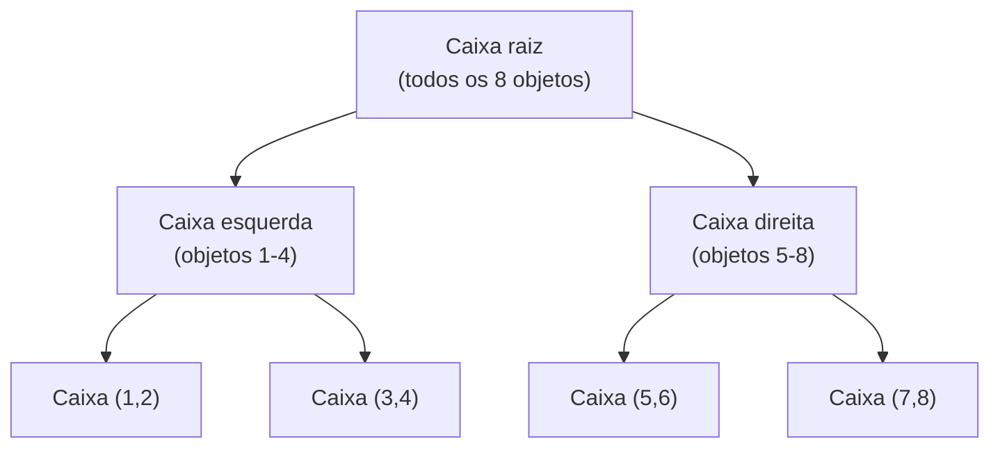

## Objetivos de Aprendizagem

- Explicar por que testar todo raio contra todo objeto numa cena não escala, em termos concretos.
- Construir uma pequena hierarquia de volume delimitador à mão, dividindo uma lista curta de objetos recursivamente ao longo do eixo mais longo, seguindo a própria construção de Ray Tracing: The Next Week.
- Rastrear uma única consulta de raio por essa hierarquia, mostrando quais subárvores são puladas inteiramente via um único teste de caixa.
- Conectar esta construção diretamente a `the-divide-and-conquer-paradigm` (`algorithms`): que propriedade de problema torna isto genuinamente o mesmo paradigma aplicado a dados espaciais.

## Contexto e Motivação

`ray-casting-generating-and-intersecting-rays` construiu a mecânica de intersectar um raio contra um objeto; uma cena real tem de dezenas a milhões de objetos, e testar todo raio contra cada um deles faz o tempo de renderização crescer linearmente com a complexidade da cena, para todo único raio, uma abordagem que para de ser prática quase imediatamente. Este conceito cobre o conserto real e padrão, uma hierarquia de volume delimitador (BVH), seguindo Ray Tracing: The Next Week de Shirley, Black e Hollasch, e o conecta explicitamente a `the-divide-and-conquer-paradigm` (`algorithms`): uma BVH é exatamente esse paradigma, quebrar um problema em subproblemas menores recursivamente, aplicado à subdivisão espacial em vez de, digamos, subdividir um array ordenado.

## Teoria Central

### O problema: custo linear por raio

Sem nenhuma estrutura de aceleração, encontrar o que um único raio atinge primeiro exige testá-lo contra todo objeto na cena e manter o acerto mais próximo, custo proporcional ao número de objetos, n. Para uma cena com um milhão de triângulos e um milhão de raios (aproximadamente um por pixel numa resolução modesta), o custo total ingênuo é da ordem de um trilhão de testes de interseção, desesperador para qualquer render interativo ou mesmo razoavelmente rápido offline.

### Construindo uma hierarquia de volume delimitador

Uma BVH é uma árvore binária onde todo nó armazena uma caixa delimitadora alinhada aos eixos (AABB), a menor caixa, alinhada aos eixos x, y e z, que contém tudo na subárvore daquele nó. Ela é construída recursivamente, seguindo exatamente o padrão que `the-divide-and-conquer-paradigm` já estabeleceu no abstrato (dividir o problema, resolver recursivamente cada metade, combinar): dada uma lista de objetos, computar a caixa delimitadora contendo todos eles, escolher o eixo mais longo dessa caixa como o eixo de divisão (uma escolha heurística real e concreta, não a única possível, mas a que a fonte citada deste conceito recomenda por balancear bem a árvore na prática), ordenar os objetos ao longo desse eixo, dividir a lista ordenada aproximadamente ao meio, e recursar em cada metade, parando quando uma subárvore guarda só um ou dois objetos (o caso base). Porque cada chamada recursiva trabalha em aproximadamente metade dos objetos do seu pai, a árvore resultante tem uma profundidade aproximadamente proporcional a log2(n) para n objetos, exatamente o mesmo formato de garantia que uma árvore de busca binária balanceada dá, aplicado aqui à contenção espacial em vez de a uma ordem total sobre chaves.

### Por que isto acelera as consultas de raio

Testar um raio contra uma BVH começa na raiz: testar o raio contra a caixa delimitadora da raiz primeiro. Se o raio erra essa caixa inteiramente, ele necessariamente erra tudo dentro dela também (uma garantia geométrica real e exata, já que a caixa contém todo objeto naquela subárvore), então a subárvore inteira, potencialmente contendo milhares de objetos, é pulada com um único teste de caixa barato. Se o raio atinge a caixa, a travessia recursa em ambos os filhos, repetindo o mesmo teste de caixa a cada nível, só alcançando testes de interseção de objeto individuais (a matemática de raio-esfera ou raio-triângulo de `ray-casting-generating-and-intersecting-rays`) nas folhas da árvore, e só para o pequeno número de folhas pelas quais o caminho do raio de fato passa. Isto transforma o custo esperado de encontrar o acerto mais próximo de um raio de linear no número de objetos em aproximadamente logarítmico na prática, já que a maior parte da árvore é podada por testes de caixa que nunca tocam a geometria de cena de fato.



## Exemplos Resolvidos

### Exemplo 1: construindo uma pequena BVH a partir de 4 objetos

Quatro objetos com estes centros de caixa delimitadora ao longo do eixo x (o eixo mais longo da sua caixa delimitadora combinada, neste exemplo simplificado): Objeto 1 em x=1, Objeto 2 em x=8, Objeto 3 em x=3, Objeto 4 em x=6.

```text
Passo 1: a caixa delimitadora combinada abrange x=1 a x=8 (eixo mais longo: x, por
  construção neste exemplo).
Passo 2: ordenar por x: [Obj1(x=1), Obj3(x=3), Obj4(x=6), Obj2(x=8)]
Passo 3: dividir aproximadamente ao meio: Esquerda = [Obj1, Obj3], Direita = [Obj4, Obj2]
Passo 4: recursar em cada metade (2 objetos cada: caso base alcançado,
  cada uma vira uma folha guardando a sua própria caixa delimitadora de 2 objetos).

Árvore resultante: Caixa raiz (abrange todos os 4) -> Caixa esquerda (Obj1, Obj3),
  Caixa direita (Obj4, Obj2), profundidade 2 para 4 objetos (log2(4) = 2).
```

### Exemplo 2: uma consulta de raio que pula metade dos objetos com um teste de caixa

A mesma BVH de 4 objetos do Exemplo 1. Um raio viaja inteiramente dentro da região x = 5 a x = 9 (errando a caixa Esquerda, que abrange aproximadamente x = 1 a x = 3, inteiramente).

```text
1. Testar o raio contra a caixa Raiz (abrange x=1 a x=8): ACERTO (o raio está dentro
   deste intervalo geral) -> tem de checar ambos os filhos.
2. Testar o raio contra a caixa Esquerda (Obj1, Obj3, abrange x=1 a x=3): ERRO
   (a região x=5..9 do raio não se sobrepõe a x=1..3) -> pular esta
   subárvore INTEIRA, tanto Obj1 quanto Obj3, com este único teste de caixa.
3. Testar o raio contra a caixa Direita (Obj4, Obj2, abrange x=6 a x=8): ACERTO
   -> recursar nesta folha, testar o raio contra Obj4 e Obj2
   individualmente usando a matemática de raio-esfera ou raio-triângulo de
   ray-casting-generating-and-intersecting-rays.
```

Dois testes de interseção de objeto completos foram pulados inteiramente (Obj1 e Obj3) usando exatamente um teste de caixa extra (passo 2), o mecanismo concreto por trás do speedup real da BVH.

### Exemplo 3: o speedup real reportado, da fonte citada

O próprio Ray Tracing: The Next Week de Shirley, Black e Hollasch reporta um resultado medido concreto de adicionar uma BVH ao seu próprio renderizador de referência na sua própria cena de teste: aproximadamente seis vezes e meia mais rápido do que a versão anterior e não acelerada, um benchmark real, publicado e de cena única, não uma alegação universal sobre toda cena possível, citado aqui honestamente como a ordem de speedup que uma implementação de BVH funcional de fato alcançou para os seus autores, cenas maiores com mais objetos e mais espaço vazio entre eles tipicamente veem speedups substancialmente maiores do que esta figura reportada em particular, já que o custo linear ingênuo com o qual este conceito abriu só piora à medida que o tamanho da cena cresce.

## Equívocos Comuns e Armadilhas

- **"Uma BVH garante exatamente log2(n) testes de caixa para todo raio, sem exceções."** O pulo do Exemplo 2 só acontece porque o caminho do raio genuinamente erra a caixa Esquerda; um raio que por acaso passa por muitas caixas delimitadoras sobrepostas (comum em cenas densas e abarrotadas) ainda visita mais nós do que uma travessia perfeitamente balanceada e de melhor-caso sugeriria; log2(n) descreve a profundidade da árvore, não um teto rígido sobre o custo de travessia de fato de todo raio.
- **"Dividir os objetos, em vez de dividir o espaço vazio, é um atalho que perde correção."** A divisão de mediana-de-objeto do Exemplo 1 (em oposição a subdividir o espaço vazio espacialmente diretamente) é explicitamente a mais simples das duas estratégias de construção mainstream, e a própria escolha da fonte citada, a correção (um raio que deveria atingir um objeto ainda o encontra) não depende de qual heurística de construção construiu a árvore, só a velocidade de travessia da árvore depende.
- **"Construir a própria BVH é caro o bastante para compensar o seu benefício."** A BVH no Exemplo 1 é construída uma vez, antes de qualquer raio ser traçado, depois reusada para todas as potencialmente milhões de consultas de raio contra a mesma cena estática; um custo de construção único de O(n log n) (da divisão de mediana recursiva, a mesma complexidade de uma ordenação por comparação) amortiza para efetivamente nada uma vez que mesmo um número modesto de raios são traçados contra ela.

## Resumo

Testar todo raio contra todo objeto numa cena escala linearmente por raio, inviável para qualquer cena de tamanho realista; uma hierarquia de volume delimitador conserta isto dividindo recursivamente os objetos ao longo do eixo mais longo da sua caixa delimitadora, exatamente a estrutura recursiva de quebrar-e-recursar de `the-divide-and-conquer-paradigm` aplicada à contenção espacial, produzindo uma árvore binária de caixas aninhadas com profundidade aproximadamente log2(n). Uma consulta de raio testa contra a caixa de um nó primeiro e pula essa subárvore inteira com um teste barato se a erra, como o Exemplo 2 mostra concretamente, transformando o custo esperado por raio de linear em aproximadamente logarítmico, o mecanismo real por trás do speedup de aproximadamente seis vezes e meia que a fonte citada reporta para a sua própria cena de teste. `recursive-ray-tracing-reflection-refraction-and-shadows`, em seguida, constrói sobre este teste de interseção acelerado para traçar raios que ricocheteiam recursivamente por uma cena.

## Documentation Links

- [Shirley, Black, and Hollasch: Ray Tracing: The Next Week (Bounding Volume Hierarchies chapter)](https://raytracing.github.io/books/RayTracingTheNextWeek.html): o livro livremente disponível do qual o algoritmo de construção de BVH e a figura de speedup reportada deste conceito são tirados diretamente.
