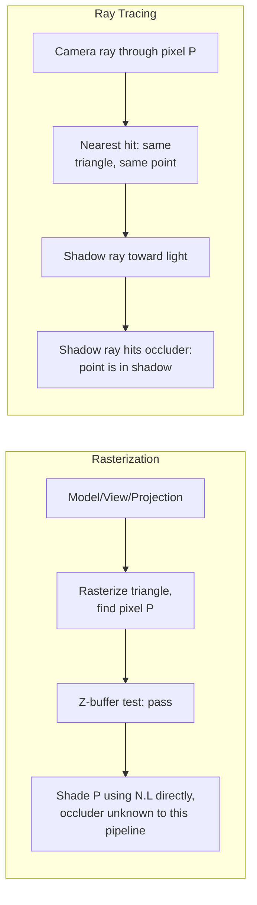

## Learning Objectives

- Trace one concrete triangle, one light, and one camera through every stage this discipline built for the rasterization pipeline: model matrix, view matrix, projection, rasterization, z-buffering, and Blinn-Phong shading, arriving at one final pixel color.
- Trace the identical scene a second way: a camera ray cast at the same pixel, intersected with the same triangle, shaded with the same lighting equation plus a recursive shadow ray.
- State precisely where the two final colors agree, where they differ, and name the exact mechanism responsible for the difference.
- State honestly, in one paragraph, what this capstone still leaves out of a production-quality renderer, matching the same honest-boundary discipline every capstone in this curriculum keeps.

## Context & Motivation

Every concept in this discipline built one piece of one of two pipelines: `the-graphics-pipeline-from-vertices-to-pixels` through `shading-interpolation-flat-gouraud-and-phong-shading` built the rasterization pipeline, and `ray-casting-generating-and-intersecting-rays` through `rasterization-vs-ray-tracing-tradeoffs-and-real-time-hardware` built ray tracing. This capstone's job, in the same closing pattern `database-systems` and `distributed-systems-i` already used for their own capstones, is naming precisely which concept is responsible for each step of one concrete scene, rendered both ways, and showing exactly where the two answers agree and where they honestly diverge.

## Core Theory

### The scene

One triangle, object-space vertices A=(0,0,0), B=(1,0,0), C=(0,1,0), each sharing the normal (0,0,1) and albedo (0.8, 0.2, 0.2) (reused from `local-illumination-lambertian-diffuse-reflection`'s own worked example). A model matrix (per `3d-transformations-and-composing-the-model-matrix`) places it in the world with a pure translation by (0,0,-5) (no scale or rotation needed for this example), so world-space vertices are A'=(0,0,-5), B'=(1,0,-5), C'=(0,1,-5), facing the camera directly. A camera sits at the world origin, looking down -Z with no additional rotation, so the view matrix (per `the-view-matrix-and-camera-space`) is the identity here, and camera-space coordinates equal these same world-space coordinates. One point light sits at a direction corresponding to L = (0.707, 0, 0.707) from the triangle's surface (the identical 45-degree configuration `local-illumination-lambertian-diffuse-reflection`'s Example 2 used), and a small, separate opaque occluder object sits directly between the triangle and the light, blocking a direct line of sight from the triangle's surface to the light source.

### Path 1: the rasterization pipeline

Projection and the viewport transform (per `the-projection-matrix-perspective-and-clipping` and `triangle-rasterization-edge-functions-and-barycentric-coordinates`) map the triangle into screen space; for this trace, the resulting screen-space triangle and the pixel of interest are taken directly from `triangle-rasterization-edge-functions-and-barycentric-coordinates`'s own worked example: screen-space vertices A=(0,0), B=(4,0), C=(0,4), pixel P=(1,1), with barycentric weights (alpha, beta, gamma) = (0.5, 0.25, 0.25), all three positive, confirming P is inside the triangle. Since every vertex shares the identical world-space depth (z=-5) and the identical normal, the interpolated depth and normal at P equal that same shared depth and normal exactly; `z-buffering-and-visibility-determination`'s test passes trivially (nothing else has been drawn at this pixel), writing depth 5 into the z-buffer. Shading at P (per `local-illumination-lambertian-diffuse-reflection` and `specular-reflection-the-phong-and-blinn-phong-models`) evaluates the lighting equation using the named light directly, with no notion of the occluder anywhere in this pipeline as built in this discipline.

### Path 2: ray tracing

A camera ray is generated (per `ray-casting-generating-and-intersecting-rays`) through the exact same pixel P; since both pipelines render the identical camera and the identical scene, that ray finds the identical surface point on the identical triangle, at the identical interpolated normal, this is not a coincidence, it is the whole reason both techniques are valid ways of answering the same underlying question. From that hit point, a shadow ray is cast toward the light (per `recursive-ray-tracing-reflection-refraction-and-shadows`); this shadow ray intersects the occluder before reaching the light.



## Worked Examples

### Example 1: the rasterization pipeline's final color at pixel P

Diffuse term (per `local-illumination-lambertian-diffuse-reflection`'s own Example 2, reused exactly): N.L = 0.707, diffuse_color = (0.8,0.2,0.2) * 0.707 = (0.566, 0.141, 0.141). Specular term (Blinn-Phong, per `specular-reflection-the-phong-and-blinn-phong-models`): view direction from the surface point (0,0,-5) to the camera (0,0,0) is (0,0,1); halfway vector H = normalize(L + V) = normalize((0.707,0,0.707)+(0,0,1)) = normalize(0.707,0,1.707), which has magnitude sqrt(0.707^2 + 1.707^2) = sqrt(0.5 + 2.914) = sqrt(3.414) =~ 1.848, giving H =~ (0.383, 0, 0.924); N.H = (0,0,1).(0.383,0,0.924) = 0.924; with shininess 32 and a white specular reflectance of 0.5: specular_term = 0.5 * 0.924^32 =~ 0.5 * 0.080 = 0.040 (applied equally to all three color channels, since the specular highlight and light color are both treated as white here):

```text
final_color (rasterization) = diffuse_color + specular_color
                             = (0.566,0.141,0.141) + (0.040,0.040,0.040)
                             = (0.606, 0.181, 0.181)
```

A moderately bright, red-leaning pixel, computed with no knowledge of the occluder anywhere in this trace, since this discipline's rasterization pipeline, as built, evaluates the named light directly without a separate shadow test.

### Example 2: the ray-traced final color at the identical pixel

The camera ray finds the identical surface point (same barycentric location, same interpolated normal (0,0,1), confirmed above). Its shadow ray toward the light intersects the occluder first (per the scene setup), so, per `recursive-ray-tracing-reflection-refraction-and-shadows`'s own shadow-ray logic, this point is in shadow with respect to this light: the diffuse and specular contributions from this specific light are both forced to zero, regardless of the identical N.L = 0.707 and N.H = 0.924 values computed in Example 1, because no light from this source actually reaches the point. With only a flat ambient term left (ambient = 0.1, per `the-rendering-equation-and-the-limits-of-real-time-shading`'s own honest stand-in for indirect light):

```text
final_color (ray tracing) = albedo * ambient
                           = (0.8,0.2,0.2) * 0.1
                           = (0.08, 0.02, 0.02)
```

A dark, nearly black pixel, the physically correct result for a point genuinely blocked from its only direct light source.

### Example 3: where the two answers agree, where they diverge, and why

```text
Rasterization: (0.606, 0.181, 0.181)   [bright]
Ray tracing:   (0.080, 0.020, 0.020)   [dark]

AGREE on: which surface is visible at pixel P (same triangle, same
  barycentric point, same interpolated normal): both pipelines
  answer the exact same visibility question identically.
DIVERGE on: whether the light actually reaches that point. The
  rasterization pipeline, as built across this discipline, has no
  mechanism to ask that question at all, it evaluates N.L against
  the light directly, unconditionally. The ray-traced pipeline asks
  it explicitly, via a shadow ray, and gets the physically correct
  answer: the occluder blocks the light, so this point is genuinely
  in shadow.
```

The rasterization result above is not a bug in this discipline's pipeline; it is the exact, concrete, honest limitation `rasterization-vs-ray-tracing-tradeoffs-and-real-time-hardware` already named: real shipping engines add a separate shadow-mapping technique specifically to give rasterization this same shadow-awareness, a real, additional mechanism this discipline's scope does not cover, deliberately left as the one piece a production renderer would still need beyond what this capstone traces.

## Common Misconceptions & Pitfalls

- **"The two pipelines disagree because ray tracing is simply more correct at everything."** Example 3 shows the two pipelines agree exactly on visibility (which surface, which point, which normal); they diverge specifically on shadow testing, a capability this discipline's rasterization pipeline was never built to have, not a general claim that ray tracing outperforms rasterization at every task this discipline covered.
- **"A real-time rasterizer would actually show this same overly bright, wrong-looking pixel in production."** Real engines add shadow mapping (rendering the scene from the light's point of view first, to determine occlusion, a real, separate, additional technique) specifically to close this exact gap; this capstone's rasterization pipeline is intentionally the discipline's own, more limited scope, not a claim that shipping rasterizers ship with no shadows at all.
- **"Since both final colors used the identical diffuse and specular formulas, the difference must be a rounding error."** The formulas and their numeric inputs (N.L = 0.707, N.H = 0.924) are identical in both examples; the entire difference comes from one explicit, discrete decision, whether this light's contribution is included at all, zeroed out entirely by Example 2's shadow-ray result, not from any numeric imprecision.

## Summary

Tracing one triangle through the rasterization pipeline, model matrix into view matrix into projection, edge-function rasterization, z-buffer visibility, and Blinn-Phong shading, produces a bright pixel, (0.606, 0.181, 0.181), because that pipeline evaluates its named light directly with no shadow test. Tracing the identical scene through ray tracing, a camera ray finding the same surface point, plus a shadow ray toward the same light, produces a dark pixel, (0.080, 0.020, 0.020), because the shadow ray correctly detects an occluder blocking the light. The two pipelines agree exactly on visibility and disagree specifically on shadow awareness, the concrete, worked instance of the honest trade-off `rasterization-vs-ray-tracing-tradeoffs-and-real-time-hardware` already named. What this capstone still leaves out, honestly: a single triangle and a single light is not a full scene, real renderers handle many overlapping, potentially transparent triangles, multiple lights, and, for rasterization specifically, a separate shadow-mapping pass this discipline's rasterization pipeline scope does not cover, all real, additional engineering this discipline's introductory treatment deliberately stops short of.

## Documentation Links

- [Cornell CS4620: Introduction to Computer Graphics (course page, Fall 2025)](https://www.cs.cornell.edu/courses/cs4620/2025fa/): a real, current university course whose combined coverage of transformations, rasterization, ray tracing, and shading this capstone's side-by-side trace draws its structure from.
- [Shirley, Black, and Hollasch: Ray Tracing in One Weekend](https://raytracing.github.io/books/RayTracingInOneWeekend.html): the freely available book whose ray generation, intersection, and shadow-ray treatment this capstone's ray-traced path follows directly.
