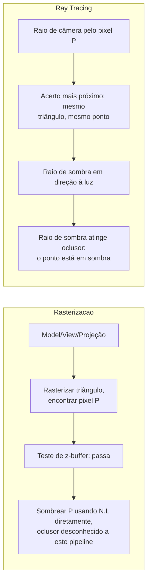

## Objetivos de Aprendizagem

- Rastrear um triângulo concreto, uma luz e uma câmera por cada estágio que esta disciplina construiu para o pipeline de rasterização: model matrix, view matrix, projeção, rasterização, z-buffering e sombreamento Blinn-Phong, chegando a uma cor de pixel final.
- Rastrear a cena idêntica de uma segunda forma: um raio de câmera lançado no mesmo pixel, intersectado com o mesmo triângulo, sombreado com a mesma equação de iluminação mais um raio de sombra recursivo.
- Enunciar precisamente onde as duas cores finais concordam, onde diferem, e nomear o mecanismo exato responsável pela diferença.
- Enunciar honestamente, num parágrafo, o que este capstone ainda deixa de fora de um renderizador de qualidade de produção, correspondendo à mesma disciplina de limite-honesto que todo capstone neste currículo mantém.

## Contexto e Motivação

Todo conceito nesta disciplina construiu uma peça de um de dois pipelines: `the-graphics-pipeline-from-vertices-to-pixels` até `shading-interpolation-flat-gouraud-and-phong-shading` construiu o pipeline de rasterização, e `ray-casting-generating-and-intersecting-rays` até `rasterization-vs-ray-tracing-tradeoffs-and-real-time-hardware` construiu o ray tracing. O trabalho deste capstone, no mesmo padrão de encerramento que `database-systems` e `distributed-systems-i` já usaram para os seus próprios capstones, é nomear precisamente qual conceito é responsável por cada passo de uma cena concreta, renderizada de ambas as formas, e mostrar exatamente onde as duas respostas concordam e onde elas honestamente divergem.

## Teoria Central

### A cena

Um triângulo, vértices de espaço de objeto A=(0,0,0), B=(1,0,0), C=(0,1,0), cada um compartilhando a normal (0,0,1) e o albedo (0.8, 0.2, 0.2) (reusado do próprio exemplo resolvido de `local-illumination-lambertian-diffuse-reflection`). Uma model matrix (por `3d-transformations-and-composing-the-model-matrix`) o coloca no mundo com uma translação pura por (0,0,-5) (nenhuma escala ou rotação necessária para este exemplo), então os vértices de espaço de mundo são A'=(0,0,-5), B'=(1,0,-5), C'=(0,1,-5), de frente para a câmera diretamente. Uma câmera fica na origem do mundo, olhando para baixo em -Z sem nenhuma rotação adicional, então a view matrix (por `the-view-matrix-and-camera-space`) é a identidade aqui, e as coordenadas de espaço de câmera igualam estas mesmas coordenadas de espaço de mundo. Uma luz pontual fica numa direção correspondente a L = (0.707, 0, 0.707) da superfície do triângulo (a configuração idêntica de 45 graus que o Exemplo 2 de `local-illumination-lambertian-diffuse-reflection` usou), e um pequeno objeto oclusor opaco e separado fica diretamente entre o triângulo e a luz, bloqueando uma linha de visão direta da superfície do triângulo à fonte de luz.

### Caminho 1: o pipeline de rasterização

A projeção e a transformação de viewport (por `the-projection-matrix-perspective-and-clipping` e `triangle-rasterization-edge-functions-and-barycentric-coordinates`) mapeiam o triângulo no espaço de tela; para este rastreamento, o triângulo de espaço de tela resultante e o pixel de interesse são tirados diretamente do próprio exemplo resolvido de `triangle-rasterization-edge-functions-and-barycentric-coordinates`: vértices de espaço de tela A=(0,0), B=(4,0), C=(0,4), pixel P=(1,1), com pesos baricêntricos (alpha, beta, gamma) = (0.5, 0.25, 0.25), todos os três positivos, confirmando que P está dentro do triângulo. Já que todo vértice compartilha a profundidade de espaço de mundo idêntica (z=-5) e a normal idêntica, a profundidade e a normal interpoladas em P igualam essa mesma profundidade e normal compartilhadas exatamente; o teste de `z-buffering-and-visibility-determination` passa trivialmente (nada mais foi desenhado neste pixel), escrevendo profundidade 5 no z-buffer. O sombreamento em P (por `local-illumination-lambertian-diffuse-reflection` e `specular-reflection-the-phong-and-blinn-phong-models`) avalia a equação de iluminação usando a luz nomeada diretamente, sem nenhuma noção do oclusor em lugar nenhum neste pipeline como construído nesta disciplina.

### Caminho 2: ray tracing

Um raio de câmera é gerado (por `ray-casting-generating-and-intersecting-rays`) pelo exato mesmo pixel P; já que ambos os pipelines renderizam a câmera idêntica e a cena idêntica, esse raio encontra o ponto de superfície idêntico no triângulo idêntico, na normal interpolada idêntica, isto não é uma coincidência, é a razão inteira pela qual ambas as técnicas são formas válidas de responder a mesma pergunta subjacente. Desse ponto de acerto, um raio de sombra é lançado em direção à luz (por `recursive-ray-tracing-reflection-refraction-and-shadows`); este raio de sombra intersecta o oclusor antes de alcançar a luz.



## Exemplos Resolvidos

### Exemplo 1: a cor final do pipeline de rasterização no pixel P

Termo difuso (pelo próprio Exemplo 2 de `local-illumination-lambertian-diffuse-reflection`, reusado exatamente): N.L = 0.707, diffuse_color = (0.8,0.2,0.2) * 0.707 = (0.566, 0.141, 0.141). Termo especular (Blinn-Phong, por `specular-reflection-the-phong-and-blinn-phong-models`): a direção de visão do ponto de superfície (0,0,-5) à câmera (0,0,0) é (0,0,1); vetor halfway H = normalize(L + V) = normalize((0.707,0,0.707)+(0,0,1)) = normalize(0.707,0,1.707), que tem magnitude sqrt(0.707^2 + 1.707^2) = sqrt(0.5 + 2.914) = sqrt(3.414) =~ 1.848, dando H =~ (0.383, 0, 0.924); N.H = (0,0,1).(0.383,0,0.924) = 0.924; com shininess 32 e uma refletância especular branca de 0.5: specular_term = 0.5 * 0.924^32 =~ 0.5 * 0.080 = 0.040 (aplicado igualmente a todos os três canais de cor, já que o destaque especular e a cor da luz são ambos tratados como brancos aqui):

```text
final_color (rasterização) = diffuse_color + specular_color
                           = (0.566,0.141,0.141) + (0.040,0.040,0.040)
                           = (0.606, 0.181, 0.181)
```

Um pixel moderadamente brilhante e inclinado ao vermelho, computado sem nenhum conhecimento do oclusor em lugar nenhum neste rastreamento, já que o pipeline de rasterização desta disciplina, como construído, avalia a luz nomeada diretamente sem um teste de sombra separado.

### Exemplo 2: a cor final por ray tracing no pixel idêntico

O raio de câmera encontra o ponto de superfície idêntico (mesma localização baricêntrica, mesma normal interpolada (0,0,1), confirmado acima). O seu raio de sombra em direção à luz intersecta o oclusor primeiro (pela montagem da cena), então, pela própria lógica de raio-de-sombra de `recursive-ray-tracing-reflection-refraction-and-shadows`, este ponto está em sombra em relação a esta luz: as contribuições difusa e especular desta luz específica são ambas forçadas a zero, independentemente dos valores idênticos N.L = 0.707 e N.H = 0.924 computados no Exemplo 1, porque nenhuma luz desta fonte de fato alcança o ponto. Com só um termo ambiente plano restante (ambient = 0.1, pelo próprio substituto honesto de luz indireta de `the-rendering-equation-and-the-limits-of-real-time-shading`):

```text
final_color (ray tracing) = albedo * ambient
                          = (0.8,0.2,0.2) * 0.1
                          = (0.08, 0.02, 0.02)
```

Um pixel escuro, quase preto, o resultado fisicamente correto para um ponto genuinamente bloqueado da sua única fonte de luz direta.

### Exemplo 3: onde as duas respostas concordam, onde divergem, e por quê

```text
Rasterização: (0.606, 0.181, 0.181)   [brilhante]
Ray tracing:  (0.080, 0.020, 0.020)   [escuro]

CONCORDAM em: qual superfície é visível no pixel P (mesmo triângulo, mesmo
  ponto baricêntrico, mesma normal interpolada): ambos os pipelines
  respondem a exata mesma pergunta de visibilidade identicamente.
DIVERGEM em: se a luz de fato alcança esse ponto. O
  pipeline de rasterização, como construído por toda esta disciplina, não tem
  nenhum mecanismo para fazer essa pergunta de todo, ele avalia N.L contra
  a luz diretamente, incondicionalmente. O pipeline por ray tracing a faz
  explicitamente, via um raio de sombra, e obtém a resposta fisicamente correta:
  o oclusor bloqueia a luz, então este ponto está genuinamente
  em sombra.
```

O resultado de rasterização acima não é um bug no pipeline desta disciplina; é a exata, concreta e honesta limitação que `rasterization-vs-ray-tracing-tradeoffs-and-real-time-hardware` já nomeou: engines de produção reais adicionam uma técnica de shadow-mapping separada especificamente para dar à rasterização essa mesma consciência de sombra, um mecanismo real e adicional que o escopo desta disciplina não cobre, deliberadamente deixado como a única peça que um renderizador de produção ainda precisaria além do que este capstone rastreia.

## Equívocos Comuns e Armadilhas

- **"Os dois pipelines discordam porque o ray tracing é simplesmente mais correto em tudo."** O Exemplo 3 mostra que os dois pipelines concordam exatamente na visibilidade (qual superfície, qual ponto, qual normal); eles divergem especificamente no teste de sombra, uma capacidade que o pipeline de rasterização desta disciplina nunca foi construído para ter, não uma alegação geral de que o ray tracing supera a rasterização em toda tarefa que esta disciplina cobriu.
- **"Um rasterizador de tempo real de fato mostraria este mesmo pixel brilhante demais e de aparência errada em produção."** Engines reais adicionam shadow mapping (renderizar a cena do ponto de vista da luz primeiro, para determinar oclusão, uma técnica real, separada e adicional) especificamente para fechar esta exata lacuna; o pipeline de rasterização deste capstone é intencionalmente o próprio escopo mais limitado da disciplina, não uma alegação de que rasterizadores de produção são enviados sem nenhuma sombra de todo.
- **"Já que ambas as cores finais usaram as fórmulas difusa e especular idênticas, a diferença tem de ser um erro de arredondamento."** As fórmulas e as suas entradas numéricas (N.L = 0.707, N.H = 0.924) são idênticas em ambos os exemplos; a diferença inteira vem de uma decisão explícita e discreta, se a contribuição desta luz é incluída de todo, zerada inteiramente pelo resultado de raio-de-sombra do Exemplo 2, não de qualquer imprecisão numérica.

## Resumo

Rastrear um triângulo pelo pipeline de rasterização, model matrix para view matrix para projeção, rasterização por função de aresta, visibilidade por z-buffer e sombreamento Blinn-Phong, produz um pixel brilhante, (0.606, 0.181, 0.181), porque esse pipeline avalia a sua luz nomeada diretamente sem nenhum teste de sombra. Rastrear a cena idêntica por ray tracing, um raio de câmera encontrando o mesmo ponto de superfície, mais um raio de sombra em direção à mesma luz, produz um pixel escuro, (0.080, 0.020, 0.020), porque o raio de sombra detecta corretamente um oclusor bloqueando a luz. Os dois pipelines concordam exatamente na visibilidade e discordam especificamente na consciência de sombra, a instância concreta e resolvida do trade-off honesto que `rasterization-vs-ray-tracing-tradeoffs-and-real-time-hardware` já nomeou. O que este capstone ainda deixa de fora, honestamente: um único triângulo e uma única luz não é uma cena completa, renderizadores reais tratam muitos triângulos sobrepostos e potencialmente transparentes, múltiplas luzes, e, para a rasterização especificamente, uma passagem de shadow-mapping separada que o escopo do pipeline de rasterização desta disciplina não cobre, toda engenharia real e adicional de que o tratamento introdutório desta disciplina deliberadamente para antes.

## Documentation Links

- [Cornell CS4620: Introduction to Computer Graphics (course page, Fall 2025)](https://www.cs.cornell.edu/courses/cs4620/2025fa/): um curso universitário real e atual cuja cobertura combinada de transformações, rasterização, ray tracing e sombreamento este rastreamento lado a lado do capstone tira a sua estrutura.
- [Shirley, Black, and Hollasch: Ray Tracing in One Weekend](https://raytracing.github.io/books/RayTracingInOneWeekend.html): o livro livremente disponível cujo tratamento de geração de raio, interseção e raio de sombra o caminho por ray tracing deste capstone segue diretamente.
