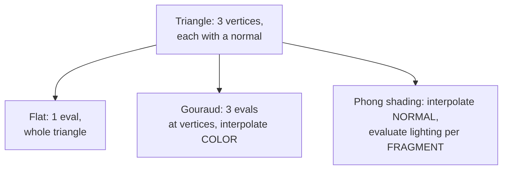

## Learning Objectives

- Distinguish three points in the pipeline where a lighting equation can be evaluated: once per triangle (flat), once per vertex with the result interpolated (Gouraud), or once per fragment with the normal itself interpolated (Phong shading).
- Compute a concrete case where Gouraud shading misses a specular highlight that Phong shading correctly captures.
- Explain precisely why "Phong shading" and "the Phong reflection model" are two different, easily confused ideas from the same author's era, and keep them straight.
- State the real cost trade-off between the three techniques in terms of where and how often the lighting equation runs.

## Context & Motivation

`local-illumination-lambertian-diffuse-reflection` and `specular-reflection-the-phong-and-blinn-phong-models` built a complete lighting equation: given a surface normal, a light direction, and a view direction, compute a color. Neither concept said where in the rendering pipeline that equation actually gets evaluated, and that turns out to matter enormously for triangle-based rendering, since a triangle only has normals defined at its three vertices, not at every one of the many pixels it covers. This concept covers the real, separate question of interpolation strategy: flat shading, Gouraud shading, and Phong shading are three different answers to "where does the lighting math actually run," each with a real, visible trade-off.

## Core Theory

### Flat shading: one evaluation per triangle

The simplest approach evaluates the lighting equation exactly once per triangle, typically using the triangle's face normal (perpendicular to the whole triangle, ignoring any per-vertex normal), and paints every pixel of that triangle the identical resulting color. This is cheap (one lighting evaluation regardless of triangle size) but visibly faceted: a curved surface approximated by many small flat triangles shows a visible boundary between every pair of adjacent triangles, since neighboring triangles generally have different face normals and therefore different flat colors.

### Gouraud shading: per-vertex evaluation, interpolated

Gouraud shading evaluates the full lighting equation at each of a triangle's three vertices (using each vertex's own normal, typically an average of the normals of the triangles sharing that vertex, which approximates a smooth surface even though the underlying geometry is faceted triangles), producing three colors, then uses `triangle-rasterization-edge-functions-and-barycentric-coordinates`'s barycentric weights to interpolate those three colors smoothly across the triangle's interior, exactly as Worked Example 3 in that concept interpolated a color attribute. This removes flat shading's hard facet boundaries, since colors now blend continuously between vertices, and costs only three lighting evaluations per triangle, however many pixels it covers.

### Phong shading: per-fragment evaluation, with interpolated normals

Phong shading (a shading interpolation technique, not the specular reflection model from the previous concept, despite sharing an author and era, a real and common point of confusion) instead interpolates the surface normal itself across the triangle, using the same barycentric weights, and then evaluates the full lighting equation fresh at every fragment, using that fragment's own interpolated (and re-normalized) normal. This costs one full lighting evaluation per fragment rather than per vertex, meaningfully more work for a large triangle covering many pixels, but produces correct, smoothly varying highlights anywhere on the triangle's interior, including places no vertex ever directly computed.



## Worked Examples

### Example 1: a specular highlight Gouraud shading misses

A single large triangle, vertices at (0,0), (10,0), (5,10) in screen space, each with the same normal (0,0,1) (a flat triangle, so all normals are identical, isolating the interpolation difference alone rather than a normal-interpolation difference). A single light positioned such that the true specular highlight peak (per `specular-reflection-the-phong-and-blinn-phong-models`'s R . V = 1 condition) falls exactly at the triangle's centroid, (5, 3.33), a point with no vertex nearby.

```text
Gouraud: lighting evaluated only at the 3 vertices. Suppose,
  at each vertex, the specular term is small (R.V = 0.3, far from
  the peak at that vertex's own position): specular ~= 0.3^32 =~ 0
  at every vertex. Interpolating three near-zero specular values
  across the triangle produces a near-zero specular value
  EVERYWHERE, including at the centroid, where the true highlight
  should peak. The highlight is missed entirely.

Phong shading: lighting evaluated fresh at the centroid fragment
  itself, using the interpolated (here, unchanged) normal and that
  fragment's own light/view geometry: R.V = 1.0 exactly at the
  centroid, specular = 1.0^32 = 1.0, a full-brightness highlight
  correctly appears there.
```

### Example 2: cost comparison for one triangle covering 10,000 pixels

A single triangle, viewed close to the camera, covers 10,000 fragments. Flat shading: 1 lighting evaluation total. Gouraud shading: 3 lighting evaluations (at the vertices) plus 10,000 cheap color interpolations (a few multiply-adds each, far cheaper than a full lighting evaluation). Phong shading: 10,000 full lighting evaluations, one per fragment, each including a normal interpolation, re-normalization, and the complete diffuse-plus-specular computation from the two previous concepts.

### Example 3: flat shading's visible facet, made concrete

Two adjacent triangles approximating a curved cylinder, with face normals (0.966, 0.259, 0) and (0.866, 0.5, 0) respectively (an 15-degree difference in orientation). Under the same light direction (1, 0, 0):

```text
Triangle 1: N.L = 0.966 -> bright
Triangle 2: N.L = 0.866 -> visibly dimmer
```

A viewer sees a sharp brightness discontinuity exactly at the shared edge between these two triangles, a real, visible facet line; both Gouraud and Phong shading remove this specific artifact by using averaged per-vertex normals instead of the raw per-triangle face normal, so the two triangles share the same normal value at their shared vertices and no hard edge appears in the interpolated result.

## Common Misconceptions & Pitfalls

- **"Phong shading and the Phong reflection model are the same thing."** They are two different, easily confused ideas from the same paper: the Phong reflection model (`specular-reflection-the-phong-and-blinn-phong-models`) is a lighting equation (what color at a point); Phong shading, this concept, is an interpolation strategy (where and how often that lighting equation gets evaluated). Gouraud shading can use the Phong reflection model as its lighting equation, and Phong shading can use any lighting equation, including plain Lambertian diffuse, at every fragment.
- **"Gouraud shading is simply a lower-quality version of Phong shading, never worth choosing."** Example 2's cost comparison is real: for a scene where per-vertex lighting artifacts are not visually significant (small triangles, gentle lighting, no small specular highlights), Gouraud shading delivers visually similar results at a small fraction of Phong shading's per-fragment cost, a genuine, still-relevant trade-off, not merely a historical one.
- **"Flat shading is never used in modern rendering."** Flat shading remains the correct, deliberate choice for surfaces that are genuinely faceted by design (a low-poly stylized game, a gemstone with real flat facets), where interpolating a smooth-looking gradient across a genuinely flat, sharp-edged face would look wrong, not right.

## Summary

The lighting equations built in the previous two concepts can be evaluated at three different points in the pipeline: once per triangle (flat shading, cheap but visibly faceted), once per vertex with the resulting color interpolated (Gouraud shading, three evaluations per triangle but capable of missing a specular highlight that falls between vertices, as Example 1 shows), or once per fragment with the normal itself interpolated first (Phong shading, one full evaluation per fragment, correctly catching highlights anywhere on the triangle's interior, at real extra cost). `the-rendering-equation-and-the-limits-of-real-time-shading`, next, states honestly what all three of these real-time techniques still leave out of the full physical picture.

## Documentation Links

- [Cornell CS4620: Introduction to Computer Graphics (course page, Fall 2025)](https://www.cs.cornell.edu/courses/cs4620/2025fa/): a real, current university course whose "Rendering" and "appearance models with shading approaches" unit covers flat, Gouraud, and Phong shading interpolation as the standard comparison this concept builds.
