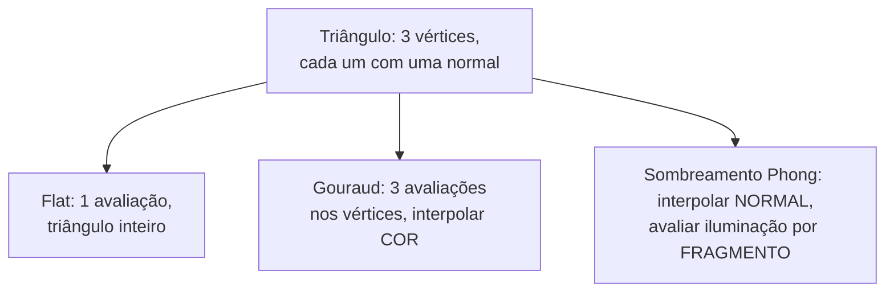

## Objetivos de Aprendizagem

- Distinguir três pontos no pipeline onde uma equação de iluminação pode ser avaliada: uma vez por triângulo (flat), uma vez por vértice com o resultado interpolado (Gouraud), ou uma vez por fragmento com a própria normal interpolada (sombreamento Phong).
- Computar um caso concreto onde o sombreamento Gouraud perde um destaque especular que o sombreamento Phong captura corretamente.
- Explicar precisamente por que "sombreamento Phong" e "o modelo de reflexão Phong" são duas ideias diferentes e facilmente confundidas da mesma era do autor, e mantê-las distintas.
- Enunciar o trade-off de custo real entre as três técnicas em termos de onde e com que frequência a equação de iluminação roda.

## Contexto e Motivação

`local-illumination-lambertian-diffuse-reflection` e `specular-reflection-the-phong-and-blinn-phong-models` construíram uma equação de iluminação completa: dada uma normal de superfície, uma direção de luz e uma direção de visão, computar uma cor. Nenhum conceito disse onde no pipeline de renderização essa equação de fato é avaliada, e isso acaba por importar enormemente para a renderização baseada em triângulos, já que um triângulo só tem normais definidas nos seus três vértices, não em cada um dos muitos pixels que ele cobre. Este conceito cobre a questão real e separada da estratégia de interpolação: sombreamento flat, sombreamento Gouraud e sombreamento Phong são três respostas diferentes para "onde a matemática de iluminação de fato roda", cada uma com um trade-off real e visível.

## Teoria Central

### Sombreamento flat: uma avaliação por triângulo

A abordagem mais simples avalia a equação de iluminação exatamente uma vez por triângulo, tipicamente usando a normal de face do triângulo (perpendicular ao triângulo inteiro, ignorando qualquer normal por vértice), e pinta todo pixel daquele triângulo com a cor resultante idêntica. Isto é barato (uma avaliação de iluminação independentemente do tamanho do triângulo) mas visivelmente facetado: uma superfície curva aproximada por muitos pequenos triângulos planos mostra um limite visível entre todo par de triângulos adjacentes, já que triângulos vizinhos geralmente têm normais de face diferentes e portanto cores flat diferentes.

### Sombreamento Gouraud: avaliação por vértice, interpolada

O sombreamento Gouraud avalia a equação de iluminação completa em cada um dos três vértices de um triângulo (usando a própria normal de cada vértice, tipicamente uma média das normais dos triângulos que compartilham aquele vértice, que aproxima uma superfície suave mesmo que a geometria subjacente seja triângulos facetados), produzindo três cores, depois usa os pesos baricêntricos de `triangle-rasterization-edge-functions-and-barycentric-coordinates` para interpolar essas três cores suavemente pelo interior do triângulo, exatamente como o Exemplo Resolvido 3 naquele conceito interpolou um atributo de cor. Isto remove os limites de faceta rígidos do sombreamento flat, já que as cores agora se misturam continuamente entre vértices, e custa só três avaliações de iluminação por triângulo, não importa quantos pixels ele cobre.

### Sombreamento Phong: avaliação por fragmento, com normais interpoladas

O sombreamento Phong (uma técnica de interpolação de sombreamento, não o modelo de reflexão especular do conceito anterior, apesar de compartilhar um autor e uma era, um ponto de confusão real e comum) em vez disso interpola a própria normal da superfície pelo triângulo, usando os mesmos pesos baricêntricos, e então avalia a equação de iluminação completa fresca em cada fragmento, usando a própria normal interpolada (e renormalizada) daquele fragmento. Isto custa uma avaliação de iluminação completa por fragmento em vez de por vértice, significativamente mais trabalho para um triângulo grande cobrindo muitos pixels, mas produz destaques corretos e suavemente variantes em qualquer lugar do interior do triângulo, incluindo lugares que nenhum vértice jamais computou diretamente.



## Exemplos Resolvidos

### Exemplo 1: um destaque especular que o sombreamento Gouraud perde

Um único triângulo grande, vértices em (0,0), (10,0), (5,10) no espaço de tela, cada um com a mesma normal (0,0,1) (um triângulo plano, então todas as normais são idênticas, isolando a diferença de interpolação sozinha em vez de uma diferença de interpolação de normal). Uma única luz posicionada de forma que o pico de destaque especular verdadeiro (pela condição R . V = 1 de `specular-reflection-the-phong-and-blinn-phong-models`) caia exatamente no centroide do triângulo, (5, 3.33), um ponto sem nenhum vértice próximo.

```text
Gouraud: iluminação avaliada só nos 3 vértices. Suponha,
  em cada vértice, que o termo especular é pequeno (R.V = 0.3, longe do
  pico na própria posição daquele vértice): especular ~= 0.3^32 =~ 0
  em todo vértice. Interpolar três valores especulares quase-zero
  pelo triângulo produz um valor especular quase-zero em TODA PARTE,
  incluindo no centroide, onde o destaque verdadeiro
  deveria atingir o pico. O destaque é perdido inteiramente.

Sombreamento Phong: iluminação avaliada fresca no próprio fragmento do centroide,
  usando a normal interpolada (aqui, inalterada) e a própria geometria de
  luz/visão daquele fragmento: R.V = 1.0 exatamente no
  centroide, especular = 1.0^32 = 1.0, um destaque de brilho total
  aparece corretamente ali.
```

### Exemplo 2: comparação de custo para um triângulo cobrindo 10.000 pixels

Um único triângulo, visto perto da câmera, cobre 10.000 fragmentos. Sombreamento flat: 1 avaliação de iluminação no total. Sombreamento Gouraud: 3 avaliações de iluminação (nos vértices) mais 10.000 interpolações de cor baratas (umas poucas multiplicações-adições cada, muito mais baratas do que uma avaliação de iluminação completa). Sombreamento Phong: 10.000 avaliações de iluminação completas, uma por fragmento, cada uma incluindo uma interpolação de normal, renormalização e a computação completa de difuso-mais-especular dos dois conceitos anteriores.

### Exemplo 3: a faceta visível do sombreamento flat, tornada concreta

Dois triângulos adjacentes aproximando um cilindro curvo, com normais de face (0.966, 0.259, 0) e (0.866, 0.5, 0) respectivamente (uma diferença de 15 graus em orientação). Sob a mesma direção de luz (1, 0, 0):

```text
Triângulo 1: N.L = 0.966 -> brilhante
Triângulo 2: N.L = 0.866 -> visivelmente mais fraco
```

Um observador vê uma descontinuidade de brilho nítida exatamente na aresta compartilhada entre estes dois triângulos, uma linha de faceta real e visível; tanto o sombreamento Gouraud quanto o Phong removem este artefato específico usando normais por vértice médias em vez da normal de face por triângulo crua, então os dois triângulos compartilham o mesmo valor de normal nos seus vértices compartilhados e nenhuma aresta rígida aparece no resultado interpolado.

## Equívocos Comuns e Armadilhas

- **"Sombreamento Phong e o modelo de reflexão Phong são a mesma coisa."** Eles são duas ideias diferentes e facilmente confundidas do mesmo artigo: o modelo de reflexão Phong (`specular-reflection-the-phong-and-blinn-phong-models`) é uma equação de iluminação (que cor num ponto); o sombreamento Phong, este conceito, é uma estratégia de interpolação (onde e com que frequência essa equação de iluminação é avaliada). O sombreamento Gouraud pode usar o modelo de reflexão Phong como a sua equação de iluminação, e o sombreamento Phong pode usar qualquer equação de iluminação, incluindo difusa lambertiana simples, em cada fragmento.
- **"O sombreamento Gouraud é simplesmente uma versão de qualidade mais baixa do sombreamento Phong, nunca vale escolher."** A comparação de custo do Exemplo 2 é real: para uma cena onde artefatos de iluminação por vértice não são visualmente significativos (triângulos pequenos, iluminação suave, nenhum destaque especular pequeno), o sombreamento Gouraud entrega resultados visualmente similares a uma pequena fração do custo por fragmento do sombreamento Phong, um trade-off genuíno e ainda relevante, não meramente histórico.
- **"Sombreamento flat nunca é usado em renderização moderna."** O sombreamento flat permanece a escolha correta e deliberada para superfícies que são genuinamente facetadas por design (um jogo estilizado low-poly, uma gema com facetas planas reais), onde interpolar um gradiente de aparência suave por uma face genuinamente plana e de arestas nítidas pareceria errado, não certo.

## Resumo

As equações de iluminação construídas nos dois conceitos anteriores podem ser avaliadas em três pontos diferentes do pipeline: uma vez por triângulo (sombreamento flat, barato mas visivelmente facetado), uma vez por vértice com a cor resultante interpolada (sombreamento Gouraud, três avaliações por triângulo mas capaz de perder um destaque especular que cai entre vértices, como o Exemplo 1 mostra), ou uma vez por fragmento com a própria normal interpolada primeiro (sombreamento Phong, uma avaliação completa por fragmento, pegando corretamente destaques em qualquer lugar do interior do triângulo, a custo extra real). `the-rendering-equation-and-the-limits-of-real-time-shading`, em seguida, enuncia honestamente o que todas estas três técnicas de tempo real ainda deixam de fora do quadro físico completo.

## Documentation Links

- [Cornell CS4620: Introduction to Computer Graphics (course page, Fall 2025)](https://www.cs.cornell.edu/courses/cs4620/2025fa/): um curso universitário real e atual cuja unidade "Rendering" e "appearance models with shading approaches" cobre a interpolação de sombreamento flat, Gouraud e Phong como a comparação padrão que este conceito constrói.
