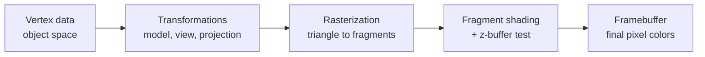

## Learning Objectives

- Name, in order, the five stages every real-time rendering pipeline shares: vertex data, geometric transformations, rasterization, fragment (per-pixel) shading, and the framebuffer.
- Explain what each stage receives as input and produces as output, without yet deriving the mathematics inside any single stage.
- State why this pipeline is a real, standard structure taught the same way across university courses and shipping engines, rather than an arbitrary organizational choice for this discipline.
- Preview which later concept in this discipline builds the internals of each stage, so the whole discipline reads as one map filled in piece by piece.

## Context & Motivation

A computer screen is a grid of pixels, each one a single color. A 3D scene, by contrast, is a list of numbers: vertex coordinates, colors, normals, texture coordinates. Every real-time graphics system, from a phone game to a AAA engine on dedicated GPU hardware, answers the same question in the same order: how does that list of numbers become that grid of colors, fast enough to redraw 30 to 144 times per second. ACM/IEEE CS2013's Graphics and Interactive Techniques (GV) knowledge area lists this pipeline structure under its Fundamental Concepts unit precisely because every other topic in the knowledge area, basic rendering, geometric modeling, advanced rendering, assumes the reader already has this map. This concept is that map: five stages, described here at the level of what goes in and what comes out, with the actual mechanics of each stage built one at a time by the rest of this discipline.

## Core Theory

### Stage 1: Vertex data

A 3D model is stored as a list of vertices, each one a position in object space (the model's own local coordinate system, centered wherever the artist or generator chose) plus attributes: a normal vector (which way the surface faces at that point), a color, one or more texture coordinates, and sometimes more. A single triangle needs exactly three vertices; a full model can need millions. Nothing in this stage does any math: it is purely the pipeline's raw input.

### Stage 2: Geometric transformations

Every vertex is transformed through a chain of matrices before it can be drawn: from object space into world space (placing the object in the scene), from world space into camera space (re-expressing the scene relative to the viewer), and from camera space into a normalized clip space that encodes perspective. This chain, model matrix, view matrix, projection matrix, is built concept by concept starting with `homogeneous-coordinates-and-2d-affine-transformations` and finishing with `the-projection-matrix-perspective-and-clipping`. The output of this stage is a triangle's three vertices, each with a position in a small, standard coordinate cube, ready to be turned into pixels.

### Stage 3: Rasterization

A triangle in that standard cube is still not pixels: rasterization is the process of figuring out exactly which pixels a triangle covers, and, for each one, what the triangle's interpolated attributes are at that exact point. `triangle-rasterization-edge-functions-and-barycentric-coordinates` builds the real algorithm (Pineda's edge functions) that does this. The output of this stage is a stream of fragments: candidate pixels, each carrying interpolated position, depth, normal, color, and texture coordinates.

### Stage 4: Fragment shading

Each fragment is not yet a final pixel color: a fragment shader (also called a pixel shader) takes the interpolated attributes and computes a color, typically by evaluating a lighting model. `local-illumination-lambertian-diffuse-reflection` and the shading concepts that follow it build the actual lighting math this stage runs. Before a fragment's color is written, `z-buffering-and-visibility-determination` decides whether this fragment is even the closest one seen so far for its pixel; a fragment that loses that test is discarded here, never reaching the framebuffer.

### Stage 5: The framebuffer

The framebuffer is the actual 2D array of pixel colors that ends up on screen, one memory cell per pixel (typically 4 bytes: red, green, blue, alpha). Real systems use double buffering: one framebuffer is being displayed while the next frame is drawn into a second, off-screen buffer, then the two are swapped, avoiding a viewer ever seeing a half-drawn frame.

## Worked Examples

### Example 1: one triangle through all five stages, conceptually

A single opaque red triangle, three vertices at object-space coordinates (0,0,0), (1,0,0), and (0,1,0), each with the same normal (0,0,1) and the same color attribute (1,0,0). Stage 1 supplies exactly these three vertices unchanged. Stage 2 (built starting in the next few concepts) multiplies each vertex by a model matrix (placing the triangle somewhere in the world), a view matrix (re-expressing it relative to the camera), and a projection matrix (mapping it into clip space); the output is still three vertices, now in a different coordinate space, still forming one triangle. Stage 3 finds every pixel whose center falls inside that transformed triangle and computes each one's interpolated color and depth. Stage 4 evaluates a lighting equation for every one of those fragments (with this single flat red color and normal, every fragment gets the same lit red, since nothing varies across the triangle in this simple case) and checks the z-buffer. Stage 5 writes the surviving fragments into the framebuffer, which is then displayed.

### Example 2: a 2D user interface skips two stages

A 2D UI element, a button drawn as a rectangle (two triangles) directly in screen coordinates, still goes through this same pipeline, but Stage 2's transformation chain often collapses to just an orthographic projection (no perspective divide, since a UI has no notion of "far away objects shrink") and there is frequently no separate camera to move (the view matrix is the identity). The pipeline is the same five stages; entire stages can become trivial without disappearing structurally.

### Example 3: framebuffer memory, a concrete number

A 1920x1080 display with 4 bytes per pixel (8 bits each for red, green, blue, alpha) needs 1920 * 1080 * 4 = 8,294,400 bytes, about 7.9 MiB, for one framebuffer. With double buffering, the system holds two of these, about 15.8 MiB, entirely separate from the z-buffer `z-buffering-and-visibility-determination` adds later (which needs its own per-pixel depth value, often 24 or 32 bits, adding another 7.9 to 8.3 MiB at this same resolution).

## Common Misconceptions & Pitfalls

- **"Rasterization and shading are the same step."** They are deliberately separate: rasterization (Stage 3) only decides which pixels a triangle covers and what its interpolated attributes are there; shading (Stage 4) is a separate computation, run once per surviving fragment, that turns those attributes into an actual color. A pipeline can rasterize the same geometry while swapping in entirely different shaders.
- **"The pipeline only matters for 3D games."** Example 2 shows the identical five-stage structure renders 2D interfaces, text, and any other primitive a GPU draws; what changes between applications is which stages do meaningful work, never the presence of the stages themselves.
- **"More stages means the pipeline is slower than it needs to be."** Each stage exists because it does a genuinely different kind of work (geometric math, per-pixel coverage, per-pixel color, memory write) that benefits from being handled by different, specialized hardware inside a real GPU; collapsing stages would not remove work, it would just make that hardware specialization impossible.

## Summary

Every real-time graphics system turns a list of numbers into a grid of pixel colors through the same five-stage pipeline: vertex data, geometric transformations (model, view, and projection matrices), rasterization (turning triangles into candidate fragments), fragment shading (turning fragments into colors, gated by a depth test), and the framebuffer (the final, double-buffered pixel grid actually displayed). This structure is the shared vocabulary ACM/IEEE CS2013's Graphics and Interactive Techniques knowledge area and courses like Cornell's CS4620 both build on, and it is the map the rest of this discipline fills in, one stage's real mechanics at a time.

## Documentation Links

- [ACM/IEEE CS2013: Graphics and Interactive Techniques (GV) Knowledge Area](https://csed.acm.org/knowledge-areas-graphics-and-interactive-techniques-git-cs2013-version/): the curriculum source confirming this five-stage pipeline structure, media applications, and rendering fundamentals as the expected starting point for an undergraduate graphics course.
- [Cornell CS4620: Introduction to Computer Graphics (course page, Fall 2025)](https://www.cs.cornell.edu/courses/cs4620/2025fa/): a real, current university course whose own syllabus organizes the same material into transformations, rasterization, ray tracing, and shading, in the order this discipline follows.
