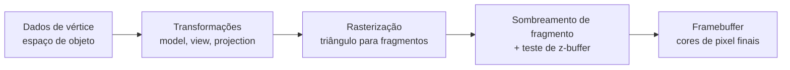

## Objetivos de Aprendizagem

- Nomear, em ordem, os cinco estágios que todo pipeline de renderização de tempo real compartilha: dados de vértice, transformações geométricas, rasterização, sombreamento de fragmento (por pixel) e o framebuffer.
- Explicar o que cada estágio recebe como entrada e produz como saída, sem ainda derivar a matemática dentro de qualquer estágio único.
- Enunciar por que este pipeline é uma estrutura real e padrão ensinada da mesma forma por entre cursos universitários e engines enviadas, em vez de uma escolha organizacional arbitrária para esta disciplina.
- Prever qual conceito posterior nesta disciplina constrói os internos de cada estágio, para que a disciplina inteira se leia como um mapa preenchido peça por peça.

## Contexto e Motivação

Uma tela de computador é uma grade de pixels, cada um uma cor única. Uma cena 3D, em contraste, é uma lista de números: coordenadas de vértice, cores, normais, coordenadas de textura. Todo sistema de gráficos de tempo real, de um jogo de celular a uma engine AAA em hardware de GPU dedicado, responde a mesma pergunta na mesma ordem: como é que essa lista de números se torna essa grade de cores, rápido o bastante para redesenhar de 30 a 144 vezes por segundo. A área de conhecimento de Gráficos e Técnicas Interativas (GV) do ACM/IEEE CS2013 lista esta estrutura de pipeline sob a sua unidade de Conceitos Fundamentais precisamente porque todo outro tópico na área de conhecimento, renderização básica, modelagem geométrica, renderização avançada, assume que o leitor já tem este mapa. Este conceito é esse mapa: cinco estágios, descritos aqui no nível do que entra e do que sai, com a mecânica de fato de cada estágio construída um de cada vez pelo resto desta disciplina.

## Teoria Central

### Estágio 1: Dados de vértice

Um modelo 3D é armazenado como uma lista de vértices, cada um uma posição no espaço de objeto (o sistema de coordenadas local do próprio modelo, centrado onde quer que o artista ou gerador tenha escolhido) mais atributos: um vetor normal (para que lado a superfície está voltada naquele ponto), uma cor, uma ou mais coordenadas de textura, e às vezes mais. Um único triângulo precisa de exatamente três vértices; um modelo completo pode precisar de milhões. Nada neste estágio faz qualquer matemática: é puramente a entrada bruta do pipeline.

### Estágio 2: Transformações geométricas

Todo vértice é transformado por uma cadeia de matrizes antes de poder ser desenhado: do espaço de objeto para o espaço de mundo (colocando o objeto na cena), do espaço de mundo para o espaço de câmera (reexpressando a cena em relação ao observador), e do espaço de câmera para um espaço de clip normalizado que codifica a perspectiva. Esta cadeia, matriz model, matriz view, matriz projection, é construída conceito por conceito começando com `homogeneous-coordinates-and-2d-affine-transformations` e terminando com `the-projection-matrix-perspective-and-clipping`. A saída deste estágio são os três vértices de um triângulo, cada um com uma posição num pequeno cubo de coordenadas padrão, pronto para ser transformado em pixels.

### Estágio 3: Rasterização

Um triângulo nesse cubo padrão ainda não são pixels: a rasterização é o processo de descobrir exatamente quais pixels um triângulo cobre, e, para cada um, quais são os atributos interpolados do triângulo naquele ponto exato. `triangle-rasterization-edge-functions-and-barycentric-coordinates` constrói o algoritmo real (funções de aresta de Pineda) que faz isto. A saída deste estágio é um fluxo de fragmentos: pixels candidatos, cada um carregando posição, profundidade, normal, cor e coordenadas de textura interpoladas.

### Estágio 4: Sombreamento de fragmento

Cada fragmento ainda não é uma cor de pixel final: um fragment shader (também chamado de pixel shader) pega os atributos interpolados e computa uma cor, tipicamente avaliando um modelo de iluminação. `local-illumination-lambertian-diffuse-reflection` e os conceitos de sombreamento que o seguem constroem a matemática de iluminação de fato que este estágio roda. Antes de a cor de um fragmento ser escrita, `z-buffering-and-visibility-determination` decide se este fragmento é sequer o mais próximo visto até agora para o seu pixel; um fragmento que perde esse teste é descartado aqui, nunca alcançando o framebuffer.

### Estágio 5: O framebuffer

O framebuffer é o array 2D de fato de cores de pixel que acaba na tela, uma célula de memória por pixel (tipicamente 4 bytes: vermelho, verde, azul, alfa). Sistemas reais usam buffer duplo: um framebuffer está sendo exibido enquanto o próximo quadro é desenhado num segundo buffer, fora da tela, depois os dois são trocados, evitando que um observador jamais veja um quadro meio desenhado.

## Exemplos Resolvidos

### Exemplo 1: um triângulo por todos os cinco estágios, conceitualmente

Um único triângulo vermelho opaco, três vértices em coordenadas de espaço de objeto (0,0,0), (1,0,0) e (0,1,0), cada um com a mesma normal (0,0,1) e o mesmo atributo de cor (1,0,0). O Estágio 1 fornece exatamente estes três vértices inalterados. O Estágio 2 (construído começando nos próximos poucos conceitos) multiplica cada vértice por uma matriz model (colocando o triângulo em algum lugar no mundo), uma matriz view (reexpressando-o em relação à câmera) e uma matriz projection (mapeando-o no espaço de clip); a saída ainda são três vértices, agora num espaço de coordenadas diferente, ainda formando um triângulo. O Estágio 3 encontra todo pixel cujo centro cai dentro desse triângulo transformado e computa a cor e profundidade interpoladas de cada um. O Estágio 4 avalia uma equação de iluminação para cada um desses fragmentos (com esta única cor vermelha plana e normal, todo fragmento recebe o mesmo vermelho iluminado, já que nada varia pelo triângulo neste caso simples) e checa o z-buffer. O Estágio 5 escreve os fragmentos sobreviventes no framebuffer, que é então exibido.

### Exemplo 2: uma interface de usuário 2D pula dois estágios

Um elemento de UI 2D, um botão desenhado como um retângulo (dois triângulos) diretamente em coordenadas de tela, ainda passa por este mesmo pipeline, mas a cadeia de transformação do Estágio 2 frequentemente colapsa para só uma projeção ortográfica (nenhuma divisão de perspectiva, já que uma UI não tem noção de "objetos distantes encolhem") e frequentemente não há câmera separada para mover (a matriz view é a identidade). O pipeline são os mesmos cinco estágios; estágios inteiros podem se tornar triviais sem desaparecer estruturalmente.

### Exemplo 3: memória de framebuffer, um número concreto

Uma tela de 1920x1080 com 4 bytes por pixel (8 bits cada para vermelho, verde, azul, alfa) precisa de 1920 * 1080 * 4 = 8.294.400 bytes, cerca de 7,9 MiB, para um framebuffer. Com buffer duplo, o sistema mantém dois destes, cerca de 15,8 MiB, inteiramente separados do z-buffer que `z-buffering-and-visibility-determination` adiciona depois (que precisa do seu próprio valor de profundidade por pixel, frequentemente 24 ou 32 bits, adicionando outros 7,9 a 8,3 MiB nesta mesma resolução).

## Equívocos Comuns e Armadilhas

- **"Rasterização e sombreamento são o mesmo passo."** Eles são deliberadamente separados: a rasterização (Estágio 3) só decide quais pixels um triângulo cobre e quais são os seus atributos interpolados ali; o sombreamento (Estágio 4) é uma computação separada, rodada uma vez por fragmento sobrevivente, que transforma esses atributos numa cor de fato. Um pipeline pode rasterizar a mesma geometria enquanto troca por shaders inteiramente diferentes.
- **"O pipeline só importa para jogos 3D."** O Exemplo 2 mostra que a estrutura idêntica de cinco estágios renderiza interfaces 2D, texto e qualquer outro primitivo que uma GPU desenha; o que muda entre aplicações é quais estágios fazem trabalho significativo, nunca a presença dos próprios estágios.
- **"Mais estágios significa que o pipeline é mais lento do que precisa ser."** Cada estágio existe porque faz um tipo genuinamente diferente de trabalho (matemática geométrica, cobertura por pixel, cor por pixel, escrita de memória) que se beneficia de ser tratado por hardware diferente e especializado dentro de uma GPU real; colapsar estágios não removeria trabalho, só tornaria essa especialização de hardware impossível.

## Resumo

Todo sistema de gráficos de tempo real transforma uma lista de números numa grade de cores de pixel por meio do mesmo pipeline de cinco estágios: dados de vértice, transformações geométricas (matrizes model, view e projection), rasterização (transformando triângulos em fragmentos candidatos), sombreamento de fragmento (transformando fragmentos em cores, limitado por um teste de profundidade) e o framebuffer (a grade de pixels final, com buffer duplo, de fato exibida). Esta estrutura é o vocabulário compartilhado sobre o qual a área de conhecimento de Gráficos e Técnicas Interativas do ACM/IEEE CS2013 e cursos como o CS4620 de Cornell ambos constroem, e é o mapa que o resto desta disciplina preenche, a mecânica real de um estágio de cada vez.

## Documentation Links

- [ACM/IEEE CS2013: Graphics and Interactive Techniques (GV) Knowledge Area](https://csed.acm.org/knowledge-areas-graphics-and-interactive-techniques-git-cs2013-version/): a fonte de currículo confirmando esta estrutura de pipeline de cinco estágios, aplicações de mídia e fundamentos de renderização como o ponto de partida esperado para um curso de gráficos de graduação.
- [Cornell CS4620: Introduction to Computer Graphics (course page, Fall 2025)](https://www.cs.cornell.edu/courses/cs4620/2025fa/): um curso universitário real e atual cuja própria ementa organiza o mesmo material em transformações, rasterização, ray tracing e sombreamento, na ordem que esta disciplina segue.
