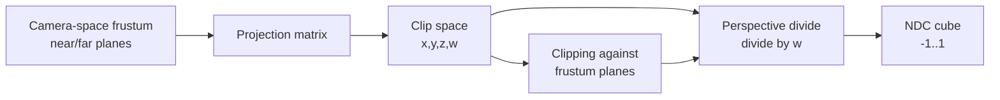

## Learning Objectives

- Explain what a projection matrix must accomplish: mapping a camera-space view frustum into a small, standardized clip-space cube.
- Contrast perspective projection (distant objects shrink) and orthographic projection (they do not), and state precisely which single arithmetic step, the perspective divide, causes the difference.
- Apply a simplified perspective projection to a concrete camera-space point and compute its normalized device coordinates.
- Explain what clipping does with a concrete point that falls outside the view frustum, and why clipping happens in this stage rather than earlier or later.

## Context & Motivation

`the-view-matrix-and-camera-space` re-expressed every scene vertex relative to the camera, but a camera-space point is still an unbounded 3D coordinate; rasterization, next in the pipeline, needs geometry confined to a small, standardized region so it can map consistently onto a screen of any resolution. This concept closes the model-view-projection chain with the projection matrix, which does two things at once: it defines the camera's field of view as a frustum (a truncated pyramid, or a rectangular box for an orthographic camera) and maps every point inside that frustum into a fixed clip-space cube, encoding perspective, the fact that distant objects should appear smaller, directly into the matrix itself.

## Core Theory

### The view frustum and two kinds of projection

A perspective camera's visible region is a frustum: a pyramid with its apex at the camera, bounded by a near plane and a far plane, and by the field of view on the sides. An orthographic camera's visible region is instead a rectangular box (no apex, sides stay parallel), used for UI, 2D games, and CAD-style views where objects should keep a constant size regardless of distance. Both projection matrices map their respective region into the identical target: a cube in normalized device coordinates (NDC), typically x, y, and z each ranging from -1 to 1 (or 0 to 1 for z, depending on convention).

### The perspective divide is what creates the shrinking effect

An orthographic projection matrix is a straightforward linear scale-and-shift (no different in kind from the scale-and-translate matrices `3d-transformations-and-composing-the-model-matrix` already built); nothing shrinks with distance. A perspective projection matrix instead sets up the vertex's own camera-space depth (its distance along the view direction) to end up in the output's w component (the fourth homogeneous coordinate), and the pipeline then performs the perspective divide: dividing x, y, and z by that w before rasterization. Since w grows with distance, dividing by it shrinks the x and y coordinates of distant points proportionally more than nearby ones, which is exactly the visual effect of things farther away looking smaller. This is the one specific arithmetic step, not the matrix multiply itself, responsible for perspective; an orthographic matrix simply sets w to a constant 1, so the divide has no shrinking effect at all.

### Clipping

Once vertices are in clip space (before the perspective divide), the pipeline compares each vertex against the frustum's six boundary planes (near, far, left, right, top, bottom) and clips any triangle that crosses one: a triangle entirely outside is discarded before rasterization ever sees it, and a triangle straddling a boundary is cut, generating new vertices exactly on the boundary, so that only geometry actually inside the frustum reaches rasterization. Clipping happens at this stage, in clip space, specifically because clip space is where the frustum's originally non-rectangular shape (for perspective) has already been mapped into a simple axis-aligned cube, making the plane tests cheap, uniform comparisons instead of frustum-shaped ones.



## Worked Examples

### Example 1: perspective divide on a concrete point

A camera-space point at (2, 2, -10) (2 units right, 2 units up, 10 units in front of the camera, using the -Z-forward convention from `the-view-matrix-and-camera-space`). A perspective projection matrix routes the point's negated depth into w, so w = 10 here. After the projection matrix multiply, suppose the resulting clip-space coordinates (before divide) are (2, 2, 8.9, 10) (the exact x and y scaling in a real matrix also depends on the field of view and aspect ratio; this example fixes them at 1 for clarity). The perspective divide computes:

```text
x_ndc = 2 / 10 = 0.2
y_ndc = 2 / 10 = 0.2
z_ndc = 8.9 / 10 = 0.89
```

Result: (0.2, 0.2, 0.89) in NDC, comfortably inside the -1 to 1 cube on all three axes.

### Example 2: the same x, y at twice the distance shrinks on screen

The same object at twice the distance, camera-space (4, 4, -20) (keeping the same x-to-z and y-to-z ratio would place it at the same apparent angle, but here it is a literal doubling of all coordinates, so w = 20):

```text
x_ndc = 4 / 20 = 0.2
y_ndc = 4 / 20 = 0.2
```

The NDC x and y come out identical to Example 1 because both the numerator and w doubled together (this is the case of an object moved straight back along the same viewing ray, which correctly keeps its NDC position and only shrinks a different, differently sized object at that same distance); a point that is twice as far away but occupies the same physical size in the world (rather than being scaled with distance) produces roughly half the NDC extent of a nearer point of that same physical size, which is the actual shrinking effect: the ratio of NDC size to physical size falls off with distance, precisely because w (proportional to distance) is in the denominator.

### Example 3: clipping a point outside the frustum

A camera-space point at (2, 2, 0.5), with the frustum's near plane at z = -1 and far plane at z = -50 (points must have camera-space z between -1 and -50 to be visible, using -Z-forward). This point's z = 0.5 is positive, meaning it sits behind the camera entirely (not merely outside the field of view). Clipping discards it, along with any triangle entirely on the wrong side of the near plane, before rasterization; the point never contributes a fragment, avoiding the numerically meaningless result a perspective divide by a near-zero or negative w would otherwise produce.

## Common Misconceptions & Pitfalls

- **"The matrix multiply alone creates the perspective effect."** Example 1 and 2 show the matrix multiply only arranges depth into the w coordinate; the shrinking itself comes from the separate perspective divide step that follows, dividing x, y, and z by that w. An orthographic matrix runs the identical pipeline stage with w fixed at 1, and the divide then has no effect.
- **"Clipping and the perspective divide happen in either order, it does not matter."** Clipping happens before the divide specifically to avoid dividing by a zero or negative w (Example 3's point behind the camera would produce nonsensical, or even sign-flipped, results if divided first); clipping against the frustum planes in clip space, prior to the divide, is what keeps the divide numerically well-behaved for every surviving vertex.
- **"A near plane is an unnecessary complication; the camera should just render everything in front of it, however close."** A near plane of exactly 0 makes w approach 0 for points very close to the camera, and dividing by a near-zero w produces enormous, unstable NDC coordinates; a small positive near-plane distance (Example 3's z = -1) is a deliberate, standard choice that keeps the perspective divide numerically stable, not an arbitrary restriction.

## Summary

The projection matrix closes the model-view-projection chain by mapping a camera's view frustum, whether the truncated pyramid of a perspective camera or the rectangular box of an orthographic one, into a standardized clip-space cube. The perspective effect itself comes from one specific step, the perspective divide (dividing x, y, and z by w, where w encodes depth), not from the matrix multiply alone, which is why an orthographic projection (constant w) produces no shrinking with distance while a perspective one does. Clipping runs in this same stage, before the divide, comparing vertices against the frustum's boundary planes in clip space and discarding or cutting geometry outside them, keeping the divide numerically well-behaved for everything that survives into `triangle-rasterization-edge-functions-and-barycentric-coordinates`, next.

## Documentation Links

- [Cornell CS4620: Introduction to Computer Graphics (course page, Fall 2025)](https://www.cs.cornell.edu/courses/cs4620/2025fa/): a real, current university course whose transformations and camera-projection units cover perspective and orthographic projection matrices and the perspective divide this concept builds.
- [ACM/IEEE CS2013: Graphics and Interactive Techniques (GV) Knowledge Area](https://csed.acm.org/knowledge-areas-graphics-and-interactive-techniques-git-cs2013-version/): the curriculum source confirming perspective projection and clipping as expected Fundamental Concepts material for an undergraduate graphics course.
