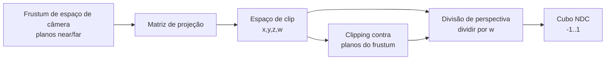

## Objetivos de Aprendizagem

- Explicar o que uma matriz de projeção tem de realizar: mapear um frustum de visão de espaço de câmera num cubo de espaço de clip pequeno e padronizado.
- Contrastar a projeção de perspectiva (objetos distantes encolhem) e a projeção ortográfica (eles não encolhem), e enunciar precisamente qual passo aritmético único, a divisão de perspectiva, causa a diferença.
- Aplicar uma projeção de perspectiva simplificada a um ponto concreto de espaço de câmera e computar as suas coordenadas de dispositivo normalizadas.
- Explicar o que o clipping faz com um ponto concreto que cai fora do frustum de visão, e por que o clipping acontece neste estágio em vez de mais cedo ou mais tarde.

## Contexto e Motivação

`the-view-matrix-and-camera-space` reexpressou todo vértice de cena em relação à câmera, mas um ponto de espaço de câmera ainda é uma coordenada 3D ilimitada; a rasterização, a próxima no pipeline, precisa de geometria confinada a uma região pequena e padronizada para poder mapear consistentemente numa tela de qualquer resolução. Este conceito fecha a cadeia model-view-projection com a matriz de projeção, que faz duas coisas de uma vez: ela define o campo de visão da câmera como um frustum (uma pirâmide truncada, ou uma caixa retangular para uma câmera ortográfica) e mapeia todo ponto dentro desse frustum num cubo de espaço de clip fixo, codificando a perspectiva, o fato de que objetos distantes deveriam parecer menores, diretamente na própria matriz.

## Teoria Central

### O frustum de visão e dois tipos de projeção

A região visível de uma câmera de perspectiva é um frustum: uma pirâmide com o seu ápice na câmera, delimitada por um plano próximo (near) e um plano distante (far), e pelo campo de visão nas laterais. A região visível de uma câmera ortográfica é em vez disso uma caixa retangular (sem ápice, as laterais ficam paralelas), usada para UI, jogos 2D e visões de estilo CAD onde os objetos deveriam manter um tamanho constante independentemente da distância. Ambas as matrizes de projeção mapeiam a sua respectiva região no alvo idêntico: um cubo em coordenadas de dispositivo normalizadas (NDC), tipicamente x, y e z cada um variando de -1 a 1 (ou 0 a 1 para z, dependendo da convenção).

### A divisão de perspectiva é o que cria o efeito de encolhimento

Uma matriz de projeção ortográfica é uma escala-e-deslocamento linear direta (em nada diferente em espécie das matrizes escala-e-translação que `3d-transformations-and-composing-the-model-matrix` já construiu); nada encolhe com a distância. Uma matriz de projeção de perspectiva em vez disso configura a própria profundidade de espaço de câmera do vértice (a sua distância ao longo da direção de visão) para acabar no componente w da saída (a quarta coordenada homogênea), e o pipeline então realiza a divisão de perspectiva: dividir x, y e z por esse w antes da rasterização. Já que w cresce com a distância, dividir por ele encolhe as coordenadas x e y de pontos distantes proporcionalmente mais do que as de pontos próximos, que é exatamente o efeito visual de coisas mais distantes parecerem menores. Este é o único passo aritmético específico, não a própria multiplicação de matriz, responsável pela perspectiva; uma matriz ortográfica simplesmente define w como uma constante 1, então a divisão não tem nenhum efeito de encolhimento de todo.

### Clipping

Uma vez que os vértices estão no espaço de clip (antes da divisão de perspectiva), o pipeline compara cada vértice contra os seis planos de limite do frustum (near, far, esquerdo, direito, superior, inferior) e corta (clips) qualquer triângulo que cruze um: um triângulo inteiramente fora é descartado antes de a rasterização sequer vê-lo, e um triângulo atravessando um limite é cortado, gerando novos vértices exatamente no limite, para que só geometria de fato dentro do frustum alcance a rasterização. O clipping acontece neste estágio, no espaço de clip, especificamente porque o espaço de clip é onde o formato originalmente não retangular do frustum (para perspectiva) já foi mapeado num cubo simples alinhado aos eixos, tornando os testes de plano comparações baratas e uniformes em vez de comparações em formato de frustum.



## Exemplos Resolvidos

### Exemplo 1: divisão de perspectiva num ponto concreto

Um ponto de espaço de câmera em (2, 2, -10) (2 unidades à direita, 2 unidades acima, 10 unidades na frente da câmera, usando a convenção -Z-para-frente de `the-view-matrix-and-camera-space`). Uma matriz de projeção de perspectiva roteia a profundidade negada do ponto para w, então w = 10 aqui. Depois da multiplicação da matriz de projeção, suponha que as coordenadas de espaço de clip resultantes (antes da divisão) sejam (2, 2, 8.9, 10) (a escala exata de x e y numa matriz real também depende do campo de visão e da razão de aspecto; este exemplo os fixa em 1 por clareza). A divisão de perspectiva computa:

```text
x_ndc = 2 / 10 = 0.2
y_ndc = 2 / 10 = 0.2
z_ndc = 8.9 / 10 = 0.89
```

Resultado: (0.2, 0.2, 0.89) em NDC, confortavelmente dentro do cubo de -1 a 1 em todos os três eixos.

### Exemplo 2: o mesmo x, y no dobro da distância encolhe na tela

O mesmo objeto no dobro da distância, espaço de câmera (4, 4, -20) (manter a mesma razão x-para-z e y-para-z o colocaria no mesmo ângulo aparente, mas aqui é uma duplicação literal de todas as coordenadas, então w = 20):

```text
x_ndc = 4 / 20 = 0.2
y_ndc = 4 / 20 = 0.2
```

O x e y de NDC saem idênticos ao Exemplo 1 porque tanto o numerador quanto w dobraram juntos (este é o caso de um objeto movido reto para trás ao longo do mesmo raio de visão, que corretamente mantém a sua posição de NDC e só encolhe um objeto diferente e de tamanho diferente naquela mesma distância); um ponto que está duas vezes mais distante mas ocupa o mesmo tamanho físico no mundo (em vez de ser escalado com a distância) produz aproximadamente metade da extensão de NDC de um ponto mais próximo daquele mesmo tamanho físico, que é o efeito de encolhimento de fato: a razão de tamanho de NDC para tamanho físico cai com a distância, precisamente porque w (proporcional à distância) está no denominador.

### Exemplo 3: cortando um ponto fora do frustum

Um ponto de espaço de câmera em (2, 2, 0.5), com o plano near do frustum em z = -1 e o plano far em z = -50 (pontos têm de ter z de espaço de câmera entre -1 e -50 para serem visíveis, usando -Z-para-frente). O z = 0.5 deste ponto é positivo, significando que ele se situa inteiramente atrás da câmera (não meramente fora do campo de visão). O clipping o descarta, junto com qualquer triângulo inteiramente no lado errado do plano near, antes da rasterização; o ponto nunca contribui com um fragmento, evitando o resultado numericamente sem sentido que uma divisão de perspectiva por um w próximo de zero ou negativo de outra forma produziria.

## Equívocos Comuns e Armadilhas

- **"A multiplicação de matriz sozinha cria o efeito de perspectiva."** Os Exemplos 1 e 2 mostram que a multiplicação de matriz só arranja a profundidade na coordenada w; o encolhimento em si vem do passo separado de divisão de perspectiva que o segue, dividindo x, y e z por esse w. Uma matriz ortográfica roda o estágio de pipeline idêntico com w fixado em 1, e a divisão então não tem nenhum efeito.
- **"Clipping e a divisão de perspectiva acontecem em qualquer ordem, não importa."** O clipping acontece antes da divisão especificamente para evitar dividir por um w zero ou negativo (o ponto atrás da câmera do Exemplo 3 produziria resultados sem sentido, ou até com sinal invertido, se dividido primeiro); cortar contra os planos do frustum no espaço de clip, antes da divisão, é o que mantém a divisão numericamente bem comportada para todo vértice sobrevivente.
- **"Um plano near é uma complicação desnecessária; a câmera deveria só renderizar tudo na frente dela, por mais próximo que seja."** Um plano near de exatamente 0 faz w se aproximar de 0 para pontos muito próximos da câmera, e dividir por um w próximo de zero produz coordenadas de NDC enormes e instáveis; uma pequena distância de plano near positiva (o z = -1 do Exemplo 3) é uma escolha deliberada e padrão que mantém a divisão de perspectiva numericamente estável, não uma restrição arbitrária.

## Resumo

A matriz de projeção fecha a cadeia model-view-projection mapeando o frustum de visão de uma câmera, seja a pirâmide truncada de uma câmera de perspectiva ou a caixa retangular de uma ortográfica, num cubo de espaço de clip padronizado. O efeito de perspectiva em si vem de um passo específico, a divisão de perspectiva (dividir x, y e z por w, onde w codifica a profundidade), não da multiplicação de matriz sozinha, que é por que uma projeção ortográfica (w constante) não produz nenhum encolhimento com a distância enquanto uma de perspectiva produz. O clipping roda neste mesmo estágio, antes da divisão, comparando vértices contra os planos de limite do frustum no espaço de clip e descartando ou cortando a geometria fora deles, mantendo a divisão numericamente bem comportada para tudo que sobrevive para `triangle-rasterization-edge-functions-and-barycentric-coordinates`, em seguida.

## Documentation Links

- [Cornell CS4620: Introduction to Computer Graphics (course page, Fall 2025)](https://www.cs.cornell.edu/courses/cs4620/2025fa/): um curso universitário real e atual cujas unidades de transformações e projeção-de-câmera cobrem matrizes de projeção de perspectiva e ortográfica e a divisão de perspectiva que este conceito constrói.
- [ACM/IEEE CS2013: Graphics and Interactive Techniques (GV) Knowledge Area](https://csed.acm.org/knowledge-areas-graphics-and-interactive-techniques-git-cs2013-version/): a fonte de currículo confirmando a projeção de perspectiva e o clipping como material de Conceitos Fundamentais esperado para um curso de gráficos de graduação.
