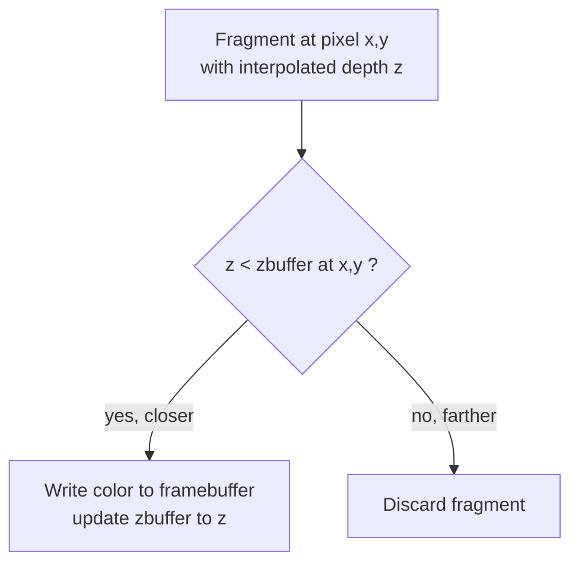

## Learning Objectives

- Explain the visibility problem precisely: why rasterizing triangles in an arbitrary order produces incorrect results without an additional mechanism.
- State the z-buffer algorithm: a per-pixel depth buffer, initialized to the farthest possible depth, updated only when a nearer fragment arrives.
- Trace two overlapping triangles through the z-buffer test by hand, with concrete depth values, and confirm the correct one is visible regardless of draw order.
- State honestly what the z-buffer does not solve (order-dependent transparency) and why.

## Context & Motivation

`triangle-rasterization-edge-functions-and-barycentric-coordinates` produces, for every triangle, a stream of fragments, each with an interpolated depth value obtained from the same barycentric weights used for color. A real scene draws many triangles, often overlapping on screen from the camera's point of view, and nothing about rasterizing one triangle prevents a later, farther-away triangle from overwriting the pixels of an earlier, nearer one. This concept covers the real, standard fix nearly every rasterization pipeline uses: z-buffering, a per-pixel depth test that makes draw order irrelevant to the final image.

## Core Theory

### The visibility problem

Consider two triangles that project to the same pixel: one 2 units from the camera, one 10 units from the camera. If the far triangle happens to be drawn (rasterized) after the near one, and nothing checks depth, the far triangle's fragment simply overwrites the near one's color in the framebuffer, producing a visibly wrong image, the far object appearing in front of the near one. The fix cannot simply be "draw triangles in back-to-front order," since that ordering can change every frame as the camera or objects move, and, for triangles that intersect or partially overlap in depth, a single global ordering may not even exist.

### The z-buffer algorithm

The fix is a second buffer, the same width and height as the framebuffer, holding one depth value per pixel, called the z-buffer or depth buffer. Before rendering a frame, every entry is initialized to the maximum possible depth (representing "nothing drawn here yet, so nothing is closer than infinity"). For every fragment produced by rasterization, at pixel (x, y) with interpolated depth z, compare z against the z-buffer's current value at (x, y): if z is closer (smaller, by the usual convention), the fragment passes the depth test, its color is written to the framebuffer, and the z-buffer at (x, y) is updated to z; if z is farther, the fragment fails the test and is discarded, its color never reaching the framebuffer regardless of what order triangles were drawn in.



### The real cost, and the real limitation

Z-buffering costs one extra read, one comparison, and, on success, one extra write per fragment, a small, fixed, per-fragment overhead paid uniformly regardless of scene complexity or draw order, which is exactly why it displaced earlier, more complex visibility algorithms (like the painter's algorithm's back-to-front triangle sort) in practice. Its real, honest limitation is transparency: the depth test is a single winner-take-all comparison, so a transparent (partially see-through) fragment that passes the test still simply overwrites what came before rather than blending with it, and rendering transparency correctly requires either sorting transparent geometry back-to-front (the exact problem z-buffering was built to avoid for opaque geometry) or a more elaborate technique this discipline does not cover at survey depth.

## Worked Examples

### Example 1: two triangles at the same pixel, far one drawn first

Pixel (100, 50). Z-buffer initialized to a large value, say 1000 (representing infinitely far, in whatever depth units are in use). Triangle F (far, depth 10) is drawn first, then Triangle N (near, depth 2), both covering this pixel:

```text
Initial z-buffer at (100,50): 1000

Fragment from Triangle F arrives, z=10:
  10 < 1000? yes -> write F's color, z-buffer becomes 10

Fragment from Triangle N arrives, z=2:
  2 < 10? yes -> write N's color, z-buffer becomes 2

Final framebuffer color at (100,50): Triangle N's color (correct: N is nearer)
```

### Example 2: the same two triangles, drawn in the opposite order

Same pixel, same two triangles, but Triangle N (near, depth 2) drawn first this time, then Triangle F (far, depth 10):

```text
Initial z-buffer at (100,50): 1000

Fragment from Triangle N arrives, z=2:
  2 < 1000? yes -> write N's color, z-buffer becomes 2

Fragment from Triangle F arrives, z=10:
  10 < 2? no -> discard F's fragment, z-buffer stays 2

Final framebuffer color at (100,50): Triangle N's color (still correct, identical result)
```

Both draw orders produce the identical, correct final color, exactly the property that makes z-buffering practical: a renderer never needs to sort opaque geometry by depth before drawing it.

### Example 3: where the z-buffer test genuinely fails, transparency

A transparent triangle T (50% opacity, depth 5) and an opaque triangle O (depth 8) at the same pixel, T drawn first:

```text
Initial z-buffer: 1000
T's fragment, z=5: 5 < 1000? yes -> write T's color (at 50% opacity, blended with whatever is behind, but nothing is behind yet), z-buffer becomes 5
O's fragment, z=8: 8 < 5? no -> discarded

Result: T's color only, with O never contributing, even though O is
  physically behind T and should show through T's transparent 50%.
```

The z-buffer correctly determined T is nearer, but O should still have been visible, dimly, through T; the single-value depth test has no way to represent "partially visible through something nearer," which is the real, honest limitation stated above.

## Common Misconceptions & Pitfalls

- **"Z-buffering requires sorting triangles by depth before drawing them."** Example 1 and 2 show the opposite is the entire point: the per-fragment test produces the identical correct result regardless of draw order, which is precisely why z-buffering replaced sorting-based visibility algorithms for opaque geometry.
- **"A larger or higher-precision z-buffer eliminates the transparency problem."** Example 3's failure is not a precision issue (the depths 5 and 8 are exactly representable); it is a structural limitation of storing only one depth and one color per pixel, which cannot represent "this pixel shows two overlapping, partially see-through surfaces" no matter how precisely each individual depth is stored.
- **"The depth test happens before rasterization, to avoid rasterizing hidden triangles at all."** The depth test in this concept's algorithm happens per fragment, after a triangle has already been rasterized into candidate fragments; it discards individual fragments, not whole triangles, which is why a triangle can be partially visible, some fragments passing the test and others failing it, within the very same triangle.

## Summary

Rasterizing triangles in any order produces overlapping fragments at the same pixel, and z-buffering resolves this with a per-pixel depth buffer, initialized to the farthest depth, updated only when a nearer fragment's interpolated depth beats the current stored value; Example 1 and 2 show this produces the identical correct image regardless of draw order, at the fixed cost of one extra compare-and-maybe-write per fragment. Its honest limitation, shown concretely in Example 3, is transparency: a single stored depth and color per pixel cannot represent two overlapping, partially see-through surfaces correctly. With visibility solved for opaque geometry, `local-illumination-lambertian-diffuse-reflection`, next, starts on the separate question this concept deliberately left open: what color a visible fragment actually is.

## Documentation Links

- [Cornell CS4620: Introduction to Computer Graphics (course page, Fall 2025)](https://www.cs.cornell.edu/courses/cs4620/2025fa/): a real, current university course covering rasterization-pipeline visibility determination, including the z-buffer, alongside ray tracing and shading.
