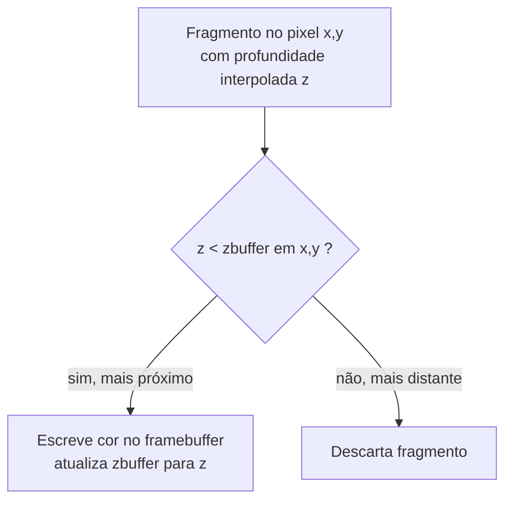

## Objetivos de Aprendizagem

- Explicar o problema de visibilidade precisamente: por que rasterizar triângulos numa ordem arbitrária produz resultados incorretos sem um mecanismo adicional.
- Enunciar o algoritmo de z-buffer: um buffer de profundidade por pixel, inicializado para a profundidade máxima possível, atualizado só quando um fragmento mais próximo chega.
- Traçar dois triângulos sobrepostos pelo teste de z-buffer à mão, com valores de profundidade concretos, e confirmar que o correto fica visível independentemente da ordem de desenho.
- Enunciar honestamente o que o z-buffer não resolve (transparência dependente de ordem) e por quê.

## Contexto e Motivação

`triangle-rasterization-edge-functions-and-barycentric-coordinates` produz, para todo triângulo, um fluxo de fragmentos, cada um com um valor de profundidade interpolado obtido dos mesmos pesos baricêntricos usados para cor. Uma cena real desenha muitos triângulos, frequentemente sobrepostos na tela do ponto de vista da câmera, e nada sobre rasterizar um triângulo impede que um triângulo posterior e mais distante sobrescreva os pixels de um anterior e mais próximo. Este conceito cobre a correção real e padrão que quase todo pipeline de rasterização usa: z-buffering, um teste de profundidade por pixel que torna a ordem de desenho irrelevante para a imagem final.

## Teoria Central

### O problema de visibilidade

Considere dois triângulos que projetam para o mesmo pixel: um a 2 unidades da câmera, um a 10 unidades da câmera. Se o triângulo distante por acaso é desenhado (rasterizado) depois do próximo, e nada checa profundidade, o fragmento do triângulo distante simplesmente sobrescreve a cor do próximo no framebuffer, produzindo uma imagem visivelmente errada, o objeto distante aparecendo na frente do próximo. A correção não pode ser simplesmente "desenhar triângulos em ordem de trás para frente", já que essa ordenação pode mudar a cada quadro conforme a câmera ou os objetos se movem, e, para triângulos que se intersectam ou se sobrepõem parcialmente em profundidade, uma única ordenação global pode nem sequer existir.

### O algoritmo de z-buffer

A correção é um segundo buffer, da mesma largura e altura que o framebuffer, mantendo um valor de profundidade por pixel, chamado de z-buffer ou buffer de profundidade. Antes de renderizar um quadro, toda entrada é inicializada para a profundidade máxima possível (representando "nada desenhado aqui ainda, então nada é mais próximo que o infinito"). Para todo fragmento produzido pela rasterização, no pixel (x, y) com profundidade interpolada z, compare z contra o valor atual do z-buffer em (x, y): se z é mais próximo (menor, pela convenção usual), o fragmento passa no teste de profundidade, a sua cor é escrita no framebuffer, e o z-buffer em (x, y) é atualizado para z; se z é mais distante, o fragmento falha no teste e é descartado, a sua cor nunca alcançando o framebuffer independentemente de que ordem os triângulos foram desenhados.



### O custo real, e a limitação real

O z-buffering custa uma leitura extra, uma comparação, e, em caso de sucesso, uma escrita extra por fragmento, um overhead por fragmento pequeno, fixo, pago uniformemente independentemente da complexidade da cena ou da ordem de desenho, que é exatamente por que ele deslocou algoritmos de visibilidade anteriores e mais complexos (como a ordenação de triângulos de trás para frente do algoritmo do pintor) na prática. A sua limitação real e honesta é a transparência: o teste de profundidade é uma única comparação em que o vencedor leva tudo, então um fragmento transparente (parcialmente translúcido) que passa no teste ainda simplesmente sobrescreve o que veio antes em vez de se misturar com ele, e renderizar transparência corretamente exige ou ordenar a geometria transparente de trás para frente (o exato problema que o z-buffering foi construído para evitar na geometria opaca) ou uma técnica mais elaborada que esta disciplina não cobre em profundidade de panorama.

## Exemplos Resolvidos

### Exemplo 1: dois triângulos no mesmo pixel, o distante desenhado primeiro

Pixel (100, 50). Z-buffer inicializado para um valor grande, digamos 1000 (representando infinitamente distante, em quaisquer unidades de profundidade em uso). O Triângulo F (distante, profundidade 10) é desenhado primeiro, depois o Triângulo N (próximo, profundidade 2), ambos cobrindo este pixel:

```text
Z-buffer inicial em (100,50): 1000

Fragmento do Triângulo F chega, z=10:
  10 < 1000? sim -> escreve a cor de F, z-buffer se torna 10

Fragmento do Triângulo N chega, z=2:
  2 < 10? sim -> escreve a cor de N, z-buffer se torna 2

Cor final do framebuffer em (100,50): cor do Triângulo N (correto: N é mais próximo)
```

### Exemplo 2: os mesmos dois triângulos, desenhados na ordem oposta

Mesmo pixel, mesmos dois triângulos, mas o Triângulo N (próximo, profundidade 2) desenhado primeiro desta vez, depois o Triângulo F (distante, profundidade 10):

```text
Z-buffer inicial em (100,50): 1000

Fragmento do Triângulo N chega, z=2:
  2 < 1000? sim -> escreve a cor de N, z-buffer se torna 2

Fragmento do Triângulo F chega, z=10:
  10 < 2? não -> descarta o fragmento de F, z-buffer permanece 2

Cor final do framebuffer em (100,50): cor do Triângulo N (ainda correto, resultado idêntico)
```

Ambas as ordens de desenho produzem a cor final idêntica e correta, exatamente a propriedade que torna o z-buffering prático: um renderizador nunca precisa ordenar geometria opaca por profundidade antes de desenhá-la.

### Exemplo 3: onde o teste de z-buffer genuinamente falha, transparência

Um triângulo transparente T (50% de opacidade, profundidade 5) e um triângulo opaco O (profundidade 8) no mesmo pixel, T desenhado primeiro:

```text
Z-buffer inicial: 1000
Fragmento de T, z=5: 5 < 1000? sim -> escreve a cor de T (a 50% de opacidade, misturada com o que estiver atrás, mas nada está atrás ainda), z-buffer se torna 5
Fragmento de O, z=8: 8 < 5? não -> descartado

Resultado: só a cor de T, com O nunca contribuindo, embora O esteja
  fisicamente atrás de T e devesse aparecer através dos 50% transparentes de T.
```

O z-buffer determinou corretamente que T é mais próximo, mas O ainda devia ter sido visível, fracamente, através de T; o teste de profundidade de valor único não tem como representar "parcialmente visível através de algo mais próximo", que é a limitação real e honesta enunciada acima.

## Equívocos Comuns e Armadilhas

- **"O z-buffering exige ordenar triângulos por profundidade antes de desenhá-los."** Os Exemplos 1 e 2 mostram que o oposto é o ponto inteiro: o teste por fragmento produz o resultado correto idêntico independentemente da ordem de desenho, que é precisamente por que o z-buffering substituiu algoritmos de visibilidade baseados em ordenação para geometria opaca.
- **"Um z-buffer maior ou de maior precisão elimina o problema de transparência."** A falha do Exemplo 3 não é uma questão de precisão (as profundidades 5 e 8 são exatamente representáveis); é uma limitação estrutural de armazenar só uma profundidade e uma cor por pixel, que não consegue representar "este pixel mostra duas superfícies sobrepostas e parcialmente translúcidas" não importa quão precisamente cada profundidade individual seja armazenada.
- **"O teste de profundidade acontece antes da rasterização, para evitar rasterizar triângulos ocultos de todo."** O teste de profundidade no algoritmo deste conceito acontece por fragmento, depois de um triângulo já ter sido rasterizado em fragmentos candidatos; ele descarta fragmentos individuais, não triângulos inteiros, que é por que um triângulo pode ser parcialmente visível, alguns fragmentos passando no teste e outros falhando, dentro do próprio mesmo triângulo.

## Resumo

Rasterizar triângulos em qualquer ordem produz fragmentos sobrepostos no mesmo pixel, e o z-buffering resolve isto com um buffer de profundidade por pixel, inicializado para a profundidade mais distante, atualizado só quando a profundidade interpolada de um fragmento mais próximo vence o valor atualmente armazenado; os Exemplos 1 e 2 mostram que isto produz a imagem correta idêntica independentemente da ordem de desenho, ao custo fixo de uma comparação-e-talvez-escrita extra por fragmento. A sua limitação honesta, mostrada concretamente no Exemplo 3, é a transparência: uma única profundidade e cor armazenadas por pixel não conseguem representar duas superfícies sobrepostas e parcialmente translúcidas corretamente. Com a visibilidade resolvida para geometria opaca, `local-illumination-lambertian-diffuse-reflection`, em seguida, começa na questão separada que este conceito deliberadamente deixou em aberto: qual cor um fragmento visível de fato é.

## Documentation Links

- [Cornell CS4620: Introduction to Computer Graphics (course page, Fall 2025)](https://www.cs.cornell.edu/courses/cs4620/2025fa/): um curso universitário real e atual cobrindo a determinação de visibilidade do pipeline de rasterização, incluindo o z-buffer, ao lado de ray tracing e sombreamento.
