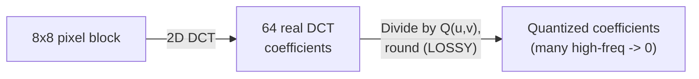

## Learning Objectives

- Explain why JPEG splits an image into 8x8 blocks and uses the DCT rather than the DFT for compression.
- Explain precisely which single step in the JPEG pipeline is lossy, and why it is designed to discard the information the human eye is least sensitive to.
- Trace, with concrete numbers, how quantization rounds DCT coefficients and why this concentrates information loss in high-frequency coefficients.

## Context & Motivation

`the-2d-discrete-fourier-transform-and-the-frequency-domain` established that a frequency-domain representation separates smooth, low-frequency image content from sharp, high-frequency detail. JPEG, the real, standard, still ubiquitous lossy image compression format, exploits exactly that separation for compression, but uses a close relative of the DFT, the **Discrete Cosine Transform (DCT)**, and applies it to small 8x8 blocks rather than the whole image at once. This concept covers the real first two stages of Wallace's 1992 description of the JPEG pipeline: block-based DCT and quantization, the one genuinely lossy step in the entire process.

## Core Theory

### Why blocks, and why the DCT instead of the DFT

Transforming an entire large image at once with a single DFT would require holding the whole image's frequency data at once and would spread the effect of a local quantization error across the whole image on reconstruction. JPEG instead splits the image into non-overlapping 8x8 pixel blocks, and transforms each independently, a real, practical engineering choice trading a small loss of cross-block frequency information for tractable, localized processing.

Within each block, JPEG uses the DCT rather than the DFT. The DCT, unlike the DFT, uses only real-valued cosine basis functions (no complex numbers), and, for typical natural image content, concentrates energy into fewer significant coefficients than the DFT does for the same block, a real, empirically and information-theoretically grounded property (related to the DFT's implicit assumption of periodicity, which the DCT avoids by effectively mirroring the block, avoiding the sharp artificial discontinuity a periodic DFT assumption would introduce at the block edges), which is exactly why the DCT, not the DFT, was chosen for this compression pipeline specifically.

### Quantization: the one lossy step

After the 2D DCT of an 8x8 block produces 64 real-valued coefficients (one DC term, the block's average intensity, and 63 AC terms of increasing frequency), each coefficient is divided by a corresponding entry in a fixed **quantization table** and rounded to the nearest integer:

```text
Quantized(u,v) = round( DCT(u,v) / Q(u,v) )
```

The quantization table Q is not uniform: entries corresponding to higher-frequency (u,v) positions are larger, meaning higher-frequency coefficients are divided by bigger numbers and rounded more aggressively, often to exactly 0. This is the deliberate, real design choice this concept's Learning Objectives name: human visual perception is measurably less sensitive to fine, high-frequency detail than to broad, low-frequency shading, so JPEG concentrates its unavoidable rounding loss precisely where it is least visually noticeable. This division-and-rounding step is the **only** lossy operation in the entire JPEG pipeline; every later stage (`entropy-coding-and-the-jpeg-pipeline`'s zigzag scan, run-length coding, and Huffman coding) is completely lossless.



## Worked Examples

### Example 1: a simplified block, DCT coefficients, and quantization

Using a tiny, simplified 1D analogue (a full 2D 8x8 DCT by hand is impractically long; the same rounding logic applies in one dimension), take four DCT-like coefficients for one row, already computed: [520, 45, -12, 3], representing decreasing energy from a low-frequency DC-like term (520) to higher-frequency terms. Using a simplified quantization step size that grows with frequency, [10, 10, 20, 40]:

```text
Quantized[0] = round(520 / 10) = 52
Quantized[1] = round(45 / 10)  = 5 (rounded from 4.5)
Quantized[2] = round(-12 / 20) = -1 (rounded from -0.6)
Quantized[3] = round(3 / 40)   = 0 (rounded from 0.075)
```

The highest-frequency coefficient, 3, is small enough relative to its large quantization step that it rounds all the way to 0, discarded entirely, while the DC-like term 520 retains meaningful precision (52, out of an original 520, an 8-fold size reduction but far from total information loss). This is the concrete mechanism behind "high frequencies are quantized more aggressively."

### Example 2: reconstruction error concentrates in high frequencies

Reconstructing approximate values from Example 1's quantized coefficients (multiplying back by the same quantization steps): 52*10=520 (exact, no error here since 520 divided evenly), 5*10=50 (versus original 45, an error of 5), -1*20=-20 (versus original -12, an error of 8), 0*40=0 (versus original 3, an error of 3, but relatively this is 100% of that small coefficient's value). The absolute errors (5, 8, 3) are all modest, but the relative error on the highest-frequency term (100% loss) is the largest, exactly matching the design intent: the visually least important, most aggressively quantized coefficients suffer the most, in relative terms, while the visually dominant low-frequency terms are preserved with the least relative distortion.

### Example 3: why choosing a coarser quantization table trades quality for size

Re-quantizing Example 1's same DCT coefficients [520, 45, -12, 3] with a coarser table [20, 20, 40, 80] (a lower "JPEG quality" setting):

```text
Quantized[0] = round(520/20) = 26
Quantized[1] = round(45/20)  = 2 (rounded from 2.25)
Quantized[2] = round(-12/40) = 0 (rounded from -0.3)
Quantized[3] = round(3/80)   = 0
```

Compare to Example 1's finer quantization, which kept nonzero values [52, 5, -1, 0]; the coarser table zeroes out one more coefficient (the third) and produces smaller nonzero values overall, meaning fewer bits are needed to represent the result (directly benefiting the entropy-coding stage next), at the direct, honest cost of more reconstruction error, exactly the size-versus-quality trade-off every real "JPEG quality" slider exposes to a user.

## Common Misconceptions & Pitfalls

- **"JPEG's DCT step itself is what makes JPEG lossy."** The DCT (like the DFT) is a lossless, invertible transform in exact arithmetic; Example 1 and the Core Theory section are explicit that the loss comes entirely from the quantization step's division-and-rounding, a separate, deliberate operation applied after the transform, not the transform itself.
- **"Quantization loses information uniformly across all frequencies."** Example 2 shows the error is concentrated, in relative terms, at high-frequency coefficients, by deliberate design of the non-uniform quantization table, not spread evenly.
- **"A lower JPEG quality setting just means 'worse in every dimension,' with no clear engineering trade-off."** Example 3 shows precisely what a coarser quantization table changes: more coefficients round to zero and remaining values shrink, directly reducing the data volume the entropy-coding stage must encode, in exchange for a specific, quantifiable increase in reconstruction error.

## Summary

JPEG splits an image into 8x8 blocks and transforms each with the DCT, a real, close relative of `the-2d-discrete-fourier-transform-and-the-frequency-domain`'s DFT chosen specifically because it concentrates a typical image block's energy into fewer significant coefficients; the resulting coefficients are then quantized, divided by a non-uniform table and rounded, the single genuinely lossy step in the whole pipeline, deliberately discarding high-frequency detail the human eye is least sensitive to. `entropy-coding-and-the-jpeg-pipeline`, next, covers the remaining, entirely lossless stages that turn these quantized coefficients into the final compressed bitstream.

## Documentation Links

- [Wallace, G.K.: The JPEG Still Picture Compression Standard (IEEE Transactions on Consumer Electronics, 1992)](https://web.stanford.edu/class/ee398a/handouts/papers/Wallace%20-%20JPEG%20-%201992.pdf): the source for this concept's description of the block-based DCT and quantization stages of the real JPEG pipeline.
