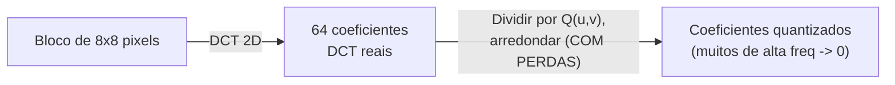

## Objetivos de Aprendizagem

- Explicar por que o JPEG divide uma imagem em blocos de 8x8 e usa a DCT em vez da DFT para compressão.
- Explicar precisamente qual passo único no pipeline do JPEG é com perdas, e por que ele é projetado para descartar a informação à qual o olho humano é menos sensível.
- Traçar, com números concretos, como a quantização arredonda os coeficientes da DCT e por que isto concentra a perda de informação nos coeficientes de alta frequência.

## Contexto e Motivação

`the-2d-discrete-fourier-transform-and-the-frequency-domain` estabeleceu que uma representação no domínio da frequência separa o conteúdo de imagem suave e de baixa frequência do detalhe nítido e de alta frequência. O JPEG, o formato de compressão de imagem com perdas real, padrão e ainda ubíquo, explora exatamente essa separação para compressão, mas usa um parente próximo da DFT, a **Transformada Discreta de Cosseno (DCT)**, e a aplica a pequenos blocos de 8x8 em vez de à imagem inteira de uma vez. Este conceito cobre os dois primeiros estágios reais da descrição de Wallace de 1992 do pipeline do JPEG: DCT por blocos e quantização, o único passo genuinamente com perdas em todo o processo.

## Teoria Central

### Por que blocos, e por que a DCT em vez da DFT

Transformar uma imagem grande inteira de uma vez com uma única DFT exigiria manter os dados de frequência da imagem inteira de uma vez e espalharia o efeito de um erro de quantização local por toda a imagem na reconstrução. O JPEG em vez disso divide a imagem em blocos de 8x8 pixels não sobrepostos, e transforma cada um independentemente, uma escolha de engenharia real e prática trocando uma pequena perda de informação de frequência entre blocos por processamento tratável e localizado.

Dentro de cada bloco, o JPEG usa a DCT em vez da DFT. A DCT, ao contrário da DFT, usa só funções de base de cosseno de valor real (sem números complexos), e, para conteúdo de imagem natural típico, concentra a energia em menos coeficientes significativos do que a DFT faz para o mesmo bloco, uma propriedade real, fundamentada empírica e teoricamente em informação (relacionada à suposição implícita de periodicidade da DFT, que a DCT evita efetivamente espelhando o bloco, evitando a descontinuidade artificial e nítida que uma suposição de DFT periódica introduziria nas bordas do bloco), que é exatamente por que a DCT, não a DFT, foi escolhida para este pipeline de compressão especificamente.

### Quantização: o único passo com perdas

Depois de a DCT 2D de um bloco de 8x8 produzir 64 coeficientes de valor real (um termo DC, a intensidade média do bloco, e 63 termos AC de frequência crescente), cada coeficiente é dividido por uma entrada correspondente numa **tabela de quantização** fixa e arredondado para o inteiro mais próximo:

```text
Quantizado(u,v) = round( DCT(u,v) / Q(u,v) )
```

A tabela de quantização Q não é uniforme: entradas correspondentes a posições (u,v) de frequência mais alta são maiores, significando que coeficientes de frequência mais alta são divididos por números maiores e arredondados mais agressivamente, frequentemente para exatamente 0. Esta é a escolha de projeto real e deliberada que os Objetivos de Aprendizagem deste conceito nomeiam: a percepção visual humana é mensuravelmente menos sensível a detalhe fino e de alta frequência do que a sombreamento amplo e de baixa frequência, então o JPEG concentra a sua perda de arredondamento inevitável precisamente onde ela é visualmente menos perceptível. Este passo de divisão-e-arredondamento é a **única** operação com perdas em todo o pipeline do JPEG; todo estágio posterior (a varredura em zigue-zague, a codificação por comprimento de sequência e a codificação de Huffman de `entropy-coding-and-the-jpeg-pipeline`) é completamente sem perdas.



## Exemplos Resolvidos

### Exemplo 1: um bloco simplificado, coeficientes da DCT, e quantização

Usando um pequeno análogo 1D simplificado (uma DCT 2D completa de 8x8 à mão é impraticavelmente longa; a mesma lógica de arredondamento se aplica em uma dimensão), tome quatro coeficientes no estilo DCT para uma linha, já computados: [520, 45, -12, 3], representando energia decrescente de um termo no estilo DC de baixa frequência (520) para termos de frequência mais alta. Usando um tamanho de passo de quantização simplificado que cresce com a frequência, [10, 10, 20, 40]:

```text
Quantizado[0] = round(520 / 10) = 52
Quantizado[1] = round(45 / 10)  = 5 (arredondado de 4.5)
Quantizado[2] = round(-12 / 20) = -1 (arredondado de -0.6)
Quantizado[3] = round(3 / 40)   = 0 (arredondado de 0.075)
```

O coeficiente de frequência mais alta, 3, é pequeno o bastante em relação ao seu grande passo de quantização que ele arredonda todo o caminho até 0, descartado inteiramente, enquanto o termo no estilo DC 520 retém precisão significativa (52, de um original 520, uma redução de tamanho de 8 vezes mas longe da perda total de informação). Este é o mecanismo concreto por trás de "frequências altas são quantizadas mais agressivamente".

### Exemplo 2: o erro de reconstrução se concentra nas frequências altas

Reconstruindo valores aproximados dos coeficientes quantizados do Exemplo 1 (multiplicando de volta pelos mesmos passos de quantização): 52*10=520 (exato, nenhum erro aqui já que 520 dividiu uniformemente), 5*10=50 (versus original 45, um erro de 5), -1*20=-20 (versus original -12, um erro de 8), 0*40=0 (versus original 3, um erro de 3, mas relativamente isto é 100% do valor daquele pequeno coeficiente). Os erros absolutos (5, 8, 3) são todos modestos, mas o erro relativo no termo de frequência mais alta (100% de perda) é o maior, correspondendo exatamente à intenção de projeto: os coeficientes visualmente menos importantes e mais agressivamente quantizados sofrem mais, em termos relativos, enquanto os termos de baixa frequência visualmente dominantes são preservados com a menor distorção relativa.

### Exemplo 3: por que escolher uma tabela de quantização mais grosseira troca qualidade por tamanho

Requantizando os mesmos coeficientes DCT [520, 45, -12, 3] do Exemplo 1 com uma tabela mais grosseira [20, 20, 40, 80] (uma configuração de "qualidade JPEG" mais baixa):

```text
Quantizado[0] = round(520/20) = 26
Quantizado[1] = round(45/20)  = 2 (arredondado de 2.25)
Quantizado[2] = round(-12/40) = 0 (arredondado de -0.3)
Quantizado[3] = round(3/80)   = 0
```

Compare com a quantização mais fina do Exemplo 1, que manteve valores diferentes de zero [52, 5, -1, 0]; a tabela mais grosseira zera mais um coeficiente (o terceiro) e produz valores diferentes de zero menores no geral, significando que menos bits são necessários para representar o resultado (beneficiando diretamente o estágio de codificação de entropia em seguida), ao custo direto e honesto de mais erro de reconstrução, exatamente o trade-off de tamanho versus qualidade que todo controle deslizante de "qualidade JPEG" real expõe a um usuário.

## Equívocos Comuns e Armadilhas

- **"O próprio passo de DCT do JPEG é o que torna o JPEG com perdas."** A DCT (como a DFT) é uma transformada sem perdas e invertível em aritmética exata; o Exemplo 1 e a seção de Teoria Central são explícitos que a perda vem inteiramente do passo de divisão-e-arredondamento da quantização, uma operação separada e deliberada aplicada depois da transformada, não a própria transformada.
- **"A quantização perde informação uniformemente por entre todas as frequências."** O Exemplo 2 mostra que o erro se concentra, em termos relativos, nos coeficientes de alta frequência, pelo projeto deliberado da tabela de quantização não uniforme, não espalhado uniformemente.
- **"Uma configuração de qualidade JPEG mais baixa só significa 'pior em toda dimensão', sem nenhum trade-off de engenharia claro."** O Exemplo 3 mostra precisamente o que uma tabela de quantização mais grosseira muda: mais coeficientes arredondam para zero e os valores remanescentes encolhem, reduzindo diretamente o volume de dados que o estágio de codificação de entropia tem de codificar, em troca de um aumento específico e quantificável no erro de reconstrução.

## Resumo

O JPEG divide uma imagem em blocos de 8x8 e transforma cada um com a DCT, um parente próximo e real da DFT de `the-2d-discrete-fourier-transform-and-the-frequency-domain` escolhido especificamente porque ela concentra a energia de um bloco de imagem típico em menos coeficientes significativos; os coeficientes resultantes são então quantizados, divididos por uma tabela não uniforme e arredondados, o único passo genuinamente com perdas em todo o pipeline, descartando deliberadamente o detalhe de alta frequência ao qual o olho humano é menos sensível. `entropy-coding-and-the-jpeg-pipeline`, em seguida, cobre os estágios remanescentes e inteiramente sem perdas que transformam estes coeficientes quantizados no fluxo de bits comprimido final.

## Documentation Links

- [Wallace, G.K.: The JPEG Still Picture Compression Standard (IEEE Transactions on Consumer Electronics, 1992)](https://web.stanford.edu/class/ee398a/handouts/papers/Wallace%20-%20JPEG%20-%201992.pdf): a fonte para a descrição deste conceito dos estágios de DCT por blocos e quantização do pipeline real do JPEG.
