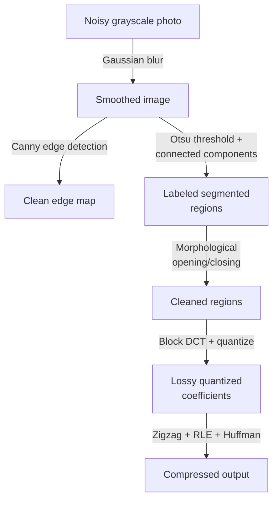

## Learning Objectives

- Trace one concrete, noisy grayscale photograph through a full classical pipeline, naming the exact concept responsible for each stage.
- Explain precisely why the stages must run in this order, and what would go wrong if a later stage ran before an earlier one.
- State honestly, in closing, the one thing this discipline deliberately never covers, and exactly where that material lives instead.

## Context & Motivation

Every concept in this discipline built one real, classical technique in isolation: smoothing, edge detection, segmentation, morphological cleanup, and compression. None of those techniques exists in a vacuum in a real system; a real image-processing application chains several of them together into a pipeline. This capstone, in the same amarra-tudo (tie-everything-together) pattern this curriculum's other capstones (`database-systems`'s and `distributed-systems-i`'s own capstones) already established, traces one concrete image through exactly such a pipeline, showing these are not six unrelated techniques but one real, ordered, composable sequence.

## Core Theory

### The scenario and the exact stages it exercises, in order

A single grayscale photograph, containing genuine sensor noise, arrives and must be processed into a compressed output highlighting its segmented objects.

```text
1. RAW INPUT: a noisy grayscale photograph, f(x,y), per
   digital-images-as-discrete-functions / grayscale-color-and-
   color-spaces.

2. NOISE REDUCTION: Gaussian blur (spatial-filtering-box-and-
   gaussian-blur), convolving f with a small Gaussian kernel
   (the-convolution-and-correlation-operation's sliding-window
   mechanic), suppressing pixel-level sensor noise BEFORE any
   gradient is computed. Skipping this step would let noise
   pollute the edge-detection stage next, exactly the honest
   reason the-canny-edge-detector's own pipeline runs smoothing
   first.

3. EDGE DETECTION: the-canny-edge-detector's full four-stage
   pipeline (reusing this same Gaussian smoothing, then Sobel
   gradients per the-sobel-operator-and-gradient-based-edge-
   detection, non-maximum suppression, hysteresis thresholding)
   locates clean, thin, well-connected object boundaries.

4. SEGMENTATION: thresholding-and-otsus-method's automatic
   threshold selection separates foreground objects from
   background by intensity, and region-growing-and-connected-
   component-labeling's BFS-based labeling (reusing algorithms-
   software/algorithms's connected-components-via-bfs directly)
   groups the thresholded pixels into distinct, separately
   labeled objects.

5. MORPHOLOGICAL CLEANUP: morphological-opening-and-closing's
   composed erosion/dilation removes small speckle noise left
   over from thresholding and fills small gaps within each
   labeled object's region, WITHOUT this step, the small
   thresholding artifacts genuinely visible in a raw photo would
   corrupt the boundaries this pipeline is trying to output.

6. COMPRESSED OUTPUT: the cleaned, segmented image is compressed
   via block-based-dct-and-quantization-in-jpeg (splitting into
   8x8 blocks, DCT, quantization, the pipeline's one genuinely
   lossy step) followed by entropy-coding-and-the-jpeg-pipeline's
   zigzag scan, run-length encoding, and Huffman coding (reusing
   ai-theory/information-theory's huffman-coding-construction
   directly), producing the final compressed output file.
```



### Why the order is not arbitrary

Reversing steps 2 and 3, running edge detection before smoothing, would feed raw sensor noise directly into the Sobel gradient computation, producing a gradient map dominated by spurious noise-driven edges, exactly why `the-canny-edge-detector`'s own internal pipeline insists on smoothing first, a design choice this capstone's larger pipeline simply inherits and applies at the whole-pipeline level too. Reversing steps 4 and 5, running morphological cleanup before segmentation, is not even well-defined: morphology (per `morphological-erosion-and-dilation`) operates on an already-binary image, which does not exist until thresholding produces one. Reversing steps 5 and 6, compressing before cleanup, would mean JPEG's lossy quantization (per `block-based-dct-and-quantization-in-jpeg`) discards detail from a still-noisy segmentation result, baking in artifacts that cleanup could otherwise have removed, a real, avoidable quality loss this pipeline's ordering specifically prevents.

### The honest boundary: what this pipeline deliberately never does

Every single number used above, the Gaussian kernel's sigma, the Sobel kernel's fixed weights, Otsu's threshold (chosen from the histogram by a closed-form rule, not learned), the structuring element's shape, JPEG's quantization table, is fixed and hand-designed, exactly the scope this discipline drew at its very first concept, `digital-images-as-discrete-functions`, and made mechanically precise at `the-convolution-and-correlation-operation`. A real, modern computer vision system solving this same "find and describe objects in a photograph" problem might instead use a convolutional neural network whose kernel weights are learned end to end from labeled training data, exactly `ai-theory/deep-learning`'s own convolution, pooling, and CNN material, published, 19 concepts. This capstone, and this discipline, deliberately never crosses into that territory; naming that boundary honestly, one final time, is this pipeline's closing statement, not an oversight.

## Worked Examples

### Example 1: the full trace on one small concrete image

Reusing `digital-images-as-discrete-functions`'s 4x4 stripe image with light noise added, f = [[12,9,198,11],[9,203,8,13],[199,11,9,10],[8,11,12,197]] (each original value perturbed by +/-3): step 2's Gaussian blur smooths these small perturbations substantially before step 3's Canny pipeline computes gradients on the smoothed result, meaning the diagonal stripe's edges are detected cleanly, without the small noise perturbations themselves being individually flagged as separate, spurious edges, exactly the noise-suppression benefit `spatial-filtering-box-and-gaussian-blur` and `the-canny-edge-detector` both name.

### Example 2: what breaks if noise reduction is skipped

Running step 3 (Canny) directly on the noisy image above without step 2's blur: the Sobel gradient computation at a flat background pixel (e.g., a run of "9, 11, 8" values, all nominally the same underlying intensity but perturbed) would compute a small but nonzero gradient purely from the noise, and depending on `the-canny-edge-detector`'s hysteresis thresholds, a run of such small noise-driven gradients could chain together via the low-threshold connectivity rule into a false, entirely spurious "edge" that does not correspond to any real object boundary, a concrete, real failure mode this pipeline's insistence on Step 2 before Step 3 specifically prevents.

### Example 3: the honest quality-versus-size choice at the final step

At step 6, choosing a fine quantization table (per `block-based-dct-and-quantization-in-jpeg`'s Example 1) preserves the cleaned segmentation's detail closely but produces a larger compressed file; choosing a coarser table (that concept's Example 3) produces a smaller file at the cost of additional, deliberate high-frequency information loss, on top of the pipeline's already-cleaned image. This is the same honest trade-off named in that concept, now shown as the genuinely final, user-facing decision this entire pipeline ends on, not a detail hidden from the pipeline's actual output.

## Common Misconceptions & Pitfalls

- **"These six stages could run in almost any order with similar results."** Example 2 shows reordering noise reduction after edge detection introduces real, concrete false edges; the Core Theory section shows the other reorderings are either quality-degrading or not even well-defined, the ordering is a real, load-bearing design decision, not a stylistic preference.
- **"A classical pipeline like this is now obsolete, fully replaced by deep learning end to end."** Real production systems frequently still use classical preprocessing, denoising, classical segmentation, or JPEG compression, even within pipelines whose core detection or classification step is a CNN; this discipline's material is the honest foundation such hybrid real systems still build on, not a purely historical curiosity.
- **"The distinction between this discipline and `ai-theory/deep-learning` is mostly semantic, since both eventually process pixels with kernels."** Restated one final time, precisely: every number in this capstone's pipeline is fixed before the image is seen; a CNN's kernel numbers are learned from data after seeing many images, a real, substantive difference in where the numbers come from, the entire honest scope line this discipline has held since its first concept.

## Summary

This capstone traces one concrete, noisy photograph through a full, real, ordered classical pipeline: Gaussian blur for noise reduction, the Canny edge detector for clean boundaries, Otsu thresholding plus connected-component labeling for segmentation, morphological opening and closing for cleanup, and the full JPEG DCT-quantize-entropy-code sequence for compressed output, naming the exact concept responsible for every stage and showing concretely, via Example 2, why the ordering is load-bearing rather than arbitrary. It closes by restating, one final time, this discipline's central honest scope decision: every parameter used throughout is fixed and hand-designed, in deliberate contrast to `ai-theory/deep-learning`'s learned-kernel CNN material, which is exactly where a reader wanting the learned-filter continuation of this same pixel-processing foundation should go next.

## Documentation Links

- [Gonzalez and Woods: Digital Image Processing, 4th Edition (Pearson, 2018)](https://www.pearson.com/en-us/subject-catalog/p/Gonzalez-Digital-Image-Processing-4th-Edition/P200000003224?view=educator): the field's standard textbook, whose end-to-end treatment of a classical image processing pipeline (smoothing, edge detection, segmentation, compression) this capstone's traced scenario follows.
