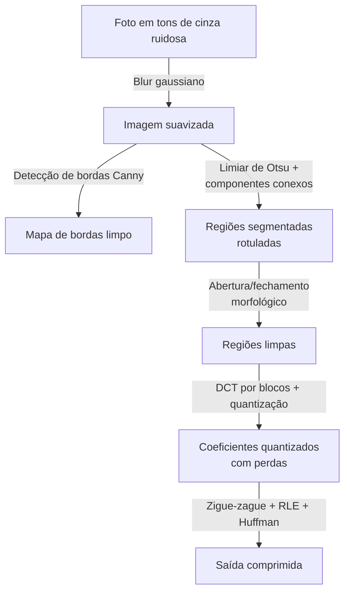

## Objetivos de Aprendizagem

- Traçar uma fotografia em tons de cinza concreta e ruidosa por um pipeline clássico completo, nomeando o conceito exato responsável por cada estágio.
- Explicar precisamente por que os estágios têm de rodar nesta ordem, e o que daria errado se um estágio posterior rodasse antes de um anterior.
- Enunciar honestamente, no encerramento, a única coisa que esta disciplina deliberadamente nunca cobre, e exatamente onde esse material reside em vez disso.

## Contexto e Motivação

Todo conceito nesta disciplina construiu uma técnica clássica real em isolamento: suavização, detecção de bordas, segmentação, limpeza morfológica e compressão. Nenhuma dessas técnicas existe num vácuo num sistema real; uma aplicação real de processamento de imagens encadeia várias delas juntas num pipeline. Este capstone, no mesmo padrão amarra-tudo que os outros capstones deste currículo (os próprios capstones de `database-systems` e `distributed-systems-i`) já estabeleceram, traça uma imagem concreta por exatamente tal pipeline, mostrando que estas não são seis técnicas não relacionadas mas uma sequência real, ordenada e componível.

## Teoria Central

### O cenário e os estágios exatos que ele exercita, em ordem

Uma única fotografia em tons de cinza, contendo ruído genuíno de sensor, chega e tem de ser processada numa saída comprimida realçando os seus objetos segmentados.

```text
1. ENTRADA BRUTA: uma fotografia em tons de cinza ruidosa, f(x,y),
   conforme digital-images-as-discrete-functions / grayscale-color-
   and-color-spaces.

2. REDUÇÃO DE RUÍDO: blur gaussiano (spatial-filtering-box-and-
   gaussian-blur), convolvendo f com um pequeno kernel gaussiano
   (a mecânica de janela deslizante de the-convolution-and-
   correlation-operation), suprimindo o ruído de sensor em nível de
   pixel ANTES que qualquer gradiente seja computado. Pular este
   passo deixaria o ruído poluir o estágio de detecção de bordas em
   seguida, exatamente a razão honesta pela qual o próprio pipeline
   de the-canny-edge-detector roda a suavização primeiro.

3. DETECÇÃO DE BORDAS: o pipeline completo de quatro estágios de
   the-canny-edge-detector (reusando esta mesma suavização gaussiana,
   depois gradientes de Sobel conforme the-sobel-operator-and-
   gradient-based-edge-detection, supressão de não-máximos,
   limiarização por histerese) localiza bordas de objetos limpas,
   finas e bem conectadas.

4. SEGMENTAÇÃO: a seleção automática de limiar de thresholding-and-
   otsus-method separa objetos de primeiro plano do fundo por
   intensidade, e a rotulação baseada em BFS de region-growing-and-
   connected-component-labeling (reusando connected-components-via-bfs
   de algorithms-software/algorithms diretamente) agrupa os pixels
   limiarizados em objetos distintos e separadamente rotulados.

5. LIMPEZA MORFOLÓGICA: a erosão/dilatação composta de morphological-
   opening-and-closing remove o pequeno ruído de respingos restante da
   limiarização e preenche pequenas lacunas dentro da região de cada
   objeto rotulado, SEM este passo, os pequenos artefatos de
   limiarização genuinamente visíveis numa foto bruta corromperiam as
   bordas que este pipeline está tentando produzir.

6. SAÍDA COMPRIMIDA: a imagem limpa e segmentada é comprimida via
   block-based-dct-and-quantization-in-jpeg (dividindo em blocos de
   8x8, DCT, quantização, o único passo genuinamente com perdas do
   pipeline) seguida da varredura em zigue-zague, codificação por
   comprimento de sequência e codificação de Huffman de entropy-
   coding-and-the-jpeg-pipeline (reusando huffman-coding-construction
   de ai-theory/information-theory diretamente), produzindo o arquivo
   de saída comprimido final.
```



### Por que a ordem não é arbitrária

Inverter os passos 2 e 3, rodar a detecção de bordas antes da suavização, alimentaria o ruído bruto do sensor diretamente na computação de gradiente de Sobel, produzindo um mapa de gradiente dominado por bordas espúrias dirigidas por ruído, exatamente por que o próprio pipeline interno de `the-canny-edge-detector` insiste na suavização primeiro, uma escolha de projeto que o pipeline maior deste capstone simplesmente herda e aplica também em nível de pipeline inteiro. Inverter os passos 4 e 5, rodar a limpeza morfológica antes da segmentação, nem sequer é bem definido: a morfologia (conforme `morphological-erosion-and-dilation`) opera numa imagem já binária, que não existe até a limiarização produzir uma. Inverter os passos 5 e 6, comprimir antes da limpeza, significaria que a quantização com perdas do JPEG (conforme `block-based-dct-and-quantization-in-jpeg`) descarta detalhe de um resultado de segmentação ainda ruidoso, cozinhando artefatos que a limpeza de outra forma poderia ter removido, uma perda de qualidade real e evitável que a ordenação deste pipeline previne especificamente.

### O limite honesto: o que este pipeline deliberadamente nunca faz

Todo único número usado acima, o sigma do kernel gaussiano, os pesos fixos do kernel de Sobel, o limiar de Otsu (escolhido do histograma por uma regra de forma fechada, não aprendido), o formato do elemento estruturante, a tabela de quantização do JPEG, é fixo e projetado à mão, exatamente o escopo que esta disciplina traçou no seu primeiro conceito, `digital-images-as-discrete-functions`, e tornou mecanicamente preciso em `the-convolution-and-correlation-operation`. Um sistema de visão computacional real e moderno resolvendo este mesmo problema de "encontrar e descrever objetos numa fotografia" poderia em vez disso usar uma rede neural convolucional cujos pesos de kernel são aprendidos de ponta a ponta a partir de dados de treino rotulados, exatamente o próprio material de convolução, pooling e CNN de `ai-theory/deep-learning`, publicado, 19 conceitos. Este capstone, e esta disciplina, deliberadamente nunca cruza para esse território; nomear esse limite honestamente, uma última vez, é a declaração de encerramento deste pipeline, não um descuido.

## Exemplos Resolvidos

### Exemplo 1: o traço completo numa pequena imagem concreta

Reusando a imagem de listras de 4x4 de `digital-images-as-discrete-functions` com ruído leve adicionado, f = [[12,9,198,11],[9,203,8,13],[199,11,9,10],[8,11,12,197]] (cada valor original perturbado por +/-3): o blur gaussiano do passo 2 suaviza estas pequenas perturbações substancialmente antes de o pipeline Canny do passo 3 computar gradientes no resultado suavizado, significando que as bordas da listra diagonal são detectadas de forma limpa, sem as pequenas perturbações de ruído em si serem individualmente sinalizadas como bordas separadas e espúrias, exatamente o benefício de supressão de ruído que `spatial-filtering-box-and-gaussian-blur` e `the-canny-edge-detector` ambos nomeiam.

### Exemplo 2: o que quebra se a redução de ruído é pulada

Rodar o passo 3 (Canny) diretamente na imagem ruidosa acima sem o blur do passo 2: a computação de gradiente de Sobel num pixel de fundo plano (por exemplo, uma sequência de valores "9, 11, 8", todos nominalmente da mesma intensidade subjacente mas perturbados) computaria um gradiente pequeno mas diferente de zero puramente a partir do ruído, e dependendo dos limiares de histerese de `the-canny-edge-detector`, uma sequência de tais pequenos gradientes dirigidos por ruído poderia se encadear via a regra de conectividade de limiar baixo numa "borda" falsa e inteiramente espúria que não corresponde a nenhuma borda de objeto real, um modo de falha concreto e real que a insistência deste pipeline no Passo 2 antes do Passo 3 previne especificamente.

### Exemplo 3: a escolha honesta de qualidade versus tamanho no passo final

No passo 6, escolher uma tabela de quantização fina (conforme o Exemplo 1 de `block-based-dct-and-quantization-in-jpeg`) preserva o detalhe da segmentação limpa de perto mas produz um arquivo comprimido maior; escolher uma tabela mais grosseira (o Exemplo 3 daquele conceito) produz um arquivo menor ao custo de perda de informação de alta frequência adicional e deliberada, por cima da imagem já limpa do pipeline. Este é o mesmo trade-off honesto nomeado naquele conceito, agora mostrado como a decisão genuinamente final e voltada ao usuário na qual este pipeline inteiro termina, não um detalhe escondido da saída de fato do pipeline.

## Equívocos Comuns e Armadilhas

- **"Estes seis estágios poderiam rodar em quase qualquer ordem com resultados semelhantes."** O Exemplo 2 mostra que reordenar a redução de ruído para depois da detecção de bordas introduz bordas falsas reais e concretas; a seção de Teoria Central mostra que as outras reordenações são ou degradantes de qualidade ou nem sequer bem definidas, a ordenação é uma decisão de projeto real e estrutural, não uma preferência estilística.
- **"Um pipeline clássico como este está agora obsoleto, totalmente substituído por deep learning de ponta a ponta."** Sistemas de produção reais frequentemente ainda usam pré-processamento clássico, remoção de ruído, segmentação clássica ou compressão JPEG, mesmo dentro de pipelines cujo passo central de detecção ou classificação é uma CNN; o material desta disciplina é a fundação honesta sobre a qual tais sistemas reais híbridos ainda constroem, não uma curiosidade puramente histórica.
- **"A distinção entre esta disciplina e `ai-theory/deep-learning` é em sua maioria semântica, já que ambas eventualmente processam pixels com kernels."** Reafirmado uma última vez, precisamente: todo número no pipeline deste capstone é fixo antes de a imagem ser vista; os números de kernel de uma CNN são aprendidos a partir de dados depois de ver muitas imagens, uma diferença real e substantiva de onde os números vêm, a linha de escopo honesta inteira que esta disciplina manteve desde o seu primeiro conceito.

## Resumo

Este capstone traça uma fotografia concreta e ruidosa por um pipeline clássico completo, real e ordenado: blur gaussiano para redução de ruído, o detector de bordas Canny para bordas limpas, limiarização de Otsu mais rotulação de componentes conexos para segmentação, abertura e fechamento morfológicos para limpeza, e a sequência completa de DCT-quantização-codificação-de-entropia do JPEG para a saída comprimida, nomeando o conceito exato responsável por cada estágio e mostrando concretamente, via Exemplo 2, por que a ordenação é estrutural em vez de arbitrária. Ele encerra reafirmando, uma última vez, a decisão central e honesta de escopo desta disciplina: todo parâmetro usado por toda parte é fixo e projetado à mão, em contraste deliberado com o material de CNN de kernel aprendido de `ai-theory/deep-learning`, que é exatamente para onde um leitor querendo a continuação de filtro aprendido desta mesma fundação de processamento de pixels deveria ir em seguida.

## Documentation Links

- [Gonzalez and Woods: Digital Image Processing, 4th Edition (Pearson, 2018)](https://www.pearson.com/en-us/subject-catalog/p/Gonzalez-Digital-Image-Processing-4th-Edition/P200000003224?view=educator): o livro-texto padrão da área, cujo tratamento de ponta a ponta de um pipeline clássico de processamento de imagens (suavização, detecção de bordas, segmentação, compressão) o cenário traçado deste capstone segue.
