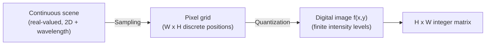

## Learning Objectives

- Define a digital image formally as a discrete, two-dimensional function f(x, y), and explain what sampling (spatial resolution) and quantization (intensity resolution, or bit depth) each contribute to that discretization.
- Compute the storage size of a raw image from its dimensions and bit depth, and explain why increasing spatial resolution and increasing intensity resolution are two independent knobs, not the same thing.
- State, precisely and honestly, the scope boundary this entire discipline draws against `ai-theory/deep-learning`: fixed, hand-designed processing versus learned, data-driven processing, the same distinction this concept opens and `the-convolution-and-correlation-operation` makes concrete.
- Explain why CS2013 does not treat image processing as its own clean Knowledge Area, and where it actually sits in that curriculum instead.

## Context & Motivation

Every technique this discipline builds, a blur kernel, an edge detector, a segmentation rule, a compression pipeline, operates on the same underlying object: a grid of numbers. Before any of that machinery makes sense, that object needs a precise definition, not just an informal "picture." This concept gives that definition and, just as importantly, states the honest scope boundary that governs the rest of the discipline.

That boundary matters because a sibling discipline, `ai-theory/deep-learning` (19 concepts, published), already teaches convolution, pooling, and CNNs as a technique for *learning* image filters from data. This discipline is not a second, redundant pass over that material. It is the classical, pre-learning tradition that predates it: every kernel, every threshold, every structuring element used here is chosen by a human, in closed form, before the image is ever seen. `the-convolution-and-correlation-operation`, two concepts from here, states this line precisely at the exact point where the two disciplines' mechanics overlap. This concept's job is narrower: get the representation right first.

Where does this fit in the wider computing curriculum? The ACM/IEEE-CS Computer Science Curricula 2013 report is honest about not having a clean, separate Image Processing Knowledge Area: it states plainly that "Graphics and Visualization is related to machine vision and image processing, which are found in the Intelligent Systems (IS) KA" (CS2013, p. 121 area), and lists "Image processing techniques" only as a topic bullet inside GV's elective Interactive Visualization unit, never as its own unit. This discipline exists to give that scattered, elective-level topic the depth CS2013 itself never built out, precisely because, as the module's own topic list already argues, pixel-level image processing is the real foundation Computer Vision (a recurring topic across this curriculum's `track-b-ai`, `track-e-human-computing`, and `track-f-robotics`) is built on top of.

## Core Theory

### Sampling: the pixel grid

A real-world scene is a continuous function of two spatial coordinates and, for a color image, wavelength. Digitizing it requires sampling that continuous function on a discrete grid: an image of width W and height H is a function f defined only at the W x H integer coordinate pairs (x, y), each cell a **pixel** (picture element). Spatial resolution is simply how fine that grid is, more pixels per unit area capture finer spatial detail, at the direct cost of more numbers to store and process.

### Quantization: intensity resolution and bit depth

At each sampled coordinate, the true intensity value (a real number, in principle) must also be rounded to one of a finite set of levels. An 8-bit grayscale image quantizes intensity into 2^8 = 256 levels, 0 (black) through 255 (white). This is a completely independent choice from spatial resolution: a 4K image quantized to 1 bit per pixel (pure black/white) has excellent spatial resolution and terrible intensity resolution, and a tiny 8x8 image at 16 bits per pixel has the reverse. Both dimensions matter, and later concepts (thresholding, in particular) depend on having enough intensity resolution to distinguish meaningfully different regions.

### The image as a discrete 2D function, and as a matrix

Putting sampling and quantization together, a grayscale digital image is formally a function:

```text
f: {0, 1, ..., W-1} x {0, 1, ..., H-1} -> {0, 1, ..., 2^b - 1}
```

where b is the bit depth. Because its domain is a finite, regular grid, f is exactly equivalent to an H x W matrix of integers, f(x, y) = the matrix entry at row y, column x. This matrix framing is not a mere notational convenience: it is what lets every later concept in this discipline, convolution, the Fourier transform, morphological operations, be stated as an operation on a matrix, borrowing directly from standard linear-algebra machinery rather than inventing image-specific mathematics from scratch.



## Worked Examples

### Example 1: computing raw storage size

A grayscale image is 1920 x 1080 pixels (spatial resolution), 8 bits per pixel (intensity resolution). Total storage:

```text
1920 * 1080 = 2,073,600 pixels
2,073,600 pixels * 8 bits/pixel = 16,588,800 bits
16,588,800 bits / 8 = 2,073,600 bytes ~= 1.98 MB (uncompressed)
```

Doubling spatial resolution in both dimensions (3840 x 2160, still 8 bits) quadruples storage to ~7.91 MB; instead doubling intensity resolution to 16 bits per pixel at the original 1920x1080 doubles storage to ~3.96 MB. The two knobs multiply independently, exactly as the Core Theory section states.

### Example 2: a tiny 4x4 image as an explicit matrix

A 4x4, 8-bit grayscale image with a bright diagonal stripe:

```text
f(x,y) =
[ 10  10  200  10 ]
[ 10 200   10  10 ]
[200  10   10  10 ]
[ 10  10   10 200 ]
```

Reading this as a matrix, row 0 is [10, 10, 200, 10], and f(2, 0) = 200 (column x=2, row y=0). This exact 4x4 matrix will be reused directly in `the-convolution-and-correlation-operation`'s worked example, run through an actual kernel by hand, to keep the transition from representation to processing concrete rather than abstract.

### Example 3: why 8 bits per channel became the practical default

Human vision can distinguish roughly 100 shades of gray reliably under normal viewing conditions; 256 levels (8 bits) comfortably exceeds that perceptual limit while keeping each pixel a single byte, a computationally convenient unit. This is a real, practical engineering trade-off, not an arbitrary standard: fewer bits (say 4, 16 levels) produces visible banding artifacts in smooth gradients, and more bits (16 or 32 per channel) is reserved for specialized domains, medical and scientific imaging, HDR photography, where the extra intensity resolution is genuinely used downstream.

## Common Misconceptions & Pitfalls

- **"Higher resolution always means a better image."** Resolution has two independent axes, spatial and intensity, per Example 1; a spatially huge image quantized to only a few intensity levels looks visibly worse than a much smaller image with proper intensity resolution, for tasks that depend on subtle intensity differences (like the thresholding this discipline covers later).
- **"An image is fundamentally different from a matrix, and needs image-specific math."** The entire reason this concept insists on the f(x,y)-as-matrix framing is that it is not a mere analogy: every later technique, convolution, the Fourier transform, is literally standard linear algebra and signal processing applied to that matrix, reused directly rather than reinvented for images specifically.
- **"CS2013 must have a full Image Processing Knowledge Area somewhere, since it is such a well-known field."** Verified directly against the CS2013 report: it genuinely does not. Image processing appears only as a topic bullet under Graphics and Visualization's elective Interactive Visualization unit, and is explicitly named as adjacent to, not part of, Intelligent Systems' Perception and Computer Vision unit, an honest gap in that curriculum standard, not something this concept invented to inflate its own importance.

## Summary

A digital image is a discrete 2D function f(x, y), produced by sampling a continuous scene onto a pixel grid (spatial resolution) and quantizing each sample's intensity into a finite set of levels (intensity resolution, or bit depth), two independent choices whose product determines raw storage size. Because that function's domain is a finite grid, it is exactly an H x W matrix, the representation every later concept in this discipline, from convolution to the Fourier transform to compression, operates on directly. This discipline's honest scope, classical, fixed, hand-designed processing on that matrix, as opposed to `ai-theory/deep-learning`'s learned-filter approach to the same underlying data, is the line drawn here and made mechanically concrete two concepts later in `the-convolution-and-correlation-operation`.

## Documentation Links

- [Gonzalez and Woods: Digital Image Processing, 4th Edition (Pearson, 2018)](https://www.pearson.com/en-us/subject-catalog/p/Gonzalez-Digital-Image-Processing-4th-Edition/P200000003224?view=educator): the field's standard textbook, whose opening chapters define the discrete-function and matrix framing of a digital image used throughout this concept.
- [ACM/IEEE-CS: Computer Science Curricula 2013 (CS2013), full report](https://www.acm.org/binaries/content/assets/education/cs2013_web_final.pdf): the source for this concept's honest claim that CS2013 has no standalone Image Processing Knowledge Area, placing the topic instead as an elective bullet under Graphics and Visualization and adjacent to Intelligent Systems' Perception and Computer Vision unit.
