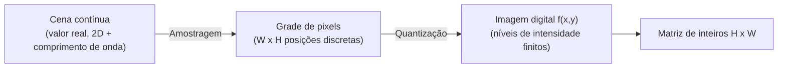

## Objetivos de Aprendizagem

- Definir uma imagem digital formalmente como uma função bidimensional e discreta f(x, y), e explicar o que a amostragem (resolução espacial) e a quantização (resolução de intensidade, ou profundidade de bits) cada uma contribui para essa discretização.
- Computar o tamanho de armazenamento de uma imagem bruta a partir das suas dimensões e profundidade de bits, e explicar por que aumentar a resolução espacial e aumentar a resolução de intensidade são dois botões independentes, não a mesma coisa.
- Enunciar, precisa e honestamente, o limite de escopo que esta disciplina inteira traça contra `ai-theory/deep-learning`: processamento fixo e projetado à mão versus processamento aprendido e dirigido por dados, a mesma distinção que este conceito abre e `the-convolution-and-correlation-operation` torna concreta.
- Explicar por que o CS2013 não trata o processamento de imagens como a sua própria Área de Conhecimento limpa, e onde ele de fato reside naquele currículo em vez disso.

## Contexto e Motivação

Toda técnica que esta disciplina constrói, um kernel de blur, um detector de bordas, uma regra de segmentação, um pipeline de compressão, opera sobre o mesmo objeto subjacente: uma grade de números. Antes que qualquer dessa maquinaria faça sentido, esse objeto precisa de uma definição precisa, não apenas uma "imagem" informal. Este conceito dá essa definição e, tão importante quanto, enuncia o limite honesto de escopo que governa o resto da disciplina.

Esse limite importa porque uma disciplina irmã, `ai-theory/deep-learning` (19 conceitos, publicada), já ensina convolução, pooling e CNNs como uma técnica para *aprender* filtros de imagem a partir de dados. Esta disciplina não é uma segunda passada redundante sobre esse material. Ela é a tradição clássica e pré-aprendizado que a precede: todo kernel, todo limiar, todo elemento estruturante usado aqui é escolhido por um humano, em forma fechada, antes de a imagem ser sequer vista. `the-convolution-and-correlation-operation`, dois conceitos daqui, enuncia esta linha precisamente no ponto exato onde a mecânica das duas disciplinas se sobrepõe. O trabalho deste conceito é mais estreito: acertar a representação primeiro.

Onde isto se encaixa no currículo de computação mais amplo? O relatório Computer Science Curricula 2013 da ACM/IEEE-CS é honesto sobre não ter uma Área de Conhecimento de Processamento de Imagens limpa e separada: ele enuncia claramente que "Graphics and Visualization is related to machine vision and image processing, which are found in the Intelligent Systems (IS) KA" (CS2013, área da p. 121), e lista "Image processing techniques" só como um item de tópico dentro da unidade eletiva Interactive Visualization de GV, nunca como a sua própria unidade. Esta disciplina existe para dar a esse tópico disperso e de nível eletivo a profundidade que o próprio CS2013 nunca construiu, precisamente porque, como a própria lista de tópicos do módulo já argumenta, o processamento de imagens em nível de pixel é a fundação real sobre a qual a Visão Computacional (um tópico recorrente por entre a `track-b-ai`, a `track-e-human-computing` e a `track-f-robotics` deste currículo) é construída.

## Teoria Central

### Amostragem: a grade de pixels

Uma cena do mundo real é uma função contínua de duas coordenadas espaciais e, para uma imagem colorida, do comprimento de onda. Digitalizá-la exige amostrar essa função contínua numa grade discreta: uma imagem de largura W e altura H é uma função f definida só nos W x H pares de coordenadas inteiras (x, y), cada célula um **pixel** (elemento de imagem). A resolução espacial é simplesmente quão fina essa grade é, mais pixels por unidade de área capturam detalhe espacial mais fino, ao custo direto de mais números para armazenar e processar.

### Quantização: resolução de intensidade e profundidade de bits

Em cada coordenada amostrada, o valor de intensidade verdadeiro (um número real, em princípio) também tem de ser arredondado para um de um conjunto finito de níveis. Uma imagem em tons de cinza de 8 bits quantiza a intensidade em 2^8 = 256 níveis, 0 (preto) até 255 (branco). Esta é uma escolha completamente independente da resolução espacial: uma imagem 4K quantizada a 1 bit por pixel (preto/branco puro) tem excelente resolução espacial e terrível resolução de intensidade, e uma pequena imagem de 8x8 a 16 bits por pixel tem o inverso. Ambas as dimensões importam, e conceitos posteriores (a limiarização, em particular) dependem de ter resolução de intensidade suficiente para distinguir regiões significativamente diferentes.

### A imagem como uma função 2D discreta, e como uma matriz

Juntando amostragem e quantização, uma imagem digital em tons de cinza é formalmente uma função:

```text
f: {0, 1, ..., W-1} x {0, 1, ..., H-1} -> {0, 1, ..., 2^b - 1}
```

onde b é a profundidade de bits. Como o seu domínio é uma grade finita e regular, f é exatamente equivalente a uma matriz H x W de inteiros, f(x, y) = a entrada da matriz na linha y, coluna x. Este enquadramento de matriz não é uma mera conveniência notacional: é o que deixa todo conceito posterior nesta disciplina, convolução, a transformada de Fourier, operações morfológicas, ser enunciado como uma operação sobre uma matriz, tomando emprestado diretamente da maquinaria padrão de álgebra linear em vez de inventar matemática específica para imagens do zero.



## Exemplos Resolvidos

### Exemplo 1: computando o tamanho de armazenamento bruto

Uma imagem em tons de cinza tem 1920 x 1080 pixels (resolução espacial), 8 bits por pixel (resolução de intensidade). Armazenamento total:

```text
1920 * 1080 = 2.073.600 pixels
2.073.600 pixels * 8 bits/pixel = 16.588.800 bits
16.588.800 bits / 8 = 2.073.600 bytes ~= 1,98 MB (não comprimido)
```

Dobrar a resolução espacial em ambas as dimensões (3840 x 2160, ainda 8 bits) quadruplica o armazenamento para ~7,91 MB; em vez disso, dobrar a resolução de intensidade para 16 bits por pixel na resolução original de 1920x1080 dobra o armazenamento para ~3,96 MB. Os dois botões se multiplicam independentemente, exatamente como a seção de Teoria Central enuncia.

### Exemplo 2: uma pequena imagem de 4x4 como uma matriz explícita

Uma imagem em tons de cinza de 4x4 e 8 bits com uma listra diagonal brilhante:

```text
f(x,y) =
[ 10  10  200  10 ]
[ 10 200   10  10 ]
[200  10   10  10 ]
[ 10  10   10 200 ]
```

Lendo isto como uma matriz, a linha 0 é [10, 10, 200, 10], e f(2, 0) = 200 (coluna x=2, linha y=0). Esta exata matriz de 4x4 será reusada diretamente no exemplo resolvido de `the-convolution-and-correlation-operation`, passada por um kernel de fato à mão, para manter a transição de representação para processamento concreta em vez de abstrata.

### Exemplo 3: por que 8 bits por canal se tornou o padrão prático

A visão humana consegue distinguir aproximadamente 100 tons de cinza de forma confiável sob condições de visualização normais; 256 níveis (8 bits) excede confortavelmente esse limite perceptual enquanto mantém cada pixel num único byte, uma unidade computacionalmente conveniente. Este é um trade-off de engenharia real e prático, não um padrão arbitrário: menos bits (digamos 4, 16 níveis) produz artefatos de bandeamento visíveis em gradientes suaves, e mais bits (16 ou 32 por canal) é reservado para domínios especializados, imagem médica e científica, fotografia HDR, onde a resolução de intensidade extra é genuinamente usada a jusante.

## Equívocos Comuns e Armadilhas

- **"Resolução mais alta sempre significa uma imagem melhor."** A resolução tem dois eixos independentes, espacial e de intensidade, conforme o Exemplo 1; uma imagem espacialmente enorme quantizada em só alguns níveis de intensidade parece visivelmente pior do que uma imagem muito menor com resolução de intensidade apropriada, para tarefas que dependem de diferenças sutis de intensidade (como a limiarização que esta disciplina cobre depois).
- **"Uma imagem é fundamentalmente diferente de uma matriz, e precisa de matemática específica para imagens."** A razão inteira pela qual este conceito insiste no enquadramento de f(x,y) como matriz é que ele não é uma mera analogia: toda técnica posterior, convolução, a transformada de Fourier, é literalmente álgebra linear e processamento de sinais padrão aplicados a essa matriz, reusados diretamente em vez de reinventados especificamente para imagens.
- **"O CS2013 deve ter uma Área de Conhecimento de Processamento de Imagens completa em algum lugar, já que é um campo tão conhecido."** Verificado diretamente contra o relatório CS2013: ele genuinamente não tem. O processamento de imagens aparece só como um item de tópico sob a unidade eletiva Interactive Visualization de Graphics and Visualization, e é explicitamente nomeado como adjacente a, não parte de, a unidade Perception and Computer Vision de Intelligent Systems, uma lacuna honesta naquele padrão de currículo, não algo que este conceito inventou para inflar a sua própria importância.

## Resumo

Uma imagem digital é uma função 2D discreta f(x, y), produzida amostrando uma cena contínua numa grade de pixels (resolução espacial) e quantizando a intensidade de cada amostra num conjunto finito de níveis (resolução de intensidade, ou profundidade de bits), duas escolhas independentes cujo produto determina o tamanho de armazenamento bruto. Como o domínio dessa função é uma grade finita, ela é exatamente uma matriz H x W, a representação sobre a qual todo conceito posterior nesta disciplina, da convolução à transformada de Fourier à compressão, opera diretamente. O escopo honesto desta disciplina, processamento clássico, fixo e projetado à mão sobre essa matriz, em oposição à abordagem de filtro aprendido de `ai-theory/deep-learning` sobre os mesmos dados subjacentes, é a linha traçada aqui e tornada mecanicamente concreta dois conceitos depois em `the-convolution-and-correlation-operation`.

## Documentation Links

- [Gonzalez and Woods: Digital Image Processing, 4th Edition (Pearson, 2018)](https://www.pearson.com/en-us/subject-catalog/p/Gonzalez-Digital-Image-Processing-4th-Edition/P200000003224?view=educator): o livro-texto padrão da área, cujos capítulos de abertura definem o enquadramento de função discreta e de matriz de uma imagem digital usado por todo este conceito.
- [ACM/IEEE-CS: Computer Science Curricula 2013 (CS2013), full report](https://www.acm.org/binaries/content/assets/education/cs2013_web_final.pdf): a fonte para a afirmação honesta deste conceito de que o CS2013 não tem nenhuma Área de Conhecimento de Processamento de Imagens autônoma, colocando o tópico em vez disso como um item eletivo sob Graphics and Visualization e adjacente à unidade Perception and Computer Vision de Intelligent Systems.
