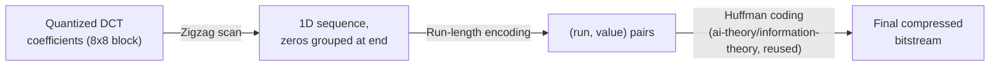

## Learning Objectives

- Trace the zigzag scan and run-length encoding steps that follow quantization in the JPEG pipeline, and explain why the zigzag order specifically helps.
- Explain precisely why Huffman coding, reused directly from `ai-theory/information-theory`, is the right tool for the final entropy-coding stage.
- Contrast JPEG's lossy DCT-quantize-entropy-code pipeline honestly against a lossless approach (PNG's DEFLATE) for the same input.

## Context & Motivation

`block-based-dct-and-quantization-in-jpeg` left off with a grid of quantized DCT coefficients per 8x8 block, many of them zero, especially at higher frequencies. This concept covers the real, remaining, entirely lossless stages that turn that grid into JPEG's final compressed bitstream: reordering the coefficients (zigzag scan), exploiting the runs of zeros (run-length encoding), and compressing the result with entropy coding. That last stage is not a new algorithm invented for JPEG: it is `huffman-coding-construction` (`ai-theory/information-theory`, published), the same optimal prefix-free code that discipline already proved, reused here directly rather than re-derived, closing the loop this discipline's compression material was always going to need.

## Core Theory

### The zigzag scan: reordering coefficients by frequency

The 8x8 quantized coefficient block is read out in a specific zigzag order, starting at the DC term (top-left, lowest frequency) and proceeding diagonally, visiting coefficients in roughly increasing order of total frequency (u+v). Because `block-based-dct-and-quantization-in-jpeg` showed quantization drives most high-frequency coefficients to zero, this reordering groups the many zero-valued high-frequency coefficients together at the end of the scan, rather than scattering them throughout a simple row-major reading, which is exactly what makes the next stage effective.

### Run-length encoding: exploiting the zero runs

With coefficients now grouped by increasing frequency, long runs of trailing zeros (all the high-frequency coefficients that quantization rounded away) can be represented compactly as a single (run-length, value) pair instead of writing out every individual zero, a simple, real, lossless compression step that specifically benefits from the zigzag reordering's grouping.

### Entropy coding: reusing Huffman coding directly

The run-length-encoded symbol stream (a mix of coefficient values and run lengths) still has a skewed frequency distribution: some symbols (small coefficient magnitudes, common run lengths) occur far more often than others. This is exactly the setting `huffman-coding-construction` (`ai-theory/information-theory`) already solved: build an optimal prefix-free binary code assigning shorter codewords to more frequent symbols and longer codewords to rarer ones, provably minimizing the expected code length for a known symbol distribution, per that discipline's own exchange-argument optimality proof. JPEG's real, standard baseline pipeline applies Huffman coding to exactly this symbol stream, reusing the algorithm and its optimality guarantee directly rather than re-deriving entropy coding from scratch. `entropy-the-expected-information-content` (`ai-theory/information-theory`)'s own entropy bound is the theoretical floor Huffman coding approaches: the more skewed the symbol distribution quantization produces (many zeros, few large coefficients), the closer Huffman coding's actual code length gets to that theoretical minimum, and the better the overall compression ratio.

### A brief, honest contrast with lossless compression

JPEG's DCT-and-quantization stages are what make it lossy; a genuinely lossless image format skips them entirely. PNG, the standard lossless alternative, instead applies a simple, reversible per-pixel prediction filter (predicting each pixel from its neighbors and encoding only the difference) and then compresses the result with DEFLATE, which itself combines LZ77 dictionary matching (finding and replacing repeated byte sequences) with Huffman coding, the same entropy-coding building block this concept just reused, applied here without any prior lossy quantization step. The real, honest trade-off: PNG reconstructs the exact original pixel values with zero loss, at a compression ratio typically far worse than JPEG's on natural photographic content, because it has no analogue of JPEG's deliberate, perceptually-informed discarding of high-frequency detail; JPEG achieves much smaller files precisely because `block-based-dct-and-quantization-in-jpeg`'s quantization step throws away real information the eye is unlikely to miss, a trade lossless formats do not make.

## Worked Examples

### Example 1: zigzag scan grouping zeros, concretely

A small 4-coefficient block (simplified from a full 8x8, in raster/row-major reading order): [52, 5, 0, -1] read row by row would not obviously group zeros in a larger block, but consider a slightly larger, more realistic simplified case, an 8-coefficient sequence in raster order with the zero-producing pattern `block-based-dct-and-quantization-in-jpeg`'s Example 1 and Example 3 established: [52, 5, 2, 0, -1, 0, 0, 0]. Reordering by increasing frequency-like index (already close to zigzag intent for this simplified 1D stand-in) keeps the trailing zeros together: [52, 5, 2, -1, 0, 0, 0, 0], a run of four trailing zeros ready for compact run-length encoding, versus a hypothetical non-frequency-ordered arrangement like [52, 0, 5, 0, 2, -1, 0, 0], which scatters the zeros and prevents them from being captured in one run.

### Example 2: run-length encoding the zigzag output

Taking Example 1's zigzag-ordered sequence [52, 5, 2, -1, 0, 0, 0, 0], run-length encoding produces: (0,52), (0,5), (0,2), (0,-1), (4,EOB), where (0,v) means "zero preceding zeros, value v" and (4,EOB) is a special end-of-block marker indicating "the remaining four coefficients are all zero," replacing what would otherwise be four separate zero symbols with a single marker, a direct, concrete instance of the compression benefit the zigzag reordering sets up.

### Example 3: Huffman coding this exact stream, reusing the construction algorithm

Given symbol frequencies drawn from many blocks like Example 2's (a real image has thousands of such blocks): suppose the symbol (0,52)-style "small run, small value" pairs occur very frequently, and rare large-value symbols occur only occasionally, with observed frequencies, say, {A: 40, B: 25, C: 20, D: 15} for four representative symbol classes. Running `huffman-coding-construction`'s own algorithm (build a min-heap of frequencies, repeatedly merge the two smallest nodes) on these frequencies produces short codewords for A and B and longer codewords for C and D, exactly as that concept's own worked construction already demonstrates for an arbitrary skewed frequency table; this concept does not repeat that construction step by step again, since it is identical machinery, only confirms that JPEG's real symbol stream has exactly the skewed shape (many small, frequent values; few large, rare ones) Huffman coding is designed to exploit well.

## Common Misconceptions & Pitfalls

- **"The entropy coding stage is where JPEG loses image quality."** Stated precisely in `block-based-dct-and-quantization-in-jpeg`: the only lossy step is quantization; the zigzag scan, run-length encoding, and Huffman coding covered here are all completely lossless, reversible operations on already-quantized data.
- **"JPEG needed to invent a new compression algorithm for its final stage."** Example 3 shows the opposite: JPEG's baseline entropy-coding stage reuses Huffman coding, exactly the general-purpose, already-proven-optimal algorithm `huffman-coding-construction` (`ai-theory/information-theory`) builds, applied to JPEG-specific symbols, not a JPEG-specific invention.
- **"Since JPEG compresses more than PNG, JPEG is simply the better format."** The honest contrast in Core Theory is that JPEG's smaller files come specifically from discarding real information (quantization); PNG's larger files come from doing no such discarding, a genuine quality-versus-size trade-off depending on the use case (a photograph tolerates JPEG's loss well; a screenshot or line-art image with hard edges typically does not, and is usually better served by PNG).

## Summary

JPEG's zigzag scan reorders quantized DCT coefficients to group the many zero-valued high-frequency terms together, run-length encoding compresses those runs compactly, and Huffman coding, reused directly from `huffman-coding-construction` (`ai-theory/information-theory`) rather than reinvented, compresses the resulting skewed symbol stream close to `entropy-the-expected-information-content`'s own theoretical entropy bound, all three stages entirely lossless, in contrast to the one genuinely lossy quantization step `block-based-dct-and-quantization-in-jpeg` covered. Set against PNG's lossless DEFLATE pipeline (LZ77 plus the same Huffman coding building block, but with no prior quantization step), the real trade-off between JPEG's much smaller files and PNG's exact reconstruction is now concrete rather than a vague reputation. With the full JPEG pipeline covered end to end, this discipline's closing `capstone-a-classical-image-processing-pipeline` traces one image through several of these stages together, from raw pixels to compressed output.

## Documentation Links

- [Wallace, G.K.: The JPEG Still Picture Compression Standard (IEEE Transactions on Consumer Electronics, 1992)](https://web.stanford.edu/class/ee398a/handouts/papers/Wallace%20-%20JPEG%20-%201992.pdf): the source for this concept's zigzag scan, run-length encoding, and baseline Huffman entropy-coding stages of the JPEG pipeline.
