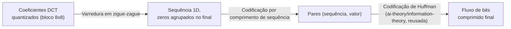

## Objetivos de Aprendizagem

- Traçar os passos de varredura em zigue-zague e codificação por comprimento de sequência que seguem a quantização no pipeline do JPEG, e explicar por que a ordem de zigue-zague especificamente ajuda.
- Explicar precisamente por que a codificação de Huffman, reusada diretamente de `ai-theory/information-theory`, é a ferramenta certa para o estágio final de codificação de entropia.
- Contrastar o pipeline com perdas de DCT-quantização-codificação-de-entropia do JPEG honestamente contra uma abordagem sem perdas (o DEFLATE do PNG) para a mesma entrada.

## Contexto e Motivação

`block-based-dct-and-quantization-in-jpeg` parou numa grade de coeficientes DCT quantizados por bloco de 8x8, muitos deles zero, especialmente nas frequências mais altas. Este conceito cobre os estágios reais, remanescentes e inteiramente sem perdas que transformam essa grade no fluxo de bits comprimido final do JPEG: reordenar os coeficientes (varredura em zigue-zague), explorar as sequências de zeros (codificação por comprimento de sequência) e comprimir o resultado com codificação de entropia. Esse último estágio não é um novo algoritmo inventado para o JPEG: é `huffman-coding-construction` (`ai-theory/information-theory`, publicado), o mesmo código livre de prefixo ótimo que aquela disciplina já provou, reusado aqui diretamente em vez de re-derivado, fechando o ciclo que o material de compressão desta disciplina sempre ia precisar.

## Teoria Central

### A varredura em zigue-zague: reordenando coeficientes por frequência

O bloco de 8x8 de coeficientes quantizados é lido numa ordem de zigue-zague específica, começando no termo DC (canto superior esquerdo, frequência mais baixa) e prosseguindo diagonalmente, visitando coeficientes em ordem aproximadamente crescente de frequência total (u+v). Como `block-based-dct-and-quantization-in-jpeg` mostrou que a quantização leva a maioria dos coeficientes de alta frequência a zero, esta reordenação agrupa os muitos coeficientes de alta frequência de valor zero juntos no final da varredura, em vez de espalhá-los por uma simples leitura em ordem de linhas, que é exatamente o que torna o próximo estágio eficaz.

### Codificação por comprimento de sequência: explorando as sequências de zeros

Com os coeficientes agora agrupados por frequência crescente, longas sequências de zeros finais (todos os coeficientes de alta frequência que a quantização arredondou) podem ser representadas compactamente como um único par (comprimento-da-sequência, valor) em vez de escrever cada zero individual, um passo de compressão sem perdas simples e real que especificamente se beneficia do agrupamento da reordenação em zigue-zague.

### Codificação de entropia: reusando a codificação de Huffman diretamente

O fluxo de símbolos codificado por comprimento de sequência (uma mistura de valores de coeficientes e comprimentos de sequência) ainda tem uma distribuição de frequência enviesada: alguns símbolos (magnitudes de coeficiente pequenas, comprimentos de sequência comuns) ocorrem muito mais frequentemente do que outros. Este é exatamente o cenário que `huffman-coding-construction` (`ai-theory/information-theory`) já resolveu: construir um código binário livre de prefixo ótimo atribuindo palavras-código mais curtas a símbolos mais frequentes e palavras-código mais longas a mais raros, comprovadamente minimizando o comprimento de código esperado para uma distribuição de símbolos conhecida, conforme a própria prova de otimalidade por argumento de troca daquela disciplina. O pipeline baseline real e padrão do JPEG aplica a codificação de Huffman a exatamente este fluxo de símbolos, reusando o algoritmo e a sua garantia de otimalidade diretamente em vez de re-derivar a codificação de entropia do zero. O próprio limite de entropia de `entropy-the-expected-information-content` (`ai-theory/information-theory`) é o piso teórico que a codificação de Huffman se aproxima: quanto mais enviesada for a distribuição de símbolos que a quantização produz (muitos zeros, poucos coeficientes grandes), mais perto o comprimento de código de fato da codificação de Huffman chega desse mínimo teórico, e melhor a razão de compressão geral.

### Um contraste breve e honesto com a compressão sem perdas

Os estágios de DCT-e-quantização do JPEG são o que o tornam com perdas; um formato de imagem genuinamente sem perdas os pula inteiramente. O PNG, a alternativa sem perdas padrão, em vez disso aplica um filtro de predição por pixel simples e reversível (prevendo cada pixel a partir dos seus vizinhos e codificando só a diferença) e então comprime o resultado com DEFLATE, que ele mesmo combina correspondência por dicionário LZ77 (encontrando e substituindo sequências de bytes repetidas) com codificação de Huffman, o mesmo bloco de construção de codificação de entropia que este conceito acabou de reusar, aplicado aqui sem nenhum passo de quantização com perdas prévio. O trade-off real e honesto: o PNG reconstrói os valores de pixel originais exatos com perda zero, a uma razão de compressão tipicamente muito pior do que a do JPEG em conteúdo fotográfico natural, porque ele não tem nenhum análogo do descarte deliberado e informado por percepção de detalhe de alta frequência do JPEG; o JPEG alcança arquivos muito menores precisamente porque o passo de quantização de `block-based-dct-and-quantization-in-jpeg` joga fora informação real que o olho provavelmente não sentirá falta, uma troca que formatos sem perdas não fazem.

## Exemplos Resolvidos

### Exemplo 1: a varredura em zigue-zague agrupando zeros, concretamente

Um pequeno bloco de 4 coeficientes (simplificado de um 8x8 completo, em ordem de leitura raster/por linhas): [52, 5, 0, -1] lido linha por linha não agruparia obviamente os zeros num bloco maior, mas considere um caso simplificado ligeiramente maior e mais realista, uma sequência de 8 coeficientes em ordem raster com o padrão produtor de zeros que o Exemplo 1 e o Exemplo 3 de `block-based-dct-and-quantization-in-jpeg` estabeleceram: [52, 5, 2, 0, -1, 0, 0, 0]. Reordenar por índice crescente no estilo de frequência (já próximo da intenção do zigue-zague para este substituto 1D simplificado) mantém os zeros finais juntos: [52, 5, 2, -1, 0, 0, 0, 0], uma sequência de quatro zeros finais pronta para codificação por comprimento de sequência compacta, versus um arranjo hipotético não ordenado por frequência como [52, 0, 5, 0, 2, -1, 0, 0], que espalha os zeros e os impede de serem capturados numa sequência.

### Exemplo 2: codificando por comprimento de sequência a saída do zigue-zague

Tomando a sequência ordenada em zigue-zague do Exemplo 1 [52, 5, 2, -1, 0, 0, 0, 0], a codificação por comprimento de sequência produz: (0,52), (0,5), (0,2), (0,-1), (4,EOB), onde (0,v) significa "zero zeros precedentes, valor v" e (4,EOB) é um marcador especial de fim de bloco indicando "os quatro coeficientes remanescentes são todos zero", substituindo o que de outra forma seriam quatro símbolos de zero separados por um único marcador, uma instância direta e concreta do benefício de compressão que a reordenação em zigue-zague prepara.

### Exemplo 3: codificando por Huffman este fluxo exato, reusando o algoritmo de construção

Dadas frequências de símbolos tiradas de muitos blocos como o do Exemplo 2 (uma imagem real tem milhares de tais blocos): suponha que os pares no estilo (0,52) de "sequência pequena, valor pequeno" ocorram muito frequentemente, e símbolos raros de valor grande ocorram só ocasionalmente, com frequências observadas, digamos, {A: 40, B: 25, C: 20, D: 15} para quatro classes de símbolo representativas. Rodar o próprio algoritmo de `huffman-coding-construction` (construir um heap mínimo de frequências, repetidamente mesclar os dois menores nós) nessas frequências produz palavras-código curtas para A e B e palavras-código mais longas para C e D, exatamente como a própria construção resolvida daquele conceito já demonstra para uma tabela de frequência enviesada arbitrária; este conceito não repete esse passo de construção passo a passo novamente, já que é maquinaria idêntica, só confirma que o fluxo de símbolos real do JPEG tem exatamente o formato enviesado (muitos valores pequenos e frequentes; poucos grandes e raros) que a codificação de Huffman é projetada para explorar bem.

## Equívocos Comuns e Armadilhas

- **"O estágio de codificação de entropia é onde o JPEG perde qualidade de imagem."** Enunciado precisamente em `block-based-dct-and-quantization-in-jpeg`: o único passo com perdas é a quantização; a varredura em zigue-zague, a codificação por comprimento de sequência e a codificação de Huffman cobertas aqui são todas operações completamente sem perdas e reversíveis sobre dados já quantizados.
- **"O JPEG precisou inventar um novo algoritmo de compressão para o seu estágio final."** O Exemplo 3 mostra o oposto: o estágio de codificação de entropia baseline do JPEG reusa a codificação de Huffman, exatamente o algoritmo de propósito geral e já comprovadamente ótimo que `huffman-coding-construction` (`ai-theory/information-theory`) constrói, aplicado a símbolos específicos do JPEG, não uma invenção específica do JPEG.
- **"Já que o JPEG comprime mais do que o PNG, o JPEG é simplesmente o formato melhor."** O contraste honesto na Teoria Central é que os arquivos menores do JPEG vêm especificamente de descartar informação real (quantização); os arquivos maiores do PNG vêm de não fazer nenhum tal descarte, um trade-off genuíno de qualidade versus tamanho dependendo do caso de uso (uma fotografia tolera a perda do JPEG bem; uma captura de tela ou imagem de arte em linha com bordas duras tipicamente não, e é geralmente mais bem servida pelo PNG).

## Resumo

A varredura em zigue-zague do JPEG reordena os coeficientes DCT quantizados para agrupar os muitos termos de alta frequência de valor zero juntos, a codificação por comprimento de sequência comprime essas sequências compactamente, e a codificação de Huffman, reusada diretamente de `huffman-coding-construction` (`ai-theory/information-theory`) em vez de reinventada, comprime o fluxo de símbolos enviesado resultante perto do próprio limite teórico de entropia de `entropy-the-expected-information-content`, todos os três estágios inteiramente sem perdas, em contraste com o único passo de quantização genuinamente com perdas que `block-based-dct-and-quantization-in-jpeg` cobriu. Posto contra o pipeline sem perdas DEFLATE do PNG (LZ77 mais o mesmo bloco de construção de codificação de Huffman, mas sem passo de quantização prévio), o trade-off real entre os arquivos muito menores do JPEG e a reconstrução exata do PNG é agora concreto em vez de uma reputação vaga. Com o pipeline completo do JPEG coberto de ponta a ponta, o `capstone-a-classical-image-processing-pipeline` de encerramento desta disciplina traça uma imagem por vários destes estágios juntos, de pixels brutos à saída comprimida.

## Documentation Links

- [Wallace, G.K.: The JPEG Still Picture Compression Standard (IEEE Transactions on Consumer Electronics, 1992)](https://web.stanford.edu/class/ee398a/handouts/papers/Wallace%20-%20JPEG%20-%201992.pdf): a fonte para os estágios de varredura em zigue-zague, codificação por comprimento de sequência e codificação de entropia baseline de Huffman do pipeline do JPEG deste conceito.
