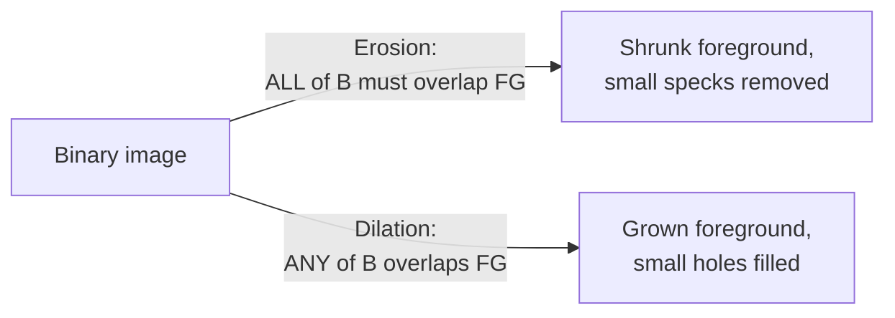

## Learning Objectives

- Define erosion and dilation precisely in terms of a structuring element, and explain why they are dual operations.
- Apply erosion and dilation by hand to a small binary image with a concrete structuring element.
- Explain the real, concrete effect each operation has on a region's boundary and on small isolated regions.

## Context & Motivation

`thresholding-and-otsus-method` and `region-growing-and-connected-component-labeling` both produce binary images: foreground and background, nothing in between. Real thresholded or segmented images are rarely perfectly clean, small isolated noise specks in the background and small unwanted holes in the foreground are a genuine, common artifact. Morphological operations are the classical technique for cleaning this up, but they operate on a different kind of object than every previous concept in this discipline: instead of a numeric kernel, morphology uses a **structuring element**, a small binary shape, and instead of a weighted sum, its rule is a set-membership test.

## Core Theory

### The structuring element

A structuring element is a small binary matrix, most simply a 3x3 square of all 1s, defining a neighborhood shape and an origin (typically its center). Unlike the convolution kernels of `the-convolution-and-correlation-operation`, it carries no weights, only a shape.

### Erosion: shrinking foreground regions

**Erosion** slides the structuring element over the binary image; at each position, the output pixel is set to foreground **only if every position of the structuring element, when centered there, overlaps a foreground pixel in the input**. Equivalently: a foreground pixel survives erosion only if its entire local neighborhood (matching the structuring element's shape) is also foreground. The real, concrete effect: foreground regions shrink from their boundary inward, and any foreground region smaller than the structuring element disappears entirely, exactly the mechanism that removes small noise specks.

```text
erosion(f, B)(x,y) = 1 if, for every (s,t) in B, f(x+s, y+t) = 1
                    = 0 otherwise
```

### Dilation: growing foreground regions

**Dilation** is erosion's dual: the output pixel is set to foreground **if any position of the structuring element, when centered there, overlaps a foreground pixel in the input**. The real, concrete effect: foreground regions grow outward from their boundary, and small holes within a foreground region, smaller than the structuring element, get filled in.

```text
dilation(f, B)(x,y) = 1 if, for some (s,t) in B, f(x+s, y+t) = 1
                     = 0 otherwise
```

Erosion and dilation are duals in a precise sense: eroding the foreground is equivalent to dilating the background and inverting the result, a real, provable relationship, though this discipline uses the two operations directly rather than deriving one purely from the other.



## Worked Examples

### Example 1: erosion on a small binary grid

A 5x5 binary image with a foreground blob and one isolated noise pixel, using a 3x3 all-1s structuring element (origin at center):

```text
Input:
[0 0 0 0 0]
[0 1 1 1 0]
[0 1 1 1 0]
[0 1 1 1 0]
[0 0 1 0 0]   <- isolated speck at (4,2), disconnected below the main blob
```

Checking the center pixel (2,2): its full 3x3 neighborhood is all 1s (rows 1-3, columns 1-3, all foreground), so it survives erosion. Checking pixel (1,1): its 3x3 neighborhood includes (0,0)=0, (0,1)=0, (0,2)=0 (the background row above), so NOT all foreground, it is eroded to 0. Checking the isolated speck at (4,2): its neighborhood includes background on nearly every side, it is eroded to 0. Result:

```text
Eroded output:
[0 0 0 0 0]
[0 0 0 0 0]
[0 0 1 0 0]
[0 0 0 0 0]
[0 0 0 0 0]
```

Only the single interior pixel with a fully foreground 3x3 neighborhood survives; the isolated speck and the entire boundary layer of the main blob are removed, exactly the noise-removal and boundary-shrinking effects Core Theory describes.

### Example 2: dilation on a small binary grid

A 5x5 binary image with a small foreground region containing a 1-pixel hole, using the same 3x3 structuring element:

```text
Input:
[0 0 0 0 0]
[0 1 1 1 0]
[0 1 0 1 0]   <- hole at (2,2)
[0 1 1 1 0]
[0 0 0 0 0]
```

Checking the hole at (2,2): its 3x3 neighborhood includes several foreground pixels (all eight surrounding cells are 1), so under dilation's ANY-overlap rule, it becomes foreground. Checking a background corner, (0,0): its neighborhood (only positions (0,0),(0,1),(1,0),(1,1) exist within bounds) includes (1,1)=1, so it also becomes foreground under dilation, growing the region outward at every boundary pixel, not just filling the interior hole. Result:

```text
Dilated output:
[1 1 1 0 0]
[1 1 1 1 0]
[1 1 1 1 0]
[1 1 1 1 0]
[0 0 0 0 0]
```

The interior hole is filled (correctly), but the entire region has also grown outward along its boundary (an honest side effect of plain dilation used alone, which `morphological-opening-and-closing`'s composed operations address directly, next).

### Example 3: a structuring element too small to remove a larger noise region

Using the same 3x3 structuring element from Example 1, but against a 2x2 noise block instead of a single isolated pixel:

```text
[0 0 0 0]
[0 1 1 0]
[0 1 1 0]
[0 0 0 0]
```

Checking pixel (1,1): its 3x3 neighborhood (rows 0-2, columns 0-2) includes background cells at (0,0),(0,1),(0,2),(1,0),(2,0), not all foreground, so it is eroded to 0. Every pixel in this 2x2 block similarly fails the ALL-overlap test (each is adjacent to at least one background cell in its 3x3 neighborhood), so the entire 2x2 block is removed, same as the single speck in Example 1. This confirms the general rule stated in Core Theory: any foreground region smaller than the structuring element's own extent is removed entirely by erosion, not just single-pixel specks.

## Common Misconceptions & Pitfalls

- **"Erosion and dilation are just different amounts of the same shrink/grow effect, and either could substitute for the other."** They are genuinely dual, opposite operations: erosion strictly shrinks foreground and can only remove information (a removed speck cannot be recovered by eroding further), while dilation strictly grows it and can only add information; neither undoes the other's specific effect, which is exactly why `morphological-opening-and-closing` composes both, in a specific order, rather than using either alone.
- **"Dilation is a 'clean' way to fill small holes with no other effect."** Example 2 shows dilation used alone also grows the entire region's outer boundary, not just its interior holes, a real, honest side effect any pipeline using plain dilation for hole-filling must account for.
- **"The structuring element's size doesn't matter much, as long as it is 'small.'** Example 3 shows the structuring element's size directly determines which noise regions get removed by erosion; a region as large as or larger than the structuring element survives, a real, size-dependent threshold, not an arbitrary detail.

## Summary

Erosion and dilation are the two fundamental, dual morphological operations on a binary image, using a structuring element instead of a numeric kernel: erosion keeps a pixel only if its entire neighborhood is foreground (shrinking regions, removing small noise), and dilation sets a pixel to foreground if any part of its neighborhood is foreground (growing regions, filling small holes), each with a real, honest side effect (boundary erosion, boundary growth) alongside its intended cleanup. `morphological-opening-and-closing`, next, shows how composing the two in a specific order achieves noise removal or hole filling without that unwanted side effect.

## Documentation Links

- [Gonzalez and Woods: Digital Image Processing, 4th Edition (Pearson, 2018)](https://www.pearson.com/en-us/subject-catalog/p/Gonzalez-Digital-Image-Processing-4th-Edition/P200000003224?view=educator): the source for this concept's formal definitions of erosion, dilation, and the structuring element.
