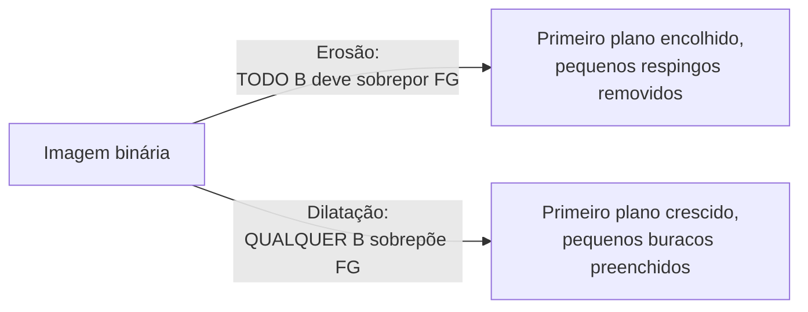

## Objetivos de Aprendizagem

- Definir erosão e dilatação precisamente em termos de um elemento estruturante, e explicar por que elas são operações duais.
- Aplicar erosão e dilatação à mão a uma pequena imagem binária com um elemento estruturante concreto.
- Explicar o efeito real e concreto que cada operação tem sobre a borda de uma região e sobre pequenas regiões isoladas.

## Contexto e Motivação

`thresholding-and-otsus-method` e `region-growing-and-connected-component-labeling` ambos produzem imagens binárias: primeiro plano e fundo, nada no meio. Imagens limiarizadas ou segmentadas reais raramente são perfeitamente limpas, pequenos respingos de ruído isolados no fundo e pequenos buracos indesejados no primeiro plano são um artefato genuíno e comum. As operações morfológicas são a técnica clássica para limpar isto, mas elas operam sobre um tipo de objeto diferente de todo conceito anterior nesta disciplina: em vez de um kernel numérico, a morfologia usa um **elemento estruturante**, um pequeno formato binário, e em vez de uma soma ponderada, a sua regra é um teste de pertinência a conjunto.

## Teoria Central

### O elemento estruturante

Um elemento estruturante é uma pequena matriz binária, mais simplesmente um quadrado 3x3 de todos 1s, definindo um formato de vizinhança e uma origem (tipicamente o seu centro). Ao contrário dos kernels de convolução de `the-convolution-and-correlation-operation`, ele não carrega pesos, só um formato.

### Erosão: encolhendo regiões de primeiro plano

A **erosão** desliza o elemento estruturante sobre a imagem binária; em cada posição, o pixel de saída é definido como primeiro plano **só se toda posição do elemento estruturante, quando centrada ali, sobrepuser um pixel de primeiro plano na entrada**. Equivalentemente: um pixel de primeiro plano sobrevive à erosão só se toda a sua vizinhança local (correspondendo ao formato do elemento estruturante) também for primeiro plano. O efeito real e concreto: as regiões de primeiro plano encolhem da sua borda para dentro, e qualquer região de primeiro plano menor que o elemento estruturante desaparece inteiramente, exatamente o mecanismo que remove pequenos respingos de ruído.

```text
erosao(f, B)(x,y) = 1 se, para todo (s,t) em B, f(x+s, y+t) = 1
                   = 0 caso contrário
```

### Dilatação: crescendo regiões de primeiro plano

A **dilatação** é a dual da erosão: o pixel de saída é definido como primeiro plano **se qualquer posição do elemento estruturante, quando centrada ali, sobrepuser um pixel de primeiro plano na entrada**. O efeito real e concreto: as regiões de primeiro plano crescem para fora da sua borda, e pequenos buracos dentro de uma região de primeiro plano, menores que o elemento estruturante, são preenchidos.

```text
dilatacao(f, B)(x,y) = 1 se, para algum (s,t) em B, f(x+s, y+t) = 1
                      = 0 caso contrário
```

A erosão e a dilatação são duais num sentido preciso: erodir o primeiro plano é equivalente a dilatar o fundo e inverter o resultado, uma relação real e demonstrável, embora esta disciplina use as duas operações diretamente em vez de derivar uma puramente da outra.



## Exemplos Resolvidos

### Exemplo 1: erosão numa pequena grade binária

Uma imagem binária de 5x5 com um blob de primeiro plano e um pixel de ruído isolado, usando um elemento estruturante 3x3 de todos 1s (origem no centro):

```text
Entrada:
[0 0 0 0 0]
[0 1 1 1 0]
[0 1 1 1 0]
[0 1 1 1 0]
[0 0 1 0 0]   <- respingo isolado em (4,2), desconectado abaixo do blob principal
```

Checando o pixel central (2,2): a sua vizinhança 3x3 completa é toda 1s (linhas 1-3, colunas 1-3, todas primeiro plano), então ele sobrevive à erosão. Checando o pixel (1,1): a sua vizinhança 3x3 inclui (0,0)=0, (0,1)=0, (0,2)=0 (a linha de fundo acima), então NÃO toda primeiro plano, ele é erodido para 0. Checando o respingo isolado em (4,2): a sua vizinhança inclui fundo em quase todo lado, ele é erodido para 0. Resultado:

```text
Saída erodida:
[0 0 0 0 0]
[0 0 0 0 0]
[0 0 1 0 0]
[0 0 0 0 0]
[0 0 0 0 0]
```

Só o único pixel interior com uma vizinhança 3x3 totalmente de primeiro plano sobrevive; o respingo isolado e toda a camada de borda do blob principal são removidos, exatamente os efeitos de remoção de ruído e encolhimento de borda que a Teoria Central descreve.

### Exemplo 2: dilatação numa pequena grade binária

Uma imagem binária de 5x5 com uma pequena região de primeiro plano contendo um buraco de 1 pixel, usando o mesmo elemento estruturante 3x3:

```text
Entrada:
[0 0 0 0 0]
[0 1 1 1 0]
[0 1 0 1 0]   <- buraco em (2,2)
[0 1 1 1 0]
[0 0 0 0 0]
```

Checando o buraco em (2,2): a sua vizinhança 3x3 inclui vários pixels de primeiro plano (todas as oito células circundantes são 1), então sob a regra de QUALQUER-sobreposição da dilatação, ele se torna primeiro plano. Checando um canto de fundo, (0,0): a sua vizinhança (só as posições (0,0),(0,1),(1,0),(1,1) existem dentro dos limites) inclui (1,1)=1, então ele também se torna primeiro plano sob a dilatação, crescendo a região para fora em todo pixel de borda, não só preenchendo o buraco interior. Resultado:

```text
Saída dilatada:
[1 1 1 0 0]
[1 1 1 1 0]
[1 1 1 1 0]
[1 1 1 1 0]
[0 0 0 0 0]
```

O buraco interior é preenchido (corretamente), mas a região inteira também cresceu para fora ao longo da sua borda (um efeito colateral honesto da dilatação simples usada sozinha, que as operações compostas de `morphological-opening-and-closing` abordam diretamente, em seguida).

### Exemplo 3: um elemento estruturante pequeno demais para remover uma região de ruído maior

Usando o mesmo elemento estruturante 3x3 do Exemplo 1, mas contra um bloco de ruído 2x2 em vez de um único pixel isolado:

```text
[0 0 0 0]
[0 1 1 0]
[0 1 1 0]
[0 0 0 0]
```

Checando o pixel (1,1): a sua vizinhança 3x3 (linhas 0-2, colunas 0-2) inclui células de fundo em (0,0),(0,1),(0,2),(1,0),(2,0), não toda primeiro plano, então ele é erodido para 0. Todo pixel neste bloco 2x2 similarmente falha no teste de TODA-sobreposição (cada um é adjacente a pelo menos uma célula de fundo na sua vizinhança 3x3), então o bloco 2x2 inteiro é removido, igual ao único respingo no Exemplo 1. Isto confirma a regra geral enunciada na Teoria Central: qualquer região de primeiro plano menor que a própria extensão do elemento estruturante é removida inteiramente pela erosão, não só respingos de pixel único.

## Equívocos Comuns e Armadilhas

- **"Erosão e dilatação são só quantidades diferentes do mesmo efeito de encolher/crescer, e qualquer uma poderia substituir a outra."** Elas são genuinamente operações duais e opostas: a erosão estritamente encolhe o primeiro plano e só pode remover informação (um respingo removido não pode ser recuperado erodindo mais), enquanto a dilatação estritamente o cresce e só pode adicionar informação; nenhuma desfaz o efeito específico da outra, que é exatamente por que `morphological-opening-and-closing` compõe ambas, numa ordem específica, em vez de usar qualquer uma sozinha.
- **"A dilatação é uma forma 'limpa' de preencher pequenos buracos sem nenhum outro efeito."** O Exemplo 2 mostra que a dilatação usada sozinha também cresce a borda externa inteira da região, não só os seus buracos interiores, um efeito colateral real e honesto que qualquer pipeline usando dilatação simples para preenchimento de buracos tem de considerar.
- **"O tamanho do elemento estruturante não importa muito, desde que seja 'pequeno'."** O Exemplo 3 mostra que o tamanho do elemento estruturante determina diretamente quais regiões de ruído são removidas pela erosão; uma região tão grande quanto ou maior que o elemento estruturante sobrevive, um limiar real e dependente de tamanho, não um detalhe arbitrário.

## Resumo

Erosão e dilatação são as duas operações morfológicas fundamentais e duais sobre uma imagem binária, usando um elemento estruturante em vez de um kernel numérico: a erosão mantém um pixel só se toda a sua vizinhança for primeiro plano (encolhendo regiões, removendo pequeno ruído), e a dilatação define um pixel como primeiro plano se qualquer parte da sua vizinhança for primeiro plano (crescendo regiões, preenchendo pequenos buracos), cada uma com um efeito colateral real e honesto (erosão de borda, crescimento de borda) ao lado da sua limpeza pretendida. `morphological-opening-and-closing`, em seguida, mostra como compor as duas numa ordem específica alcança a remoção de ruído ou o preenchimento de buracos sem esse efeito colateral indesejado.

## Documentation Links

- [Gonzalez and Woods: Digital Image Processing, 4th Edition (Pearson, 2018)](https://www.pearson.com/en-us/subject-catalog/p/Gonzalez-Digital-Image-Processing-4th-Edition/P200000003224?view=educator): a fonte para as definições formais deste conceito de erosão, dilatação e o elemento estruturante.
