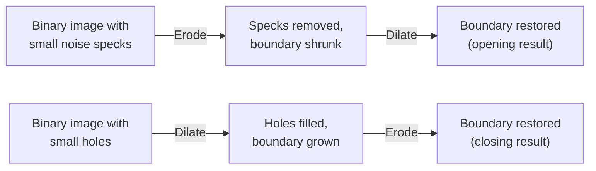

## Learning Objectives

- Define opening (erosion then dilation) and closing (dilation then erosion) precisely, using the same structuring element for both steps.
- Trace opening and closing by hand on small binary grids, showing why the composed operation avoids the boundary side effect a single erosion or dilation leaves behind.
- Choose, for a given cleanup goal (removing small noise specks versus filling small holes), which of opening or closing applies.

## Context & Motivation

`morphological-erosion-and-dilation` proved both primitives leave an honest, unwanted side effect when used alone: erosion removes noise specks but also shrinks every real region's boundary; dilation fills small holes but also grows every real region's boundary outward. This concept shows the real, standard fix: composing the two operations, in a specific order, with the *same* structuring element, cancels the unwanted boundary shift while keeping the intended cleanup effect.

## Core Theory

### Opening: erosion, then dilation

**Opening** applies erosion first, then dilation, both with the same structuring element B:

```text
opening(f, B) = dilation(erosion(f, B), B)
```

The erosion pass removes any foreground region smaller than B entirely (exactly `morphological-erosion-and-dilation`'s Example 1 and Example 3), and shrinks every surviving region's boundary inward. The dilation pass then grows every surviving region's boundary back outward by the same amount, restoring its original size, but a once-erased small speck, having been fully removed by the erosion pass, has nothing left to dilate back, so it stays gone. The net, real effect: small noise specks are removed, and larger regions are approximately restored to their original size and shape.

### Closing: dilation, then erosion

**Closing** applies the operations in the opposite order:

```text
closing(f, B) = erosion(dilation(f, B), B)
```

The dilation pass fills small holes and connects small nearby gaps (exactly `morphological-erosion-and-dilation`'s Example 2), growing every region's boundary outward. The erosion pass then shrinks every region's boundary back inward by the same amount, restoring approximate original size, but a hole that was fully filled by the dilation pass has no background left inside the region for the erosion pass to reintroduce, so it stays filled. The net, real effect: small holes are filled, and larger regions are approximately restored to their original size and shape.



## Worked Examples

### Example 1: opening removes a noise speck without shrinking the main region

Reusing `morphological-erosion-and-dilation`'s Example 1 input (a 3x3 solid blob plus an isolated speck), with the same 3x3 structuring element:

```text
Input:
[0 0 0 0 0]
[0 1 1 1 0]
[0 1 1 1 0]
[0 1 1 1 0]
[0 0 1 0 0]
```

Erosion pass (from that concept's Example 1) leaves only the single interior pixel (2,2). Dilation pass, applied now to that single surviving pixel with the 3x3 structuring element, grows it back into a 3x3 block centered at (2,2):

```text
Opening result:
[0 0 0 0 0]
[0 1 1 1 0]
[0 1 1 1 0]
[0 1 1 1 0]
[0 0 0 0 0]
```

Compare this to plain erosion alone (Example 1 of the previous concept), which left only a single pixel: opening restores the main blob to nearly its full original 3x3 extent while the isolated speck, having been completely erased by the erosion pass, does not reappear. This is the exact, concrete demonstration of opening's dual benefit: real noise removed, real regions preserved.

### Example 2: closing fills a hole without growing the region's outer boundary

Reusing `morphological-erosion-and-dilation`'s Example 2 input (a ring with a 1-pixel interior hole), with the same 3x3 structuring element:

```text
Input:
[0 0 0 0 0]
[0 1 1 1 0]
[0 1 0 1 0]
[0 1 1 1 0]
[0 0 0 0 0]
```

Dilation pass (from that concept's Example 2) fills the hole but also grows the boundary outward into the corners. Erosion pass, applied now to that grown result, shrinks the boundary back inward: checking each grown boundary pixel, most fail the ALL-foreground 3x3 test (their neighborhoods still include background just outside the original boundary) and are eroded away, while the filled interior pixel at (2,2), now surrounded entirely by foreground on all sides, survives:

```text
Closing result:
[0 0 0 0 0]
[0 1 1 1 0]
[0 1 1 1 0]
[0 1 1 1 0]
[0 0 0 0 0]
```

The interior hole stays filled, and the outer boundary is restored close to its original extent, in contrast to plain dilation alone (the previous concept's Example 2), which left the boundary permanently grown.

### Example 3: choosing opening versus closing for two different real defects

A segmented binary image has two separate defects: a scattering of small isolated 1-pixel noise specks in the background, and several small 1-pixel holes inside otherwise solid foreground regions. Applying opening alone removes the specks (as in Example 1) but does nothing for the interior holes, since opening's erosion-first order only ever shrinks foreground, it can remove small foreground specks but cannot fill a background-colored hole inside foreground. Applying closing alone fills the holes (as in Example 2) but does nothing for the background specks, since closing's dilation-first order only ever grows foreground, it can fill small holes but a background speck simply is not part of any foreground region for it to shrink away. A real pipeline facing both defects genuinely needs both operations in sequence (commonly opening followed by closing, or vice versa), confirming honestly that neither operation alone is a universal cleanup step.

## Common Misconceptions & Pitfalls

- **"Opening and closing are the same operation, just with different names for symmetry."** Example 1 and Example 2 show they solve genuinely different, opposite defects (removing foreground specks versus filling background holes), because the order of erosion and dilation determines which class of small feature gets permanently erased in the first pass and cannot be recovered in the second.
- **"Since opening or closing both roughly restore the original region size, you can apply either one repeatedly with no further effect."** Applying opening (or closing) a second time to its own output is idempotent for that specific operation, a real property, but it does not mean opening alone will ever fix a defect closing addresses, or vice versa, exactly Example 3's point.
- **"The structuring element used for the erosion and dilation passes can be different sizes, as long as both are 'small.'** Both Core Theory's formulas and this concept's worked examples use the identical structuring element for both passes; using a different size for each pass breaks the boundary-cancellation property that makes opening and closing work as intended, an implementation detail worth getting right.

## Summary

Opening (erode then dilate) removes small foreground noise specks while approximately preserving larger regions' size; closing (dilate then erode) fills small background holes while approximately preserving larger regions' size; both achieve this by having the same structuring element's second pass cancel the first pass's boundary shift, while a fully erased speck or fully filled hole has nothing left to reverse. With segmentation and morphological cleanup both covered, this discipline turns next to a genuinely different lens on the same image data: the frequency domain, starting with `the-2d-discrete-fourier-transform-and-the-frequency-domain`.

## Documentation Links

- [Gonzalez and Woods: Digital Image Processing, 4th Edition (Pearson, 2018)](https://www.pearson.com/en-us/subject-catalog/p/Gonzalez-Digital-Image-Processing-4th-Edition/P200000003224?view=educator): the source for this concept's formal definitions of opening and closing as compositions of erosion and dilation.
