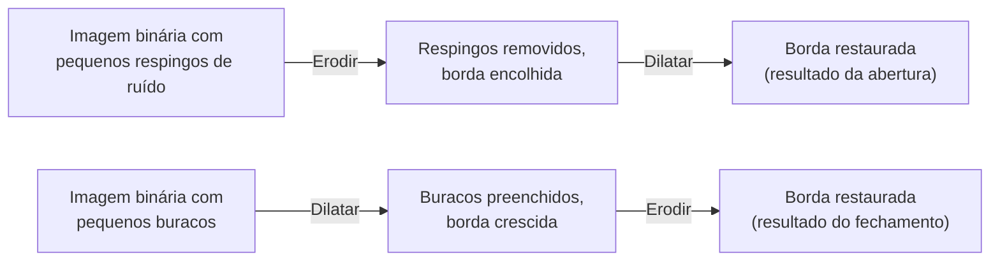

## Objetivos de Aprendizagem

- Definir abertura (erosão depois dilatação) e fechamento (dilatação depois erosão) precisamente, usando o mesmo elemento estruturante para ambos os passos.
- Traçar abertura e fechamento à mão em pequenas grades binárias, mostrando por que a operação composta evita o efeito colateral de borda que uma única erosão ou dilatação deixa para trás.
- Escolher, para um dado objetivo de limpeza (remover pequenos respingos de ruído versus preencher pequenos buracos), qual de abertura ou fechamento se aplica.

## Contexto e Motivação

`morphological-erosion-and-dilation` provou que ambos os primitivos deixam um efeito colateral honesto e indesejado quando usados sozinhos: a erosão remove respingos de ruído mas também encolhe a borda de toda região real; a dilatação preenche pequenos buracos mas também cresce a borda de toda região real para fora. Este conceito mostra a correção real e padrão: compor as duas operações, numa ordem específica, com o *mesmo* elemento estruturante, cancela o deslocamento de borda indesejado enquanto mantém o efeito de limpeza pretendido.

## Teoria Central

### Abertura: erosão, depois dilatação

A **abertura** aplica a erosão primeiro, depois a dilatação, ambas com o mesmo elemento estruturante B:

```text
abertura(f, B) = dilatacao(erosao(f, B), B)
```

A passada de erosão remove qualquer região de primeiro plano menor que B inteiramente (exatamente o Exemplo 1 e o Exemplo 3 de `morphological-erosion-and-dilation`), e encolhe a borda de toda região sobrevivente para dentro. A passada de dilatação então cresce a borda de toda região sobrevivente de volta para fora na mesma quantidade, restaurando o seu tamanho original, mas um pequeno respingo já apagado, tendo sido completamente removido pela passada de erosão, não tem nada sobrado para dilatar de volta, então ele permanece ido. O efeito líquido e real: pequenos respingos de ruído são removidos, e regiões maiores são aproximadamente restauradas ao seu tamanho e formato originais.

### Fechamento: dilatação, depois erosão

O **fechamento** aplica as operações na ordem oposta:

```text
fechamento(f, B) = erosao(dilatacao(f, B), B)
```

A passada de dilatação preenche pequenos buracos e conecta pequenas lacunas próximas (exatamente o Exemplo 2 de `morphological-erosion-and-dilation`), crescendo a borda de toda região para fora. A passada de erosão então encolhe a borda de toda região de volta para dentro na mesma quantidade, restaurando o tamanho original aproximado, mas um buraco que foi completamente preenchido pela passada de dilatação não tem nenhum fundo sobrado dentro da região para a passada de erosão reintroduzir, então ele permanece preenchido. O efeito líquido e real: pequenos buracos são preenchidos, e regiões maiores são aproximadamente restauradas ao seu tamanho e formato originais.



## Exemplos Resolvidos

### Exemplo 1: a abertura remove um respingo de ruído sem encolher a região principal

Reusando a entrada do Exemplo 1 de `morphological-erosion-and-dilation` (um blob sólido 3x3 mais um respingo isolado), com o mesmo elemento estruturante 3x3:

```text
Entrada:
[0 0 0 0 0]
[0 1 1 1 0]
[0 1 1 1 0]
[0 1 1 1 0]
[0 0 1 0 0]
```

A passada de erosão (do Exemplo 1 daquele conceito) deixa só o único pixel interior (2,2). A passada de dilatação, aplicada agora a esse único pixel sobrevivente com o elemento estruturante 3x3, o cresce de volta num bloco 3x3 centrado em (2,2):

```text
Resultado da abertura:
[0 0 0 0 0]
[0 1 1 1 0]
[0 1 1 1 0]
[0 1 1 1 0]
[0 0 0 0 0]
```

Compare isto com a erosão simples sozinha (Exemplo 1 do conceito anterior), que deixou só um único pixel: a abertura restaura o blob principal a quase toda a sua extensão 3x3 original enquanto o respingo isolado, tendo sido completamente apagado pela passada de erosão, não reaparece. Esta é a demonstração exata e concreta do benefício duplo da abertura: ruído real removido, regiões reais preservadas.

### Exemplo 2: o fechamento preenche um buraco sem crescer a borda externa da região

Reusando a entrada do Exemplo 2 de `morphological-erosion-and-dilation` (um anel com um buraco interior de 1 pixel), com o mesmo elemento estruturante 3x3:

```text
Entrada:
[0 0 0 0 0]
[0 1 1 1 0]
[0 1 0 1 0]
[0 1 1 1 0]
[0 0 0 0 0]
```

A passada de dilatação (do Exemplo 2 daquele conceito) preenche o buraco mas também cresce a borda para fora nos cantos. A passada de erosão, aplicada agora a esse resultado crescido, encolhe a borda de volta para dentro: checando cada pixel de borda crescido, a maioria falha no teste 3x3 de TODO-primeiro-plano (as suas vizinhanças ainda incluem fundo logo fora da borda original) e são erodidos, enquanto o pixel interior preenchido em (2,2), agora circundado inteiramente por primeiro plano em todos os lados, sobrevive:

```text
Resultado do fechamento:
[0 0 0 0 0]
[0 1 1 1 0]
[0 1 1 1 0]
[0 1 1 1 0]
[0 0 0 0 0]
```

O buraco interior permanece preenchido, e a borda externa é restaurada perto da sua extensão original, em contraste com a dilatação simples sozinha (o Exemplo 2 do conceito anterior), que deixou a borda permanentemente crescida.

### Exemplo 3: escolhendo abertura versus fechamento para dois defeitos reais diferentes

Uma imagem binária segmentada tem dois defeitos separados: um espalhamento de pequenos respingos de ruído isolados de 1 pixel no fundo, e vários pequenos buracos de 1 pixel dentro de regiões de primeiro plano de outra forma sólidas. Aplicar a abertura sozinha remove os respingos (como no Exemplo 1) mas não faz nada pelos buracos interiores, já que a ordem de erosão-primeiro da abertura só encolhe o primeiro plano, ela pode remover pequenos respingos de primeiro plano mas não pode preencher um buraco de cor de fundo dentro do primeiro plano. Aplicar o fechamento sozinho preenche os buracos (como no Exemplo 2) mas não faz nada pelos respingos de fundo, já que a ordem de dilatação-primeiro do fechamento só cresce o primeiro plano, ele pode preencher pequenos buracos mas um respingo de fundo simplesmente não é parte de nenhuma região de primeiro plano para ele encolher. Um pipeline real enfrentando ambos os defeitos genuinamente precisa de ambas as operações em sequência (comumente abertura seguida de fechamento, ou vice-versa), confirmando honestamente que nenhuma operação sozinha é um passo de limpeza universal.

## Equívocos Comuns e Armadilhas

- **"Abertura e fechamento são a mesma operação, só com nomes diferentes por simetria."** O Exemplo 1 e o Exemplo 2 mostram que elas resolvem defeitos genuinamente diferentes e opostos (remover respingos de primeiro plano versus preencher buracos de fundo), porque a ordem de erosão e dilatação determina qual classe de pequena característica é permanentemente apagada na primeira passada e não pode ser recuperada na segunda.
- **"Já que a abertura ou o fechamento ambos restauram aproximadamente o tamanho original da região, você pode aplicar qualquer uma repetidamente sem efeito adicional."** Aplicar a abertura (ou o fechamento) uma segunda vez à sua própria saída é idempotente para essa operação específica, uma propriedade real, mas isso não significa que a abertura sozinha jamais corrigirá um defeito que o fechamento aborda, ou vice-versa, exatamente o ponto do Exemplo 3.
- **"O elemento estruturante usado para as passadas de erosão e dilatação pode ter tamanhos diferentes, desde que ambos sejam 'pequenos'."** Tanto as fórmulas da Teoria Central quanto os exemplos resolvidos deste conceito usam o elemento estruturante idêntico para ambas as passadas; usar um tamanho diferente para cada passada quebra a propriedade de cancelamento de borda que faz a abertura e o fechamento funcionarem como pretendido, um detalhe de implementação que vale a pena acertar.

## Resumo

A abertura (erodir depois dilatar) remove pequenos respingos de ruído de primeiro plano enquanto preserva aproximadamente o tamanho de regiões maiores; o fechamento (dilatar depois erodir) preenche pequenos buracos de fundo enquanto preserva aproximadamente o tamanho de regiões maiores; ambos alcançam isto fazendo a segunda passada do mesmo elemento estruturante cancelar o deslocamento de borda da primeira passada, enquanto um respingo completamente apagado ou um buraco completamente preenchido não tem nada sobrado para reverter. Com a segmentação e a limpeza morfológica ambas cobertas, esta disciplina se volta em seguida para uma lente genuinamente diferente sobre os mesmos dados de imagem: o domínio da frequência, começando com `the-2d-discrete-fourier-transform-and-the-frequency-domain`.

## Documentation Links

- [Gonzalez and Woods: Digital Image Processing, 4th Edition (Pearson, 2018)](https://www.pearson.com/en-us/subject-catalog/p/Gonzalez-Digital-Image-Processing-4th-Edition/P200000003224?view=educator): a fonte para as definições formais deste conceito de abertura e fechamento como composições de erosão e dilatação.
