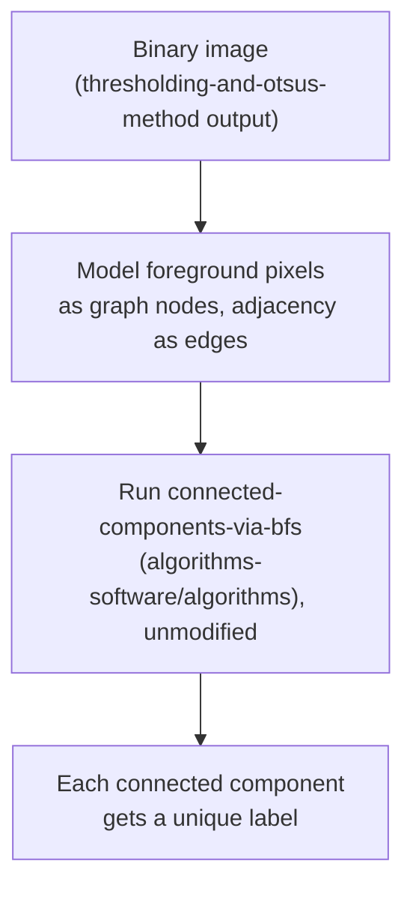

## Learning Objectives

- Trace the region-growing algorithm by hand from a seed pixel, using an intensity-similarity tolerance.
- Explain precisely why connected-component labeling on a binary image is the same problem `connected-components-via-bfs` (`algorithms-software/algorithms`) already solved, applied to a pixel grid instead of an abstract graph.
- Label the connected components of a small binary image by hand, using 4-neighbor adjacency.

## Context & Motivation

`thresholding-and-otsus-method` produces a binary image, but, as that concept states honestly in its own Common Misconceptions, thresholding alone has no notion of spatial connectivity: two disconnected bright blobs with identical intensity are indistinguishable to a threshold rule. This concept fills exactly that gap with two real, classical, region-based techniques: region growing, which builds a region directly from a seed pixel using intensity similarity, and connected-component labeling, which partitions an already-thresholded binary image into its separate spatially connected regions.

The second technique is a genuine, direct reuse, not a new algorithm: `connected-components-via-bfs` (`algorithms-software/algorithms`, published) already proves breadth-first search finds every connected component of an arbitrary graph in O(V+E). A pixel grid is a graph, each pixel a node, each 4- or 8-neighbor pair an edge, so that proof and that algorithm apply here without modification. This concept's job is showing the mapping precisely, not re-deriving BFS's correctness.

## Core Theory

### Region growing: intensity similarity from a seed

Given one or more seed pixels, region growing repeatedly examines each unassigned pixel adjacent to the current region and adds it to the region if its intensity is within a chosen tolerance of the region's current mean (or of the seed's original intensity, depending on the variant), continuing until no adjacent pixel qualifies. The result depends on both seed choice and tolerance: a seed placed in a genuinely different region, or a tolerance set too high, both produce a real, honest failure mode, region growing "leaking" across a true boundary into a neighboring, visually distinct region.

### Connected-component labeling as pixel-grid BFS

Given a binary image (exactly `thresholding-and-otsus-method`'s output), connected-component labeling assigns every foreground pixel a label such that two foreground pixels share a label if and only if a path of foreground pixels connects them, using **4-neighbor** (up/down/left/right) or **8-neighbor** (also diagonals) adjacency. This is precisely a graph connectivity problem: model each foreground pixel as a node, each adjacency between two foreground pixels as an edge, and connected components of this graph are exactly `connected-components-via-bfs`'s own definition, reused directly. That concept's algorithm, running BFS from an unvisited node and marking every node it reaches with the current label, then repeating from the next unvisited node, applies to the pixel grid with zero modification beyond defining pixel adjacency as the edge relation.



## Worked Examples

### Example 1: region growing on a small intensity image

An image with intensities:

```text
[ 50  52  90]
[ 48  95  92]
[ 91  93  55]
```

Starting region growing from seed pixel (0,0), intensity 50, tolerance +/-5: neighbor (0,1)=52 is within tolerance, added; neighbor (1,0)=48 is within tolerance, added. Neighbor (1,1)=95 is far outside tolerance, rejected. The region so far, {(0,0),(0,1),(1,0)}, has mean intensity (50+52+48)/3 = 50, and no further unassigned neighbor of this region falls within tolerance (all remaining neighbors are in the 90s), so growth stops with a 3-pixel region cleanly separated from the brighter cluster of five pixels in the 90s, correctly identifying two visually distinct intensity regions.

### Example 2: 4-connected component labeling on a binary grid

A binary image (1 = foreground):

```text
[1 1 0 0]
[1 0 0 1]
[0 0 1 1]
[0 0 0 1]
```

Running BFS-based labeling with 4-neighbor adjacency, starting from the first unvisited foreground pixel (0,0):

```text
BFS from (0,0): visits (0,0) -> (0,1) [right neighbor, foreground]
  -> (1,0) [down neighbor, foreground]. Neither (0,1) nor (1,0) has
  further unvisited foreground 4-neighbors. Component 1 = {(0,0),(0,1),(1,0)}.

Next unvisited foreground pixel: (1,3). BFS from (1,3): visits (1,3)
  -> (2,3) [down] -> (2,2) [left of (2,3)] -> (3,3) [down from (2,3)].
  Component 2 = {(1,3),(2,2),(2,3),(3,3)}.
```

Result: two connected components, sizes 3 and 4, exactly the output `connected-components-via-bfs`'s algorithm guarantees, applied here with pixel adjacency as the edge relation.

### Example 3: why 4-connectivity and 8-connectivity can disagree

The same binary image from Example 2, but checking whether (0,1) and (1,3)'s components would merge under 8-connectivity (which also counts diagonal neighbors): (0,1) at row 0, column 1 and its diagonal neighbors are (1,0) and (1,2). (1,2) is background (0), so no new connection forms there specifically, but consider a different small case:

```text
[1 0]
[0 1]
```

Under 4-connectivity, these two foreground pixels are NOT adjacent (they only touch diagonally) and form two separate components. Under 8-connectivity, they ARE adjacent and form a single component. This is a real, consequential choice an implementation must make explicit before running the algorithm, not an inconsequential detail: the same binary image can produce a different number of components depending on which adjacency rule is used.

## Common Misconceptions & Pitfalls

- **"Region growing and connected-component labeling are the same algorithm."** Region growing decides *which* pixels belong to a region using an intensity-similarity rule on a grayscale image; connected-component labeling assumes that decision is already made (a binary image) and only groups already-foreground pixels by spatial connectivity. They solve different, complementary problems, often used in sequence, as `region-growing-and-connected-component-labeling`'s own title reflects.
- **"Connected-component labeling on pixels needs its own specialized algorithm, distinct from general graph BFS."** Example 2 shows the pixel-grid case is a direct, unmodified application of `connected-components-via-bfs`'s own algorithm; the only image-specific choice is the adjacency definition (4- or 8-connected), not the traversal algorithm itself.
- **"4-connectivity and 8-connectivity always give the same component count."** Example 3 shows a minimal, concrete case where they genuinely disagree; this is a real implementation decision with a real effect on the result, not a detail safe to ignore.

## Summary

Region growing builds a region directly from a seed pixel by intensity similarity, filling the connectivity gap `thresholding-and-otsus-method` left open, and connected-component labeling partitions an already-binary image into its separate connected regions using exactly the graph-connectivity algorithm `connected-components-via-bfs` (`algorithms-software/algorithms`) already proved, reused here with pixel adjacency as the edge relation rather than re-derived. The labeled or thresholded regions this concept produces are exactly the binary images `morphological-erosion-and-dilation`, next, cleans up.

## Documentation Links

- [Gonzalez and Woods: Digital Image Processing, 4th Edition (Pearson, 2018)](https://www.pearson.com/en-us/subject-catalog/p/Gonzalez-Digital-Image-Processing-4th-Edition/P200000003224?view=educator): the source for this concept's region-growing algorithm and connected-component labeling definitions, including the 4- versus 8-connectivity distinction.
