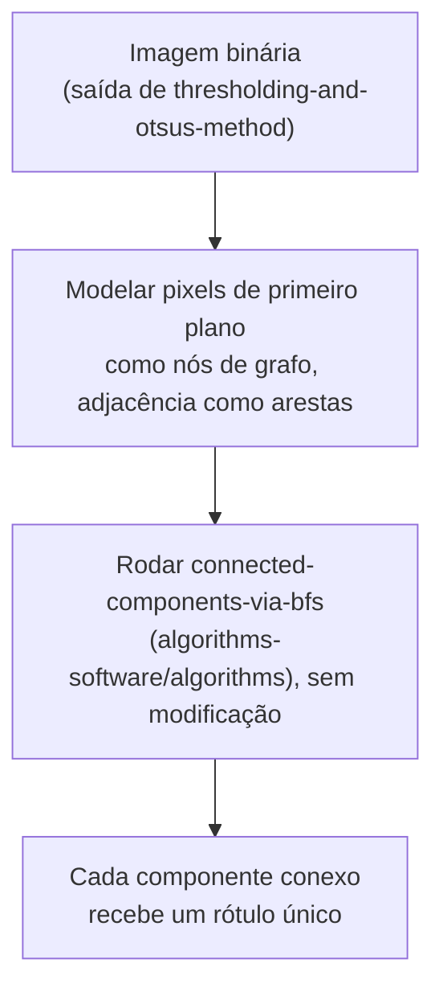

## Objetivos de Aprendizagem

- Traçar o algoritmo de crescimento de regiões à mão a partir de um pixel semente, usando uma tolerância de similaridade de intensidade.
- Explicar precisamente por que a rotulação de componentes conexos numa imagem binária é o mesmo problema que `connected-components-via-bfs` (`algorithms-software/algorithms`) já resolveu, aplicado a uma grade de pixels em vez de um grafo abstrato.
- Rotular os componentes conexos de uma pequena imagem binária à mão, usando adjacência de 4 vizinhos.

## Contexto e Motivação

`thresholding-and-otsus-method` produz uma imagem binária, mas, como aquele conceito enuncia honestamente nos seus próprios Equívocos Comuns, a limiarização sozinha não tem nenhuma noção de conectividade espacial: dois blobs brilhantes desconexos com intensidade idêntica são indistinguíveis para uma regra de limiar. Este conceito preenche exatamente essa lacuna com duas técnicas reais, clássicas e baseadas em região: o crescimento de regiões, que constrói uma região diretamente de um pixel semente usando similaridade de intensidade, e a rotulação de componentes conexos, que particiona uma imagem binária já limiarizada nas suas regiões espacialmente conexas separadas.

A segunda técnica é um reúso genuíno e direto, não um novo algoritmo: `connected-components-via-bfs` (`algorithms-software/algorithms`, publicado) já prova que a busca em largura encontra todo componente conexo de um grafo arbitrário em O(V+E). Uma grade de pixels é um grafo, cada pixel um nó, cada par de 4 ou 8 vizinhos uma aresta, então essa prova e esse algoritmo se aplicam aqui sem modificação. O trabalho deste conceito é mostrar o mapeamento precisamente, não re-derivar a corretude do BFS.

## Teoria Central

### Crescimento de regiões: similaridade de intensidade a partir de uma semente

Dados um ou mais pixels semente, o crescimento de regiões repetidamente examina cada pixel não atribuído adjacente à região atual e o adiciona à região se a sua intensidade estiver dentro de uma tolerância escolhida da média atual da região (ou da intensidade original da semente, dependendo da variante), continuando até nenhum pixel adjacente qualificar. O resultado depende tanto da escolha da semente quanto da tolerância: uma semente colocada numa região genuinamente diferente, ou uma tolerância definida alta demais, ambas produzem um modo de falha real e honesto, o crescimento de regiões "vazando" através de uma borda verdadeira para uma região vizinha e visualmente distinta.

### Rotulação de componentes conexos como BFS de grade de pixels

Dada uma imagem binária (exatamente a saída de `thresholding-and-otsus-method`), a rotulação de componentes conexos atribui a todo pixel de primeiro plano um rótulo tal que dois pixels de primeiro plano compartilham um rótulo se e somente se um caminho de pixels de primeiro plano os conecta, usando adjacência de **4 vizinhos** (cima/baixo/esquerda/direita) ou de **8 vizinhos** (também as diagonais). Isto é precisamente um problema de conectividade de grafo: modele cada pixel de primeiro plano como um nó, cada adjacência entre dois pixels de primeiro plano como uma aresta, e os componentes conexos deste grafo são exatamente a própria definição de `connected-components-via-bfs`, reusada diretamente. O algoritmo daquele conceito, rodando BFS a partir de um nó não visitado e marcando todo nó que ele alcança com o rótulo atual, depois repetindo do próximo nó não visitado, se aplica à grade de pixels com zero modificação além de definir a adjacência de pixels como a relação de aresta.



## Exemplos Resolvidos

### Exemplo 1: crescimento de regiões numa pequena imagem de intensidade

Uma imagem com intensidades:

```text
[ 50  52  90]
[ 48  95  92]
[ 91  93  55]
```

Começando o crescimento de regiões do pixel semente (0,0), intensidade 50, tolerância +/-5: o vizinho (0,1)=52 está dentro da tolerância, adicionado; o vizinho (1,0)=48 está dentro da tolerância, adicionado. O vizinho (1,1)=95 está muito fora da tolerância, rejeitado. A região até agora, {(0,0),(0,1),(1,0)}, tem intensidade média (50+52+48)/3 = 50, e nenhum vizinho não atribuído adicional desta região cai dentro da tolerância (todos os vizinhos remanescentes estão na casa dos 90), então o crescimento para com uma região de 3 pixels limpamente separada do agrupamento mais brilhante de cinco pixels na casa dos 90, identificando corretamente duas regiões de intensidade visualmente distintas.

### Exemplo 2: rotulação de componentes 4-conexos numa grade binária

Uma imagem binária (1 = primeiro plano):

```text
[1 1 0 0]
[1 0 0 1]
[0 0 1 1]
[0 0 0 1]
```

Rodando a rotulação baseada em BFS com adjacência de 4 vizinhos, começando do primeiro pixel de primeiro plano não visitado (0,0):

```text
BFS a partir de (0,0): visita (0,0) -> (0,1) [vizinho à direita, primeiro plano]
  -> (1,0) [vizinho abaixo, primeiro plano]. Nem (0,1) nem (1,0) têm
  outros 4-vizinhos de primeiro plano não visitados. Componente 1 = {(0,0),(0,1),(1,0)}.

Próximo pixel de primeiro plano não visitado: (1,3). BFS a partir de (1,3): visita (1,3)
  -> (2,3) [abaixo] -> (2,2) [à esquerda de (2,3)] -> (3,3) [abaixo de (2,3)].
  Componente 2 = {(1,3),(2,2),(2,3),(3,3)}.
```

Resultado: dois componentes conexos, tamanhos 3 e 4, exatamente a saída que o algoritmo de `connected-components-via-bfs` garante, aplicado aqui com a adjacência de pixels como a relação de aresta.

### Exemplo 3: por que a 4-conectividade e a 8-conectividade podem discordar

A mesma imagem binária do Exemplo 2, mas checando se os componentes de (0,1) e (1,3) se fundiriam sob 8-conectividade (que também conta vizinhos diagonais): (0,1) na linha 0, coluna 1 e os seus vizinhos diagonais são (1,0) e (1,2). (1,2) é fundo (0), então nenhuma nova conexão se forma ali especificamente, mas considere um caso pequeno diferente:

```text
[1 0]
[0 1]
```

Sob 4-conectividade, estes dois pixels de primeiro plano NÃO são adjacentes (eles só se tocam diagonalmente) e formam dois componentes separados. Sob 8-conectividade, eles SÃO adjacentes e formam um único componente. Esta é uma escolha real e consequente que uma implementação tem de tornar explícita antes de rodar o algoritmo, não um detalhe inconsequente: a mesma imagem binária pode produzir um número diferente de componentes dependendo de qual regra de adjacência é usada.

## Equívocos Comuns e Armadilhas

- **"O crescimento de regiões e a rotulação de componentes conexos são o mesmo algoritmo."** O crescimento de regiões decide *quais* pixels pertencem a uma região usando uma regra de similaridade de intensidade numa imagem em tons de cinza; a rotulação de componentes conexos assume que essa decisão já foi feita (uma imagem binária) e só agrupa pixels já de primeiro plano por conectividade espacial. Eles resolvem problemas diferentes e complementares, frequentemente usados em sequência, como o próprio título de `region-growing-and-connected-component-labeling` reflete.
- **"A rotulação de componentes conexos em pixels precisa do seu próprio algoritmo especializado, distinto do BFS de grafo geral."** O Exemplo 2 mostra que o caso de grade de pixels é uma aplicação direta e não modificada do próprio algoritmo de `connected-components-via-bfs`; a única escolha específica de imagem é a definição de adjacência (4 ou 8 conexos), não o próprio algoritmo de travessia.
- **"A 4-conectividade e a 8-conectividade sempre dão a mesma contagem de componentes."** O Exemplo 3 mostra um caso mínimo e concreto onde elas genuinamente discordam; esta é uma decisão de implementação real com um efeito real sobre o resultado, não um detalhe seguro de ignorar.

## Resumo

O crescimento de regiões constrói uma região diretamente de um pixel semente por similaridade de intensidade, preenchendo a lacuna de conectividade que `thresholding-and-otsus-method` deixou em aberto, e a rotulação de componentes conexos particiona uma imagem já binária nas suas regiões conexas separadas usando exatamente o algoritmo de conectividade de grafo que `connected-components-via-bfs` (`algorithms-software/algorithms`) já provou, reusado aqui com a adjacência de pixels como a relação de aresta em vez de re-derivado. As regiões rotuladas ou limiarizadas que este conceito produz são exatamente as imagens binárias que `morphological-erosion-and-dilation`, em seguida, limpa.

## Documentation Links

- [Gonzalez and Woods: Digital Image Processing, 4th Edition (Pearson, 2018)](https://www.pearson.com/en-us/subject-catalog/p/Gonzalez-Digital-Image-Processing-4th-Edition/P200000003224?view=educator): a fonte para o algoritmo de crescimento de regiões e as definições de rotulação de componentes conexos deste conceito, incluindo a distinção de 4 versus 8 conectividade.
