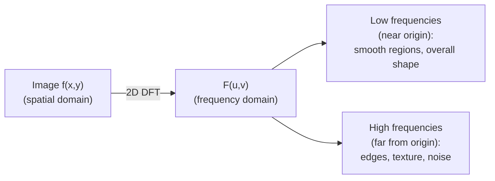

## Learning Objectives

- State the 2D Discrete Fourier Transform's definition, and explain each DFT coefficient as an inner product between the image and a complex sinusoidal basis function.
- Explain, concretely, what "low frequency" and "high frequency" mean for an image, and connect each to a real visual property (smooth regions versus edges/noise).
- Compute a small 1D DFT by hand to make the inner-product framing concrete before generalizing to two dimensions.

## Context & Motivation

Every concept so far in this discipline has operated directly on the pixel grid, the spatial domain. This concept introduces a genuinely different, equally valid way of describing the same image: as a sum of 2D sinusoidal patterns of varying spatial frequency, the frequency domain. This is not a different image, it is a lossless, invertible re-expression of `digital-images-as-discrete-functions`'s same discrete function f(x, y), and it is the foundation `the-fast-fourier-transform`, `the-convolution-theorem-and-frequency-domain-filtering`, and the JPEG compression pipeline all build on.

The real mathematical machinery underneath is not new: each DFT coefficient is computed as an inner product, exactly `the-dot-product-and-vector-norms` (`foundations/mathematics-for-computing`, published)'s own dot product, between the image and one complex sinusoidal basis vector. This concept reuses that machinery directly rather than re-deriving what an inner product or a vector norm means.

## Core Theory

### The 1D DFT as an inner product with basis sinusoids

For an N-point discrete signal x[n], the DFT is:

```text
X[k] = sum_{n=0}^{N-1} x[n] * exp(-i * 2*pi*k*n / N),  for k = 0, ..., N-1
```

Each X[k] is exactly the inner product (per `the-dot-product-and-vector-norms`) between the signal vector x and the complex sinusoidal basis vector exp(-i*2*pi*k*n/N) sampled at each n, one fixed frequency k. A large |X[k]| means the signal has strong energy at that frequency, a small |X[k]| means it has little.

### The 2D DFT: the same idea, on rows and columns

For an image f(x, y) of size M x N, the 2D DFT is:

```text
F(u, v) = sum_{x=0}^{M-1} sum_{y=0}^{N-1} f(x,y) * exp(-i*2*pi*(ux/M + vy/N))
```

This can be computed as a 1D DFT applied to every row, followed by a 1D DFT applied to every column of the result (or vice versa), a real, practical separability property directly analogous to the Gaussian kernel's separability in `spatial-filtering-box-and-gaussian-blur`. F(u, v) measures how much the image resembles a 2D sinusoidal pattern oscillating at horizontal frequency u and vertical frequency v.

### Low frequency versus high frequency: the real visual meaning

F(0, 0), the **DC component**, is the sum of all pixel values, the image's overall average brightness with no spatial variation at all, the lowest possible frequency. Coefficients near F(0,0) (low u, v) correspond to slowly varying, smooth regions of the image, broad shapes, gradual lighting changes. Coefficients far from the origin (high u, v) correspond to rapidly varying content: sharp edges, fine texture, and pixel-level noise, all genuinely high-frequency phenomena in the precise sense that they require high-frequency sinusoidal components to represent. This is the concrete, honest intuition every frequency-domain filtering concept in this discipline depends on.



## Worked Examples

### Example 1: a 4-point 1D DFT by hand

Signal x = [1, 0, 0, 0] (an impulse). Computing X[k] for k=0,1,2,3, N=4:

```text
X[0] = sum x[n]*exp(0) = 1*1 + 0 + 0 + 0 = 1
X[1] = 1*exp(-i*2*pi*1*0/4) + 0 + 0 + 0 = 1*exp(0) = 1
X[2] = 1*exp(0) = 1
X[3] = 1*exp(0) = 1
```

Every term with x[n]=0 (n=1,2,3) drops out regardless of k, since the basis function is multiplied by 0. Result: X = [1, 1, 1, 1], every frequency equally represented, the correct, well-known result for an impulse, whose energy is spread flat across all frequencies.

### Example 2: a constant signal has all its energy at F(0)

Signal x = [5, 5, 5, 5]. Computing X[0]:

```text
X[0] = 5*exp(0) + 5*exp(0) + 5*exp(0) + 5*exp(0) = 20
```

Computing X[1]: exp(-i*2*pi*1*n/4) for n=0,1,2,3 gives 1, -i, -1, i (the four fourth-roots of unity), so:

```text
X[1] = 5*1 + 5*(-i) + 5*(-1) + 5*i = 5 - 5i - 5 + 5i = 0
```

X[2] and X[3] similarly evaluate to 0 by the same cancellation. Result: X = [20, 0, 0, 0], all energy concentrated at the DC term (frequency 0), correctly matching Core Theory's claim that a perfectly smooth (here, perfectly constant) signal has no high-frequency content at all.

### Example 3: an alternating (highest-frequency) signal

Signal x = [1, -1, 1, -1], the most rapidly oscillating possible 4-point signal. Computing X[2] (the Nyquist, highest, frequency for N=4): exp(-i*2*pi*2*n/4) = exp(-i*pi*n) gives 1, -1, 1, -1 for n=0,1,2,3:

```text
X[2] = 1*1 + (-1)*(-1) + 1*1 + (-1)*(-1) = 1+1+1+1 = 4
```

Computing X[0]: X[0] = 1 + (-1) + 1 + (-1) = 0. Result: X = [0, 0, 4, 0], all energy concentrated at the highest available frequency, the exact opposite of Example 2's constant signal, confirming directly that rapid oscillation (analogous to a sharp edge or noise in an image row) corresponds to high-frequency DFT energy, and smoothness corresponds to low-frequency energy.

## Common Misconceptions & Pitfalls

- **"The frequency domain representation loses information compared to the original image."** The DFT is a lossless, invertible transform (an inverse DFT recovers f(x,y) exactly, given exact arithmetic); it is a different, equally complete description of the same data, not a lossy summary, a distinction worth keeping precise before `block-based-dct-and-quantization-in-jpeg` introduces a genuinely lossy step later in this discipline.
- **"F(0,0) is just one coefficient among many, with no special meaning."** Example 2 shows it specifically captures the signal's (or image's) overall average value, the entire reason it is called the DC (direct current) component, a real, distinct, always-present low-frequency anchor.
- **"High frequency in an image just means 'high pixel values,' the way F(0,0) sums up values."** Example 3 shows high frequency energy comes from rapid alternation (oscillation) in the signal, not from large absolute values, exactly matching the Core Theory intuition that edges and noise (rapid intensity change) are high frequency, regardless of how bright or dark the pixels involved happen to be.

## Summary

The 2D Discrete Fourier Transform re-expresses `digital-images-as-discrete-functions`'s pixel matrix as a weighted sum of 2D sinusoidal basis patterns, each coefficient computed as `the-dot-product-and-vector-norms` (`foundations/mathematics-for-computing`)'s own inner product between the image and one basis sinusoid, reused directly rather than re-derived. Low-frequency coefficients capture an image's smooth, slowly varying content; high-frequency coefficients capture its edges, texture, and noise, the concrete intuition `the-fast-fourier-transform` (making this computation practical) and `the-convolution-theorem-and-frequency-domain-filtering` (connecting it back to spatial-domain blurring) both build on next.

## Documentation Links

- [Gonzalez and Woods: Digital Image Processing, 4th Edition (Pearson, 2018)](https://www.pearson.com/en-us/subject-catalog/p/Gonzalez-Digital-Image-Processing-4th-Edition/P200000003224?view=educator): the source for this concept's 2D DFT definition and its frequency-domain intuition for image content.
