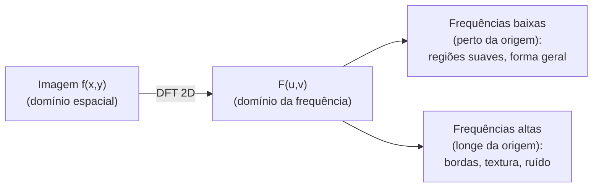

## Objetivos de Aprendizagem

- Enunciar a definição da Transformada Discreta de Fourier 2D, e explicar cada coeficiente da DFT como um produto interno entre a imagem e uma função de base senoidal complexa.
- Explicar, concretamente, o que "frequência baixa" e "frequência alta" significam para uma imagem, e conectar cada uma a uma propriedade visual real (regiões suaves versus bordas/ruído).
- Computar uma pequena DFT 1D à mão para tornar o enquadramento de produto interno concreto antes de generalizar para duas dimensões.

## Contexto e Motivação

Todo conceito até agora nesta disciplina operou diretamente sobre a grade de pixels, o domínio espacial. Este conceito introduz uma forma genuinamente diferente e igualmente válida de descrever a mesma imagem: como uma soma de padrões senoidais 2D de frequência espacial variável, o domínio da frequência. Esta não é uma imagem diferente, é uma reexpressão sem perdas e invertível da mesma função discreta f(x, y) de `digital-images-as-discrete-functions`, e é a fundação sobre a qual `the-fast-fourier-transform`, `the-convolution-theorem-and-frequency-domain-filtering` e o pipeline de compressão do JPEG todos constroem.

A maquinaria matemática real subjacente não é nova: cada coeficiente da DFT é computado como um produto interno, exatamente o próprio produto escalar de `the-dot-product-and-vector-norms` (`foundations/mathematics-for-computing`, publicado), entre a imagem e um vetor de base senoidal complexo. Este conceito reusa essa maquinaria diretamente em vez de re-derivar o que um produto interno ou uma norma de vetor significa.

## Teoria Central

### A DFT 1D como um produto interno com senoides de base

Para um sinal discreto de N pontos x[n], a DFT é:

```text
X[k] = sum_{n=0}^{N-1} x[n] * exp(-i * 2*pi*k*n / N),  para k = 0, ..., N-1
```

Cada X[k] é exatamente o produto interno (conforme `the-dot-product-and-vector-norms`) entre o vetor de sinal x e o vetor de base senoidal complexo exp(-i*2*pi*k*n/N) amostrado em cada n, uma frequência fixa k. Um |X[k]| grande significa que o sinal tem energia forte naquela frequência, um |X[k]| pequeno significa que ele tem pouca.

### A DFT 2D: a mesma ideia, em linhas e colunas

Para uma imagem f(x, y) de tamanho M x N, a DFT 2D é:

```text
F(u, v) = sum_{x=0}^{M-1} sum_{y=0}^{N-1} f(x,y) * exp(-i*2*pi*(ux/M + vy/N))
```

Isto pode ser computado como uma DFT 1D aplicada a toda linha, seguida de uma DFT 1D aplicada a toda coluna do resultado (ou vice-versa), uma propriedade de separabilidade real e prática diretamente análoga à separabilidade do kernel gaussiano em `spatial-filtering-box-and-gaussian-blur`. F(u, v) mede o quanto a imagem se assemelha a um padrão senoidal 2D oscilando na frequência horizontal u e na frequência vertical v.

### Frequência baixa versus frequência alta: o significado visual real

F(0, 0), o **componente DC**, é a soma de todos os valores de pixel, o brilho médio geral da imagem sem nenhuma variação espacial de todo, a frequência mais baixa possível. Coeficientes perto de F(0,0) (u, v baixos) correspondem a regiões lentamente variáveis e suaves da imagem, formas amplas, mudanças graduais de iluminação. Coeficientes longe da origem (u, v altos) correspondem a conteúdo rapidamente variável: bordas nítidas, textura fina e ruído em nível de pixel, todos fenômenos genuinamente de alta frequência no sentido preciso de que eles exigem componentes senoidais de alta frequência para representar. Esta é a intuição concreta e honesta da qual todo conceito de filtragem no domínio da frequência nesta disciplina depende.



## Exemplos Resolvidos

### Exemplo 1: uma DFT 1D de 4 pontos à mão

Sinal x = [1, 0, 0, 0] (um impulso). Computando X[k] para k=0,1,2,3, N=4:

```text
X[0] = sum x[n]*exp(0) = 1*1 + 0 + 0 + 0 = 1
X[1] = 1*exp(-i*2*pi*1*0/4) + 0 + 0 + 0 = 1*exp(0) = 1
X[2] = 1*exp(0) = 1
X[3] = 1*exp(0) = 1
```

Todo termo com x[n]=0 (n=1,2,3) cai fora independentemente de k, já que a função de base é multiplicada por 0. Resultado: X = [1, 1, 1, 1], toda frequência igualmente representada, o resultado correto e bem conhecido para um impulso, cuja energia é espalhada de forma plana por todas as frequências.

### Exemplo 2: um sinal constante tem toda a sua energia em F(0)

Sinal x = [5, 5, 5, 5]. Computando X[0]:

```text
X[0] = 5*exp(0) + 5*exp(0) + 5*exp(0) + 5*exp(0) = 20
```

Computando X[1]: exp(-i*2*pi*1*n/4) para n=0,1,2,3 dá 1, -i, -1, i (as quatro raízes quartas da unidade), então:

```text
X[1] = 5*1 + 5*(-i) + 5*(-1) + 5*i = 5 - 5i - 5 + 5i = 0
```

X[2] e X[3] similarmente avaliam para 0 pelo mesmo cancelamento. Resultado: X = [20, 0, 0, 0], toda a energia concentrada no termo DC (frequência 0), correspondendo corretamente à alegação da Teoria Central de que um sinal perfeitamente suave (aqui, perfeitamente constante) não tem nenhum conteúdo de alta frequência de todo.

### Exemplo 3: um sinal alternante (de frequência mais alta)

Sinal x = [1, -1, 1, -1], o sinal de 4 pontos possível que oscila mais rapidamente. Computando X[2] (a frequência de Nyquist, a mais alta, para N=4): exp(-i*2*pi*2*n/4) = exp(-i*pi*n) dá 1, -1, 1, -1 para n=0,1,2,3:

```text
X[2] = 1*1 + (-1)*(-1) + 1*1 + (-1)*(-1) = 1+1+1+1 = 4
```

Computando X[0]: X[0] = 1 + (-1) + 1 + (-1) = 0. Resultado: X = [0, 0, 4, 0], toda a energia concentrada na frequência mais alta disponível, o exato oposto do sinal constante do Exemplo 2, confirmando diretamente que a oscilação rápida (análoga a uma borda nítida ou ruído numa linha de imagem) corresponde à energia de alta frequência da DFT, e a suavidade corresponde à energia de baixa frequência.

## Equívocos Comuns e Armadilhas

- **"A representação do domínio da frequência perde informação comparada à imagem original."** A DFT é uma transformada sem perdas e invertível (uma DFT inversa recupera f(x,y) exatamente, dada aritmética exata); ela é uma descrição diferente e igualmente completa dos mesmos dados, não um resumo com perdas, uma distinção que vale a pena manter precisa antes de `block-based-dct-and-quantization-in-jpeg` introduzir um passo genuinamente com perdas depois nesta disciplina.
- **"F(0,0) é só um coeficiente entre muitos, sem nenhum significado especial."** O Exemplo 2 mostra que ele especificamente captura o valor médio geral do sinal (ou da imagem), a razão inteira pela qual ele é chamado de componente DC (corrente contínua), uma âncora de baixa frequência real, distinta e sempre presente.
- **"Frequência alta numa imagem só significa 'valores de pixel altos', da forma que F(0,0) soma valores."** O Exemplo 3 mostra que a energia de alta frequência vem da alternação (oscilação) rápida no sinal, não de valores absolutos grandes, correspondendo exatamente à intuição da Teoria Central de que bordas e ruído (mudança rápida de intensidade) são alta frequência, independentemente de quão brilhantes ou escuros os pixels envolvidos por acaso sejam.

## Resumo

A Transformada Discreta de Fourier 2D reexpressa a matriz de pixels de `digital-images-as-discrete-functions` como uma soma ponderada de padrões de base senoidais 2D, cada coeficiente computado como o próprio produto interno de `the-dot-product-and-vector-norms` (`foundations/mathematics-for-computing`) entre a imagem e uma senoide de base, reusado diretamente em vez de re-derivado. Os coeficientes de baixa frequência capturam o conteúdo suave e lentamente variável de uma imagem; os coeficientes de alta frequência capturam as suas bordas, textura e ruído, a intuição concreta sobre a qual `the-fast-fourier-transform` (tornando esta computação prática) e `the-convolution-theorem-and-frequency-domain-filtering` (conectando-a de volta ao embaçamento no domínio espacial) ambos constroem em seguida.

## Documentation Links

- [Gonzalez and Woods: Digital Image Processing, 4th Edition (Pearson, 2018)](https://www.pearson.com/en-us/subject-catalog/p/Gonzalez-Digital-Image-Processing-4th-Edition/P200000003224?view=educator): a fonte para a definição da DFT 2D deste conceito e a sua intuição de domínio da frequência para conteúdo de imagem.
