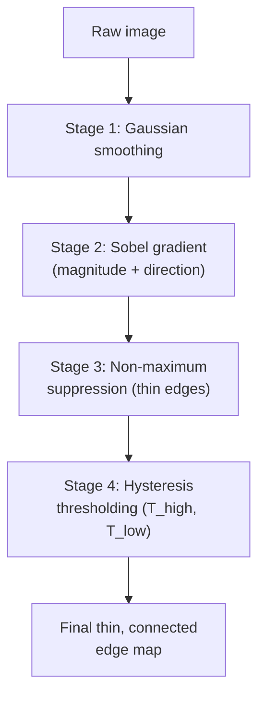

## Learning Objectives

- Name and order Canny's four pipeline stages: Gaussian smoothing, gradient computation, non-maximum suppression, and hysteresis thresholding.
- Explain precisely what problem each stage solves relative to the raw Sobel gradient map `the-sobel-operator-and-gradient-based-edge-detection` produces.
- Trace non-maximum suppression and hysteresis thresholding by hand on a small concrete gradient map.

## Context & Motivation

`the-sobel-operator-and-gradient-based-edge-detection` computes a real, useful gradient magnitude map, but its raw output has two honest problems: a genuine edge in a real photograph produces a thick band of pixels with elevated gradient magnitude, not a single clean line, and a single global magnitude threshold either misses faint but real edge segments or lets through noisy speckle, with no threshold value getting both right everywhere in one image. Canny's 1986 paper, "A Computational Approach to Edge Detection," is the real, classic, still-standard answer: a four-stage pipeline that reuses `spatial-filtering-box-and-gaussian-blur`'s smoothing and `the-sobel-operator-and-gradient-based-edge-detection`'s gradient computation directly as its first two stages, then adds two new stages purpose-built to solve exactly the thickness and threshold problems just named.

## Core Theory

### Stage 1: Gaussian smoothing (reused directly)

Before any gradient is computed, the image is blurred with a Gaussian kernel, exactly `spatial-filtering-box-and-gaussian-blur`'s kernel, to suppress pixel-level sensor noise that would otherwise produce spurious small gradients unrelated to any real edge.

### Stage 2: gradient computation (reused directly)

The smoothed image is run through the Sobel Gx and Gy kernels, exactly as in `the-sobel-operator-and-gradient-based-edge-detection`, producing gradient magnitude and direction at every pixel. Nothing new happens in this stage; it is the previous concept's machinery, applied to the now-smoothed image.

### Stage 3: non-maximum suppression, thinning the edge

At each pixel, its gradient direction is rounded to one of four discrete orientations (0, 45, 90, 135 degrees). The pixel's magnitude is then compared against its two neighbors *along that direction* (the two pixels the edge is locally perpendicular to). If the current pixel's magnitude is not the largest of the three, it is suppressed (set to 0), even if it is well above any absolute threshold. This keeps only the single pixel that is a true local maximum across the edge's width, converting the raw thick gradient band into a thin, ideally one-pixel-wide ridge tracing the actual edge.

### Stage 4: hysteresis thresholding, two thresholds instead of one

Rather than a single global magnitude threshold, Canny's algorithm uses two: a high threshold T_high and a low threshold T_low (T_low < T_high). A pixel with magnitude above T_high is immediately accepted as a strong, confirmed edge pixel. A pixel with magnitude below T_low is immediately rejected. A pixel in between (weak) is accepted only if it is connected, through a chain of other weak pixels, to at least one strong pixel; otherwise it is discarded as likely noise. This is the real, precise mechanism that closes small gaps along a genuine but locally faint edge segment while still rejecting isolated noisy speckle that never connects back to a strong edge.



## Worked Examples

### Example 1: non-maximum suppression along a horizontal gradient direction

A row of gradient magnitudes, direction rounded to 0 degrees (horizontal gradient, so comparison is against left/right neighbors) at five consecutive pixels: [40, 90, 85, 95, 30]. Checking each interior pixel against its immediate left/right neighbor along the gradient direction:

```text
Pixel at index 1 (90): neighbors are 40 and 85. 90 > both -> KEEP (local max)
Pixel at index 2 (85): neighbors are 90 and 95. 85 < both -> SUPPRESS (set to 0)
Pixel at index 3 (95): neighbors are 85 and 30. 95 > both -> KEEP (local max)
```

Result after suppression: [40, 90, 0, 95, 30]. What was a thick band of three consecutive high-magnitude pixels (90, 85, 95) is thinned to two separated local maxima, closer to the single-pixel-wide ridge the algorithm aims for; a real full 2D pass would resolve this further using the true 2D neighborhood, but the 1D case shown makes the thinning mechanic concrete.

### Example 2: hysteresis thresholding closing a gap

A chain of eight connected pixels along a candidate edge, with magnitudes [120, 25, 15, 60, 55, 22, 130, 18], and thresholds T_high = 100, T_low = 20:

```text
120 >= T_high -> STRONG (accepted immediately)
25: T_low <= 25 < T_high -> WEAK, check connectivity to a strong pixel
15 < T_low -> REJECTED (below low threshold)
60, 55: WEAK, check connectivity
22: WEAK, check connectivity
130 >= T_high -> STRONG (accepted immediately)
18 < T_low -> REJECTED
```

Tracing connectivity: pixel index 1 (25, weak) is adjacent to index 0 (120, strong) -> ACCEPTED via connection. Pixel index 2 (15) was already rejected outright (below T_low), breaking the chain there. Pixels 3, 4, 5 (60, 55, 22, all weak) are adjacent to each other and to index 6 (130, strong) -> all ACCEPTED via that connection, even though 22 alone, checked against T_low and T_high in isolation, is barely above T_low. This is the real mechanism: a weak-but-real edge segment survives because it connects to a confirmed strong edge, while an isolated weak pixel with no such connection (matching neither Example's chain) would be discarded.

### Example 3: why a single threshold cannot do what Example 2 did

Re-running Example 2's same magnitudes [120, 25, 15, 60, 55, 22, 130, 18] with one single threshold instead of two: setting the threshold at 50 keeps [120, 60, 55, 130] and rejects [25, 15, 22, 18], breaking the edge into three disconnected fragments (losing the legitimate weak-but-connected 22 that hysteresis correctly kept). Lowering the single threshold to 20 to try to keep that 22 also lets through any isolated noise pixel with magnitude 20 or above anywhere else in the image, with no way to distinguish real faint edge continuation from noise using magnitude alone. Hysteresis's two-threshold, connectivity-aware rule is a real, specific fix for exactly this dilemma, not an arbitrary added complexity.

## Common Misconceptions & Pitfalls

- **"Canny is just Sobel with extra steps that do not fundamentally change the result."** Example 1 and Example 2 show the two added stages solve two specific, real, named problems, edge thickness and threshold brittleness, that Sobel's raw magnitude map, per `the-sobel-operator-and-gradient-based-edge-detection`, does not address on its own.
- **"A single, well-chosen threshold could achieve the same result as hysteresis."** Example 3 shows concretely that no single threshold value simultaneously keeps the legitimate weak-but-connected pixel and rejects isolated noise; the two-threshold, connectivity-based rule is doing genuinely different work than threshold tuning alone could achieve.
- **"Non-maximum suppression and hysteresis thresholding can run in either order."** They cannot: hysteresis's connectivity check operates on the thinned edge map non-maximum suppression produces; running hysteresis first on the thick, unthinned gradient map would let entire wide bands of connected strong pixels through, defeating the thinning stage's purpose entirely.

## Summary

Canny's 1986 algorithm reuses `spatial-filtering-box-and-gaussian-blur`'s smoothing and `the-sobel-operator-and-gradient-based-edge-detection`'s gradient computation as its first two stages, then adds non-maximum suppression (keeping only local gradient maxima along the edge direction, thinning a thick band to a one-pixel ridge) and hysteresis thresholding (a high threshold for confirmed edges, a low threshold plus connectivity for extending them, closing gaps a single threshold cannot close without also admitting noise). The result is the real, still-standard, precise edge map every classical segmentation technique in this discipline can build on, starting with `thresholding-and-otsus-method`, next.

## Documentation Links

- [Canny, J.: A Computational Approach to Edge Detection (IEEE Transactions on Pattern Analysis and Machine Intelligence, 1986)](https://ieeexplore.ieee.org/document/4767851): the original paper defining this concept's full four-stage pipeline, including the non-maximum suppression and hysteresis thresholding mechanisms worked by hand above.
- [Gonzalez and Woods: Digital Image Processing, 4th Edition (Pearson, 2018)](https://www.pearson.com/en-us/subject-catalog/p/Gonzalez-Digital-Image-Processing-4th-Edition/P200000003224?view=educator): a secondary, textbook-level treatment of the Canny pipeline, cross-referenced against the original paper.
