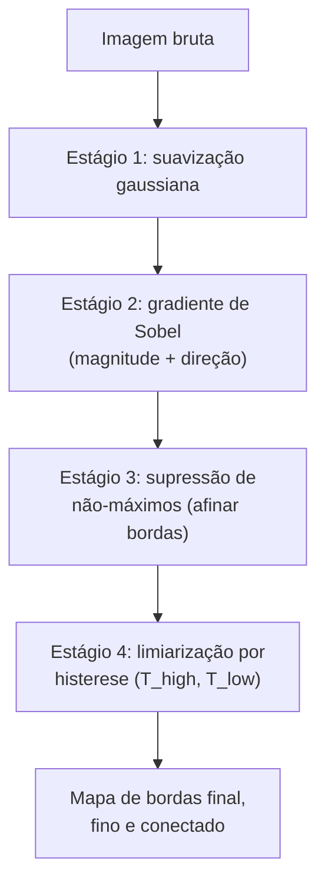

## Objetivos de Aprendizagem

- Nomear e ordenar os quatro estágios do pipeline de Canny: suavização gaussiana, computação de gradiente, supressão de não-máximos e limiarização por histerese.
- Explicar precisamente qual problema cada estágio resolve em relação ao mapa de gradiente de Sobel bruto que `the-sobel-operator-and-gradient-based-edge-detection` produz.
- Traçar a supressão de não-máximos e a limiarização por histerese à mão num pequeno mapa de gradiente concreto.

## Contexto e Motivação

`the-sobel-operator-and-gradient-based-edge-detection` computa um mapa de magnitude de gradiente real e útil, mas a sua saída bruta tem dois problemas honestos: uma borda genuína numa fotografia real produz uma banda grossa de pixels com magnitude de gradiente elevada, não uma única linha limpa, e um único limiar de magnitude global ou perde segmentos de borda fracos mas reais ou deixa passar respingos ruidosos, sem nenhum valor de limiar acertando ambos em todo lugar numa imagem. O artigo de Canny de 1986, "A Computational Approach to Edge Detection", é a resposta real, clássica e ainda padrão: um pipeline de quatro estágios que reusa a suavização de `spatial-filtering-box-and-gaussian-blur` e a computação de gradiente de `the-sobel-operator-and-gradient-based-edge-detection` diretamente como os seus dois primeiros estágios, depois adiciona dois novos estágios feitos sob medida para resolver exatamente os problemas de espessura e de limiar que acabamos de nomear.

## Teoria Central

### Estágio 1: suavização gaussiana (reusada diretamente)

Antes de qualquer gradiente ser computado, a imagem é embaçada com um kernel gaussiano, exatamente o kernel de `spatial-filtering-box-and-gaussian-blur`, para suprimir o ruído de sensor em nível de pixel que de outra forma produziria pequenos gradientes espúrios não relacionados a nenhuma borda real.

### Estágio 2: computação de gradiente (reusada diretamente)

A imagem suavizada é rodada pelos kernels Gx e Gy de Sobel, exatamente como em `the-sobel-operator-and-gradient-based-edge-detection`, produzindo magnitude e direção de gradiente em todo pixel. Nada de novo acontece neste estágio; é a maquinaria do conceito anterior, aplicada à imagem agora suavizada.

### Estágio 3: supressão de não-máximos, afinando a borda

Em cada pixel, a sua direção de gradiente é arredondada para uma de quatro orientações discretas (0, 45, 90, 135 graus). A magnitude do pixel é então comparada contra os seus dois vizinhos *ao longo daquela direção* (os dois pixels aos quais a borda é localmente perpendicular). Se a magnitude do pixel atual não é a maior dos três, ela é suprimida (definida como 0), mesmo se estiver bem acima de qualquer limiar absoluto. Isto mantém só o único pixel que é um verdadeiro máximo local pela largura da borda, convertendo a banda de gradiente grossa e bruta numa crista fina, idealmente de um pixel de largura, traçando a borda de fato.

### Estágio 4: limiarização por histerese, dois limiares em vez de um

Em vez de um único limiar de magnitude global, o algoritmo de Canny usa dois: um limiar alto T_high e um limiar baixo T_low (T_low < T_high). Um pixel com magnitude acima de T_high é imediatamente aceito como um pixel de borda forte e confirmado. Um pixel com magnitude abaixo de T_low é imediatamente rejeitado. Um pixel entre os dois (fraco) é aceito só se estiver conectado, por uma cadeia de outros pixels fracos, a pelo menos um pixel forte; caso contrário é descartado como provável ruído. Este é o mecanismo real e preciso que fecha pequenas lacunas ao longo de um segmento de borda genuíno mas localmente fraco enquanto ainda rejeita respingos ruidosos isolados que nunca se conectam de volta a uma borda forte.



## Exemplos Resolvidos

### Exemplo 1: supressão de não-máximos ao longo de uma direção de gradiente horizontal

Uma linha de magnitudes de gradiente, direção arredondada para 0 graus (gradiente horizontal, então a comparação é contra vizinhos esquerda/direita) em cinco pixels consecutivos: [40, 90, 85, 95, 30]. Checando cada pixel interior contra o seu vizinho imediato esquerda/direita ao longo da direção do gradiente:

```text
Pixel no índice 1 (90): vizinhos são 40 e 85. 90 > ambos -> MANTER (máximo local)
Pixel no índice 2 (85): vizinhos são 90 e 95. 85 < ambos -> SUPRIMIR (definir como 0)
Pixel no índice 3 (95): vizinhos são 85 e 30. 95 > ambos -> MANTER (máximo local)
```

Resultado após a supressão: [40, 90, 0, 95, 30]. O que era uma banda grossa de três pixels consecutivos de alta magnitude (90, 85, 95) é afinado para dois máximos locais separados, mais próximo da crista de um pixel de largura que o algoritmo visa; uma passada 2D completa real resolveria isto ainda mais usando a verdadeira vizinhança 2D, mas o caso 1D mostrado torna a mecânica de afinamento concreta.

### Exemplo 2: limiarização por histerese fechando uma lacuna

Uma cadeia de oito pixels conectados ao longo de uma borda candidata, com magnitudes [120, 25, 15, 60, 55, 22, 130, 18], e limiares T_high = 100, T_low = 20:

```text
120 >= T_high -> FORTE (aceito imediatamente)
25: T_low <= 25 < T_high -> FRACO, checar conectividade a um pixel forte
15 < T_low -> REJEITADO (abaixo do limiar baixo)
60, 55: FRACOS, checar conectividade
22: FRACO, checar conectividade
130 >= T_high -> FORTE (aceito imediatamente)
18 < T_low -> REJEITADO
```

Traçando a conectividade: o pixel no índice 1 (25, fraco) é adjacente ao índice 0 (120, forte) -> ACEITO via conexão. O pixel no índice 2 (15) já foi rejeitado de pronto (abaixo de T_low), quebrando a cadeia ali. Os pixels 3, 4, 5 (60, 55, 22, todos fracos) são adjacentes entre si e ao índice 6 (130, forte) -> todos ACEITOS via essa conexão, embora 22 sozinho, checado contra T_low e T_high isoladamente, esteja mal acima de T_low. Este é o mecanismo real: um segmento de borda fraco-mas-real sobrevive porque se conecta a uma borda forte confirmada, enquanto um pixel fraco isolado sem tal conexão (não correspondendo à cadeia de nenhum Exemplo) seria descartado.

### Exemplo 3: por que um único limiar não consegue fazer o que o Exemplo 2 fez

Rerodando as mesmas magnitudes do Exemplo 2 [120, 25, 15, 60, 55, 22, 130, 18] com um único limiar em vez de dois: definir o limiar em 50 mantém [120, 60, 55, 130] e rejeita [25, 15, 22, 18], quebrando a borda em três fragmentos desconectados (perdendo o legítimo 22 fraco-mas-conectado que a histerese corretamente manteve). Baixar o único limiar para 20 para tentar manter esse 22 também deixa passar qualquer pixel de ruído isolado com magnitude 20 ou acima em qualquer outro lugar na imagem, sem nenhuma forma de distinguir a continuação de borda fraca real do ruído usando a magnitude sozinha. A regra de dois limiares e ciente de conectividade da histerese é uma correção real e específica para exatamente este dilema, não uma complexidade adicionada arbitrária.

## Equívocos Comuns e Armadilhas

- **"Canny é só Sobel com passos extras que não mudam fundamentalmente o resultado."** O Exemplo 1 e o Exemplo 2 mostram que os dois estágios adicionados resolvem dois problemas específicos, reais e nomeados, espessura de borda e fragilidade de limiar, que o mapa de magnitude bruto de Sobel, conforme `the-sobel-operator-and-gradient-based-edge-detection`, não aborda por conta própria.
- **"Um único limiar bem escolhido poderia alcançar o mesmo resultado que a histerese."** O Exemplo 3 mostra concretamente que nenhum valor de limiar único simultaneamente mantém o legítimo pixel fraco-mas-conectado e rejeita o ruído isolado; a regra de dois limiares e baseada em conectividade está fazendo um trabalho genuinamente diferente do que o ajuste de limiar sozinho poderia alcançar.
- **"A supressão de não-máximos e a limiarização por histerese podem rodar em qualquer ordem."** Elas não podem: a checagem de conectividade da histerese opera sobre o mapa de bordas afinado que a supressão de não-máximos produz; rodar a histerese primeiro no mapa de gradiente grosso e não afinado deixaria bandas largas inteiras de pixels fortes conectados passarem, derrotando o propósito do estágio de afinamento inteiramente.

## Resumo

O algoritmo de Canny de 1986 reusa a suavização de `spatial-filtering-box-and-gaussian-blur` e a computação de gradiente de `the-sobel-operator-and-gradient-based-edge-detection` como os seus dois primeiros estágios, depois adiciona a supressão de não-máximos (mantendo só máximos locais de gradiente ao longo da direção da borda, afinando uma banda grossa numa crista de um pixel) e a limiarização por histerese (um limiar alto para bordas confirmadas, um limiar baixo mais conectividade para estendê-las, fechando lacunas que um único limiar não consegue fechar sem também admitir ruído). O resultado é o mapa de bordas real, ainda padrão e preciso sobre o qual toda técnica de segmentação clássica nesta disciplina pode construir, começando com `thresholding-and-otsus-method`, em seguida.

## Documentation Links

- [Canny, J.: A Computational Approach to Edge Detection (IEEE Transactions on Pattern Analysis and Machine Intelligence, 1986)](https://ieeexplore.ieee.org/document/4767851): o artigo original definindo o pipeline completo de quatro estágios deste conceito, incluindo os mecanismos de supressão de não-máximos e limiarização por histerese trabalhados à mão acima.
- [Gonzalez and Woods: Digital Image Processing, 4th Edition (Pearson, 2018)](https://www.pearson.com/en-us/subject-catalog/p/Gonzalez-Digital-Image-Processing-4th-Edition/P200000003224?view=educator): um tratamento secundário em nível de livro-texto do pipeline de Canny, cruzado com o artigo original.
