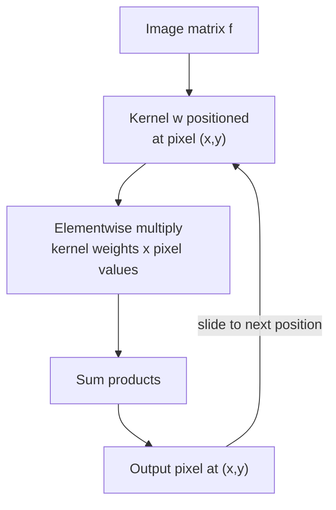

## Learning Objectives

- Compute the result of sliding a small kernel over an image matrix by hand, at a single position and across a full small image, including boundary handling.
- Distinguish true (flipped-kernel) convolution from correlation, and explain why most image-processing libraries implement correlation while still calling it "convolution."
- State, precisely, the exact point of mechanical overlap and the exact point of divergence between this operation and `convolution-as-a-sliding-dot-product` (`ai-theory/deep-learning`): the same sliding-dot-product mechanic, a fixed, human-chosen kernel here versus a kernel learned from data there.

## Context & Motivation

This is the single most important scope decision in this discipline, made concrete rather than left abstract. `digital-images-as-discrete-functions` established that an image is a matrix of numbers. This concept introduces the operation nearly every technique in the rest of this discipline, blurring, edge detection, and (via the convolution theorem) frequency-domain filtering, is built from: sliding a small kernel over that matrix.

That operation, a sliding-window sum of element-wise products, is mathematically identical to what `convolution-as-a-sliding-dot-product` (`ai-theory/deep-learning`, published, 19 concepts) builds a CNN layer from. That concept's discipline teaches convolution as a *learned* technique: the kernel starts as random numbers and is updated by gradient descent until it minimizes a loss function on training data. This discipline's entire scope is the opposite half of that same operation's history: every kernel used here, a box blur, a Gaussian, a Sobel gradient kernel, is fixed and hand-designed by a human, in closed form, before the image is ever seen. The operation is the same; how the kernel's numbers get chosen is the entire, real difference, and it is the honest reason this discipline exists as something other than a duplicate of `deep-learning`'s convolution material.

## Core Theory

### The sliding-window mechanic

Given an image matrix f and a small kernel (or mask) w of size (2a+1) x (2b+1), centered at its own middle entry, the **correlation** of w with f at position (x, y) is:

```text
(w correlated with f)(x, y) = sum_{s=-a}^{a} sum_{t=-b}^{b} w(s, t) * f(x+s, y+t)
```

At each pixel position, the kernel is laid over the neighborhood centered at that pixel, each kernel weight is multiplied by the pixel underneath it, and all the products are summed into the single output value at that position. Sliding this computation across every position in the image produces the full output image.

### Correlation versus true convolution

Mathematically, true **convolution** flips the kernel before sliding it:

```text
(w convolved with f)(x, y) = sum_{s=-a}^{a} sum_{t=-b}^{b} w(s, t) * f(x-s, y-t)
```

For a kernel that is symmetric (unchanged by a 180-degree rotation), like a box blur or a Gaussian, correlation and true convolution produce identical results, which is exactly why the distinction is so often glossed over in practice: most image-processing libraries implement correlation and simply call it "convolution," a real, widely acknowledged naming looseness. The distinction becomes visible, and matters, for a kernel that is not symmetric, the Sobel gradient kernels covered next in `the-sobel-operator-and-gradient-based-edge-detection` being the clearest example: convolving with an asymmetric kernel flips its effect relative to correlating with it, so an implementation must be internally consistent about which one it means.

### Boundary handling

At the image's edges, the kernel's neighborhood extends past the matrix boundary. Three common, real strategies resolve this:

- **Zero-padding**: treat out-of-bounds pixels as 0, simplest, but darkens results near the border.
- **Replicate (clamp)**: repeat the nearest edge pixel's value, avoids artificial darkening, can slightly distort edge-adjacent gradients.
- **Reflect**: mirror the image across its own boundary, often the best visual result for smoothing filters, since it avoids introducing a hard edge that was not in the original image.



## Worked Examples

### Example 1: correlation at one interior pixel, by hand

Reusing `digital-images-as-discrete-functions`'s 4x4 image:

```text
f =
[ 10  10 200  10]
[ 10 200  10  10]
[200  10  10  10]
[ 10  10  10 200]
```

and a simple 3x3 averaging kernel w (each weight 1/9):

```text
w =
[1/9 1/9 1/9]
[1/9 1/9 1/9]
[1/9 1/9 1/9]
```

Computing the output at position (1,1) (the pixel with value 200, row 1, column 1), the 3x3 neighborhood centered there is:

```text
[ 10  10 200]
[ 10 200  10]
[200  10  10]
```

Sum of these 9 values = 10+10+200+10+200+10+200+10+10 = 660. Output = 660/9 = 73.33. The sharp bright pixel (200) has been averaged down toward its darker neighbors, smoothing exactly as `spatial-filtering-box-and-gaussian-blur`'s box blur will formalize next.

### Example 2: boundary handling changes the answer at a corner

Computing the output at the top-left corner pixel (0,0) requires a neighborhood that extends one row and one column out of bounds in two directions.

With **zero-padding**, the out-of-bounds cells contribute 0:

```text
[  0   0   0]
[  0  10  10]
[  0  10 200]
Sum = 0+0+0+0+10+10+0+10+200 = 230
Output = 230/9 = 25.56
```

With **replicate**, the out-of-bounds cells copy the nearest real pixel (f(0,0)=10 for the corner, f(0,0)/f(x,0)/f(0,y) as appropriate):

```text
[ 10  10  10]
[ 10  10  10]
[ 10  10 200]
Sum = 10+10+10+10+10+10+10+10+200 = 280
Output = 280/9 = 31.11
```

The two strategies give visibly different results (25.56 versus 31.11) at the same pixel, confirming boundary handling is a real, consequential implementation choice, not a footnote.

### Example 3: why kernel symmetry makes convolution and correlation agree

Take the 3x3 averaging kernel from Example 1, which is symmetric under 180-degree rotation (every value is 1/9, rotating it produces the identical kernel). Flipping it for true convolution, per the Core Theory definition, produces the exact same kernel, so correlation and convolution give identical results for this kernel at every position, confirming the Core Theory claim concretely rather than asserting it. An asymmetric kernel, like a Sobel Gx kernel with distinct positive and negative weights on opposite sides, would flip under this same operation into a visibly different kernel, which is exactly why that distinction resurfaces, and matters, in `the-sobel-operator-and-gradient-based-edge-detection`.

## Common Misconceptions & Pitfalls

- **"Convolution and correlation are always the same operation."** Example 3 shows they coincide only for symmetric kernels; an asymmetric kernel like a Sobel operator flips under true convolution's kernel-flip step, a real, consequential difference implementers must track.
- **"Boundary handling is a minor implementation detail with no real effect."** Example 2 shows two reasonable, common boundary strategies give meaningfully different numeric results (25.56 vs. 31.11) at the same corner pixel, a real, first-order effect near any image's edges.
- **"Since this is the same math as a CNN's convolution layer, this discipline is redundant with `deep-learning`."** The operation is genuinely identical; what differs, and what the rest of this discipline is actually about, is that every kernel here is fixed and hand-chosen before the image is seen, while `convolution-as-a-sliding-dot-product` (`ai-theory/deep-learning`) covers the case where the kernel's numbers are learned from data via gradient descent, a real, substantive difference in where the numbers come from, not a difference in the sliding-dot-product mechanic itself.

## Summary

Convolution (and its close, symmetric-kernel-equivalent cousin, correlation) slides a small kernel over an image matrix, computing a weighted sum of each pixel neighborhood at every position, with boundary handling (zero-padding, replicate, or reflect) a real, consequential choice at the image's edges. This is exactly the sliding-dot-product mechanic `convolution-as-a-sliding-dot-product` (`ai-theory/deep-learning`) uses inside a CNN layer; the entire, honest difference this discipline is built around is that every kernel used here is fixed and hand-designed, never learned from data, the scope boundary the rest of this discipline's spatial-filtering and edge-detection concepts rely on being stated clearly, right here, at the exact point the two disciplines' mechanics genuinely meet.

## Documentation Links

- [Gonzalez and Woods: Digital Image Processing, 4th Edition (Pearson, 2018)](https://www.pearson.com/en-us/subject-catalog/p/Gonzalez-Digital-Image-Processing-4th-Edition/P200000003224?view=educator): the source for this concept's formal definitions of spatial correlation and convolution, and its treatment of boundary-handling strategies.
