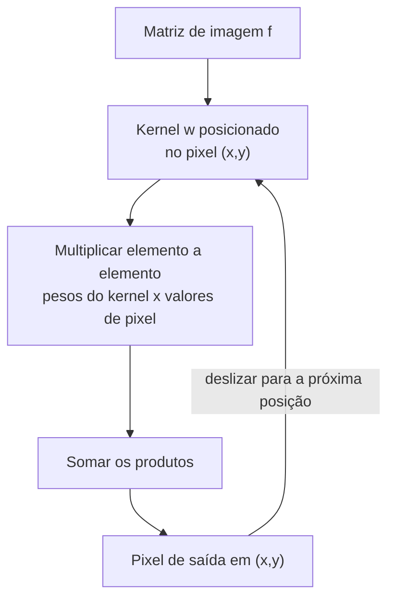

## Objetivos de Aprendizagem

- Computar o resultado de deslizar um pequeno kernel sobre uma matriz de imagem à mão, numa única posição e por uma pequena imagem completa, incluindo o tratamento de borda.
- Distinguir a convolução verdadeira (de kernel invertido) da correlação, e explicar por que a maioria das bibliotecas de processamento de imagens implementa correlação enquanto ainda a chama de "convolução".
- Enunciar, precisamente, o ponto exato de sobreposição mecânica e o ponto exato de divergência entre esta operação e `convolution-as-a-sliding-dot-product` (`ai-theory/deep-learning`): a mesma mecânica de produto escalar deslizante, um kernel fixo e escolhido por humano aqui versus um kernel aprendido a partir de dados lá.

## Contexto e Motivação

Esta é a decisão de escopo mais importante desta disciplina, tornada concreta em vez de deixada abstrata. `digital-images-as-discrete-functions` estabeleceu que uma imagem é uma matriz de números. Este conceito introduz a operação da qual quase toda técnica no resto desta disciplina, embaçamento, detecção de bordas, e (via o teorema da convolução) filtragem no domínio da frequência, é construída: deslizar um pequeno kernel sobre essa matriz.

Essa operação, uma soma de janela deslizante de produtos elemento a elemento, é matematicamente idêntica ao que `convolution-as-a-sliding-dot-product` (`ai-theory/deep-learning`, publicado, 19 conceitos) constrói uma camada de CNN. A disciplina daquele conceito ensina a convolução como uma técnica *aprendida*: o kernel começa como números aleatórios e é atualizado por gradiente descendente até minimizar uma função de perda sobre dados de treino. O escopo inteiro desta disciplina é a metade oposta da história dessa mesma operação: todo kernel usado aqui, um blur de caixa, uma gaussiana, um kernel de gradiente de Sobel, é fixo e projetado à mão por um humano, em forma fechada, antes de a imagem ser sequer vista. A operação é a mesma; como os números do kernel são escolhidos é a diferença inteira e real, e é a razão honesta pela qual esta disciplina existe como algo diferente de uma duplicata do material de convolução de `deep-learning`.

## Teoria Central

### A mecânica de janela deslizante

Dada uma matriz de imagem f e um pequeno kernel (ou máscara) w de tamanho (2a+1) x (2b+1), centrado na sua própria entrada do meio, a **correlação** de w com f na posição (x, y) é:

```text
(w correlacionado com f)(x, y) = sum_{s=-a}^{a} sum_{t=-b}^{b} w(s, t) * f(x+s, y+t)
```

Em cada posição de pixel, o kernel é posto sobre a vizinhança centrada naquele pixel, cada peso do kernel é multiplicado pelo pixel embaixo dele, e todos os produtos são somados no único valor de saída naquela posição. Deslizar esta computação por toda posição na imagem produz a imagem de saída completa.

### Correlação versus convolução verdadeira

Matematicamente, a **convolução** verdadeira inverte o kernel antes de deslizá-lo:

```text
(w convolvido com f)(x, y) = sum_{s=-a}^{a} sum_{t=-b}^{b} w(s, t) * f(x-s, y-t)
```

Para um kernel que é simétrico (inalterado por uma rotação de 180 graus), como um blur de caixa ou uma gaussiana, a correlação e a convolução verdadeira produzem resultados idênticos, que é exatamente por que a distinção é tão frequentemente ignorada na prática: a maioria das bibliotecas de processamento de imagens implementa correlação e simplesmente a chama de "convolução", uma frouxidão de nomenclatura real e amplamente reconhecida. A distinção se torna visível, e importa, para um kernel que não é simétrico, os kernels de gradiente de Sobel cobertos em seguida em `the-sobel-operator-and-gradient-based-edge-detection` sendo o exemplo mais claro: convolver com um kernel assimétrico inverte o seu efeito em relação a correlacionar com ele, então uma implementação tem de ser internamente consistente sobre qual das duas ela quer dizer.

### Tratamento de borda

Nas bordas da imagem, a vizinhança do kernel se estende para além do limite da matriz. Três estratégias reais e comuns resolvem isto:

- **Preenchimento com zeros**: tratar pixels fora dos limites como 0, o mais simples, mas escurece os resultados perto da borda.
- **Replicar (fixar)**: repetir o valor do pixel de borda mais próximo, evita o escurecimento artificial, pode distorcer ligeiramente os gradientes adjacentes à borda.
- **Refletir**: espelhar a imagem através do seu próprio limite, frequentemente o melhor resultado visual para filtros de suavização, já que evita introduzir uma borda dura que não estava na imagem original.



## Exemplos Resolvidos

### Exemplo 1: correlação num pixel interior, à mão

Reusando a imagem de 4x4 de `digital-images-as-discrete-functions`:

```text
f =
[ 10  10 200  10]
[ 10 200  10  10]
[200  10  10  10]
[ 10  10  10 200]
```

e um simples kernel de média 3x3 w (cada peso 1/9):

```text
w =
[1/9 1/9 1/9]
[1/9 1/9 1/9]
[1/9 1/9 1/9]
```

Computando a saída na posição (1,1) (o pixel com valor 200, linha 1, coluna 1), a vizinhança 3x3 centrada ali é:

```text
[ 10  10 200]
[ 10 200  10]
[200  10  10]
```

Soma destes 9 valores = 10+10+200+10+200+10+200+10+10 = 660. Saída = 660/9 = 73,33. O pixel brilhante nítido (200) foi reduzido pela média em direção aos seus vizinhos mais escuros, suavizando exatamente como o blur de caixa de `spatial-filtering-box-and-gaussian-blur` formalizará em seguida.

### Exemplo 2: o tratamento de borda muda a resposta num canto

Computar a saída no pixel do canto superior esquerdo (0,0) exige uma vizinhança que se estende uma linha e uma coluna para fora dos limites em duas direções.

Com **preenchimento com zeros**, as células fora dos limites contribuem 0:

```text
[  0   0   0]
[  0  10  10]
[  0  10 200]
Soma = 0+0+0+0+10+10+0+10+200 = 230
Saída = 230/9 = 25,56
```

Com **replicação**, as células fora dos limites copiam o pixel real mais próximo (f(0,0)=10 para o canto, f(0,0)/f(x,0)/f(0,y) conforme apropriado):

```text
[ 10  10  10]
[ 10  10  10]
[ 10  10 200]
Soma = 10+10+10+10+10+10+10+10+200 = 280
Saída = 280/9 = 31,11
```

As duas estratégias dão resultados visivelmente diferentes (25,56 versus 31,11) no mesmo pixel, confirmando que o tratamento de borda é uma escolha de implementação real e consequente, não uma nota de rodapé.

### Exemplo 3: por que a simetria do kernel faz a convolução e a correlação concordarem

Tome o kernel de média 3x3 do Exemplo 1, que é simétrico sob rotação de 180 graus (todo valor é 1/9, rotacioná-lo produz o kernel idêntico). Invertê-lo para a convolução verdadeira, conforme a definição da Teoria Central, produz o exato mesmo kernel, então a correlação e a convolução dão resultados idênticos para este kernel em toda posição, confirmando a alegação da Teoria Central concretamente em vez de afirmá-la. Um kernel assimétrico, como um kernel Gx de Sobel com pesos positivos e negativos distintos em lados opostos, inverteria sob esta mesma operação num kernel visivelmente diferente, que é exatamente por que essa distinção ressurge, e importa, em `the-sobel-operator-and-gradient-based-edge-detection`.

## Equívocos Comuns e Armadilhas

- **"Convolução e correlação são sempre a mesma operação."** O Exemplo 3 mostra que elas coincidem só para kernels simétricos; um kernel assimétrico como um operador de Sobel inverte sob o passo de inversão de kernel da convolução verdadeira, uma diferença real e consequente que os implementadores têm de rastrear.
- **"O tratamento de borda é um detalhe de implementação menor sem nenhum efeito real."** O Exemplo 2 mostra que duas estratégias de borda razoáveis e comuns dão resultados numéricos significativamente diferentes (25,56 vs. 31,11) no mesmo pixel de canto, um efeito real e de primeira ordem perto das bordas de qualquer imagem.
- **"Já que esta é a mesma matemática que a camada de convolução de uma CNN, esta disciplina é redundante com `deep-learning`."** A operação é genuinamente idêntica; o que difere, e sobre o que o resto desta disciplina de fato trata, é que todo kernel aqui é fixo e escolhido à mão antes de a imagem ser vista, enquanto `convolution-as-a-sliding-dot-product` (`ai-theory/deep-learning`) cobre o caso onde os números do kernel são aprendidos a partir de dados via gradiente descendente, uma diferença real e substantiva de onde os números vêm, não uma diferença na própria mecânica de produto escalar deslizante.

## Resumo

A convolução (e a sua prima próxima e equivalente para kernels simétricos, a correlação) desliza um pequeno kernel sobre uma matriz de imagem, computando uma soma ponderada de cada vizinhança de pixels em toda posição, com o tratamento de borda (preenchimento com zeros, replicação ou reflexão) uma escolha real e consequente nas bordas da imagem. Esta é exatamente a mecânica de produto escalar deslizante que `convolution-as-a-sliding-dot-product` (`ai-theory/deep-learning`) usa dentro de uma camada de CNN; a diferença inteira e honesta em torno da qual esta disciplina é construída é que todo kernel usado aqui é fixo e projetado à mão, nunca aprendido a partir de dados, o limite de escopo do qual o resto dos conceitos de filtragem espacial e detecção de bordas desta disciplina depende sendo enunciado claramente, bem aqui, no ponto exato onde a mecânica das duas disciplinas genuinamente se encontra.

## Documentation Links

- [Gonzalez and Woods: Digital Image Processing, 4th Edition (Pearson, 2018)](https://www.pearson.com/en-us/subject-catalog/p/Gonzalez-Digital-Image-Processing-4th-Edition/P200000003224?view=educator): a fonte para as definições formais deste conceito de correlação e convolução espacial, e o seu tratamento das estratégias de tratamento de borda.
