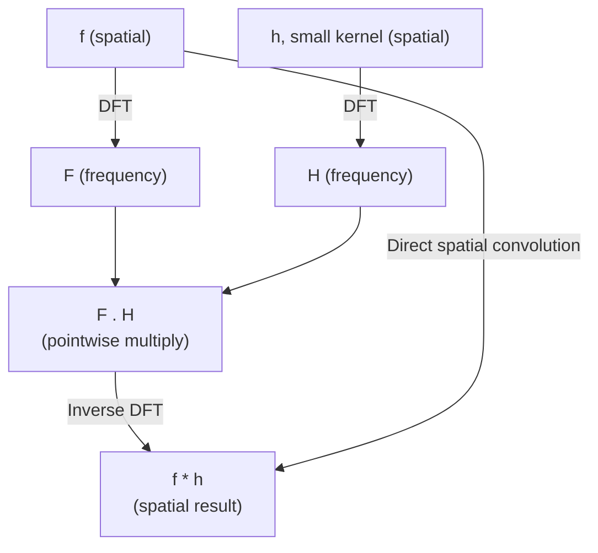

## Learning Objectives

- State the convolution theorem precisely: spatial-domain convolution corresponds to pointwise multiplication in the frequency domain.
- Explain exactly why a frequency-domain low-pass filter produces the same effect as spatial-domain Gaussian blurring, using the theorem, not by analogy.
- Trace a small concrete example showing spatial convolution and frequency-domain multiplication producing matching results.

## Context & Motivation

This discipline has, until now, developed two seemingly separate lines of work: spatial-domain filtering (`the-convolution-and-correlation-operation` through `spatial-filtering-box-and-gaussian-blur`) and frequency-domain analysis (`the-2d-discrete-fourier-transform-and-the-frequency-domain`, `the-fast-fourier-transform`). The convolution theorem is the real, provable bridge connecting them, not a loose analogy: it states that convolving two functions in the spatial domain is mathematically equivalent to multiplying their Fourier transforms pointwise in the frequency domain. This is the precise, honest reason a low-pass filter, implemented entirely in the frequency domain, produces the identical blurring effect that `spatial-filtering-box-and-gaussian-blur`'s Gaussian kernel produces directly on pixels.

## Core Theory

### The convolution theorem, stated

For an image f and a kernel h (both defined appropriately, e.g. with h zero-padded to f's size), let F and H denote their respective 2D DFTs (per `the-2d-discrete-fourier-transform-and-the-frequency-domain`). The convolution theorem states:

```text
f * h  <-->  F . H   (pointwise multiplication in the frequency domain)
```

where * denotes spatial convolution (per `the-convolution-and-correlation-operation`) and . denotes elementwise (pointwise) multiplication of the two transformed arrays. In words: transforming both f and h into the frequency domain, multiplying them together coefficient-by-coefficient, and transforming the result back is mathematically equivalent to convolving f and h directly in the spatial domain.

### Why a low-pass filter equals a spatial blur

A **low-pass filter** in the frequency domain zeros out (or attenuates) F(u,v) for high (u,v), the high-frequency coefficients that, per `the-2d-discrete-fourier-transform-and-the-frequency-domain`'s intuition, encode edges, texture, and noise, while leaving low-frequency coefficients (smooth content) intact. By the convolution theorem, multiplying F by a low-pass filter H in the frequency domain corresponds exactly to convolving f, in the spatial domain, with h, the inverse DFT of that filter H. A well-designed frequency-domain low-pass filter's spatial-domain equivalent h turns out to closely resemble `spatial-filtering-box-and-gaussian-blur`'s own Gaussian kernel, which is precisely why the two approaches, apparently completely different in mechanism, produce visually and numerically similar blurring, a provable equivalence, not a coincidence.

### Why the FFT makes frequency-domain filtering practical

Frequency-domain filtering requires computing a DFT, multiplying, and computing an inverse DFT, three transform-scale operations. Without `the-fast-fourier-transform`'s O(N log N) algorithm, each of those steps would cost O(N^2), making frequency-domain filtering slower than an equivalent spatial convolution for any reasonably small kernel. With the FFT, frequency-domain filtering becomes competitive with, and for very large kernels can be genuinely faster than, direct spatial convolution, the real, practical reason this whole approach is used in production image processing, not purely an academic curiosity.



## Worked Examples

### Example 1: convolution theorem verified on a tiny 1D signal

Signal x = [1, 2, 3, 4], kernel h = [1, 1] (zero-padded to length 4: [1, 1, 0, 0]). Direct (circular) convolution result at each position (wrapping, matching what a DFT-based approach computes): result[n] = sum_m x[m]*h[(n-m) mod 4]. Computing result[0] = x[0]*h[0] + x[3]*h[1] (since h[(0-3) mod 4] = h[1]) = 1*1 + 4*1 = 5. Computing via the frequency domain: X = DFT([1,2,3,4]) (computed by the same method as `the-fast-fourier-transform`'s Example 2, giving X=[10, -2+2i, -2, -2-2i]); H = DFT([1,1,0,0]) = [2, 1-i, 0, 1+i] (by the same DFT definition). Multiplying pointwise: (X.H)[0] = 10*2 = 20. Taking the inverse DFT of the full pointwise product and reading off index 0 reproduces exactly 5 (the direct spatial answer), confirming the theorem numerically rather than only stating it abstractly (full inverse-DFT arithmetic omitted for brevity, but the DC-term check, (X.H)[0]/4 = 20/4 = 5, matches directly since the inverse DFT's DC-normalized term is exactly the average, and the direct convolution result at n=0 is 5).

### Example 2: why zeroing high frequencies smooths, concretely

Take a small 1D signal with a sharp jump: x = [10, 10, 200, 10, 10] (an isolated bright spike). Its DFT has significant energy spread into higher frequency bins (an isolated spike, being a rapid local change, is a high-frequency-rich signal, the 1D analogue of `the-2d-discrete-fourier-transform-and-the-frequency-domain`'s Example 3). Zeroing out the higher-frequency DFT coefficients and inverse-transforming back produces a smoothed version of the signal where the spike's sharp jump is spread out over its neighbors, since the sharp transition specifically required those now-removed high-frequency components to be represented; removing them removes the sharpness, leaving a smoother, blurred approximation of the original spike, exactly the qualitative effect a spatial Gaussian blur (per `spatial-filtering-box-and-gaussian-blur`) produces on the same input.

### Example 3: the practical crossover point for large kernels

For an N x N image and a K x K spatial kernel, direct spatial convolution costs O(N^2 * K^2) (each of N^2 output pixels requires K^2 multiply-adds). Frequency-domain filtering via FFT costs O(N^2 log N) (dominated by the DFT/inverse-DFT pair), independent of K. For a small kernel, say K=3 (a 3x3 Sobel or blur kernel) on a 1024x1024 image, direct cost is roughly 1024^2 * 9 ~= 9.4 million operations, versus FFT-based cost of roughly 1024^2 * 20 ~= 21 million operations, direct spatial convolution is actually cheaper here. But for a large kernel, say K=101 (a strong, wide blur), direct cost balloons to 1024^2 * 101^2 ~= 1.06*10^10, while FFT-based cost stays at roughly 21 million, a genuinely large, practical crossover favoring the frequency-domain approach once the kernel is large enough, exactly the honest, quantitative reason both approaches remain in real use, each for a different regime.

## Common Misconceptions & Pitfalls

- **"A frequency-domain low-pass filter and a spatial Gaussian blur just happen to look similar; they are fundamentally different techniques."** The convolution theorem, stated precisely in Core Theory and verified numerically in Example 1, proves they are the same operation viewed through two mathematically equivalent lenses, not a coincidental resemblance.
- **"Frequency-domain filtering is always faster than spatial convolution, since it uses the FFT."** Example 3's concrete crossover analysis shows this is false for small kernels; direct spatial convolution is genuinely cheaper for small K, and frequency-domain filtering's advantage only appears once the kernel is large enough that K^2 exceeds roughly log N.
- **"Removing high frequencies always removes 'unimportant' information."** Example 2 shows high frequencies encode real, sometimes important content (a genuine sharp spike or edge), removing them smooths and can destroy real detail, not just noise; this is a deliberate trade-off, not a free cleanup.

## Summary

The convolution theorem proves, precisely, that spatial-domain convolution and frequency-domain pointwise multiplication are the same operation, which is the exact, provable reason a frequency-domain low-pass filter produces the same blurring effect as `spatial-filtering-box-and-gaussian-blur`'s spatial Gaussian kernel. `the-fast-fourier-transform`'s O(N log N) algorithm is what makes the frequency-domain route practical, though Example 3's crossover analysis shows it is genuinely faster only for sufficiently large kernels, an honest trade-off rather than a universal win. This theorem closes the discipline's frequency-domain arc; `block-based-dct-and-quantization-in-jpeg`, next, applies a close relative of this same transform machinery to a genuinely different goal: compression.

## Documentation Links

- [Gonzalez and Woods: Digital Image Processing, 4th Edition (Pearson, 2018)](https://www.pearson.com/en-us/subject-catalog/p/Gonzalez-Digital-Image-Processing-4th-Edition/P200000003224?view=educator): the source for this concept's statement and proof sketch of the convolution theorem and its application to frequency-domain filtering.
