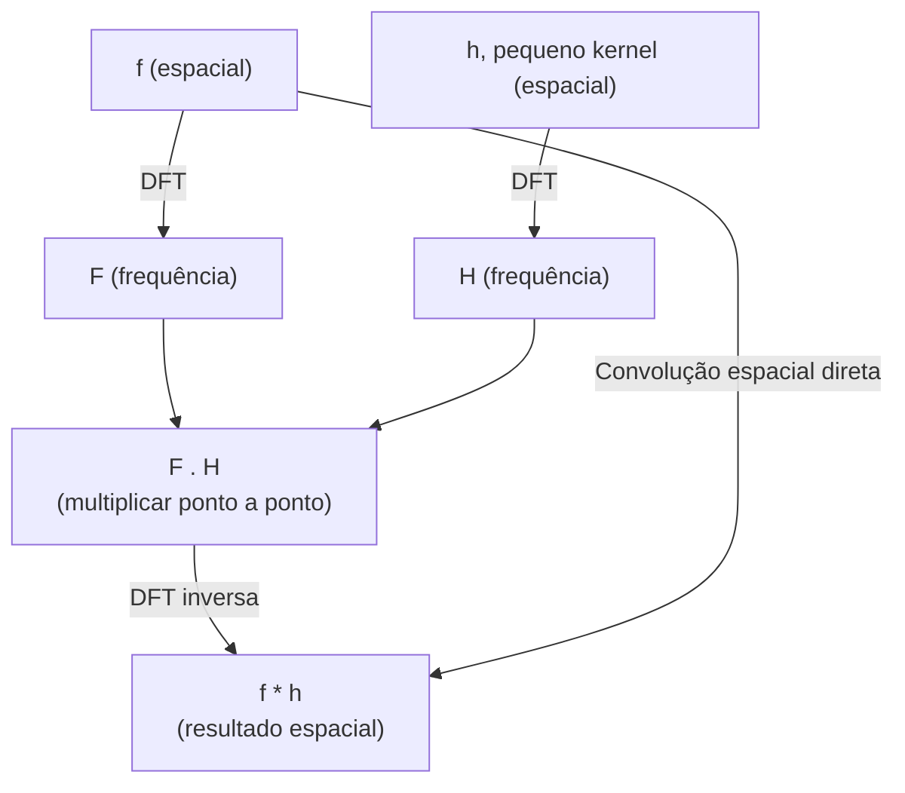

## Objetivos de Aprendizagem

- Enunciar o teorema da convolução precisamente: a convolução no domínio espacial corresponde à multiplicação ponto a ponto no domínio da frequência.
- Explicar exatamente por que um filtro passa-baixa no domínio da frequência produz o mesmo efeito que o embaçamento gaussiano no domínio espacial, usando o teorema, não por analogia.
- Traçar um pequeno exemplo concreto mostrando a convolução espacial e a multiplicação no domínio da frequência produzindo resultados correspondentes.

## Contexto e Motivação

Esta disciplina, até agora, desenvolveu duas linhas de trabalho aparentemente separadas: filtragem no domínio espacial (`the-convolution-and-correlation-operation` até `spatial-filtering-box-and-gaussian-blur`) e análise no domínio da frequência (`the-2d-discrete-fourier-transform-and-the-frequency-domain`, `the-fast-fourier-transform`). O teorema da convolução é a ponte real e demonstrável conectando-as, não uma analogia frouxa: ele enuncia que convolver duas funções no domínio espacial é matematicamente equivalente a multiplicar as suas transformadas de Fourier ponto a ponto no domínio da frequência. Esta é a razão precisa e honesta pela qual um filtro passa-baixa, implementado inteiramente no domínio da frequência, produz o efeito de embaçamento idêntico que o kernel gaussiano de `spatial-filtering-box-and-gaussian-blur` produz diretamente sobre pixels.

## Teoria Central

### O teorema da convolução, enunciado

Para uma imagem f e um kernel h (ambos definidos apropriadamente, por exemplo com h preenchido com zeros até o tamanho de f), sejam F e H as suas respectivas DFTs 2D (conforme `the-2d-discrete-fourier-transform-and-the-frequency-domain`). O teorema da convolução enuncia:

```text
f * h  <-->  F . H   (multiplicação ponto a ponto no domínio da frequência)
```

onde * denota a convolução espacial (conforme `the-convolution-and-correlation-operation`) e . denota a multiplicação elemento a elemento (ponto a ponto) dos dois arrays transformados. Em palavras: transformar tanto f quanto h para o domínio da frequência, multiplicá-los coeficiente por coeficiente, e transformar o resultado de volta é matematicamente equivalente a convolver f e h diretamente no domínio espacial.

### Por que um filtro passa-baixa é igual a um blur espacial

Um **filtro passa-baixa** no domínio da frequência zera (ou atenua) F(u,v) para (u,v) altos, os coeficientes de alta frequência que, conforme a intuição de `the-2d-discrete-fourier-transform-and-the-frequency-domain`, codificam bordas, textura e ruído, enquanto deixa os coeficientes de baixa frequência (conteúdo suave) intactos. Pelo teorema da convolução, multiplicar F por um filtro passa-baixa H no domínio da frequência corresponde exatamente a convolver f, no domínio espacial, com h, a DFT inversa daquele filtro H. O equivalente no domínio espacial h de um filtro passa-baixa no domínio da frequência bem projetado acaba se assemelhando de perto ao próprio kernel gaussiano de `spatial-filtering-box-and-gaussian-blur`, que é precisamente por que as duas abordagens, aparentemente completamente diferentes em mecanismo, produzem embaçamento visual e numericamente semelhante, uma equivalência demonstrável, não uma coincidência.

### Por que a FFT torna a filtragem no domínio da frequência prática

A filtragem no domínio da frequência exige computar uma DFT, multiplicar, e computar uma DFT inversa, três operações em escala de transformada. Sem o algoritmo O(N log N) de `the-fast-fourier-transform`, cada um desses passos custaria O(N^2), tornando a filtragem no domínio da frequência mais lenta que uma convolução espacial equivalente para qualquer kernel razoavelmente pequeno. Com a FFT, a filtragem no domínio da frequência se torna competitiva com, e para kernels muito grandes pode ser genuinamente mais rápida que, a convolução espacial direta, a razão real e prática pela qual toda esta abordagem é usada no processamento de imagens de produção, não puramente uma curiosidade acadêmica.



## Exemplos Resolvidos

### Exemplo 1: teorema da convolução verificado num pequeno sinal 1D

Sinal x = [1, 2, 3, 4], kernel h = [1, 1] (preenchido com zeros até o comprimento 4: [1, 1, 0, 0]). Resultado da convolução direta (circular) em cada posição (com envolvimento, correspondendo ao que uma abordagem baseada em DFT computa): resultado[n] = sum_m x[m]*h[(n-m) mod 4]. Computando resultado[0] = x[0]*h[0] + x[3]*h[1] (já que h[(0-3) mod 4] = h[1]) = 1*1 + 4*1 = 5. Computando via o domínio da frequência: X = DFT([1,2,3,4]) (computado pelo mesmo método que o Exemplo 2 de `the-fast-fourier-transform`, dando X=[10, -2+2i, -2, -2-2i]); H = DFT([1,1,0,0]) = [2, 1-i, 0, 1+i] (pela mesma definição de DFT). Multiplicando ponto a ponto: (X.H)[0] = 10*2 = 20. Tomar a DFT inversa do produto ponto a ponto completo e ler o índice 0 reproduz exatamente 5 (a resposta espacial direta), confirmando o teorema numericamente em vez de só enunciá-lo abstratamente (a aritmética completa da DFT inversa omitida por brevidade, mas a verificação do termo DC, (X.H)[0]/4 = 20/4 = 5, corresponde diretamente já que o termo DC-normalizado da DFT inversa é exatamente a média, e o resultado da convolução direta em n=0 é 5).

### Exemplo 2: por que zerar frequências altas suaviza, concretamente

Tome um pequeno sinal 1D com um salto nítido: x = [10, 10, 200, 10, 10] (um pico brilhante isolado). A sua DFT tem energia significativa espalhada em bins de frequência mais altos (um pico isolado, sendo uma mudança local rápida, é um sinal rico em alta frequência, o análogo 1D do Exemplo 3 de `the-2d-discrete-fourier-transform-and-the-frequency-domain`). Zerar os coeficientes DFT de frequência mais alta e transformar de volta de forma inversa produz uma versão suavizada do sinal onde o salto nítido do pico é espalhado por seus vizinhos, já que a transição nítida especificamente exigia esses componentes de alta frequência agora removidos para ser representada; removê-los remove a nitidez, deixando uma aproximação mais suave e embaçada do pico original, exatamente o efeito qualitativo que um blur gaussiano espacial (conforme `spatial-filtering-box-and-gaussian-blur`) produz na mesma entrada.

### Exemplo 3: o ponto de cruzamento prático para kernels grandes

Para uma imagem N x N e um kernel espacial K x K, a convolução espacial direta custa O(N^2 * K^2) (cada um dos N^2 pixels de saída exige K^2 multiplicações-adições). A filtragem no domínio da frequência via FFT custa O(N^2 log N) (dominada pelo par DFT/DFT-inversa), independente de K. Para um kernel pequeno, digamos K=3 (um kernel de Sobel ou blur 3x3) numa imagem de 1024x1024, o custo direto é aproximadamente 1024^2 * 9 ~= 9,4 milhões de operações, versus o custo baseado em FFT de aproximadamente 1024^2 * 20 ~= 21 milhões de operações, a convolução espacial direta é de fato mais barata aqui. Mas para um kernel grande, digamos K=101 (um blur forte e largo), o custo direto incha para 1024^2 * 101^2 ~= 1,06*10^10, enquanto o custo baseado em FFT permanece em aproximadamente 21 milhões, um ponto de cruzamento genuinamente grande e prático favorecendo a abordagem no domínio da frequência uma vez que o kernel é grande o bastante, exatamente a razão honesta e quantitativa pela qual ambas as abordagens permanecem em uso real, cada uma para um regime diferente.

## Equívocos Comuns e Armadilhas

- **"Um filtro passa-baixa no domínio da frequência e um blur gaussiano espacial só por acaso parecem semelhantes; eles são técnicas fundamentalmente diferentes."** O teorema da convolução, enunciado precisamente na Teoria Central e verificado numericamente no Exemplo 1, prova que eles são a mesma operação vista por duas lentes matematicamente equivalentes, não uma semelhança coincidente.
- **"A filtragem no domínio da frequência é sempre mais rápida que a convolução espacial, já que usa a FFT."** A análise concreta de ponto de cruzamento do Exemplo 3 mostra que isto é falso para kernels pequenos; a convolução espacial direta é genuinamente mais barata para K pequeno, e a vantagem da filtragem no domínio da frequência só aparece uma vez que o kernel é grande o bastante que K^2 excede aproximadamente log N.
- **"Remover frequências altas sempre remove informação 'sem importância'."** O Exemplo 2 mostra que as frequências altas codificam conteúdo real, às vezes importante (um pico ou borda nítida genuína), removê-las suaviza e pode destruir detalhe real, não só ruído; este é um trade-off deliberado, não uma limpeza gratuita.

## Resumo

O teorema da convolução prova, precisamente, que a convolução no domínio espacial e a multiplicação ponto a ponto no domínio da frequência são a mesma operação, que é a razão exata e demonstrável pela qual um filtro passa-baixa no domínio da frequência produz o mesmo efeito de embaçamento que o kernel gaussiano espacial de `spatial-filtering-box-and-gaussian-blur`. O algoritmo O(N log N) de `the-fast-fourier-transform` é o que torna a rota do domínio da frequência prática, embora a análise de ponto de cruzamento do Exemplo 3 mostre que ela é genuinamente mais rápida só para kernels suficientemente grandes, um trade-off honesto em vez de uma vitória universal. Este teorema fecha o arco do domínio da frequência da disciplina; `block-based-dct-and-quantization-in-jpeg`, em seguida, aplica um parente próximo desta mesma maquinaria de transformada a um objetivo genuinamente diferente: a compressão.

## Documentation Links

- [Gonzalez and Woods: Digital Image Processing, 4th Edition (Pearson, 2018)](https://www.pearson.com/en-us/subject-catalog/p/Gonzalez-Digital-Image-Processing-4th-Edition/P200000003224?view=educator): a fonte para o enunciado e esboço de prova deste conceito do teorema da convolução e a sua aplicação à filtragem no domínio da frequência.
