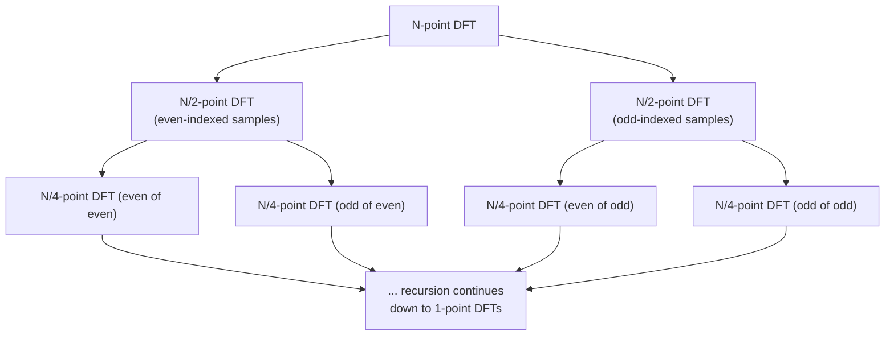

## Learning Objectives

- State the computational cost of a direct DFT (O(N^2)) versus the FFT (O(N log N)), and explain concretely where the saving comes from.
- Trace the Cooley-Tukey algorithm's even/odd split on a small concrete signal by hand.
- Explain why this efficiency gain is the real, practical reason frequency-domain image processing is feasible at all.

## Context & Motivation

`the-2d-discrete-fourier-transform-and-the-frequency-domain` defined the DFT and its frequency-domain intuition, but said nothing about how expensive it is to compute. Computed directly from its definition, an N-point DFT requires, for each of N output values, a sum over N terms, O(N^2) multiplications total. For a modest 256x256 image, treating each row and column as a 1D transform, that is a genuinely large number of operations, expensive enough that frequency-domain filtering would be impractical for real images at real sizes without a faster algorithm.

Cooley and Tukey's 1965 paper, "An Algorithm for the Machine Calculation of Complex Fourier Series," is the real, historic answer: a divide-and-conquer algorithm, the **Fast Fourier Transform (FFT)**, that computes the exact same DFT result in O(N log N) operations. This is not an approximation of the DFT; it is the identical mathematical result, computed by a smarter algorithm, exactly the kind of asymptotic-improvement result this curriculum's algorithms disciplines have already established the value of proving carefully rather than asserting.

## Core Theory

### The even/odd split

The Cooley-Tukey algorithm's key insight, for N a power of 2, is that an N-point DFT can be rewritten in terms of two N/2-point DFTs, one over the even-indexed samples, one over the odd-indexed samples:

```text
X[k] = E[k] + exp(-i*2*pi*k/N) * O[k]      for k = 0, ..., N/2-1
X[k+N/2] = E[k] - exp(-i*2*pi*k/N) * O[k]  for k = 0, ..., N/2-1
```

where E[k] is the N/2-point DFT of the even-indexed samples and O[k] is the N/2-point DFT of the odd-indexed samples. Each N/2-point DFT is, recursively, split the same way into two N/4-point DFTs, and so on, down to trivial 1-point DFTs (which are just the sample itself).

### Why this gives O(N log N)

There are log2(N) levels of recursive splitting (halving N each time until reaching size 1), and at each level, combining the sub-results into the next level up costs O(N) work total across all the sub-problems at that level (each of the twiddle-factor multiplications and additions shown above, applied N/2 times per level, doubled by symmetry). Total cost: O(N) work per level, times log2(N) levels, gives O(N log N), a real, asymptotically large improvement over the direct O(N^2) computation as N grows.



## Worked Examples

### Example 1: comparing operation counts directly

For N = 1024 (a realistic single row of a modest image): direct DFT cost is N^2 = 1,048,576 multiplications. FFT cost is N * log2(N) = 1024 * 10 = 10,240 multiplications, roughly 102 times fewer. For N = 1,000,000 (a large 1D signal, or comparable total pixel count), direct cost is 10^12 multiplications; FFT cost is 10^6 * ~20 = 2*10^7, a factor of roughly 50,000 fewer operations, the gap widening dramatically as N grows, exactly the asymptotic argument Core Theory makes concrete with numbers.

### Example 2: the even/odd split on a 4-point signal, by hand

Signal x = [1, 2, 3, 4], N=4. Even-indexed samples: [x[0], x[2]] = [1, 3]. Odd-indexed samples: [x[1], x[3]] = [2, 4]. Computing the 2-point DFTs directly (trivial base case, N=2: X[0]=x[0]+x[1], X[1]=x[0]-x[1]):

```text
E = DFT([1,3]) = [1+3, 1-3] = [4, -2]
O = DFT([2,4]) = [2+4, 2-4] = [6, -2]
```

Combining, using twiddle factor exp(-i*2*pi*k/4) for k=0,1 (values 1 and -i):

```text
X[0] = E[0] + exp(0)*O[0]     = 4 + 1*6  = 10
X[1] = E[1] + exp(-i*pi/2)*O[1] = -2 + (-i)*(-2) = -2 + 2i
X[2] = E[0] - exp(0)*O[0]     = 4 - 6 = -2
X[3] = E[1] - exp(-i*pi/2)*O[1] = -2 - 2i
```

Result: X = [10, -2+2i, -2, -2-2i]. Verifying X[0] directly from the DFT definition (sum of all samples with exp(0)=1 for k=0): 1+2+3+4 = 10, matching exactly, confirming the recursive computation reproduces the direct definition's result, just via a different, faster route.

### Example 3: why the recursion requires N to be a power of 2 (in this classic form)

Attempting the same even/odd split on N=6 samples: even-indexed = 3 samples, odd-indexed = 3 samples, each an N/2=3-point DFT, but 3 is not itself even, so the same halving trick cannot be applied again to reach a size-1 base case cleanly. This is the real, honest reason the classic radix-2 Cooley-Tukey algorithm, as shown above, is typically presented for N a power of 2; real FFT implementations handle other sizes (via mixed-radix variants or by zero-padding to the next power of 2), a genuine practical detail this concept names honestly rather than presenting the power-of-2 case as the whole story.

## Common Misconceptions & Pitfalls

- **"The FFT is an approximation of the DFT, faster but less accurate."** Example 2 confirms directly, by cross-checking X[0] against the DFT's own definition, that the FFT computes the mathematically identical result; the only difference is the number of arithmetic operations required, not the answer's correctness.
- **"O(N log N) versus O(N^2) is a minor, mostly theoretical improvement."** Example 1's concrete numbers, a 50,000-fold reduction in operations at N=1,000,000, show this is a large, practically decisive difference, the real reason frequency-domain processing of real-sized images and signals is computationally feasible at all.
- **"The FFT algorithm works for any signal length with no special handling."** Example 3 shows the classic radix-2 split genuinely requires N to be a power of 2 (or a related structured factorization); this is a real implementation constraint, addressed in practice but not a detail to gloss over.

## Summary

The Cooley-Tukey Fast Fourier Transform computes the exact same result as `the-2d-discrete-fourier-transform-and-the-frequency-domain`'s DFT definition, using a recursive even/odd split that reduces the cost from O(N^2) to O(N log N), a real, historically decisive efficiency gain (Example 1's numbers make this concrete) that is the specific, practical reason frequency-domain filtering of real images is feasible at all, not a purely theoretical curiosity. With an efficient way to move between the spatial and frequency domains now in hand, `the-convolution-theorem-and-frequency-domain-filtering`, next, connects this discipline's two halves: spatial-domain convolution and frequency-domain filtering.

## Documentation Links

- [Cooley, J.W. and Tukey, J.W.: An Algorithm for the Machine Calculation of Complex Fourier Series (Mathematics of Computation, 1965)](https://www.ece.ucdavis.edu/~bbaas/281/papers/CooleyTukey.1965.pdf): the original paper defining the recursive even/odd split this concept's worked examples trace by hand.
