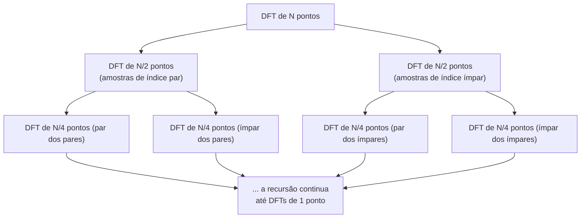

## Objetivos de Aprendizagem

- Enunciar o custo computacional de uma DFT direta (O(N^2)) versus a FFT (O(N log N)), e explicar concretamente de onde a economia vem.
- Traçar a divisão par/ímpar do algoritmo de Cooley-Tukey num pequeno sinal concreto à mão.
- Explicar por que este ganho de eficiência é a razão real e prática pela qual o processamento de imagens no domínio da frequência é viável de todo.

## Contexto e Motivação

`the-2d-discrete-fourier-transform-and-the-frequency-domain` definiu a DFT e a sua intuição de domínio da frequência, mas não disse nada sobre quão caro é computá-la. Computada diretamente da sua definição, uma DFT de N pontos exige, para cada um dos N valores de saída, uma soma sobre N termos, O(N^2) multiplicações no total. Para uma imagem modesta de 256x256, tratando cada linha e coluna como uma transformada 1D, esse é um número genuinamente grande de operações, caro o bastante que a filtragem no domínio da frequência seria impraticável para imagens reais em tamanhos reais sem um algoritmo mais rápido.

O artigo de Cooley e Tukey de 1965, "An Algorithm for the Machine Calculation of Complex Fourier Series", é a resposta real e histórica: um algoritmo de divisão e conquista, a **Transformada Rápida de Fourier (FFT)**, que computa o exato mesmo resultado da DFT em O(N log N) operações. Esta não é uma aproximação da DFT; é o resultado matemático idêntico, computado por um algoritmo mais inteligente, exatamente o tipo de resultado de melhoria assintótica cujo valor as disciplinas de algoritmos deste currículo já estabeleceram que vale a pena provar cuidadosamente em vez de afirmar.

## Teoria Central

### A divisão par/ímpar

O insight chave do algoritmo de Cooley-Tukey, para N uma potência de 2, é que uma DFT de N pontos pode ser reescrita em termos de duas DFTs de N/2 pontos, uma sobre as amostras de índice par, uma sobre as amostras de índice ímpar:

```text
X[k] = E[k] + exp(-i*2*pi*k/N) * O[k]      para k = 0, ..., N/2-1
X[k+N/2] = E[k] - exp(-i*2*pi*k/N) * O[k]  para k = 0, ..., N/2-1
```

onde E[k] é a DFT de N/2 pontos das amostras de índice par e O[k] é a DFT de N/2 pontos das amostras de índice ímpar. Cada DFT de N/2 pontos é, recursivamente, dividida da mesma forma em duas DFTs de N/4 pontos, e assim por diante, até DFTs triviais de 1 ponto (que são só a própria amostra).

### Por que isto dá O(N log N)

Há log2(N) níveis de divisão recursiva (reduzindo N pela metade a cada vez até alcançar tamanho 1), e em cada nível, combinar os subresultados no próximo nível acima custa O(N) de trabalho no total por entre todos os subproblemas naquele nível (cada uma das multiplicações de fator de rotação e adições mostradas acima, aplicada N/2 vezes por nível, dobrada por simetria). Custo total: O(N) de trabalho por nível, vezes log2(N) níveis, dá O(N log N), uma melhoria real e assintoticamente grande sobre a computação direta O(N^2) conforme N cresce.



## Exemplos Resolvidos

### Exemplo 1: comparando contagens de operações diretamente

Para N = 1024 (uma única linha realista de uma imagem modesta): o custo da DFT direta é N^2 = 1.048.576 multiplicações. O custo da FFT é N * log2(N) = 1024 * 10 = 10.240 multiplicações, aproximadamente 102 vezes menos. Para N = 1.000.000 (um grande sinal 1D, ou uma contagem total de pixels comparável), o custo direto é 10^12 multiplicações; o custo da FFT é 10^6 * ~20 = 2*10^7, um fator de aproximadamente 50.000 operações a menos, a diferença se alargando dramaticamente conforme N cresce, exatamente o argumento assintótico que a Teoria Central torna concreto com números.

### Exemplo 2: a divisão par/ímpar num sinal de 4 pontos, à mão

Sinal x = [1, 2, 3, 4], N=4. Amostras de índice par: [x[0], x[2]] = [1, 3]. Amostras de índice ímpar: [x[1], x[3]] = [2, 4]. Computando as DFTs de 2 pontos diretamente (caso base trivial, N=2: X[0]=x[0]+x[1], X[1]=x[0]-x[1]):

```text
E = DFT([1,3]) = [1+3, 1-3] = [4, -2]
O = DFT([2,4]) = [2+4, 2-4] = [6, -2]
```

Combinando, usando o fator de rotação exp(-i*2*pi*k/4) para k=0,1 (valores 1 e -i):

```text
X[0] = E[0] + exp(0)*O[0]     = 4 + 1*6  = 10
X[1] = E[1] + exp(-i*pi/2)*O[1] = -2 + (-i)*(-2) = -2 + 2i
X[2] = E[0] - exp(0)*O[0]     = 4 - 6 = -2
X[3] = E[1] - exp(-i*pi/2)*O[1] = -2 - 2i
```

Resultado: X = [10, -2+2i, -2, -2-2i]. Verificando X[0] diretamente da definição da DFT (soma de todas as amostras com exp(0)=1 para k=0): 1+2+3+4 = 10, correspondendo exatamente, confirmando que a computação recursiva reproduz o resultado da definição direta, só que por uma rota diferente e mais rápida.

### Exemplo 3: por que a recursão exige N ser uma potência de 2 (nesta forma clássica)

Tentar a mesma divisão par/ímpar em N=6 amostras: índice par = 3 amostras, índice ímpar = 3 amostras, cada uma uma DFT de N/2=3 pontos, mas 3 não é ele mesmo par, então o mesmo truque de redução pela metade não pode ser aplicado novamente para alcançar um caso base de tamanho 1 de forma limpa. Esta é a razão real e honesta pela qual o algoritmo clássico radix-2 de Cooley-Tukey, como mostrado acima, é tipicamente apresentado para N uma potência de 2; implementações de FFT reais tratam outros tamanhos (via variantes de radix misto ou preenchendo com zeros até a próxima potência de 2), um detalhe prático genuíno que este conceito nomeia honestamente em vez de apresentar o caso de potência de 2 como a história inteira.

## Equívocos Comuns e Armadilhas

- **"A FFT é uma aproximação da DFT, mais rápida mas menos acurada."** O Exemplo 2 confirma diretamente, cruzando X[0] contra a própria definição da DFT, que a FFT computa o resultado matematicamente idêntico; a única diferença é o número de operações aritméticas exigidas, não a corretude da resposta.
- **"O(N log N) versus O(N^2) é uma melhoria menor e majoritariamente teórica."** Os números concretos do Exemplo 1, uma redução de 50.000 vezes nas operações em N=1.000.000, mostram que esta é uma diferença grande e praticamente decisiva, a razão real pela qual o processamento no domínio da frequência de imagens e sinais de tamanho real é computacionalmente viável de todo.
- **"O algoritmo da FFT funciona para qualquer comprimento de sinal sem nenhum tratamento especial."** O Exemplo 3 mostra que a divisão radix-2 clássica genuinamente exige N ser uma potência de 2 (ou uma fatoração estruturada relacionada); esta é uma restrição de implementação real, abordada na prática mas não um detalhe para ignorar.

## Resumo

A Transformada Rápida de Fourier de Cooley-Tukey computa o exato mesmo resultado que a definição da DFT de `the-2d-discrete-fourier-transform-and-the-frequency-domain`, usando uma divisão par/ímpar recursiva que reduz o custo de O(N^2) para O(N log N), um ganho de eficiência real e historicamente decisivo (os números do Exemplo 1 tornam isto concreto) que é a razão específica e prática pela qual a filtragem de imagens reais no domínio da frequência é viável de todo, não uma curiosidade puramente teórica. Com uma forma eficiente de se mover entre os domínios espacial e da frequência agora em mãos, `the-convolution-theorem-and-frequency-domain-filtering`, em seguida, conecta as duas metades desta disciplina: a convolução no domínio espacial e a filtragem no domínio da frequência.

## Documentation Links

- [Cooley, J.W. and Tukey, J.W.: An Algorithm for the Machine Calculation of Complex Fourier Series (Mathematics of Computation, 1965)](https://www.ece.ucdavis.edu/~bbaas/281/papers/CooleyTukey.1965.pdf): o artigo original definindo a divisão par/ímpar recursiva que os exemplos resolvidos deste conceito traçam à mão.
