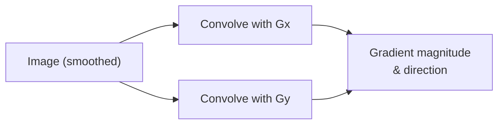

## Learning Objectives

- State the Sobel Gx and Gy kernels exactly, and explain what each approximates (horizontal and vertical intensity gradient) and why each also bakes in perpendicular smoothing.
- Compute gradient magnitude and direction at a pixel from Gx and Gy, by hand, on a concrete small image.
- Explain the real historical attribution of the Sobel operator honestly, without overstating a primary source that does not cleanly exist.

## Context & Motivation

`spatial-filtering-box-and-gaussian-blur` built the smoothing machinery this concept now depends on as a preprocessing step. Here, the same convolution mechanic from `the-convolution-and-correlation-operation` is aimed at a different goal: not smoothing away variation, but detecting it. An **edge** is, by the most direct classical definition, a place where intensity changes sharply, and the Sobel operator is the standard, simple way to measure that change as a gradient.

This concept is also where `the-convolution-and-correlation-operation`'s correlation-versus-true-convolution distinction stops being a footnote: the Sobel kernels are asymmetric (their sign structure is what makes them detect a *directional* gradient, not just presence of variation), so whether an implementation treats them as convolution or correlation kernels genuinely changes the sign of the result, a detail worth getting right before building `the-canny-edge-detector`'s fuller pipeline on top.

## Core Theory

### The two Sobel kernels

The Sobel operator uses two fixed 3x3 kernels, approximating the partial derivative of image intensity in the x and y directions:

```text
Gx = [-1  0  1]      Gy = [-1 -2 -1]
     [-2  0  2]           [ 0  0  0]
     [-1  0  1]           [ 1  2  1]
```

Gx responds strongly where intensity changes left-to-right (a vertical edge), Gy where intensity changes top-to-bottom (a horizontal edge). Each kernel also contains a row or column of weights (2, 1, 1 pattern) perpendicular to its differencing direction, a small amount of smoothing along that axis, which is precisely why the Sobel operator is somewhat more noise-tolerant than a bare, unsmoothed difference operator would be, though real pipelines like `the-canny-edge-detector` still add an explicit Gaussian smoothing pass before this step for stronger noise suppression.

### Historical attribution, stated honestly

The Sobel operator is real and historically attributed, but not through a clean, formally published primary source: Irwin Sobel and Gary Feldman presented it as an "Isotropic 3x3 Image Gradient Operator" in an unpublished talk at the Stanford Artificial Intelligence Laboratory in 1968. It became widely known through secondary citation, notably in Duda and Hart's 1973 textbook *Pattern Classification and Scene Analysis*, and is consistently, correctly credited as the Sobel (or Sobel-Feldman) operator across the field despite the absence of a single citable original paper, an honest historical detail worth stating plainly rather than fabricating a primary-source citation that does not actually exist.

### Gradient magnitude and direction

Given the two convolution results Gx(x,y) and Gy(x,y) at a pixel, the gradient magnitude and direction are:

```text
magnitude(x,y) = sqrt(Gx(x,y)^2 + Gy(x,y)^2)
direction(x,y) = atan2(Gy(x,y), Gx(x,y))
```

Magnitude answers "how strong is the intensity change here" (a large value means a likely edge); direction answers "which way does the edge run," information `the-canny-edge-detector`'s non-maximum suppression step depends on directly.



## Worked Examples

### Example 1: Gx and Gy at one pixel, by hand

Using `digital-images-as-discrete-functions`'s 4x4 image, computing the gradient at pixel (1,1) (value 200), whose 3x3 neighborhood is:

```text
[ 10  10 200]
[ 10 200  10]
[200  10  10]
```

Applying Gx (element-wise multiply, then sum):

```text
Gx = (-1*10)+(0*10)+(1*200) + (-2*10)+(0*200)+(2*10) + (-1*200)+(0*10)+(1*10)
   = (-10+0+200) + (-20+0+20) + (-200+0+10)
   = 190 + 0 + (-190)
   = 0
```

Applying Gy on the same neighborhood:

```text
Gy = (-1*10)+(-2*10)+(-1*200) + (0*10)+(0*200)+(0*10) + (1*200)+(2*10)+(1*10)
   = (-10-20-200) + 0 + (200+20+10)
   = -230 + 0 + 230
   = 0
```

Both Gx and Gy are 0 at this pixel: the neighborhood is symmetric around the center in a way that cancels both directional gradients exactly, a genuine, instructive edge case showing the Sobel operator can miss a diagonal-only pattern that a human eye reads as clearly non-uniform, since neither axis-aligned kernel responds to a pure diagonal gradient the way a diagonal-oriented kernel would.

### Example 2: a pixel with a real, nonzero gradient

Neighborhood centered at pixel (2,0) (value 200), reading the image with zero-padding above row 0:

```text
[  0   0   0]     (padded row, out of bounds)
[ 10  10 200]
[200  10  10]
```

Gx = (-1*0)+(0*0)+(1*0) + (-2*10)+(0*10)+(2*200) + (-1*200)+(0*10)+(1*10)
   = 0 + (-20+0+400) + (-200+0+10)
   = 0 + 380 + (-190) = 190

Gy = (-1*0)+(-2*0)+(-1*0) + (0*10)+(0*10)+(0*200) + (1*200)+(2*10)+(1*10)
   = 0 + 0 + (200+20+10) = 230

magnitude = sqrt(190^2 + 230^2) = sqrt(36100 + 52900) = sqrt(89000) ~= 298.33
direction = atan2(230, 190) ~= 50.4 degrees

A strong, clearly nonzero gradient here, correctly flagging this boundary-adjacent bright pixel as an edge candidate, in contrast to Example 1's interior pixel where the surrounding pattern canceled out.

### Example 3: convolution versus correlation changes the sign

Recall from `the-convolution-and-correlation-operation` that true convolution flips the kernel before sliding it. Flipping Gx by 180 degrees:

```text
Gx (original) = [-1 0 1]      Gx (flipped) = [1 0 -1]
                [-2 0 2]                     [2 0 -2]
                [-1 0 1]                     [1 0 -1]
```

Recomputing Example 2's Gx using the flipped kernel on the same neighborhood gives -190 instead of +190, the exact negative. Since gradient magnitude squares this value, magnitude is unaffected, but direction (atan2) flips by 180 degrees, confirming concretely that convolution versus correlation is not a cosmetic distinction for an asymmetric kernel like Sobel's: it changes which way the algorithm reports the edge as pointing.

## Common Misconceptions & Pitfalls

- **"A zero gradient always means no edge is present."** Example 1 shows a genuinely non-uniform 3x3 neighborhood can still produce a zero Sobel gradient, because Gx and Gy each only detect axis-aligned intensity change; a purely diagonal pattern can cancel both, a real, acknowledged limitation of this specific operator.
- **"The Sobel operator has one clean, citable original paper, like Canny's."** Stated honestly in Core Theory: it comes from an unpublished 1968 talk, widely and consistently attributed, but without a single formal primary-source paper, a genuinely different citation situation from `the-canny-edge-detector`'s clean 1986 IEEE paper.
- **"Convolution versus correlation only matters for symmetric kernels."** Example 3 shows the opposite is true: for a symmetric kernel like a box blur it makes no difference, but for Sobel's genuinely asymmetric kernels, it flips the reported gradient direction by 180 degrees, a real, consequential effect for any implementation that mixes the two conventions inconsistently.

## Summary

The Sobel operator's two fixed 3x3 kernels, Gx and Gy, approximate horizontal and vertical intensity gradients using the exact convolution mechanic `the-convolution-and-correlation-operation` defined, from which gradient magnitude and direction identify candidate edges, the classic, direct definition of "edge" as a location of sharp intensity change. Historically attributed to Sobel and Feldman's unpublished 1968 talk, a real, consistently cited but not cleanly primary-sourced attribution, this operator's raw output (a noisy, thick gradient map, per Example 1's blind spot) is exactly what `the-canny-edge-detector`'s fuller, four-stage pipeline refines next into clean, thin, well-localized edges.

## Documentation Links

- [Wikipedia: Sobel Operator](https://en.wikipedia.org/wiki/Sobel_operator): the source for this concept's honest historical attribution to Sobel and Feldman's unpublished 1968 Stanford Artificial Intelligence Laboratory talk, and its secondary citation in Duda and Hart (1973).
- [Gonzalez and Woods: Digital Image Processing, 4th Edition (Pearson, 2018)](https://www.pearson.com/en-us/subject-catalog/p/Gonzalez-Digital-Image-Processing-4th-Edition/P200000003224?view=educator): the source for this concept's Sobel kernel definitions and gradient magnitude/direction formulas.
