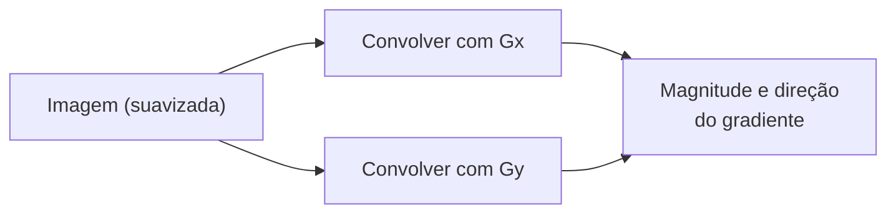

## Objetivos de Aprendizagem

- Enunciar os kernels Gx e Gy de Sobel exatamente, e explicar o que cada um aproxima (gradiente de intensidade horizontal e vertical) e por que cada um também incorpora suavização perpendicular.
- Computar a magnitude e a direção do gradiente num pixel a partir de Gx e Gy, à mão, numa pequena imagem concreta.
- Explicar a atribuição histórica real do operador de Sobel honestamente, sem exagerar uma fonte primária que não existe de forma limpa.

## Contexto e Motivação

`spatial-filtering-box-and-gaussian-blur` construiu a maquinaria de suavização da qual este conceito agora depende como um passo de pré-processamento. Aqui, a mesma mecânica de convolução de `the-convolution-and-correlation-operation` é apontada para um objetivo diferente: não suavizar a variação, mas detectá-la. Uma **borda** é, pela definição clássica mais direta, um lugar onde a intensidade muda nitidamente, e o operador de Sobel é a forma padrão e simples de medir essa mudança como um gradiente.

Este conceito é também onde a distinção de correlação-versus-convolução-verdadeira de `the-convolution-and-correlation-operation` deixa de ser uma nota de rodapé: os kernels de Sobel são assimétricos (a sua estrutura de sinal é o que os faz detectar um gradiente *direcional*, não só a presença de variação), então se uma implementação os trata como kernels de convolução ou de correlação genuinamente muda o sinal do resultado, um detalhe que vale a pena acertar antes de construir o pipeline mais completo de `the-canny-edge-detector` por cima.

## Teoria Central

### Os dois kernels de Sobel

O operador de Sobel usa dois kernels 3x3 fixos, aproximando a derivada parcial da intensidade da imagem nas direções x e y:

```text
Gx = [-1  0  1]      Gy = [-1 -2 -1]
     [-2  0  2]           [ 0  0  0]
     [-1  0  1]           [ 1  2  1]
```

Gx responde fortemente onde a intensidade muda da esquerda para a direita (uma borda vertical), Gy onde a intensidade muda de cima para baixo (uma borda horizontal). Cada kernel também contém uma linha ou coluna de pesos (padrão 2, 1, 1) perpendicular à sua direção de diferenciação, uma pequena quantidade de suavização ao longo daquele eixo, que é precisamente por que o operador de Sobel é um tanto mais tolerante a ruído do que um operador de diferença nu e não suavizado seria, embora pipelines reais como `the-canny-edge-detector` ainda adicionem uma passada explícita de suavização gaussiana antes deste passo para uma supressão de ruído mais forte.

### Atribuição histórica, enunciada honestamente

O operador de Sobel é real e historicamente atribuído, mas não por uma fonte primária limpa e formalmente publicada: Irwin Sobel e Gary Feldman o apresentaram como um "Isotropic 3x3 Image Gradient Operator" numa palestra não publicada no Stanford Artificial Intelligence Laboratory em 1968. Ele se tornou amplamente conhecido por citação secundária, notavelmente no livro-texto de Duda e Hart de 1973 *Pattern Classification and Scene Analysis*, e é consistentemente e corretamente creditado como o operador de Sobel (ou Sobel-Feldman) por toda a área apesar da ausência de um único artigo original citável, um detalhe histórico honesto que vale a pena enunciar claramente em vez de fabricar uma citação de fonte primária que de fato não existe.

### Magnitude e direção do gradiente

Dados os dois resultados de convolução Gx(x,y) e Gy(x,y) num pixel, a magnitude e a direção do gradiente são:

```text
magnitude(x,y) = sqrt(Gx(x,y)^2 + Gy(x,y)^2)
direcao(x,y) = atan2(Gy(x,y), Gx(x,y))
```

A magnitude responde "quão forte é a mudança de intensidade aqui" (um valor grande significa uma provável borda); a direção responde "para que lado a borda corre", informação da qual o passo de supressão de não-máximos de `the-canny-edge-detector` depende diretamente.



## Exemplos Resolvidos

### Exemplo 1: Gx e Gy num pixel, à mão

Usando a imagem de 4x4 de `digital-images-as-discrete-functions`, computando o gradiente no pixel (1,1) (valor 200), cuja vizinhança 3x3 é:

```text
[ 10  10 200]
[ 10 200  10]
[200  10  10]
```

Aplicando Gx (multiplicação elemento a elemento, depois soma):

```text
Gx = (-1*10)+(0*10)+(1*200) + (-2*10)+(0*200)+(2*10) + (-1*200)+(0*10)+(1*10)
   = (-10+0+200) + (-20+0+20) + (-200+0+10)
   = 190 + 0 + (-190)
   = 0
```

Aplicando Gy na mesma vizinhança:

```text
Gy = (-1*10)+(-2*10)+(-1*200) + (0*10)+(0*200)+(0*10) + (1*200)+(2*10)+(1*10)
   = (-10-20-200) + 0 + (200+20+10)
   = -230 + 0 + 230
   = 0
```

Tanto Gx quanto Gy são 0 neste pixel: a vizinhança é simétrica em torno do centro de uma forma que cancela ambos os gradientes direcionais exatamente, um caso extremo genuíno e instrutivo mostrando que o operador de Sobel pode perder um padrão apenas-diagonal que um olho humano lê como claramente não uniforme, já que nenhum kernel alinhado aos eixos responde a um gradiente puramente diagonal da forma que um kernel orientado diagonalmente responderia.

### Exemplo 2: um pixel com um gradiente real e diferente de zero

Vizinhança centrada no pixel (2,0) (valor 200), lendo a imagem com preenchimento com zeros acima da linha 0:

```text
[  0   0   0]     (linha preenchida, fora dos limites)
[ 10  10 200]
[200  10  10]
```

Gx = (-1*0)+(0*0)+(1*0) + (-2*10)+(0*10)+(2*200) + (-1*200)+(0*10)+(1*10)
   = 0 + (-20+0+400) + (-200+0+10)
   = 0 + 380 + (-190) = 190

Gy = (-1*0)+(-2*0)+(-1*0) + (0*10)+(0*10)+(0*200) + (1*200)+(2*10)+(1*10)
   = 0 + 0 + (200+20+10) = 230

magnitude = sqrt(190^2 + 230^2) = sqrt(36100 + 52900) = sqrt(89000) ~= 298,33
direcao = atan2(230, 190) ~= 50,4 graus

Um gradiente forte e claramente diferente de zero aqui, corretamente sinalizando este pixel brilhante adjacente à borda como um candidato a borda, em contraste com o pixel interior do Exemplo 1 onde o padrão circundante se cancelou.

### Exemplo 3: convolução versus correlação muda o sinal

Lembre de `the-convolution-and-correlation-operation` que a convolução verdadeira inverte o kernel antes de deslizá-lo. Invertendo Gx em 180 graus:

```text
Gx (original) = [-1 0 1]      Gx (invertido) = [1 0 -1]
                [-2 0 2]                       [2 0 -2]
                [-1 0 1]                       [1 0 -1]
```

Recomputar o Gx do Exemplo 2 usando o kernel invertido na mesma vizinhança dá -190 em vez de +190, o exato negativo. Já que a magnitude do gradiente eleva este valor ao quadrado, a magnitude não é afetada, mas a direção (atan2) inverte em 180 graus, confirmando concretamente que a convolução versus correlação não é uma distinção cosmética para um kernel assimétrico como o de Sobel: ela muda para que lado o algoritmo relata que a borda está apontando.

## Equívocos Comuns e Armadilhas

- **"Um gradiente zero sempre significa que nenhuma borda está presente."** O Exemplo 1 mostra que uma vizinhança 3x3 genuinamente não uniforme ainda pode produzir um gradiente de Sobel zero, porque Gx e Gy cada um só detecta mudança de intensidade alinhada aos eixos; um padrão puramente diagonal pode cancelar ambos, uma limitação real e reconhecida deste operador específico.
- **"O operador de Sobel tem um artigo original limpo e citável, como o de Canny."** Enunciado honestamente na Teoria Central: ele vem de uma palestra não publicada de 1968, amplamente e consistentemente atribuída, mas sem um único artigo de fonte primária formal, uma situação de citação genuinamente diferente do artigo IEEE limpo de 1986 de `the-canny-edge-detector`.
- **"Convolução versus correlação só importa para kernels simétricos."** O Exemplo 3 mostra que o oposto é verdadeiro: para um kernel simétrico como um blur de caixa não faz nenhuma diferença, mas para os kernels genuinamente assimétricos de Sobel, ela inverte a direção de gradiente relatada em 180 graus, um efeito real e consequente para qualquer implementação que misture as duas convenções de forma inconsistente.

## Resumo

Os dois kernels 3x3 fixos do operador de Sobel, Gx e Gy, aproximam os gradientes de intensidade horizontal e vertical usando a exata mecânica de convolução que `the-convolution-and-correlation-operation` definiu, a partir dos quais a magnitude e a direção do gradiente identificam bordas candidatas, a definição clássica e direta de "borda" como uma localização de mudança nítida de intensidade. Historicamente atribuído à palestra não publicada de 1968 de Sobel e Feldman, uma atribuição real e consistentemente citada mas não com fonte primária limpa, a saída bruta deste operador (um mapa de gradiente ruidoso e grosso, conforme o ponto cego do Exemplo 1) é exatamente o que o pipeline mais completo de quatro estágios de `the-canny-edge-detector` refina em seguida em bordas limpas, finas e bem localizadas.

## Documentation Links

- [Wikipedia: Sobel Operator](https://en.wikipedia.org/wiki/Sobel_operator): a fonte para a atribuição histórica honesta deste conceito à palestra não publicada de 1968 de Sobel e Feldman no Stanford Artificial Intelligence Laboratory, e a sua citação secundária em Duda e Hart (1973).
- [Gonzalez and Woods: Digital Image Processing, 4th Edition (Pearson, 2018)](https://www.pearson.com/en-us/subject-catalog/p/Gonzalez-Digital-Image-Processing-4th-Edition/P200000003224?view=educator): a fonte para as definições de kernel de Sobel e as fórmulas de magnitude/direção de gradiente deste conceito.
