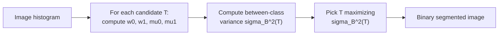

## Learning Objectives

- Apply a global intensity threshold to segment an image into two classes, and explain the honest limitation of choosing that threshold by hand.
- Compute Otsu's optimal threshold from a small concrete intensity histogram, by hand, using between-class variance.
- Explain what criterion Otsu's method actually maximizes, and why that criterion is a reasonable, principled definition of a "good" threshold.

## Context & Motivation

`grayscale-color-and-color-spaces` established that a grayscale image is a single-channel intensity function. Segmentation, the task of splitting an image into meaningful regions, starts here with the simplest possible technique: thresholding, splitting pixels into two classes purely by intensity. This is a genuinely classical, pre-deep-learning technique, distinct from semantic segmentation networks that classify pixels using learned features; this discipline's scope, as `digital-images-as-discrete-functions` states, is the fixed, hand-designed tradition, and Otsu's 1979 method is the classic example of a fixed, closed-form rule for choosing that threshold automatically rather than by trial and error.

## Core Theory

### Global thresholding

Given a grayscale image and a threshold value T, a binary output image is produced:

```text
g(x,y) = 1 (foreground) if f(x,y) > T
g(x,y) = 0 (background) otherwise
```

The honest limitation: picking T by eye, or by a fixed rule like "half of the maximum intensity," works only when the image's foreground and background intensities are cleanly separated and the analyst knows roughly where. A real image's histogram is not always known in advance, and a threshold tuned for one image often fails on the next.

### Otsu's method: choosing T from the histogram itself

Otsu's 1979 method removes the guesswork by choosing T directly from the image's own intensity histogram, using a real, precise optimality criterion. For a candidate threshold T, it splits the histogram's pixel population into two classes, C0 (intensities <= T) and C1 (intensities > T), and computes the **between-class variance**:

```text
sigma_B^2(T) = w0(T) * w1(T) * (mu0(T) - mu1(T))^2
```

where w0, w1 are the fraction of pixels in each class, and mu0, mu1 are each class's mean intensity. Otsu's method exhaustively tries every possible threshold value and picks the T that **maximizes** sigma_B^2(T), which is exactly equivalent (a real, provable identity, since total variance is fixed for a given image) to **minimizing** the within-class variance, the intuitive goal of making each class as internally homogeneous as possible while making the two classes as different from each other as possible.



## Worked Examples

### Example 1: a small, clean bimodal histogram

An image with only 8 pixels, intensities: [10, 15, 12, 18, 200, 210, 195, 205]. Trying T = 100 as a candidate split:

```text
C0 (<=100): {10, 15, 12, 18}, w0 = 4/8 = 0.5, mu0 = (10+15+12+18)/4 = 55/4 = 13.75
C1 (>100):  {200, 210, 195, 205}, w1 = 4/8 = 0.5, mu1 = (200+210+195+205)/4 = 810/4 = 202.5

sigma_B^2(100) = 0.5 * 0.5 * (13.75 - 202.5)^2
               = 0.25 * (-188.75)^2
               = 0.25 * 35625.6
               = 8906.4
```

Trying T = 50 instead (an obviously worse split for this data): C0 = all 8 pixels (nothing exceeds 50... actually all pixels below 50 except the four ~200 values, so C0 = {10,15,12,18}, same as before since no value falls between 18 and 195). In this particular histogram, any T between 18 and 195 gives the identical partition and identical sigma_B^2 = 8906.4, correctly reflecting that this data has one clean gap and any threshold landing in that gap is equally optimal, exactly the well-separated case Otsu's method handles cleanly.

### Example 2: a harder histogram with three candidate thresholds compared

Intensities: [20, 40, 60, 80, 100, 120]. Comparing T=50 and T=90:

```text
T=50: C0={20,40}, w0=2/6, mu0=30; C1={60,80,100,120}, w1=4/6, mu1=90
  sigma_B^2 = (2/6)*(4/6)*(30-90)^2 = 0.2222 * 3600 = 800.0

T=90: C0={20,40,60,80}, w0=4/6, mu0=50; C1={100,120}, w1=2/6, mu1=110
  sigma_B^2 = (4/6)*(2/6)*(50-110)^2 = 0.2222 * 3600 = 800.0
```

Both candidates give the identical between-class variance for this evenly spaced data, showing Otsu's method can have multiple equally optimal thresholds when the underlying distribution has no single sharp separation, an honest, real outcome rather than always producing one uniquely obvious answer.

### Example 3: applying the chosen threshold to a small image

Reusing `digital-images-as-discrete-functions`'s 4x4 grayscale image (values 10 and 200 only), Otsu's method on this exact bimodal data (matching Example 1's structure) selects any T in the gap between 10 and 200, say T=100. Applying it:

```text
Original:              Binary output (T=100):
[ 10  10 200  10]      [0 0 1 0]
[ 10 200  10  10]      [0 1 0 0]
[200  10  10  10]      [1 0 0 0]
[ 10  10  10 200]      [0 0 0 1]
```

This binary output is exactly the input `region-growing-and-connected-component-labeling` and `morphological-erosion-and-dilation` operate on next, the direct handoff from thresholding to the rest of this discipline's segmentation and morphology work.

## Common Misconceptions & Pitfalls

- **"Otsu's method always finds one uniquely correct threshold."** Example 2 shows a real case where multiple threshold values tie for the maximum between-class variance; the method is optimal with respect to its specific criterion, not a guarantee of a single unambiguous answer for every image.
- **"Thresholding alone is a complete segmentation technique."** It only separates pixels by intensity value, with no notion of spatial connectivity, two disconnected bright regions with the same intensity are indistinguishable to thresholding alone, exactly the gap `region-growing-and-connected-component-labeling` fills next.
- **"Otsu's method requires trying every threshold to be practical."** It does require an exhaustive search over candidate thresholds in the naive formulation, but because the underlying histogram has a small, fixed number of intensity levels (256 for an 8-bit image), this is a cheap, bounded search in practice, not a genuinely expensive optimization.

## Summary

Global thresholding segments an image into two classes purely by intensity, and Otsu's 1979 method chooses that threshold automatically by maximizing the between-class variance across the image's own intensity histogram, a real, principled, still-standard technique for automatic threshold selection. Applied to `digital-images-as-discrete-functions`'s image representation, its binary output is exactly the input the next two concepts, region growing with connected-component labeling and morphological operations, build on directly.

## Documentation Links

- [Otsu, N.: A Threshold Selection Method from Gray-Level Histograms (IEEE Transactions on Systems, Man, and Cybernetics, 1979)](https://engineering.purdue.edu/kak/computervision/ECE661.08/OTSU_paper.pdf): the original paper defining the between-class variance criterion this concept's worked examples compute by hand.
- [Gonzalez and Woods: Digital Image Processing, 4th Edition (Pearson, 2018)](https://www.pearson.com/en-us/subject-catalog/p/Gonzalez-Digital-Image-Processing-4th-Edition/P200000003224?view=educator): a textbook-level treatment of global thresholding and Otsu's method, cross-referenced against the original paper.
