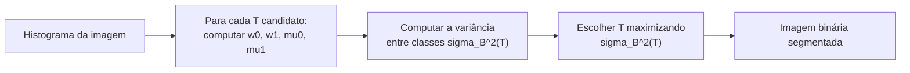

## Objetivos de Aprendizagem

- Aplicar um limiar de intensidade global para segmentar uma imagem em duas classes, e explicar a limitação honesta de escolher esse limiar à mão.
- Computar o limiar ótimo de Otsu a partir de um pequeno histograma de intensidade concreto, à mão, usando a variância entre classes.
- Explicar qual critério o método de Otsu de fato maximiza, e por que esse critério é uma definição razoável e fundamentada de um "bom" limiar.

## Contexto e Motivação

`grayscale-color-and-color-spaces` estabeleceu que uma imagem em tons de cinza é uma função de intensidade de canal único. A segmentação, a tarefa de dividir uma imagem em regiões significativas, começa aqui com a técnica mais simples possível: a limiarização, dividindo os pixels em duas classes puramente por intensidade. Esta é uma técnica genuinamente clássica e pré-deep-learning, distinta das redes de segmentação semântica que classificam pixels usando características aprendidas; o escopo desta disciplina, como `digital-images-as-discrete-functions` enuncia, é a tradição fixa e projetada à mão, e o método de Otsu de 1979 é o exemplo clássico de uma regra fixa e de forma fechada para escolher esse limiar automaticamente em vez de por tentativa e erro.

## Teoria Central

### Limiarização global

Dada uma imagem em tons de cinza e um valor de limiar T, uma imagem de saída binária é produzida:

```text
g(x,y) = 1 (primeiro plano) se f(x,y) > T
g(x,y) = 0 (fundo) caso contrário
```

A limitação honesta: escolher T a olho, ou por uma regra fixa como "metade da intensidade máxima", funciona só quando as intensidades de primeiro plano e de fundo da imagem estão limpamente separadas e o analista sabe aproximadamente onde. O histograma de uma imagem real nem sempre é conhecido de antemão, e um limiar ajustado para uma imagem frequentemente falha na próxima.

### O método de Otsu: escolhendo T a partir do próprio histograma

O método de Otsu de 1979 remove a adivinhação escolhendo T diretamente a partir do próprio histograma de intensidade da imagem, usando um critério de otimalidade real e preciso. Para um limiar candidato T, ele divide a população de pixels do histograma em duas classes, C0 (intensidades <= T) e C1 (intensidades > T), e computa a **variância entre classes**:

```text
sigma_B^2(T) = w0(T) * w1(T) * (mu0(T) - mu1(T))^2
```

onde w0, w1 são a fração de pixels em cada classe, e mu0, mu1 são a intensidade média de cada classe. O método de Otsu exaustivamente tenta todo valor de limiar possível e escolhe o T que **maximiza** sigma_B^2(T), que é exatamente equivalente (uma identidade real e demonstrável, já que a variância total é fixa para uma dada imagem) a **minimizar** a variância dentro das classes, o objetivo intuitivo de tornar cada classe o mais internamente homogênea possível enquanto torna as duas classes o mais diferentes uma da outra possível.



## Exemplos Resolvidos

### Exemplo 1: um pequeno histograma bimodal limpo

Uma imagem com só 8 pixels, intensidades: [10, 15, 12, 18, 200, 210, 195, 205]. Tentando T = 100 como uma divisão candidata:

```text
C0 (<=100): {10, 15, 12, 18}, w0 = 4/8 = 0.5, mu0 = (10+15+12+18)/4 = 55/4 = 13.75
C1 (>100):  {200, 210, 195, 205}, w1 = 4/8 = 0.5, mu1 = (200+210+195+205)/4 = 810/4 = 202.5

sigma_B^2(100) = 0.5 * 0.5 * (13.75 - 202.5)^2
               = 0.25 * (-188.75)^2
               = 0.25 * 35625.6
               = 8906.4
```

Tentando T = 50 em vez disso (uma divisão obviamente pior para estes dados): C0 = {10,15,12,18} (nenhum valor cai entre 18 e 195, então a partição é a mesma). Neste histograma particular, qualquer T entre 18 e 195 dá a partição idêntica e sigma_B^2 = 8906.4 idêntico, refletindo corretamente que estes dados têm uma lacuna limpa e qualquer limiar aterrissando nessa lacuna é igualmente ótimo, exatamente o caso bem separado que o método de Otsu trata de forma limpa.

### Exemplo 2: um histograma mais difícil com três limiares candidatos comparados

Intensidades: [20, 40, 60, 80, 100, 120]. Comparando T=50 e T=90:

```text
T=50: C0={20,40}, w0=2/6, mu0=30; C1={60,80,100,120}, w1=4/6, mu1=90
  sigma_B^2 = (2/6)*(4/6)*(30-90)^2 = 0.2222 * 3600 = 800.0

T=90: C0={20,40,60,80}, w0=4/6, mu0=50; C1={100,120}, w1=2/6, mu1=110
  sigma_B^2 = (4/6)*(2/6)*(50-110)^2 = 0.2222 * 3600 = 800.0
```

Ambos os candidatos dão a variância entre classes idêntica para estes dados uniformemente espaçados, mostrando que o método de Otsu pode ter múltiplos limiares igualmente ótimos quando a distribuição subjacente não tem nenhuma separação nítida única, um resultado honesto e real em vez de sempre produzir uma única resposta obviamente óbvia.

### Exemplo 3: aplicando o limiar escolhido a uma pequena imagem

Reusando a imagem em tons de cinza de 4x4 de `digital-images-as-discrete-functions` (valores 10 e 200 apenas), o método de Otsu nestes exatos dados bimodais (correspondendo à estrutura do Exemplo 1) seleciona qualquer T na lacuna entre 10 e 200, digamos T=100. Aplicando-o:

```text
Original:              Saída binária (T=100):
[ 10  10 200  10]      [0 0 1 0]
[ 10 200  10  10]      [0 1 0 0]
[200  10  10  10]      [1 0 0 0]
[ 10  10  10 200]      [0 0 0 1]
```

Esta saída binária é exatamente a entrada sobre a qual `region-growing-and-connected-component-labeling` e `morphological-erosion-and-dilation` operam em seguida, a passagem direta da limiarização para o resto do trabalho de segmentação e morfologia desta disciplina.

## Equívocos Comuns e Armadilhas

- **"O método de Otsu sempre encontra um limiar unicamente correto."** O Exemplo 2 mostra um caso real onde múltiplos valores de limiar empatam na variância entre classes máxima; o método é ótimo em relação ao seu critério específico, não uma garantia de uma única resposta inequívoca para toda imagem.
- **"A limiarização sozinha é uma técnica de segmentação completa."** Ela só separa pixels por valor de intensidade, sem nenhuma noção de conectividade espacial, duas regiões brilhantes desconexas com a mesma intensidade são indistinguíveis para a limiarização sozinha, exatamente a lacuna que `region-growing-and-connected-component-labeling` preenche em seguida.
- **"O método de Otsu exige tentar todo limiar para ser prático."** Ele de fato exige uma busca exaustiva por limiares candidatos na formulação ingênua, mas como o histograma subjacente tem um número pequeno e fixo de níveis de intensidade (256 para uma imagem de 8 bits), esta é uma busca barata e limitada na prática, não uma otimização genuinamente cara.

## Resumo

A limiarização global segmenta uma imagem em duas classes puramente por intensidade, e o método de Otsu de 1979 escolhe esse limiar automaticamente maximizando a variância entre classes por entre o próprio histograma de intensidade da imagem, uma técnica real, fundamentada e ainda padrão para seleção automática de limiar. Aplicada à representação de imagem de `digital-images-as-discrete-functions`, a sua saída binária é exatamente a entrada sobre a qual os dois próximos conceitos, crescimento de regiões com rotulação de componentes conexos e operações morfológicas, constroem diretamente.

## Documentation Links

- [Otsu, N.: A Threshold Selection Method from Gray-Level Histograms (IEEE Transactions on Systems, Man, and Cybernetics, 1979)](https://engineering.purdue.edu/kak/computervision/ECE661.08/OTSU_paper.pdf): o artigo original definindo o critério de variância entre classes que os exemplos resolvidos deste conceito computam à mão.
- [Gonzalez and Woods: Digital Image Processing, 4th Edition (Pearson, 2018)](https://www.pearson.com/en-us/subject-catalog/p/Gonzalez-Digital-Image-Processing-4th-Edition/P200000003224?view=educator): um tratamento em nível de livro-texto da limiarização global e do método de Otsu, cruzado com o artigo original.
