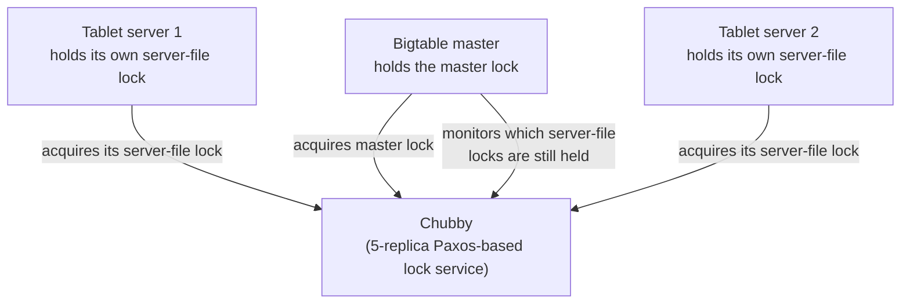

## Learning Objectives

- List the specific coordination problems Bigtable delegates entirely to Chubby, rather than solving itself.
- Explain how Chubby lets exactly one Bigtable master be active at a time, using a lock rather than a bespoke leader-election protocol built into Bigtable.
- Explain how a tablet server claims ownership of a tablet, and what happens, from the master's point of view, when a tablet server's Chubby session expires.
- Explain why separating "serve data fast" (Bigtable proper) from "agree on who is in charge of what" (Chubby) is a reusable architectural pattern, not a Bigtable-specific detail.

## Context & Motivation

The previous concept developed Bigtable's data model and storage layout entirely in terms of a single tablet and a single tablet server, deliberately deferring one question: in a cluster with one master and potentially thousands of tablet servers, who decides which tablet server is currently responsible for which tablet, and what happens if the master itself needs to be replaced, say, because the machine it was running on failed? Bigtable's own paper answers this by explicitly not building a bespoke solution to this problem inside Bigtable at all. Instead, it relies entirely on **Chubby**, a separate, general-purpose distributed lock service Google built once and reused across many systems, of which Bigtable is only one client.

This is worth taking seriously as a design decision, not a minor implementation detail: rather than every distributed storage or compute system independently reinventing leader election and distributed locking (each with its own subtle correctness bugs to discover the hard way), Google factored that one hard problem out into a single, carefully built and tested service, and let every other system, Bigtable included, simply be a client of it. This concept develops precisely what Chubby is used for inside Bigtable, and sets up the next concept, which studies ZooKeeper, the open-source system that generalizes exactly this same pattern into a widely reusable coordination service.

## Core Theory

### What Chubby actually is, briefly, and what it is used for here

Chubby is a lock service exposing a small, simple, file-system-like interface: clients create and manipulate small files and directories, and can acquire an exclusive or shared lock on any of them. Underneath, Chubby itself is built as a small, tightly replicated cluster (typically five replicas) using a Paxos-like consensus protocol to keep those replicas in agreement, exactly the kind of consensus machinery this discipline's foundational theory (covered separately in Distributed Systems I) developed in the abstract. The important point for understanding Bigtable is not Chubby's own internal consensus mechanics, but the specific, narrow set of jobs Bigtable delegates to it:

1. **Ensuring at most one active master.** Bigtable's single master (mentioned but not developed in the previous concept) acquires a specific, well-known lock file in Chubby when it starts up, and holds that lock for as long as it remains the active master. Because Chubby guarantees a given lock is held by at most one client at a time, this single acquisition is sufficient to guarantee at most one Bigtable master is ever active, without Bigtable needing to implement any leader-election logic of its own.
2. **Discovering, and letting tablet servers claim, tablets.** Each tablet server, on starting up, creates and acquires an exclusive lock on a specific file in a known Chubby directory, and this successful lock acquisition is precisely what constitutes "this tablet server is alive and eligible to serve tablets" from the rest of the system's point of view.
3. **Storing schema and access-control metadata.** Bigtable stores each table's schema information and access control lists as small files in Chubby, rather than building a separate metadata-storage mechanism, again reusing an already-built, already-replicated service instead of adding new machinery.

### Detecting a dead tablet server through lock expiration, not a bespoke heartbeat

A Chubby lock is held only as long as the client's session with Chubby remains active, and a session requires periodic renewal (a lease, conceptually similar to the chunk lease mechanism GFS uses, developed earlier in this discipline). If a tablet server crashes, or becomes partitioned from Chubby, it stops renewing its session, and once the session lease expires, Chubby releases the lock on that tablet server's file automatically. The Bigtable master, which monitors the relevant Chubby directory, detects this lock release and concludes the tablet server is no longer alive, at which point it reassigns that tablet server's tablets to other, live tablet servers. Notice this means Bigtable itself never needed to implement its own liveness-detection protocol (no bespoke heartbeat-and-timeout mechanism inside Bigtable's own code), it simply observes Chubby's lock state, which Chubby's own session-lease mechanism already keeps accurate.

### Why this separation is a reusable pattern, not a Bigtable-specific trick

The general shape here, one small, carefully built, heavily tested coordination service providing locks, leader election, and small metadata storage, consumed by many larger, more complex systems that would otherwise each need to solve those same hard distributed-agreement problems themselves, is exactly the pattern the next concept develops in its open-source, widely reused form: ZooKeeper. Understanding Chubby's specific role inside Bigtable here is what makes ZooKeeper's more general version of the same idea, and its direct connection back to the Raft and Paxos consensus protocols this discipline's theoretical foundation already covers, immediately recognizable rather than a new idea learned from scratch.

## Worked Examples

### Example 1: tracing a Bigtable master failure and recovery through Chubby

**Problem:** The machine running Bigtable's active master crashes outright. Trace, step by step, how a new master ends up active, using only the Chubby-based mechanism this concept develops.

**Trace:** The crashed master's process stops renewing its Chubby session, and once that session's lease expires, Chubby releases the master lock the old master had been holding. A standby master process (Bigtable typically runs one or more standby masters specifically for this situation) is watching for exactly this lock to become available, and once it does, the standby attempts to acquire the master lock itself. Chubby grants it to whichever standby successfully acquires it first, and that standby now becomes the new active master. The new master then reads the current tablet assignment state (itself partly reconstructed by scanning the relevant Chubby directory for which tablet servers currently hold their server-file locks, i.e., which ones are still actually alive) and resumes normal master duties, all without any bespoke Bigtable-specific leader-election code ever needing to run, the entire mechanism is simply "acquire this well-known lock, and notice when it becomes free."

### Example 2: tracing a tablet server crash, contrasted with the master crash in Example 1

**Problem:** Instead of the master, a single tablet server crashes, while the master and every other tablet server remain healthy. Trace what happens, and explain what is different about this case compared to Example 1.

**Trace:** The crashed tablet server's Chubby session similarly stops being renewed, and its server-file lock is eventually released by Chubby once the lease expires. The Bigtable master, which is actively monitoring the relevant Chubby directory (not merely reacting passively the way a standby master waits for the master lock), notices this specific tablet server's lock has been released, concludes that tablet server is dead, and reassigns every tablet that dead server had been responsible for to other, currently live tablet servers (tablet servers whose own locks the master can see are still held). The key difference from Example 1 is which role is doing the watching and reacting: for a master failure, other standby masters race to acquire the newly available master lock themselves; for a tablet server failure, it is the single active master, which was already the one component responsible for tablet assignment, that notices the change and reassigns work, no other tablet server needs to race for anything.

## Common Misconceptions & Pitfalls

- **"Bigtable implements its own leader election and heartbeat protocol, and Chubby is just where it happens to store some configuration files."** Both the master's uniqueness and the detection of dead tablet servers are entirely Chubby's doing, through lock acquisition and session-lease expiration, respectively; Bigtable does not implement a separate leader-election algorithm or a separate heartbeat-and-timeout mechanism of its own, both problems are fully delegated to Chubby's existing lock semantics.
- **"Chubby is a Bigtable-internal component, tightly coupled to Bigtable's own code."** Chubby is a general-purpose lock service used by many different Google systems, Bigtable is one client among several, using only a small, generic slice of Chubby's interface (acquiring locks on files, storing small metadata files). This general-purpose, multi-client design is precisely what the next concept's system, ZooKeeper, generalizes into an openly reusable service outside Google.
- **"Since Chubby itself uses a Paxos-like protocol, Bigtable's overall consistency guarantees come from Chubby's consensus, not from Bigtable's own design."** Chubby's consensus protocol only governs Chubby's own internal state (which locks are held by which client, and the contents of the small files Bigtable stores in it); it says nothing about the consistency of the actual row data a client reads and writes through Bigtable's own tablet servers, which is governed entirely by the tablet's own commit-log-memtable-SSTable design developed in the previous concept. Chubby solves coordination, not data serving, and Bigtable's data model and storage layout are what actually determine data consistency.

## Summary

Bigtable does not implement its own leader election or failure-detection protocol; it delegates both entirely to Chubby, a separate, general-purpose distributed lock service built on Paxos-like consensus. A single active master is guaranteed simply by that master holding a well-known Chubby lock, and a standby master races to acquire that same lock only once it becomes free, following a crash. Each tablet server similarly claims aliveness by holding its own lock on a server-specific Chubby file, and the master detects a dead tablet server purely by noticing that file's lock has been released after the tablet server's Chubby session lease expired, with no bespoke heartbeat mechanism inside Bigtable itself. Bigtable also stores schema and access-control metadata as small Chubby files, reusing an already-built service rather than adding new metadata-storage machinery. This clean separation, one small, heavily tested coordination service used by many larger systems, is a reusable architectural pattern, not a Bigtable-specific trick, and the next concept studies its open-source, generalized form directly: ZooKeeper.

## Documentation Links

- [Chang et al.: Bigtable: A Distributed Storage System for Structured Data (OSDI 2006)](https://research.google.com/archive/bigtable-osdi06.pdf): doc
