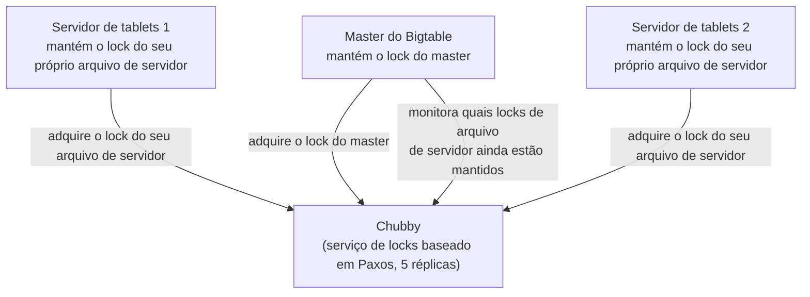

## Objetivos de Aprendizagem

- Listar os problemas específicos de coordenação que o Bigtable delega inteiramente ao Chubby, em vez de resolvê-los por conta própria.
- Explicar como o Chubby permite que exatamente um master do Bigtable esteja ativo por vez, usando um lock em vez de um protocolo de eleição de líder sob medida embutido no Bigtable.
- Explicar como um servidor de tablets reivindica a posse de um tablet, e o que acontece, do ponto de vista do master, quando a sessão Chubby de um servidor de tablets expira.
- Explicar por que separar 'servir dados rápido' (o Bigtable propriamente dito) de 'concordar sobre quem está no comando do quê' (o Chubby) é um padrão arquitetural reutilizável, e não um detalhe específico do Bigtable.

## Contexto e Motivação

O conceito anterior desenvolveu o modelo de dados e o layout de armazenamento do Bigtable inteiramente em termos de um único tablet e de um único servidor de tablets, adiando deliberadamente uma questão: em um cluster com um master e potencialmente milhares de servidores de tablets, quem decide qual servidor de tablets é atualmente responsável por qual tablet, e o que acontece se o próprio master precisar ser substituído, digamos, porque a máquina em que ele rodava falhou? O próprio artigo do Bigtable responde a isso explicitamente não construindo uma solução sob medida para esse problema dentro do Bigtable. Em vez disso, ele depende inteiramente do **Chubby**, um serviço de locks distribuído, separado e de propósito geral, que o Google construiu uma vez e reutilizou em muitos sistemas, dos quais o Bigtable é apenas um cliente.

Vale levar isso a sério como uma decisão de projeto, e não como um detalhe menor de implementação: em vez de cada sistema de armazenamento ou computação distribuída reinventar independentemente a eleição de líder e o lock distribuído (cada um com seus próprios bugs sutis de correção a descobrir do jeito difícil), o Google isolou esse único problema difícil em um serviço único, cuidadosamente construído e testado, e deixou todo outro sistema, o Bigtable incluído, simplesmente ser um cliente dele. Este conceito desenvolve precisamente para que o Chubby é usado dentro do Bigtable, e prepara o próximo conceito, que estuda o ZooKeeper, o sistema de código aberto que generaliza exatamente esse mesmo padrão em um serviço de coordenação amplamente reutilizável.

## Teoria Central

### O que o Chubby realmente é, brevemente, e para que é usado aqui

O Chubby é um serviço de locks que expõe uma interface pequena, simples e parecida com a de um sistema de arquivos: os clientes criam e manipulam pequenos arquivos e diretórios, e podem adquirir um lock exclusivo ou compartilhado sobre qualquer um deles. Por baixo, o próprio Chubby é construído como um cluster pequeno e fortemente replicado (tipicamente cinco réplicas) usando um protocolo de consenso parecido com o Paxos para manter essas réplicas em acordo, exatamente o tipo de maquinaria de consenso que a teoria fundamental desta disciplina (coberta separadamente em Sistemas Distribuídos I) desenvolveu no abstrato. O ponto importante para entender o Bigtable não é a mecânica interna de consenso do próprio Chubby, mas o conjunto específico e estreito de tarefas que o Bigtable delega a ele:

1. **Garantir no máximo um master ativo.** O master único do Bigtable (mencionado mas não desenvolvido no conceito anterior) adquire um arquivo de lock específico e bem conhecido no Chubby quando inicia, e mantém esse lock enquanto permanecer o master ativo. Como o Chubby garante que um dado lock seja mantido por no máximo um cliente por vez, essa única aquisição é suficiente para garantir que no máximo um master do Bigtable esteja ativo em algum momento, sem o Bigtable precisar implementar qualquer lógica de eleição de líder própria.
2. **Descobrir, e permitir que os servidores de tablets reivindiquem, os tablets.** Cada servidor de tablets, ao iniciar, cria e adquire um lock exclusivo sobre um arquivo específico em um diretório conhecido do Chubby, e essa aquisição bem-sucedida de lock é precisamente o que constitui 'este servidor de tablets está vivo e elegível para servir tablets' do ponto de vista do resto do sistema.
3. **Armazenar metadados de esquema e de controle de acesso.** O Bigtable armazena a informação de esquema de cada tabela e as listas de controle de acesso como pequenos arquivos no Chubby, em vez de construir um mecanismo separado de armazenamento de metadados, mais uma vez reutilizando um serviço já construído e já replicado em vez de adicionar maquinaria nova.

### Detectando um servidor de tablets morto por expiração de lock, não por um heartbeat sob medida

Um lock do Chubby é mantido somente enquanto a sessão do cliente com o Chubby permanece ativa, e uma sessão requer renovação periódica (um lease, conceitualmente parecido com o mecanismo de lease de chunk que o GFS usa, desenvolvido anteriormente nesta disciplina). Se um servidor de tablets trava, ou fica particionado do Chubby, ele para de renovar sua sessão, e uma vez que o lease da sessão expira, o Chubby libera automaticamente o lock sobre o arquivo daquele servidor de tablets. O master do Bigtable, que monitora o diretório relevante do Chubby, detecta essa liberação de lock e conclui que o servidor de tablets não está mais vivo, momento em que reatribui os tablets daquele servidor de tablets a outros servidores de tablets vivos. Note que isso significa que o próprio Bigtable nunca precisou implementar seu próprio protocolo de detecção de vivacidade (nenhum mecanismo sob medida de heartbeat-e-timeout dentro do código do próprio Bigtable), ele simplesmente observa o estado de lock do Chubby, que o próprio mecanismo de lease de sessão do Chubby já mantém preciso.

### Por que essa separação é um padrão reutilizável, e não um truque específico do Bigtable

O formato geral aqui, um serviço de coordenação único, cuidadosamente construído e fortemente testado, fornecendo locks, eleição de líder e armazenamento de pequenos metadados, consumido por muitos sistemas maiores e mais complexos que de outra forma precisariam cada um resolver esses mesmos problemas difíceis de acordo distribuído por conta própria, é exatamente o padrão que o próximo conceito desenvolve em sua forma de código aberto e amplamente reutilizada: o ZooKeeper. Entender o papel específico do Chubby dentro do Bigtable aqui é o que torna a versão mais geral da mesma ideia no ZooKeeper, e sua conexão direta de volta aos protocolos de consenso Raft e Paxos que a fundação teórica desta disciplina já cobre, imediatamente reconhecível em vez de uma ideia nova aprendida do zero.

## Exemplos Resolvidos

### Exemplo 1: rastreando uma falha e recuperação do master do Bigtable através do Chubby

**Problema:** A máquina que roda o master ativo do Bigtable trava por completo. Rastreie, passo a passo, como um novo master acaba ativo, usando apenas o mecanismo baseado em Chubby que este conceito desenvolve.

**Rastreamento:** O processo do master travado para de renovar sua sessão Chubby, e uma vez que o lease dessa sessão expira, o Chubby libera o lock do master que o antigo master mantinha. Um processo de master em espera (o Bigtable tipicamente roda um ou mais masters em espera especificamente para essa situação) está observando exatamente esse lock ficar disponível, e assim que fica, o master em espera tenta adquirir o lock do master ele mesmo. O Chubby o concede a qualquer master em espera que consiga adquiri-lo primeiro, e esse master em espera agora se torna o novo master ativo. O novo master então lê o estado atual de atribuição de tablets (ele mesmo parcialmente reconstruído varrendo o diretório relevante do Chubby para ver quais servidores de tablets mantêm atualmente seus locks de arquivo de servidor, isto é, quais ainda estão de fato vivos) e retoma as tarefas normais de master, tudo sem qualquer código de eleição de líder sob medida específico do Bigtable jamais precisar rodar, o mecanismo inteiro é simplesmente 'adquirir este lock bem conhecido, e notar quando ele fica livre'.

### Exemplo 2: rastreando o travamento de um servidor de tablets, contrastado com o travamento do master no Exemplo 1

**Problema:** Em vez do master, um único servidor de tablets trava, enquanto o master e todo outro servidor de tablets permanecem saudáveis. Rastreie o que acontece, e explique o que é diferente neste caso comparado ao Exemplo 1.

**Rastreamento:** A sessão Chubby do servidor de tablets travado similarmente para de ser renovada, e seu lock de arquivo de servidor é eventualmente liberado pelo Chubby quando o lease expira. O master do Bigtable, que está monitorando ativamente o diretório relevante do Chubby (não meramente reagindo passivamente da forma como um master em espera aguarda o lock do master), nota que o lock desse servidor de tablets específico foi liberado, conclui que aquele servidor de tablets está morto, e reatribui todo tablet pelo qual aquele servidor morto era responsável a outros servidores de tablets atualmente vivos (servidores de tablets cujos próprios locks o master consegue ver que ainda estão mantidos). A diferença chave em relação ao Exemplo 1 é qual papel está fazendo a observação e a reação: para uma falha de master, outros masters em espera disputam para adquirir o lock do master recém-disponível eles mesmos; para uma falha de servidor de tablets, é o único master ativo, que já era o único componente responsável pela atribuição de tablets, que nota a mudança e reatribui o trabalho, nenhum outro servidor de tablets precisa disputar nada.

## Equívocos Comuns e Armadilhas

- **"O Bigtable implementa seu próprio protocolo de eleição de líder e heartbeat, e o Chubby é só onde ele por acaso armazena alguns arquivos de configuração."** Tanto a unicidade do master quanto a detecção de servidores de tablets mortos são inteiramente obra do Chubby, por meio de aquisição de lock e expiração de lease de sessão, respectivamente; o Bigtable não implementa um algoritmo separado de eleição de líder nem um mecanismo separado de heartbeat-e-timeout próprio, ambos os problemas são plenamente delegados à semântica de locks existente do Chubby.
- **"O Chubby é um componente interno do Bigtable, fortemente acoplado ao código do próprio Bigtable."** O Chubby é um serviço de locks de propósito geral usado por muitos sistemas diferentes do Google, o Bigtable é um cliente entre vários, usando apenas uma fatia pequena e genérica da interface do Chubby (adquirir locks sobre arquivos, armazenar pequenos arquivos de metadados). Esse projeto de propósito geral e multicliente é precisamente o que o sistema do próximo conceito, o ZooKeeper, generaliza em um serviço abertamente reutilizável fora do Google.
- **"Já que o próprio Chubby usa um protocolo parecido com o Paxos, as garantias gerais de consistência do Bigtable vêm do consenso do Chubby, não do projeto do próprio Bigtable."** O protocolo de consenso do Chubby governa apenas o estado interno do próprio Chubby (quais locks são mantidos por qual cliente, e o conteúdo dos pequenos arquivos que o Bigtable armazena nele); ele nada diz sobre a consistência dos dados de linha reais que um cliente lê e escreve através dos próprios servidores de tablets do Bigtable, que é governada inteiramente pelo projeto de commit-log, memtable e SSTable do próprio tablet, desenvolvido no conceito anterior. O Chubby resolve coordenação, não o serviço de dados, e o modelo de dados e o layout de armazenamento do Bigtable é que de fato determinam a consistência dos dados.

## Resumo

O Bigtable não implementa seu próprio protocolo de eleição de líder ou de detecção de falhas; ele delega ambos inteiramente ao Chubby, um serviço de locks distribuído, separado e de propósito geral, construído sobre consenso parecido com o Paxos. Um único master ativo é garantido simplesmente por esse master manter um lock bem conhecido do Chubby, e um master em espera disputa para adquirir esse mesmo lock somente depois que ele fica livre, após um travamento. Cada servidor de tablets similarmente reivindica vivacidade mantendo seu próprio lock sobre um arquivo Chubby específico do servidor, e o master detecta um servidor de tablets morto puramente notando que o lock desse arquivo foi liberado depois que o lease de sessão Chubby do servidor de tablets expirou, sem nenhum mecanismo de heartbeat sob medida dentro do próprio Bigtable. O Bigtable também armazena metadados de esquema e de controle de acesso como pequenos arquivos Chubby, reutilizando um serviço já construído em vez de adicionar nova maquinaria de armazenamento de metadados. Essa separação limpa, um serviço de coordenação único, fortemente testado, usado por muitos sistemas maiores, é um padrão arquitetural reutilizável, e não um truque específico do Bigtable, e o próximo conceito estuda sua forma generalizada e de código aberto diretamente: o ZooKeeper.

## Documentation Links

- [Chang et al.: Bigtable: A Distributed Storage System for Structured Data (OSDI 2006)](https://research.google.com/archive/bigtable-osdi06.pdf): doc
