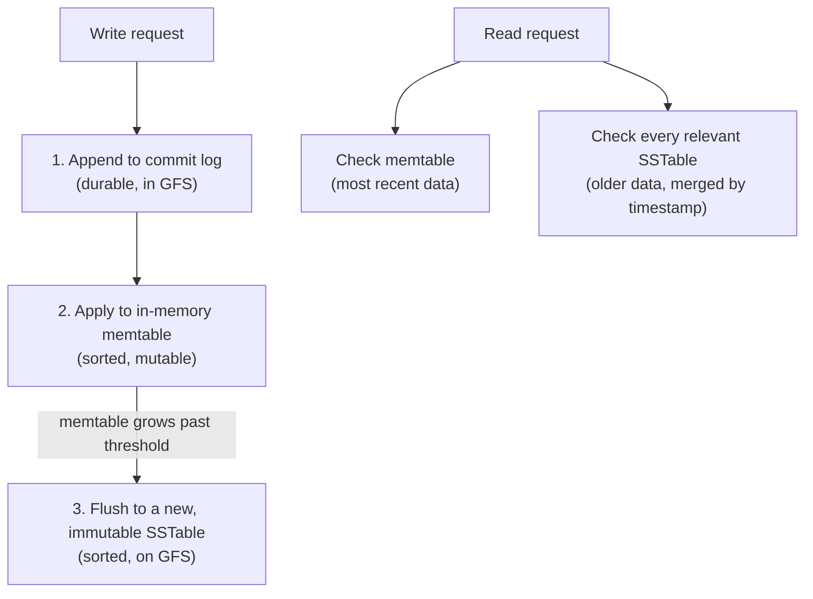

## Learning Objectives

- State Bigtable's data model precisely: the (row, column family:qualifier, timestamp) to value mapping, and explain what "sparse" means in this context.
- Explain what a tablet is, how tablets divide a table, and why a tablet, not an individual row, is Bigtable's unit of load balancing and replication.
- Describe the layered storage a tablet actually uses on disk: the commit log, the in-memory memtable, and the immutable, sorted SSTables, and explain what a write and a read each touch.
- Contrast Bigtable's storage layout with a B+Tree-indexed relational engine's, and explain what workload each one is actually optimized for.

## Context & Motivation

GFS, developed earlier in this discipline, solves the problem of storing huge files reliably across a cluster, but it exposes only a raw byte-stream file abstraction, an application still has to build any notion of structured records, rows, or fast lookup by key entirely on top of that. By the mid-2000s, Google's engineers needed exactly that kind of structured storage for an enormous range of internal applications, at wildly different scales, from a project needing to store a handful of megabytes of configuration data to a project needing to store petabytes of crawled web pages, one row per URL, with potentially thousands of different, sparse columns representing different attributes of that page (its language, its inbound links, snapshots of its content at different crawl times) where any given page might have data in only a handful of those columns.

Bigtable, published at OSDI in 2006, is Google's answer: a distributed storage system for structured data that is explicitly not a relational database (the paper is careful to note it does not support a full relational data model, joins, or general transactions across rows), but instead a much simpler, sparser abstraction, deliberately built to scale to petabytes of data across thousands of machines while still supporting a semi-structured row/column model far richer than GFS's raw byte-stream files. This concept develops that data model and, critically for this discipline's running theme of understanding how a system is actually built underneath its abstraction, the specific on-disk storage layout, tablets, memtables, and SSTables, that makes both the model and its performance possible.

## Core Theory

### The data model: a sparse, distributed, sorted map

Bigtable's paper describes its own data model precisely as "a sparse, distributed, persistent multi-dimensional sorted map," indexed by a row key, a column key, and a timestamp, mapping to an uninterpreted array of bytes as the value:

```
(row:string, column:string, timestamp:int64) -> value:string
```

Rows are sorted lexicographically by row key, and this ordering is not incidental, it is precisely what determines how the table is horizontally split into tablets, developed in the next section. Columns are grouped into a small, fixed number of **column families**, created explicitly ahead of time (unlike rows, which can be created implicitly just by writing to them), and a column family is the actual unit of access control and the primary unit that governs how data is physically stored together on disk. Within a column family, an application can create any number of **column qualifiers** on the fly, without needing to declare them in advance, which is precisely what "sparse" means here in practice, a table can conceptually have thousands of distinct qualifiers across all its rows, while any individual row typically populates only a small handful of them, and Bigtable's storage format, developed below, is specifically designed not to waste space on the columns a given row leaves empty.

The timestamp dimension lets Bigtable store multiple versions of the same (row, column) cell, typically the write time in microseconds, letting an application configure how many versions to retain, or how old a version must be before it is garbage-collected.

### Tablets: the unit of splitting, load balancing, and replication

A Bigtable table is horizontally partitioned by row key ranges into **tablets**, each tablet holding all the rows in some contiguous range of the sorted row-key space. A tablet, not an individual row and not the whole table, is Bigtable's fundamental unit for essentially every operational concern: a tablet server is assigned responsibility for serving some number of tablets, load balancing works by moving whole tablets between tablet servers, and a tablet splits into two smaller tablets once it grows past a configured size threshold, which is also how a table's total data can grow to scale far beyond what any single tablet server could hold.

This design, choosing a contiguous row-key range as the unit rather than, say, a hash-based partition, is deliberate and has a direct practical payoff: an application that chooses its row keys carefully (for example, storing a URL's row key in reversed-domain-name order, `com.example.www/page`, rather than the raw URL) can arrange for rows it will frequently want to scan together (like every page on the same site) to land in the same, or few adjacent, tablets, a locality benefit a hash-based partitioning scheme would give up entirely, since a hash deliberately scatters related keys apart to spread load evenly.

### Storage layout: commit log, memtable, and SSTables

Underneath a tablet, Bigtable does not simply write directly to a mutable on-disk data structure the way a B+Tree-indexed engine would. Instead, a write follows a specific, layered path:

1. The write is first appended to a **commit log**, a durable, sequential, append-only log stored in GFS, ensuring the write survives a tablet server crash before anything else happens to it.
2. The write is then applied to the **memtable**, an in-memory, sorted data structure holding the tablet's most recently written data.
3. Once the memtable grows past a size threshold, it is flushed to disk as a new, immutable **SSTable** (Sorted String Table), a file format storing a sequence of key-value pairs sorted by key, along with a block index that lets a lookup for a specific key jump directly to the right block without scanning the whole file.



A read for a given key must therefore potentially consult the memtable (for the most recent, not-yet-flushed data) as well as every SSTable the tablet has accumulated over time, merging results across all of them (keeping, per Bigtable's timestamp-versioning rules, whichever versions the read actually asked for). Because every SSTable is immutable once written, a background **compaction** process periodically merges several existing SSTables into a single new one, both to bound the number of files a read must check and to physically reclaim space from values that have since been overwritten or garbage-collected.

This layout is a direct, deliberate contrast with a B+Tree-indexed relational engine, developed earlier in this platform's core `database-systems` discipline, which mutates its index pages in place on disk. Bigtable's append-only, immutable-SSTable design is specifically optimized for a write-heavy, sequential-append workload (much like GFS's own record-append design), converting what would be many small, scattered random writes into large sequential writes to new files, at the cost of a read sometimes needing to check several SSTables rather than a single, always-current index structure.

## Worked Examples

### Example 1: tracing a write and a subsequent read for a sparse web-crawl row

**Problem:** A Bigtable table stores crawled web pages, with row key `com.example.www/page`, a column family `content` (holding the page's raw HTML under qualifier `html`) and a column family `anchor` (holding inbound link anchor text, one qualifier per linking site). A crawler writes the page's HTML, and separately, two different sites link to it with different anchor text. Trace what gets written, and then trace a read for this row's `content:html` column.

**Trace:** The HTML write appends `(com.example.www/page, content:html, t1) -> "<html>...</html>"` to the commit log, then applies it to the tablet's memtable. The two anchor-text writes similarly append `(com.example.www/page, anchor:cnn.com, t2) -> "Example Homepage"` and `(com.example.www/page, anchor:blog.example.org, t3) -> "an interesting site"` to the log and memtable. Notice this row now has data in three distinct qualifiers across two column families, while a different row (a page with no inbound links yet) might have data only under `content:html` and nothing at all under `anchor`, exactly the sparseness the data model is built for, no space is wasted storing "empty" values for qualifiers a given row simply does not have.

A subsequent read for `com.example.www/page`, column `content:html`, first checks the memtable (if the write has not yet been flushed, this is where it is found), and if not found there, checks each SSTable the tablet has accumulated, in order, until the value is located, or, if versioning is configured to return multiple timestamps, merges together every version found across the memtable and all relevant SSTables.

### Example 2: contrasting Bigtable's write path with a B+Tree engine's, under heavy sequential writes

**Problem:** A workload consists of a continuous stream of new rows being appended (never updating existing rows), millions per hour. Explain, concretely, why Bigtable's layered write path handles this differently, and generally more efficiently for pure throughput, than a B+Tree engine that must maintain one always-current, in-place index.

**Resolution:** In Bigtable, every one of these writes is a sequential append to the commit log, followed by an in-memory memtable update, both cheap, sequential-friendly operations, and the eventual flush to a new SSTable is itself one large sequential write of the whole accumulated memtable, not a series of small, scattered disk writes. A B+Tree engine, by contrast, must locate and update the specific leaf page (and potentially split it, and update parent pages) for each new row's key, and if the incoming row keys are not conveniently sequential themselves, these page updates can land essentially anywhere across the tree's on-disk structure, producing a much less sequential-friendly, more randomly scattered write pattern, precisely the concurrency-and-page-management overhead this platform's `database-systems` discipline develops in detail for B+Trees. This is not a claim that Bigtable's design is universally superior, a B+Tree engine's always-current, in-place index gives it a real advantage for workloads needing efficient in-place updates and range queries over frequently-changing data, exactly the kind of workload a relational engine, not Bigtable, is built for.

## Common Misconceptions & Pitfalls

- **"Bigtable is just a distributed relational database with a different name."** Bigtable's own paper is explicit that it does not implement a full relational model, there are no joins, no general multi-row transactions, and no query language comparable to SQL; it is a much simpler, sparser row/column/timestamp map, deliberately built to scale further and more simply than a full relational engine, by giving up the relational model's richer query and transaction guarantees.
- **"A tablet holds a fixed set of specific columns, like a column-oriented database's physical column store."** A tablet is a horizontal split by row-key range, holding all columns (across all column families) for the rows in that range, not a vertical split by column. Column families do influence physical storage layout (each column family's data can be stored in its own set of SSTables), but the tablet itself is fundamentally a row-range concept, not a column-range one.
- **"Since SSTables are immutable, deleting or updating a value requires rewriting the whole file immediately."** A logical update or delete is itself just a new write (a new value, or a special delete marker, at a newer timestamp), appended through the same commit-log-then-memtable-then-SSTable path as any other write; the old, now-superseded value in an older SSTable is not rewritten immediately, it is simply superseded and eventually reclaimed later, during a background compaction that merges old SSTables together, not synchronously as part of the update itself.

## Summary

Bigtable exposes a sparse, distributed, sorted map, keyed by row, column family and qualifier, and timestamp, deliberately simpler than a full relational model, in exchange for scaling to petabytes of data with columns that can be added on the fly and left empty per row without wasting space. Rows are sorted and horizontally split into tablets by contiguous row-key range, and the tablet, not an individual row or the whole table, is Bigtable's actual unit of load balancing, splitting, and replication, rewarding a row-key design that groups related rows together. Underneath a tablet, a write is first appended to a durable commit log, then applied to an in-memory memtable, and periodically flushed as a new, immutable SSTable, converting what could be scattered random writes into large sequential ones, at the cost of a read sometimes needing to merge results from the memtable and several SSTables, a deliberate contrast with a B+Tree engine's always-current, in-place index. The next concept develops a piece deliberately left out of this one: how a Bigtable cluster elects a single live master and lets tablet servers safely claim ownership of tablets, using a separate coordination service, Chubby.

## Documentation Links

- [Chang et al.: Bigtable: A Distributed Storage System for Structured Data (OSDI 2006)](https://research.google.com/archive/bigtable-osdi06.pdf): doc
