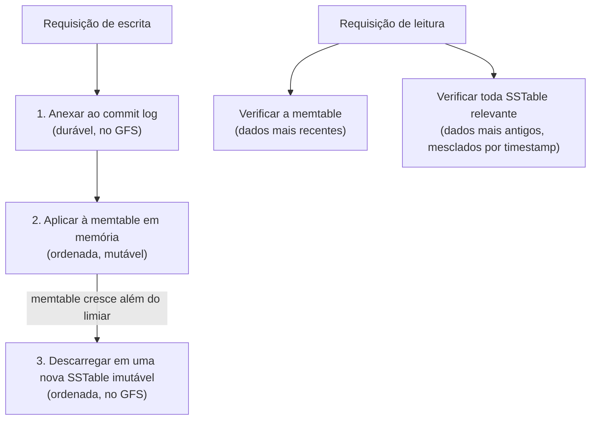

## Objetivos de Aprendizagem

- Enunciar o modelo de dados do Bigtable com precisão: o mapeamento de (linha, família de colunas:qualificador, timestamp) para valor, e explicar o que 'esparso' significa neste contexto.
- Explicar o que é um tablet, como os tablets dividem uma tabela, e por que um tablet, e não uma linha individual, é a unidade de balanceamento de carga e replicação do Bigtable.
- Descrever o armazenamento em camadas que um tablet de fato usa em disco: o commit log, a memtable em memória, e as SSTables imutáveis e ordenadas, e explicar o que uma escrita e uma leitura tocam cada uma.
- Contrastar o layout de armazenamento do Bigtable com o de um motor relacional indexado por B+Tree, e explicar para qual carga de trabalho cada um é de fato otimizado.

## Contexto e Motivação

O GFS, desenvolvido anteriormente nesta disciplina, resolve o problema de armazenar arquivos enormes de forma confiável em um cluster, mas expõe apenas uma abstração crua de arquivo como fluxo de bytes, uma aplicação ainda precisa construir qualquer noção de registros estruturados, linhas ou busca rápida por chave inteiramente em cima disso. Por volta de meados dos anos 2000, os engenheiros do Google precisavam exatamente desse tipo de armazenamento estruturado para uma gama enorme de aplicações internas, em escalas muito diferentes, desde um projeto que precisava armazenar um punhado de megabytes de dados de configuração até um projeto que precisava armazenar petabytes de páginas web rastreadas, uma linha por URL, com potencialmente milhares de colunas diferentes e esparsas representando atributos distintos daquela página (seu idioma, seus links de entrada, instantâneos de seu conteúdo em diferentes momentos de rastreamento) onde qualquer página dada poderia ter dados em apenas um punhado dessas colunas.

O Bigtable, publicado no OSDI em 2006, é a resposta do Google: um sistema de armazenamento distribuído para dados estruturados que explicitamente não é um banco de dados relacional (o artigo é cuidadoso em notar que ele não suporta um modelo de dados relacional completo, joins, ou transações gerais entre linhas), mas sim uma abstração muito mais simples e esparsa, deliberadamente construída para escalar a petabytes de dados em milhares de máquinas ainda suportando um modelo de linhas e colunas semiestruturado muito mais rico do que os arquivos de fluxo cru de bytes do GFS. Este conceito desenvolve esse modelo de dados e, criticamente para o tema recorrente desta disciplina de entender como um sistema é de fato construído por baixo de sua abstração, o layout específico de armazenamento em disco, tablets, memtables e SSTables, que torna tanto o modelo quanto seu desempenho possíveis.

## Teoria Central

### O modelo de dados: um mapa esparso, distribuído e ordenado

O artigo do Bigtable descreve seu próprio modelo de dados precisamente como "um mapa ordenado multidimensional esparso, distribuído e persistente," indexado por uma chave de linha, uma chave de coluna e um timestamp, mapeando para um array não interpretado de bytes como valor:

```
(linha:string, coluna:string, timestamp:int64) -> valor:string
```

As linhas são ordenadas lexicograficamente pela chave de linha, e essa ordenação não é incidental, é precisamente o que determina como a tabela é dividida horizontalmente em tablets, desenvolvido na próxima seção. As colunas são agrupadas em um número pequeno e fixo de **famílias de colunas**, criadas explicitamente de antemão (ao contrário das linhas, que podem ser criadas implicitamente só por escrever nelas), e uma família de colunas é a unidade de fato de controle de acesso e a unidade primária que governa como os dados são fisicamente armazenados juntos em disco. Dentro de uma família de colunas, uma aplicação pode criar qualquer número de **qualificadores de coluna** em tempo real, sem precisar declará-los de antemão, que é precisamente o que 'esparso' significa aqui na prática, uma tabela pode conceitualmente ter milhares de qualificadores distintos em todas as suas linhas, enquanto qualquer linha individual tipicamente popula apenas um pequeno punhado deles, e o formato de armazenamento do Bigtable, desenvolvido abaixo, é especificamente projetado para não desperdiçar espaço com as colunas que uma dada linha deixa vazias.

A dimensão de timestamp permite ao Bigtable armazenar múltiplas versões da mesma célula (linha, coluna), tipicamente o tempo de escrita em microssegundos, permitindo que uma aplicação configure quantas versões reter, ou quão antiga uma versão deve ser antes de ser coletada como lixo.

### Tablets: a unidade de divisão, balanceamento de carga e replicação

Uma tabela do Bigtable é particionada horizontalmente por faixas de chave de linha em **tablets**, cada tablet contendo todas as linhas em alguma faixa contígua do espaço ordenado de chaves de linha. Um tablet, e não uma linha individual nem a tabela inteira, é a unidade fundamental do Bigtable para essencialmente toda preocupação operacional: um servidor de tablets recebe a responsabilidade de servir algum número de tablets, o balanceamento de carga funciona movendo tablets inteiros entre servidores de tablets, e um tablet se divide em dois tablets menores assim que cresce além de um limiar de tamanho configurado, que é também como o total de dados de uma tabela pode crescer para escalar muito além do que qualquer servidor de tablets único poderia conter.

Esse projeto, escolher uma faixa contígua de chaves de linha como a unidade em vez de, digamos, uma partição baseada em hash, é deliberado e tem um retorno prático direto: uma aplicação que escolhe suas chaves de linha com cuidado (por exemplo, armazenando a chave de linha de uma URL em ordem de nome de domínio invertido, `com.example.www/page`, em vez da URL crua) pode arranjar para que linhas que frequentemente quererá varrer juntas (como toda página do mesmo site) caiam no mesmo tablet, ou em poucos tablets adjacentes, um benefício de localidade que um esquema de particionamento baseado em hash abriria mão inteiramente, já que um hash deliberadamente espalha chaves relacionadas para distribuir a carga uniformemente.

### Layout de armazenamento: commit log, memtable e SSTables

Por baixo de um tablet, o Bigtable não escreve simplesmente direto em uma estrutura de dados mutável em disco da forma que um motor indexado por B+Tree faria. Em vez disso, uma escrita segue um caminho específico e em camadas:

1. A escrita é primeiro anexada a um **commit log**, um log durável, sequencial, apenas de anexação, armazenado no GFS, garantindo que a escrita sobreviva a um travamento do servidor de tablets antes de qualquer outra coisa acontecer com ela.
2. A escrita é então aplicada à **memtable**, uma estrutura de dados ordenada, em memória, que contém os dados escritos mais recentemente do tablet.
3. Assim que a memtable cresce além de um limiar de tamanho, ela é descarregada em disco como uma nova **SSTable** imutável (Sorted String Table), um formato de arquivo que armazena uma sequência de pares chave-valor ordenados por chave, junto com um índice de blocos que permite a uma busca por uma chave específica saltar diretamente para o bloco certo sem varrer o arquivo inteiro.



Uma leitura para uma dada chave deve portanto potencialmente consultar a memtable (para os dados mais recentes, ainda não descarregados) bem como toda SSTable que o tablet acumulou ao longo do tempo, mesclando resultados entre todas elas (mantendo, conforme as regras de versionamento por timestamp do Bigtable, as versões que a leitura de fato pediu). Como toda SSTable é imutável uma vez escrita, um processo de **compactação** em segundo plano periodicamente mescla várias SSTables existentes em uma única nova, tanto para limitar o número de arquivos que uma leitura deve verificar quanto para recuperar fisicamente espaço de valores que desde então foram sobrescritos ou coletados como lixo.

Esse layout é um contraste direto e deliberado com um motor relacional indexado por B+Tree, desenvolvido anteriormente na disciplina central `database-systems` desta plataforma, que muta suas páginas de índice no lugar em disco. O projeto de SSTable imutável e apenas de anexação do Bigtable é especificamente otimizado para uma carga de trabalho pesada em escrita e com anexação sequencial (muito como o próprio projeto de record-append do GFS), convertendo o que seriam muitas escritas aleatórias pequenas e espalhadas em grandes escritas sequenciais para novos arquivos, ao custo de uma leitura às vezes precisar verificar várias SSTables em vez de uma única estrutura de índice sempre atual.

## Exemplos Resolvidos

### Exemplo 1: rastreando uma escrita e uma leitura subsequente para uma linha esparsa de rastreamento web

**Problema:** Uma tabela do Bigtable armazena páginas web rastreadas, com chave de linha `com.example.www/page`, uma família de colunas `content` (contendo o HTML cru da página sob o qualificador `html`) e uma família de colunas `anchor` (contendo o texto âncora de links de entrada, um qualificador por site que liga). Um rastreador escreve o HTML da página, e separadamente, dois sites diferentes ligam para ela com textos âncora diferentes. Rastreie o que é escrito, e então rastreie uma leitura para a coluna `content:html` desta linha.

**Rastreamento:** A escrita do HTML anexa `(com.example.www/page, content:html, t1) -> "<html>...</html>"` ao commit log, depois a aplica à memtable do tablet. As duas escritas de texto âncora similarmente anexam `(com.example.www/page, anchor:cnn.com, t2) -> "Página Inicial do Exemplo"` e `(com.example.www/page, anchor:blog.example.org, t3) -> "um site interessante"` ao log e à memtable. Note que esta linha agora tem dados em três qualificadores distintos em duas famílias de colunas, enquanto uma linha diferente (uma página sem links de entrada ainda) poderia ter dados apenas sob `content:html` e nada em absoluto sob `anchor`, exatamente a esparsidade para a qual o modelo de dados é construído, nenhum espaço é desperdiçado armazenando valores 'vazios' para qualificadores que uma dada linha simplesmente não tem.

Uma leitura subsequente para `com.example.www/page`, coluna `content:html`, primeiro verifica a memtable (se a escrita ainda não foi descarregada, é aqui que ela é encontrada), e se não encontrada ali, verifica cada SSTable que o tablet acumulou, em ordem, até o valor ser localizado, ou, se o versionamento estiver configurado para retornar múltiplos timestamps, mescla toda versão encontrada na memtable e em todas as SSTables relevantes.

### Exemplo 2: contrastando o caminho de escrita do Bigtable com o de um motor B+Tree, sob escritas sequenciais pesadas

**Problema:** Uma carga de trabalho consiste em um fluxo contínuo de novas linhas sendo anexadas (nunca atualizando linhas existentes), milhões por hora. Explique, concretamente, por que o caminho de escrita em camadas do Bigtable lida com isso de forma diferente, e geralmente mais eficiente para vazão pura, do que um motor B+Tree que deve manter um índice único, sempre atual e no lugar.

**Resolução:** No Bigtable, cada uma dessas escritas é uma anexação sequencial ao commit log, seguida por uma atualização em memória da memtable, ambas operações baratas e amigáveis à sequencialidade, e o eventual descarregamento para uma nova SSTable é ele mesmo uma grande escrita sequencial de toda a memtable acumulada, não uma série de escritas pequenas e espalhadas em disco. Um motor B+Tree, por contraste, deve localizar e atualizar a página folha específica (e potencialmente dividi-la, e atualizar páginas pais) para a chave de cada nova linha, e se as chaves de linha que chegam não forem elas mesmas convenientemente sequenciais, essas atualizações de página podem cair essencialmente em qualquer lugar da estrutura em disco da árvore, produzindo um padrão de escrita muito menos amigável à sequencialidade e mais aleatoriamente espalhado, precisamente a sobrecarga de concorrência e gerenciamento de páginas que a disciplina `database-systems` desta plataforma desenvolve em detalhe para B+Trees. Isto não é uma afirmação de que o projeto do Bigtable é universalmente superior, o índice sempre atual e no lugar de um motor B+Tree lhe dá uma vantagem real para cargas de trabalho que precisam de atualizações eficientes no lugar e de consultas por faixa sobre dados que mudam com frequência, exatamente o tipo de carga de trabalho para a qual um motor relacional, e não o Bigtable, é construído.

## Equívocos Comuns e Armadilhas

- **"O Bigtable é apenas um banco de dados relacional distribuído com um nome diferente."** O próprio artigo do Bigtable é explícito em que ele não implementa um modelo relacional completo, não há joins, não há transações gerais entre múltiplas linhas, e não há linguagem de consulta comparável ao SQL; é um mapa de linha, coluna e timestamp muito mais simples e esparso, deliberadamente construído para escalar mais longe e mais simplesmente do que um motor relacional completo, abrindo mão das garantias mais ricas de consulta e transação do modelo relacional.
- **"Um tablet contém um conjunto fixo de colunas específicas, como o armazenamento físico de colunas de um banco de dados orientado a colunas."** Um tablet é uma divisão horizontal por faixa de chave de linha, contendo todas as colunas (em todas as famílias de colunas) para as linhas naquela faixa, não uma divisão vertical por coluna. As famílias de colunas de fato influenciam o layout de armazenamento físico (os dados de cada família de colunas podem ser armazenados em seu próprio conjunto de SSTables), mas o tablet em si é fundamentalmente um conceito de faixa de linhas, não de faixa de colunas.
- **"Já que as SSTables são imutáveis, excluir ou atualizar um valor exige reescrever o arquivo inteiro imediatamente."** Uma atualização ou exclusão lógica é ela mesma apenas uma nova escrita (um novo valor, ou um marcador especial de exclusão, em um timestamp mais recente), anexada pelo mesmo caminho de commit log, depois memtable, depois SSTable que qualquer outra escrita; o valor antigo, agora substituído, em uma SSTable mais antiga não é reescrito imediatamente, ele é simplesmente substituído e eventualmente recuperado mais tarde, durante uma compactação em segundo plano que mescla SSTables antigas, não sincronamente como parte da atualização em si.

## Resumo

O Bigtable expõe um mapa esparso, distribuído e ordenado, chaveado por linha, família de colunas e qualificador, e timestamp, deliberadamente mais simples do que um modelo relacional completo, em troca de escalar a petabytes de dados com colunas que podem ser adicionadas em tempo real e deixadas vazias por linha sem desperdiçar espaço. As linhas são ordenadas e divididas horizontalmente em tablets por faixa contígua de chaves de linha, e o tablet, e não uma linha individual ou a tabela inteira, é a unidade de fato de balanceamento de carga, divisão e replicação do Bigtable, recompensando um projeto de chave de linha que agrupa linhas relacionadas juntas. Por baixo de um tablet, uma escrita é primeiro anexada a um commit log durável, depois aplicada a uma memtable em memória, e periodicamente descarregada como uma nova SSTable imutável, convertendo o que poderiam ser escritas aleatórias espalhadas em grandes escritas sequenciais, ao custo de uma leitura às vezes precisar mesclar resultados da memtable e de várias SSTables, um contraste deliberado com o índice sempre atual e no lugar de um motor B+Tree. O próximo conceito desenvolve uma peça deliberadamente deixada de fora deste: como um cluster Bigtable elege um único master vivo e permite que servidores de tablets reivindiquem com segurança a posse dos tablets, usando um serviço de coordenação separado, o Chubby.

## Documentation Links

- [Chang et al.: Bigtable: A Distributed Storage System for Structured Data (OSDI 2006)](https://research.google.com/archive/bigtable-osdi06.pdf): doc
