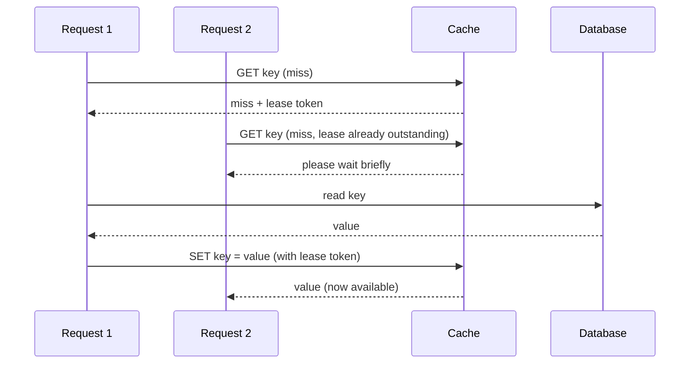

## Learning Objectives

- Explain the thundering herd problem precisely: what specifically goes wrong when a popular cache key expires or is evicted under heavy concurrent read load.
- Describe Facebook's lease mechanism and trace exactly how it prevents a thundering herd without simply serializing all reads for a key.
- Explain the stale-read race a naive cache-then-database write path creates, and how invalidation via a database commit-log-reading daemon addresses it.
- Explain what a regional pool is, what specific kind of data it targets, and what trade-off it makes compared to replicating that same data in every local cluster.

## Context & Motivation

Every system studied earlier in this discipline (GFS, Bigtable, Dynamo, Spanner) is itself a system of record, the actual, durable, authoritative store for some data. A cache sits in a different, complementary role: it holds a copy of data that already lives durably somewhere else (typically a database), purely to serve reads faster than the durable store could on its own. At small scale, a cache is close to trivial to reason about, look up a key, and on a miss, read the value from the database and store it in the cache for next time. Facebook's own published account of scaling exactly this simple idea to serve trillions of items and handle billions of requests per second, presented at USENIX NSDI in 2013, is a valuable case study for this discipline precisely because it shows several genuinely new failure modes that only appear at that scale, each with a specific, deliberate fix, rather than one that would already be obvious from the small-scale version of the same idea.

## Core Theory

### The thundering herd problem

Consider a single, very popular cache key (say, a piece of data on a celebrity's profile page, read by an enormous number of concurrent requests). If that key expires or is evicted from the cache, the very next read that misses will, in the naive design, go fetch the value from the database and repopulate the cache, this is fine in isolation. The problem is concurrency: at Facebook's scale, potentially thousands of concurrent requests can arrive for that same now-missing key within the same brief window, before any single one of them has finished repopulating the cache, and in the naive design, every single one of those thousands of requests independently sees a cache miss and independently issues its own read to the database, all at once, a sudden, concentrated spike of redundant load hitting the database for what should have been a single cache-miss-and-refill event. This is the **thundering herd** problem, and at scale it is a real, recurring threat to database stability, not a rare or merely theoretical edge case.

### Leases: letting one request repopulate while others wait, without full serialization

Facebook's fix is a **lease** mechanism. When a request experiences a cache miss for a key, the cache does not just report "not found," it also hands that request a lease, a unique token bound to that specific key, and, critically, if another request for the same key arrives shortly afterward while the lease is still outstanding, the cache tells that second request to wait briefly rather than also being told to go fetch from the database itself. The single request holding the valid lease is the only one permitted to fetch from the database and then set the value back into the cache, presenting its lease token when doing so, and once that set succeeds, the cache serves the now-repopulated value to every other request that had been waiting. To further bound the damage even if something goes wrong (a request holding a lease crashes or is delayed unexpectedly), the cache only issues one fresh lease token per key roughly once every ten seconds, so even in the worst case, only a small, bounded number of database reads for a single hot key can pile up in any given window, rather than an unbounded thousands-at-once spike.

### Invalidation: keeping the cache from serving stale data after a database write

A separate problem arises specifically from writes: if an application, after writing a new value to the database, also directly updates the cache, a race between two concurrent writers can leave the cache holding an older value than the database, permanently, until the key happens to expire on its own. Facebook's design instead deletes (invalidates) the cached entry rather than trying to directly update it after a write, and, importantly, does this through a dedicated mechanism rather than trusting the application code path that performed the write to reliably also remember to invalidate every affected cache entry: a daemon (the paper calls this component `mcsqueal`) reads the database's own commit log directly, extracts which rows were just changed, and broadcasts delete requests for the corresponding cache keys to every relevant front-end cluster. Because this reads from the database's authoritative commit log, rather than depending on scattered application code correctly remembering to invalidate the cache on every write path, it is both more reliable and centralizes a concern (keeping the cache from serving data known to be stale) that would otherwise need to be correctly re-implemented in every single place the application writes to the database.

### Regional pools: not every kind of hot key benefits from full local replication

Facebook's cache deployment is organized into clusters (relatively nearby machines serving a region's user traffic) and, above that, regions. For most cached data, replicating it into every local cluster's own cache is the right choice, keeping frequently accessed data as close as possible to the requests reading it. But the paper identifies a specific, different category of data, large in size and infrequently accessed, for which full per-cluster replication is wasteful, replicating a large, rarely-read item into every cluster's cache consumes a proportional amount of memory in every one of those clusters, for very little actual benefit, since the item is rarely read from any of them anyway. For exactly this category, Facebook uses a **regional pool**, a single shared cache tier, accessible to multiple front-end clusters within the same region, holding one copy of this large, cold data rather than one copy per cluster. This is a deliberate trade of slightly higher latency (a cluster reading from the regional pool is not reading from its own immediately-local cache) for a large reduction in total memory used across the region, correctly matched to data where that latency cost is rarely paid anyway, precisely because the data is infrequently accessed.

## Worked Examples

### Example 1: tracing a thundering herd, with and without leases

**Problem:** A hot key expires, and 2,000 requests for it arrive within the same 50-millisecond window. Trace what happens (a) without the lease mechanism, and (b) with it.

**Trace, without leases:** All 2,000 requests independently see a cache miss (the key has expired and nothing has repopulated it yet), and all 2,000 independently issue a read to the database for the same underlying data, a 2,000-times redundant spike of load for what should have needed exactly one database read.

**Trace, with leases:** The first of the 2,000 requests to arrive sees the miss and is issued a lease token. The remaining 1,999 requests, arriving within the same brief window, each see that a lease for this key is already outstanding, and are told to wait briefly rather than being sent to the database themselves. Only the single lease-holding request actually reads the database and then sets the value back into the cache; once that set completes, the other 1,999 requests, which had been waiting, are served the now-repopulated value directly from the cache. The database saw exactly one read for this key during the whole window, not 2,000.

### Example 2: tracing the stale-read race invalidation prevents

**Problem:** An application updates a user's profile field in the database, and, in the naive design, also directly writes the new value into the cache immediately afterward. A second, concurrent request, processing a slightly older version of the same update (perhaps retried after a delay), performs the same two steps a moment later, but its database write actually executes first while its cache write is delayed slightly. Trace how the cache can end up permanently stale, and then trace how Facebook's invalidation-via-commit-log design avoids it.

**Trace, direct cache update (the race):** Suppose request A (the newer update) writes to the database, then writes the new value directly to the cache. Suppose request B (the older, retried update) had already written its older value to the database earlier, but its own direct cache write happens to execute after A's cache write completes, due to some scheduling delay. The cache now holds B's older value, even though the database correctly holds A's newer value, and the cache will continue silently serving this stale value to every reader until the key eventually expires on its own, an actively wrong answer, not merely a slow one.

**Trace, with commit-log-based invalidation:** Neither request A nor B writes to the cache directly at all. Instead, each database write is simply recorded in the database's own commit log, in the order the database itself actually committed them (A's write, then B's write, or B's then A's, whichever the database genuinely executed first and recorded as such). The `mcsqueal`-style daemon reads this authoritative commit log and issues a cache invalidation (a delete, not a direct value update) for the affected key after each write it observes. Regardless of the exact interleaving, the cache entry for this key ends up deleted following the database's own true final write, and the next read simply experiences an ordinary cache miss, fetching the current, correct value directly from the database, exactly the same well-understood repopulation path Example 1 already covers, rather than silently serving a stale value with no signal anything was ever wrong.

## Common Misconceptions & Pitfalls

- **"Leases work by making every request for a hot key wait in a strict queue, one at a time."** Only the single lease-holding request actually performs the expensive database read; every other concurrent request for that same key waits briefly and then receives the already-repopulated value directly from the cache once the lease-holder's write completes, not by each of them eventually taking its own turn to read the database. The database sees essentially one read for the whole burst, not a serialized queue of many.
- **"Cache invalidation and cache update are two equally good ways to keep a cache correct after a write, invalidation is just Facebook's stylistic preference."** Direct cache updates from application code create the specific race Example 2 develops, whichever writer's cache update happens to execute last wins, regardless of which database write actually happened last, a genuine correctness bug, not a style choice. Invalidation sidesteps this entirely by never writing a value directly into the cache from the write path at all, the next reader simply repopulates it correctly from the database's own current, authoritative state.
- **"A regional pool is just a normal cache tier with a different name."** A regional pool specifically targets large, infrequently accessed data, and deliberately trades slightly higher per-cluster latency for a large reduction in total memory used, by storing one shared copy per region instead of one copy per cluster; using it for small, frequently accessed hot data would be the wrong choice, since that category of data specifically benefits from being replicated close to every cluster reading it, exactly the opposite trade-off a regional pool makes.

## Summary

Facebook's memcached deployment reveals three specific failure modes that only appear at very large scale, each with a deliberate, distinct fix, rather than one that a small-scale cache-then-database design would already need. The thundering herd problem, thousands of concurrent requests independently reading the database after the same key's cache miss, is addressed by leases, letting exactly one request repopulate the cache while others briefly wait for its result rather than each issuing their own redundant database read. The stale-read race, where directly updating the cache from application code can leave a stale value permanently cached depending on write-ordering luck, is addressed by invalidating (deleting) the cache entry via a dedicated daemon reading the database's own authoritative commit log, rather than trusting scattered application code to correctly update the cache itself. And regional pools trade a small amount of per-cluster latency for a large reduction in total memory used, specifically for the category of data, large and infrequently accessed, where full per-cluster replication would otherwise be wasteful. Each mechanism targets one precise, concrete problem visible only at scale, exactly this discipline's recurring lesson that a real system's specific engineering choices follow directly from the specific failure modes its actual scale exposes.

## Documentation Links

- [Nishtala et al.: Scaling Memcache at Facebook (USENIX NSDI 2013)](https://www.usenix.org/conference/nsdi13/technical-sessions/presentation/nishtala): doc
